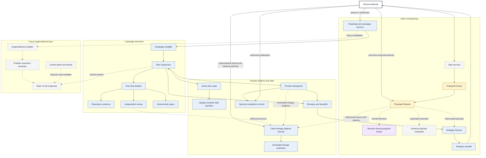
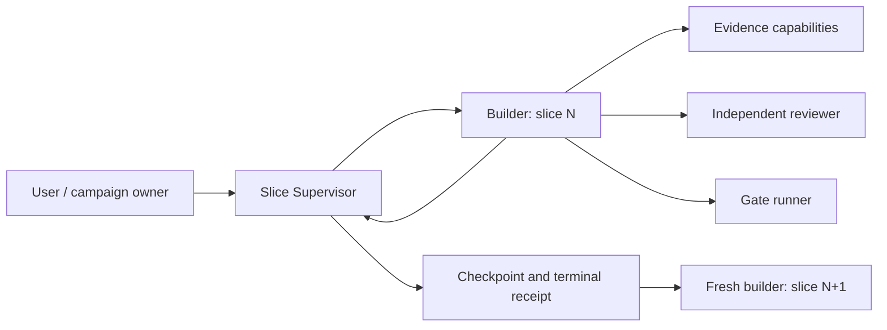

# Work Engine Architecture

## Purpose

This document describes the whole Work Engine as it exists and as it is
currently taking shape. It is the canonical map of the system's **variant
structure**: the machinery, subsystem boundaries, information flows, and
ownership relationships that currently realize the product.

Work Engine is not yet a fully formed platform. Its essential backbone exists,
several parts of that backbone are under active construction, and broader
organizational and control-plane designs remain proposals or research ideas.
This document keeps those maturity levels visible rather than presenting the
future system as already implemented.

This document does not own product doctrine, implementation authority, or
roadmap priority:

- [`DESIGN.md`](DESIGN.md) owns normative product doctrine and invariants.
- [`PHILOSOPHY.md`](PHILOSOPHY.md) explains the reasoning behind that doctrine.
- [`roadmap.md`](roadmap.md) owns current product direction, priorities, and
  completion evidence.
- `proposals/` owns formed candidate changes and their decision state.
- `ideas/` contains speculative source material and architectural directions.
- skill contracts and schemas own their local runtime and artifact semantics.

Architecture describes the machine. It does not silently promote current
machinery, a proposal, or an idea into an invariant.

## Maturity model

Architecture claims in this document use four maturity classes:

| Class | Meaning |
| --- | --- |
| **Implemented** | A current skill, script, schema, or executable reference path realizes the capability. This does not imply production completeness. |
| **Active construction** | A usable foundation exists and is being extended, exercised, or revised. Its final boundary is not settled. |
| **Formed direction** | A durable proposal or explicit planning artifact describes the change, but implementation is not thereby authorized or complete. |
| **Exploratory** | An idea records a possible architectural direction. It is neither a product commitment nor an implementation plan. |

Each component receives one primary maturity class in the reference tables and
diagrams. When an active capability contains a narrower implemented primitive,
the surrounding prose names that foundation without assigning the component two
classes.

The repository is currently best understood as an **implemented execution
backbone surrounded by an actively forming planning and durable-state layer**.
The more general multi-role organization, control plane, and operator surface
are later architecture.

## The system in one view



Node fills map exactly to the four maturity classes; human authority is shown
separately because it is a governing boundary, not a capability maturity.
Solid edges are relationships supported by current machinery. Dashed edges are
formed or exploratory relationships that are not yet implemented end to end.
Component maturity and relationship maturity are independent: an implemented
component may participate in a formed or exploratory integration, while an
active component may already support current relationships.
Neither edge style prescribes a mandatory universal procedure. Work can enter
through an explicit objective or campaign without first passing through the
proposal system. Proposal formation, evaluation, and strategic planning are
planning capabilities; they do not acquire execution or human decision
authority merely by producing durable artifacts.

## Architectural layers

### 1. Doctrine and authority

The upper boundary of the system is human authority plus explicit product
contracts. Work Engine supplies structure for model judgment; it does not
replace the authority that granted an objective, approved a consequential
choice, or authorized mutation.

The doctrine distinguishes:

```text
invariant structure   what must remain true
variant structure     what machinery currently exists and why
state and evidence    what is true in this run
objective/consequence what outcome matters
judgment              what to do inside the valid space
```

Runtime skills are role-scoped projections of this structure. They are not
independent doctrine layers.

### 2. Intent and planning

The planning layer turns unbounded or speculative intent into artifacts that
later roles can understand without reconstructing the originating discussion.
Its principal boundaries are:

- **Ideas** are cheap, speculative source material.
- **Proposal formation** uses model judgment to identify, split, merge, place,
  and revise candidate changes.
- **Proposal packets** give independently decidable candidates stable identity,
  human-readable meaning, typed relationships, uncertainty, and authority
  metadata.
- **Revision-bound proposal review** is a formed direction for challenging the
  exact proposal revision without accepting or prioritizing it.
- **Evidence-backed evaluation** is an exploratory consumer that would establish
  comparable decision support without acquiring proposal or portfolio
  authority.
- **Strategic planning** reconciles durable evidence with the roadmap and emits
  advisory planning handoffs.
- **Roadmaps and campaign sources** select bounded objectives for execution
  under the authority of their owner.

The proposal packet is not runtime state, and a roadmap entry is not the
canonical copy of a proposal. These artifacts have different owners and
lifetimes.

### 3. Campaign control

The current campaign controller is the `slice-supervisor` skill. It owns:

- effective campaign configuration and provenance;
- campaign and slice lifecycle state;
- plan acceptance and human escalation boundaries;
- limits, stop conditions, and continuation decisions;
- orchestration of builder, gate, review, checkpoint, and receipt capabilities;
- exactly one truthful terminal result for each terminal slice; and
- compact context transfer between accepted slices.

The supervisor deliberately does not inspect the repository, design the change,
implement it, or rederive domain validation. That work belongs to the builder.
The current topology uses one persistent builder identity for one coherent slice
and a new builder for the next slice.

### 4. Domain execution

The `slice-builder` is the current engineering execution adapter. For one
accepted slice it owns:

- repository understanding and architectural placement;
- a semantic-path certificate connecting trigger, producer, state owner,
  consumer, consequence, and proof;
- implementation and task-owned mutations;
- evidence selection and route revision;
- deterministic checks and review remediation; and
- implementation, audit, and compact handoff receipts.

The builder may use disposable reconnaissance and independent reviewers, but
they are capabilities or bounded roles within its slice. They do not divide the
builder's ownership of the coherent implementation result.

### 5. Evidence, review, and deterministic validation

Work Engine keeps three kinds of support distinct:

- **Repository evidence** establishes source facts, symbols, relationships, and
  implementation context. `repo-search` describes the provider-neutral evidence
  contract; Codebase Memory is the current primary indexed implementation.
- **Independent review** supplies fresh, read-only falsification or adversarial
  evidence when independence matters. Retrieval does not become review merely
  because it runs in another process or model.
- **Deterministic gates** execute mechanically decidable checks and return
  compact observed results. Model confidence cannot substitute for a required
  passing gate.

Provider identity, capability selection, evidence mode, fallback, and reviewer
independence remain separate provenance dimensions.

### 6. Persistence and publication

Work Engine persists different truths in different artifacts rather than
putting all state into one general store:

- `durable-state` publishes opaque values under stable keys using
  integrity-checked compare-and-swap revisions;
- active-slice records preserve recovery-critical planning and review
  obligations across context or provider replacement;
- proposal packets preserve candidate meaning and decision context;
- private checkpoints preserve exact accepted repository content without
  changing user-visible history;
- terminal receipts preserve audit and continuation consequences;
- compact handoffs carry only useful next-slice context and are not audit
  history;
- strategic handoffs preserve advisory conclusions and their evidence cutoff;
- scheduler records preserve future obligations and delivery state; and
- optional completion commits publish an accepted change only after explicit
  per-slice human authority.

Durability preserves bytes and provenance. It does not make a judgment correct,
authoritative, independent, accepted, or current.

## Current subsystem map

The architectural-layer sections above explain why the boundaries exist and
how they relate. The tables below are the compact reference for each
component's current maturity and ownership. A material change to either view
should update both in the same revision. The tables are the current
hand-authored classification reference, not an independent architecture owner;
any conflict is a documentation defect to reconcile against owning evidence.
A future accepted structured architecture definition may generate tables and
diagrams, but this document does not assume or authorize that machinery.

### Essential backbone

| Subsystem | Maturity | Current owner | Responsibility | Does not own |
| --- | --- | --- | --- | --- |
| Product doctrine | Implemented | `DESIGN.md` | Invariants, authority relationships, design tests | Current machinery inventory or roadmap priority |
| Campaign supervision | Implemented | `slice-supervisor` | Configuration, lifecycle, acceptance, limits, continuation, receipts | Repository understanding or implementation |
| Slice execution | Implemented | `slice-builder` | One coherent engineering slice from reconnaissance through proof | Campaign lifecycle or cross-slice strategy |
| Durable-state primitive | Implemented | `durable-state` | Atomic publication and integrity-checked reads of opaque values | Payload meaning or transition authority |
| Active-slice recovery | Implemented | `slice-supervisor` over `durable-state` | Bounded vertical for pending planning/review obligations, waiting, recovery, and retirement | General durable state for every role or phase |
| Independent-review episode state | Implemented bounded profile | `independent-review-state` over `durable-state` | Resume-critical state for one authority-bound adversarial-review and remediation episode | Slice acceptance, supervisor or implementation state, claims, or generic role state |
| Proposal packets | Active construction | `proposal-packets` plus packet repository | Implemented identity and validation foundation being extended with authority-authored decision recording | Proposal meaning, value, priority, or implementation authority |
| Proposal formation | Active construction | `proposal-former` | Implemented model-facing foundation for semantic formation and revision of packets | Evaluation, acceptance, portfolio priority, or execution |
| Strategic reconciliation | Implemented | `strategic-planner` | Advisory reconciliation of evidence and roadmap assumptions into a durable recommendation | Roadmap mutation, campaign amendment, or user approval |
| Deterministic gates | Implemented | `slice-builder/run_gate.py` | Execute explicit checks and report observed results | Semantic acceptance judgment |
| Private checkpoints | Implemented | `slice-checkpoint` plus supervisor lifecycle | Immutable attributed candidate and accepted content identity | User-visible Git history |
| Completion publication | Implemented | `slice-completion-commit` | Optional adapter that verifies and publishes one explicitly approved commit | Implicit publication authority or pushing remote history |
| Terminal receipt chain | Implemented | supervisor receipt schemas and scripts | Assemble, validate, finalize, append, and resume from durable terminals | Raw reasoning transcripts or live unfinished role state |

### Supporting and experimental capabilities

| Subsystem | Maturity | Architectural role |
| --- | --- | --- |
| Agent Environment Graph | Implemented | Projects a verified baseline of roles, invariants, capabilities, states, and artifacts into inspectable generated views. The live runtime overlay is not yet represented. |
| Role Scheduler | Active construction | A local SQLite and Unix-socket prototype stores scheduled obligations and delivery state. It never activates a role or creates authority. |
| Chrome Vision | Implemented | Produces bounded rendered-state and interaction evidence through Chrome's DevTools Protocol. |
| Comparative Repository Analysis | Implemented | Produces compatible evidence-backed repository profiles under a frozen comparison contract. |
| Review Bench | Implemented | Research harness that compares review providers and harnesses without turning benchmark scores into production approval. |
| Claude and Codex review adapters | Implemented | Supply repository reconnaissance, diagnosis, or read-only review under distinct provider and independence contracts. |
| Claim-lineage backbone | Implemented bounded dogfood | Git-backed experimental records preserve stable claim identity, immutable revisions, impact nominations, authorized refresh judgments, exact-revision reliance, and typed lineage edges. The rebuildable projection owns no claim meaning, authority, causality, or completeness beyond its declared inputs. |
| Work Engine MCP projection | Implemented bounded dogfood | Exposes read-only active-slice and experimental claim-lineage projections. An explicitly episode-bound launch may also expose the narrow independent-review-state transition surface; MCP remains transport rather than semantic owner or peer authentication. |
| UI design principles | Implemented | Retained Site2JSON compatibility surface; it is not a generic Work Engine UI architecture owner. |

## Durable-state architecture

### Primitive boundary

The durable-state capability is intentionally small:

```text
stable key + opaque payload + expected revision
                    │
                    ▼
         atomic compare-and-swap publish
                    │
                    ▼
       immutable bytes + integrity revision
```

The first adapter writes immutable Git blobs behind private refs without moving
a branch or modifying the user's worktree or index. Git is current machinery,
not the product definition of durability.

Semantic owners layer their own state machines over this primitive. For
example, the slice supervisor interprets active-slice identity, phase, pending
obligation, waiting, handled consequence, and retirement state. The durable
store only prevents lost or stale writes; it does not decide whether a review
is complete or a slice is accepted.

### What is implemented now

The accepted active-slice vertical can:

1. begin a planning or review attempt with stable run, slice, attempt, and plan
   identity;
2. publish a pending obligation and actor binding;
3. record temporary capability unavailability without creating a false terminal;
4. recover the same pending phase in a fresh process; and
5. retire the attempt so stale state cannot resurrect it.

The first separately owned role-state profile preserves one independent
adversarial-review episode across its initial fresh entry and ordinary
remediation loop. An episode-scoped authority manifest binds its exact subject,
writer generation, runtime-session reference, visibility, and authority
provenance. The profile retains attributed findings, unresolved questions, and
the next review action through compare-and-swap revisions. Replacement is
generation-fenced and labeled reconstructed continuation; it does not create a
new fresh-independence claim. The manifest constrains the exposed capability but
does not authenticate the MCP peer, which remains a launcher and operating-
system trust boundary.

This does not provide a general live semantic projection for every builder,
planner, or future organizational role. The formed
role-owned-durable-operational-state proposal is investigating that broader
boundary while preserving stronger domain owners such as packets, receipts,
checkpoints, schedules, and repositories.

## Proposal architecture

### Artifact boundary

One proposal packet represents one independently decidable candidate change.
The current repository-local shape combines:

```text
packet.json       stable identity, lifecycle, placement, relationships,
                  uncertainty, authority, and referenced artifacts
proposal.md       human-readable semantic meaning
placement.md      ownership claim, alternatives, and reopening conditions
relationships.md  typed links to other proposals and consumers
decision.json     authority-authored disposition when one exists
optional files    evidence, review, evaluation, or implementation projections
```

The mechanically validated packet is the durable planning object. The idea that
originated it remains source material. A decision record binds an exercised
authority; validation cannot establish that a claimed actor actually possessed
that authority.

### Current proposal flow

```mermaid
flowchart LR
  I[Idea source] --> F[Proposal Former]
  F --> P[Durable packet]
  P --> V[Mechanical validation]
  P -. formed direction .-> R[Revision-bound review artifacts]
  P -. exploratory direction .-> E[Evidence-backed evaluation]
  R -. future advice .-> PA[Proposal decision authority]
  E -. future advice .-> PA
  PA -->|exercises disposition| D[Decision record]
  D --> S[Strategic Planner]
  S --> SH[Advisory strategic handoff]
  SH --> RA[Roadmap authority]
  RA --> RM[Roadmap and campaign selection]
  RM --> C[Campaign objective]

  classDef implemented fill:#e8f1fb,stroke:#315b7d,color:#1f2937;
  classDef active fill:#fff3cd,stroke:#8a6d00,color:#1f2937;
  classDef formed fill:#f3e8ff,stroke:#6b3fa0,color:#1f2937;
  classDef exploratory fill:#f5f5f5,stroke:#6b7280,color:#1f2937,stroke-dasharray:5 4;
  classDef authority fill:#ffffff,stroke:#111827,color:#111827,stroke-width:2px;
  class V,S,SH,RM,C implemented;
  class F,P,D active;
  class R formed;
  class I,E exploratory;
  class PA,RA authority;
```



This diagram uses the same maturity fills and edge semantics as the system view:
solid edges are current relationships, while dashed edges are formed or
exploratory relationships not yet implemented end to end.

The packet and formation foundations exist and remain under active construction.
Authority-controlled decision recording is also active construction.
Revision-bound specialized review is a formed direction; evidence-backed
proposal evaluation, portfolio comparison, automatic research maintenance, and
closed-loop learning remain exploratory consumers.

Proposal work does not have to precede every campaign. The proposal system is
for preserving candidate product decisions; the campaign system can execute any
already-authorized bounded objective.

## Claim-lineage backbone dogfood

The implemented claim-lineage dogfood tests a small shared epistemic boundary
across one proposal-research claim and one specialist-review finding. Its
canonical input is a Git-backed, closed-schema record set under
`proposals/evidence-lineage/_dogfood/claim-lineage-backbone-dogfood/`. Generated
projections and the evidence report are replaceable views over those records.

```text
existing proposal, review, and repository evidence
                         │
                         ▼
       stable claim identity + immutable revisions
                         │
        implementation nominates may_affect
                         │
                         ▼
       authority-bound refresh episode and judgment
               │ retained_unchanged
               └ changed + changed_because_of
                         │
                         ▼
             exact-revision downstream reliance
                         │
                         ▼
               rebuildable query projection
```

The records distinguish mechanical suspicion from semantic adjudication:

- an implementation event may nominate that an exact claim revision could be
  affected, but does not acquire authority to make the claim stale or false;
- reopening records that the claim was actually reconsidered, including the
  important terminal case where its conclusion was retained unchanged;
- `changed_because_of` records only causality adjudicated by the authorized
  refresh owner; and
- downstream reliance names an exact claim revision and never advances or
  reopens itself merely because another revision exists.

The bounded run passed its four intended proofs: stable identity across
revision, non-authoritative impact nomination, both authorized refresh paths,
and exact-revision reliance. That result establishes representability for two
purposively selected historical fixtures with known outcomes. It does not
establish outcome-independent falsification, a production registry, permanent
placement, automatic discovery or propagation, continuous freshness
monitoring, or acceptance of the broader claim-centered evidence-lineage
proposal. Existing proposal packets, review artifacts, completion evidence,
checkpoints, and Git objects remain canonical for their own facts and are
referenced rather than absorbed by the dogfood records.

## Campaign and slice lifecycle

### Current topology



The supervisor is a compact campaign control role. It launches one builder for
a slice, evaluates whether the plan satisfies procedural and authority
conditions, authorizes mutation, consumes compact receipts, and decides whether
the objective supports another slice.

The builder retains one identity through planning, implementation, gating, and
bounded remediation because its accumulated domain understanding remains
valuable. Independent review begins outside the builder's reasoning context
when independence is part of the evidence claim.

The primary lifecycle is:

```text
idle
  → planning
  → awaiting_acceptance
  → implementing
  → awaiting_gate
  → gating
  → accepted
```

Evidence may return an active slice to planning, and gate findings may return it
to implementation. Campaign terminals are `completed`, `stopped`, and `failed`.
Capability waiting in the bounded active-slice lifecycle is nonterminal.

### Intended multi-role evolution

The current supervisor-to-one-builder topology is the working foundation, not
the final organizational model. The exploratory execution-envelope direction
would compile a problem-specific organization from:

```text
problem specification
+ system invariants and human authority
+ reusable role templates and capability contracts
+ static environment configuration
+ current context and authorized changes
                         │
                         ▼
              organizational compiler
                         │
                         ▼
              problem execution envelope
                         │
                         ▼
     role-scoped projections and runtime activation
```

An execution envelope could instantiate a team of roles with explicit ownership,
delegation, collaboration, observation, mutation, lifecycle, and information
flow. A supervisor would coordinate the accepted objective and consequences
without becoming the domain owner of every role's work.

This direction is **exploratory**. No organizational compiler, general execution
envelope, or runtime team manager is implemented or authorized by the idea. The
current Agent Environment Graph is a useful structural precursor: it can express
roles and their relationships, but it is presently a verified baseline for the
supervisor, builder, and independent reviewer rather than a live compiler.

## State and artifact ownership

The architecture depends on keeping semantically different state with its
proper owner:

| State or artifact | Canonical owner | Lifetime | Key boundary |
| --- | --- | --- | --- |
| Product invariants | `DESIGN.md` and owned contracts | Product | Change requires owning authority, not ordinary route revision |
| Effective campaign configuration | Slice supervisor | Campaign | Immutable within a run except recorded authorized amendment |
| Campaign and slice lifecycle | Slice supervisor | Campaign | Supervisor controls transitions but does not perform domain work |
| Builder reasoning context | Current builder runtime | Slice | Useful temporary knowledge, not durable product state |
| Active pending obligation | Owning workflow over `durable-state` | Attempt | Durable state references stronger artifacts and prevents stale replay |
| Proposal meaning and identity | Proposal packet | Candidate lifecycle | Formation or validation does not grant decision authority |
| Experimental claim identity and revision history | Claim-lineage dogfood canonical records | Dogfood run and immutable revision lineage | Refresh authority owns semantic reconciliation; implementations only nominate impact, and the generated projection owns no meaning |
| Strategic recommendation | Strategic planning handoff | Strategic evidence cutoff | Advisory; cannot mutate the roadmap or campaign |
| Review subject and findings | Review artifact or bounded reviewer context; `independent-review-state` while its authorized episode is unfinished | Review revision/remediation loop | The profile owns reviewer-attributed operational state only; acceptance, gate state, remediation content, and claims remain referenced owners |
| Gate result | Gate receipt | Candidate/check execution | Records observed check state, not semantic acceptance |
| Accepted repository content | Private checkpoint | Slice and recovery history | Separate from branch `HEAD` and user-visible publication |
| Terminal audit history | Terminal receipt store | Durable campaign history | Exactly one validated terminal per run and slice when enabled |
| Inter-slice context | Compact handoff projection | Until useful to later slices | Never substitutes for the durable audit record |
| Scheduled obligation | Role scheduler | Until acknowledged, cancelled, expired, or superseded | Scheduling never creates execution authority |
| User-visible commit | User branch history | Repository history | Requires explicit per-slice publication authority |

The intended general rule is reference, not duplication: live operational state
should point to the packet, checkpoint, receipt, review artifact, or repository
object that owns stronger truth.

## Runtime and storage topology

The current Work Engine is repository-local rather than a centralized service:

- model-facing capabilities are packaged as skills containing instructions,
  references, schemas, scripts, and tests;
- deterministic adapters are primarily Python and Node.js command-line tools;
- campaign configuration is YAML;
- packet, receipt, and review contracts use Markdown and JSON;
- Git objects and private refs provide current checkpoint, proposal-history, and
  durable-state mechanics;
- the scheduler prototype uses repository-local SQLite plus a Unix socket;
- external model/provider processes supply builders, reconnaissance, or review;
- Codebase Memory supplies indexed repository structure; and
- Chrome Vision connects to a separately running Chrome instance when rendered
  evidence is required.

There is no implemented general Work Engine daemon, organizational compiler,
remote distributed executor, unified control protocol, Studio UI, or live
cross-role state service. Those remain future architecture directions.

## Control plane and human interface direction

The role scheduler is the first implemented control-plane-shaped component. It
owns timing, delivery, and acknowledgement for durable obligations addressed to
stable logical roles. It does not activate agents or execute work when time
passes.

The exploratory control-plane direction composes, without merging ownership:

```text
logical identity and role routing
activation and authority leases
scheduler and delivery
runtime bindings
control-packet lifecycle
subscriptions and reconciliation
delivery and runtime health
bounded projections of domain-owned state
```

A future client protocol could allow a CLI, chat surface, editor, or Work Engine
Studio to observe authoritative projections, discover available controls,
submit identity- and revision-bound intent, and mediate environment affordances.
The protocol would not own proposal, slice, review, receipt, Git, or human
authority semantics.

## Evolution map

The current direction can be summarized as a sequence of architectural
capabilities, not a mandatory delivery order:

| Horizon | Capability | Present state |
| --- | --- | --- |
| Backbone | Contract-driven slice supervision, one coherent builder, gates, receipts, checkpoints, optional publication | Implemented |
| Backbone | Opaque compare-and-swap durable state and bounded active-slice recovery | Implemented |
| Planning foundation | Durable proposal packets and model-centered proposal formation | Active construction |
| Planning control | Authority-bound proposal decision recording | Active construction |
| Planning control | Revision-bound specialist review | Formed direction |
| Planning intelligence | Evidence-backed evaluation, portfolio selection, research maturity, outcome calibration | Exploratory |
| Organizational runtime | Role-owned durable operational projections | Formed direction |
| Organizational runtime | Problem-derived execution envelopes and teams of agent roles | Exploratory |
| Control plane | Durable scheduling | Active construction |
| Control plane | Activation, routing, runtime bindings, client protocol, subscriptions | Exploratory |
| Product surface | Work Engine Studio for design, control, and forensics | Exploratory |
| Learning system | Closed-loop comparison of intended and observed outcomes | Exploratory |

The `ideas/` directory supplies much of the long-range map, but ideas are not a
backlog of promises. A future direction becomes product work only when its
meaning and owner are formed, its authority is explicit, its required
consequence is accepted, and an implementation objective is authorized.

## Derived invariant projection

This section is a non-normative architectural projection. It does not establish
or independently own invariants. The binding definitions remain in
[`DESIGN.md`](DESIGN.md), the owning skill and schema contracts, and the
verified primary-workflow catalog in
[`docs/workflow-invariants.md`](docs/workflow-invariants.md). The references in
parentheses identify the principal current owners; changes must be made at those
owners before this projection is updated.

`INV-*` references establish support only inside the invariant catalog's
declared primary-workflow scope. Planning-layer and future-architecture claims
cite their own contracts or are explicitly qualified by maturity; this section
does not extend the catalog by analogy.

The current architecture is organized around these derived distinctions:

1. **Human authority is not model confidence.** A recommendation, packet,
   review, schedule, or durable record does not create authority. (`INV-002`)
2. **Durability is not semantic ownership.** The shared state primitive stores
   opaque revisions; each workflow owns the meaning of its payload.
   ([`durable-state` contract](skills/durable-state/SKILL.md))
3. **Planning artifacts do not authorize execution.** Idea sources, proposal
   packets, strategic recommendations, campaign contracts, and implementation
   state have distinct current owners and lifetimes. Evidence-backed proposal
   evaluation remains exploratory and has no settled owner here.
   ([`proposal-former`](skills/proposal-former/SKILL.md),
   [`proposal-packets`](skills/proposal-packets/SKILL.md),
   [`strategic-planner`](skills/strategic-planner/SKILL.md),
   [`slice-supervisor`](skills/slice-supervisor/SKILL.md))
4. **Supervision is not domain work.** The control role owns lifecycle and
   acceptance boundaries; builders or future domain roles own implementation
   judgment. (`INV-005`, `INV-006`)
5. **Evidence retrieval is not independent review.** They may use the same
   provider but establish different claims. (`INV-012`, `INV-020`)
6. **Mechanical validity is not semantic acceptance.** Schemas and tests prove
   only the mechanically decidable properties they actually check.
   (`INV-014`, `INV-015`)
7. **Private acceptance is not public mutation.** Checkpoints preserve exact
   accepted content; user-visible commits require separate authority.
   (`INV-024`, `INV-027`)
8. **Runtime identity is not logical identity.** Provider sessions may be
   replaced while durable role or attempt identity remains stable. (`INV-016`;
   `slice-supervisor` active-slice recovery contract)
9. **Current projections are not owners.** Handoffs and role-environment views
   remain secondary to the stronger artifacts they reference. Future UI and
   control-plane projections are intended to preserve the same separation, but
   that extension is exploratory rather than verified by the primary-workflow
   catalog. (`DESIGN.md` §2.3; `INV-022`;
   [`agent-environments.yaml`](docs/agent-environments.yaml))
10. **Current machinery is not permanent doctrine.** Git refs, SQLite, model
    providers, specific skills, and named routes may be replaced while their
    protected consequences remain true. (`DESIGN.md` §2.2)

## Repository map

| Location | Architectural meaning |
| --- | --- |
| `DESIGN.md` | Normative product doctrine |
| `PHILOSOPHY.md` | Non-normative design reasoning |
| `ARCHITECTURE.md` | Current whole-system structural map |
| `roadmap.md` | Product direction, status, remaining work, and completion evidence |
| `campaigns/` | Declarative execution objectives and configuration |
| `skills/` | Role and capability packages with contracts, adapters, schemas, and tests |
| `docs/workflow-invariants.md` | Verified invariant and current machinery catalog for the primary slice workflow |
| `docs/agent-environments.yaml` | Canonical structured role-environment baseline |
| `docs/agent-environment-graphs.md` | Generated human-readable role and relationship views |
| `planning/` | Durable strategic handoffs and bounded execution plans |
| `proposals/` | Formed candidate changes, relationships, placement, and decisions |
| `ideas/` | Speculative sources and future architecture directions |
| `reviews/` | Review evidence tied to its recorded subject and revision |
| `notes/` | Non-authoritative working observations |

## Maintaining this document

Update this document when a subsystem boundary, owner, principal information
flow, runtime topology, or maturity classification materially changes. Link to
the canonical owner instead of copying detailed schemas or procedures.

Source resolution is claim-sensitive and authority-sensitive. No artifact type
has universal precedence. First identify the claim, its semantic owner, its
subject and revision, and any authority actually exercised:

| Claim | Canonical owner | Role of other evidence |
| --- | --- | --- |
| Granted authority or approval | The human or contract that owns the decision | A verified decision record evidences that authority only for its bound subject, revision, scope, and disposition. |
| Product invariant | `DESIGN.md` or the more specific owning contract | Executable behavior and tests may reveal compliance or a defect; they do not silently rewrite the contract. |
| Current interface or wire semantics | The owning schema or capability contract | Executable behavior and tests establish the current realization and expose divergence that must be reconciled. |
| Current run, acceptance, or recovery state | The owning receipt, checkpoint, live-state record, or repository object with its provenance | Handoffs, projections, and model context are secondary views, not substitute owners. |
| Proposal identity, meaning, lifecycle, or disposition | The proposal packet's owning artifacts plus any authority-authored decision bound to that proposal | Origin ideas and mechanical validation do not establish semantic quality or decision authority. |
| Roadmap priority or campaign selection | The roadmap or campaign owner, including any authorized amendment or selection decision | Strategic handoffs and proposal decisions advise or supply inputs only within their stated authority. |
| Current architecture and maturity | Current owning machinery and this evidence-backed structural synthesis | The roadmap informs transition status; proposals and ideas describe possible later architecture at their recorded maturity. |
| Speculative future direction | The formed proposal for that candidate meaning, or the idea when no proposal exists | Neither source authorizes implementation or outranks the current owner of another claim. |

An authority-authored decision belongs with the authority that produced it for
the exact claim it decides; it is not merely a higher-status proposal artifact.
Conversely, a formed but undecided proposal does not outrank an authorized
roadmap decision. When current behavior contradicts its owning contract, record
and resolve the inconsistency rather than treating either side as an automatic
global winner.

A stale section should be marked or revised rather than rationalized around new
evidence. This document is a map of the current machine and its evidenced
direction, not a promise that the unfinished future already exists.
