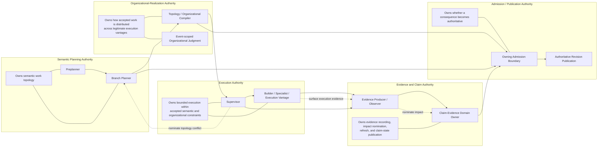

# Authority and Ownership

> **Question:** Which logical role owns each semantic decision, and what may every other role do with respect to it?

## Purpose

This view shows Work Engine's **authority topology**.

The semantic planning hierarchy describes how work flows through planning and execution. This page asks a different question:

> **Which decisions belong to which vantage, and what kinds of participation are permitted without transferring ownership?**

Work Engine treats authority as more specific than access, capability, or proximity to evidence.

A role may:

- observe a fact,
- recommend an action,
- nominate a decision,
- make a bounded decision,
- admit a consequence,
- execute an admitted consequence,

without necessarily owning all of those operations.

The central rule is:

> **Place each semantic decision with the narrowest authorized logical role whose vantage satisfies the evidence, ownership, continuity, independence, and consequence requirements of that decision.**

Authority does not arise merely because an actor has the information, the capability, or the opportunity to act.

---

## Diagram



---

## How to Read This View

This diagram is not a call graph.

It shows **authority domains** and the permitted movement of information and consequence between them.

A downstream role can surface evidence upward without acquiring the authority of the role that receives it.

Likewise, an upstream role can authorize a bounded consequence without necessarily performing the work itself.

---

## 1. Semantic Planning Authority

Semantic planning authority answers questions such as:

- What work actually exists?
- What are the accepted workstreams?
- What depends on what?
- Which semantic owners are affected?
- What consequences must be preserved?
- Is the accepted topology still correct?

At orchestration scale, that authority belongs to planning roles such as the **Preplanner**.

At branch scale, it belongs to the **Branch Planner**.

A Supervisor may discover evidence relevant to these questions, but discovery is not ownership.

For example:

```text
Supervisor discovers:
    A and B are not actually independent.

Supervisor may:
    report evidence;
    nominate topology conflict.

Supervisor may not:
    silently revise the branch plan to make A depend on B.
```

The semantic revision moves back to the role that owns the affected planning surface.

---

## 2. Organizational-Realization Authority

Organizational-realization authority answers a different class of question:

> **Given accepted semantic work, how should it be distributed across legitimate execution vantages?**

Examples include:

- Should two accepted obligations share one retained implementation context?
- Should a bounded specialist vantage be introduced?
- Does an independence requirement require a separate role?
- Is one execution context carrying too much unrelated semantic responsibility?
- Should a branch remain one execution vantage or become several?

This authority must remain bounded by the accepted semantic topology.

It may:

- group accepted obligations;
- separate accepted obligations;
- assign them to distinct execution vantages;
- project already-admitted authority into child roles;
- choose among lawful organizational realizations.

It may not silently:

- create new semantic obligations;
- remove accepted obligations;
- alter dependency meaning;
- redefine affected semantic owners;
- repair a false plan by inventing a new planning topology.

The unresolved boundary around cross-cutting realizations—where one execution vantage would own only part of one semantic obligation and part of another—belongs to the organizational-compilation view, not this page.

---

## 3. Execution Authority

Execution authority belongs to roles such as Supervisors, Builders, Specialists, and other realized execution vantages.

These roles act within already-admitted constraints.

A Supervisor may own:

- bounded execution coordination;
- branch-local continuity;
- child-role supervision;
- mutation within the accepted boundary;
- local execution decisions;
- evidence production;
- nomination of conflicts outside its authority.

A Builder or Specialist may own:

- the implementation consequence assigned to its role;
- mutations within its granted boundary;
- bounded local judgments necessary to complete that consequence.

Execution authority does not become planning authority merely because execution exposes new facts.

---

## 4. Evidence-Producing Authority

Work Engine separates **being able to observe something** from **being authorized to decide what that observation means for the system**.

Evidence producers may include:

- Supervisors;
- Builders;
- repository observers;
- runtime observers;
- context observers;
- provider adapters;
- deterministic analysis services.

An evidence producer may establish:

```text
"These two components share state."
```

It does not automatically establish:

```text
"The branch topology must change."
```

That second statement is a semantic consequence owned elsewhere.

This separation lets Work Engine externalize observation aggressively without externalizing judgment improperly.

---

## 5. Claim-Evidence Authority

The claim-evidence system owns the lifecycle of materialized claims and their evidence relationships.

Its authority may include operations such as:

```text
nominate_impact
open_refresh_episode
publish_refresh_judgment
```

These operations determine the state of the **claim**.

They do not automatically determine the state of the semantic object from which the claim originated.

For example:

```text
planning-derived claim:
    "A depends on B under branch-plan revision R"

new evidence:
    contradicts the claim

claim-evidence may:
    mark the claim changed through its own governed lifecycle

claim-evidence may NOT:
    rewrite branch-plan revision R
```

The changed claim can support a topology-conflict nomination.

Planning authority remains responsible for semantic revision.

The invariant is:

> **Claim state and source-authority state are related but not interchangeable.**

---

## 6. Admission and Publication Authority

Work Engine distinguishes deciding a consequence from making that consequence authoritative.

A valid semantic judgment may still require admission by the owner of the affected state transition.

Examples include:

- accepting an orchestration plan;
- accepting a branch plan;
- publishing a revised ExecutionEnvelope;
- admitting an organizational-topology revision;
- publishing a claim refresh judgment;
- activating a successor context.

This gives Work Engine a recurring pattern:

```text
observation
    ↓
bounded judgment
    ↓
admission
    ↓
authoritative publication
    ↓
runtime realization
```

A role that can judge a matter does not automatically gain authority to publish every consequence of that judgment.

---

## 7. Participation Modes Are Not Equivalent

Work Engine benefits from distinguishing several modes of participation explicitly:

```text
observe
recommend
nominate
decide
admit
execute
```

These are not synonyms.

### Observe

The role may perceive or produce evidence.

Example:

```text
Builder observes shared-state coupling.
```

### Recommend

The role may propose a preferred consequence without owning the decision.

Example:

```text
Specialist recommends a separate migration vantage.
```

### Nominate

The role may formally surface an issue to the owning decision boundary.

Example:

```text
Supervisor nominates topology conflict.
```

### Decide

The role owns the bounded semantic judgment.

Example:

```text
Branch Planner determines revised dependency topology.
```

### Admit

The role or service boundary determines whether the consequence becomes authoritative.

Example:

```text
Planning authority accepts branch-plan revision R'.
```

### Execute

The role realizes an already-admitted consequence.

Example:

```text
Builder executes the implementation contract.
```

Collapsing these verbs into a generic notion of "authority" hides important boundaries.

---

## 8. Authority Projection

Authority may be projected downward, but it must be attenuated.

The fundamental invariant is:

```text
child_authority ⊆ delegable(parent_authority)
```

A child role receives only the subset of authority required for its legitimate consequence.

Creating deeper organizational structure must never manufacture new authority.

```text
Root authority
    ↓
Workstream authority ceiling
    ↓
Supervisor authority
    ↓
Builder / Specialist authority
```

Each transition narrows scope.

It does not increase semantic standing.

---

## 9. Delegation Modes

Not all authority is delegable in the same way.

A decision surface may be:

### Non-transferable

The owning vantage must make the decision itself.

Example:

```text
A semantic owner may need to approve a consequence affecting its domain.
```

### Delegable

The owner may grant a bounded subset to another legitimate vantage.

Example:

```text
Supervisor delegates bounded mutation authority to Builder A.
```

### Nomination-only

The role may identify that a decision is required but may not resolve it.

Example:

```text
Supervisor nominates topology conflict.
```

### Advisory

The role may supply analysis without carrying formal consequence authority.

Example:

```text
Reviewer reports a finding.
```

The authority model should represent these differences rather than treating all child-role relationships as generic delegation.

---

## 10. Vantage Is Necessary but Not Sufficient

A role may possess excellent evidence and still lack legitimate authority.

Work Engine therefore treats a decision's legitimate vantage as more than informational access.

A decision may require some combination of:

```text
evidence sufficiency
semantic ownership
continuity
independence
effect boundary
authority ceiling
delegability
temporal position
```

The best-informed actor is not automatically the rightful owner.

Conversely, the formal owner may lack sufficient vantage to decide safely, in which case the architecture must create or consult a legitimate vantage rather than pretending ownership alone produces knowledge.

---

## 11. Deterministic Authority Projection

Some authority placement may eventually be derived mechanically.

Conceptually:

```text
Decision Requirements
    evidence requirements
    semantic owner
    continuity requirements
    independence constraints
    effect boundary
    authority ceiling
    delegability

        +

Candidate Role Vantages
    observations
    owned state
    continuity
    capabilities
    independence
    effects
    prohibitions

        ↓

Authority Projection
```

Possible results:

```text
exactly one eligible role
    -> deterministic projection possible

multiple eligible roles
    -> unresolved semantic / organizational choice

no eligible role
    -> explicit organizational gap
```

The projection mechanism may derive the consequence of already-admitted authority rules.

It may not invent new authority.

---

## Key Invariants

1. **Authority comes from an upstream legitimate owner; projection does not mint authority.**

2. **Information access is not authority.**

3. **Capability is not authority.**

4. **Execution proximity is not authority.**

5. **Coordination is not planning authority.**

6. **Claim maintenance is not source-domain authority.**

7. **A role may nominate a decision it may not decide.**

8. **A role may decide a bounded semantic question without owning publication of every consequence.**

9. **Child authority must be a subset of authority the parent is permitted to delegate.**

10. **Deeper organizational structure partitions authority; it does not create more of it.**

11. **Same actor does not imply same role, same decision surface, or same authority.**

12. **When no legitimate vantage owns a required decision, Work Engine should expose an organizational gap rather than silently assign authority to the nearest available actor.**

---

## What This View Does Not Show

This page does not describe:

- the complete semantic planning flow;
- exact branch-plan contents;
- organizational-compilation algorithms;
- when another execution vantage should be created;
- context-lifecycle pressure or replacement;
- transition fencing;
- exact claim schemas;
- model/provider selection;
- runtime capability resolution;
- detailed recovery procedures.

Those dimensions have their own views.

In particular, this diagram is not intended to imply that all authority is embodied by named human-like roles.

Some authority may belong to:

- services;
- transition boundaries;
- admission mechanisms;
- durable state owners;
- deterministic compilers.

The named roles shown here are examples of authority-bearing logical vantages within the broader system.

---

## Relationship to Semantic Planning Hierarchy

The semantic-planning view asks:

> **Where does planning occur?**

This view asks:

> **What exactly is each actor allowed to do?**

For example:

```text
Semantic Planning Hierarchy:

Branch Planner
    ↓
Accepted Branch Plan
    ↓
Supervisor
```

The authority view expands that edge:

```text
Branch Planner:
    owns branch semantic topology

Accepted Branch Plan:
    authoritative semantic boundary

Supervisor:
    owns bounded realization / execution
    may surface contradictory evidence
    may nominate topology conflict
    may not silently replan
```

The two pages therefore describe the same system from different dimensions.

---

## Related Architecture Views

- **`semantic-planning-hierarchy.md`** — where semantic planning and replanning occur.
- **`organizational-compilation.md`** — how accepted obligations become concrete execution vantages under bounded authority.
- **`context-lifecycle-and-fencing.md`** — how reasoning environments change without violating ownership or revision consistency.
- **`claim-evidence-refresh--planning-facts-emission.md`** — how materialized facts remain subordinate to their authoritative source.

A durable-state/revisions view (where authoritative state, derived state, and lineage live across all of these) does not exist yet as its own page — an open decomposition question, not resolved by this link list.

---

## Source and Status

This view synthesizes authority distinctions established across the planned Work Engine architecture, especially:

- the semantic ownership boundaries in `hierarchical-planning-and-multi-supervisor-orchestration.md`;
- the decision/admission distinctions in `proposal-decision-gated-implementation-compilation.md`;
- the authority/vantage decomposition in `deterministic-authority-projection-and-adaptive-organizational-topology.md`;
- the emerging organizational contract model associated with role compilation and ExecutionEnvelope design;
- claim-evidence's separation between evidence production, domain ownership, and publication authority.

The high-level authority principles are treated here as established planned-architecture direction.

The exact representation of authority grants, role primitives, deterministic authority projection, and organizational-realization ownership remains subject to the reconciliation work identified elsewhere in the architecture.

This page therefore describes the intended ownership model without claiming that every authority primitive shown here already exists as a concrete runtime type or service.