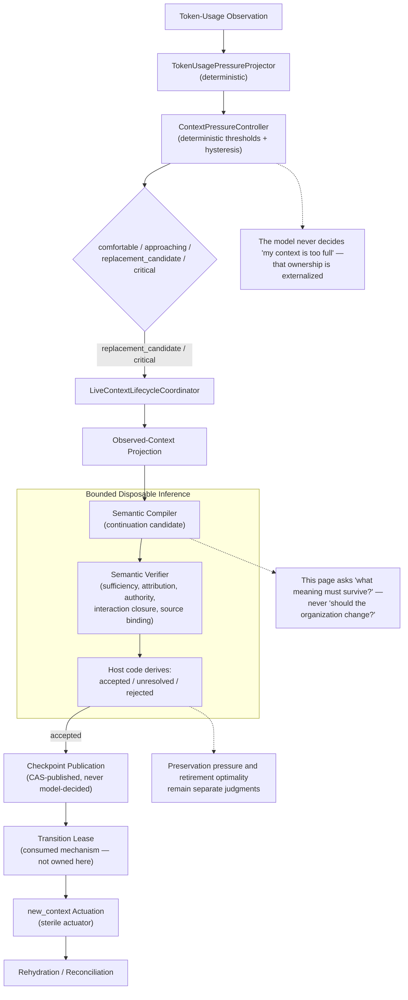

# Context Lifecycle

> **Question:** Given an existing logical vantage and its durable continuation state, when and how should its projected reasoning context change over time — without changing the semantic role or organizational topology that vantage belongs to?

## Purpose

This view shows Work Engine's **context-lifecycle dimension**: the temporal question of when a retained reasoning context should be replaced, and how continuation meaning survives that replacement — kept strictly separate from the topological question of whether the vantage itself should change.

The central rule, restated from the idea document that first drew this line:

> **When should this same vantage receive a fresh context?** is a different question from **is this still the correct organizational topology?** The first belongs here. The second belongs to `organizational-compilation.md`. This page answers only the first.

This dimension owns thread/turn observation, deterministic pressure detection, bounded compiler/verifier inference over continuation meaning, checkpoint publication, transition actuation, and rehydration. It does not own organizational topology, authority reassignment, or either of the two shared mechanisms it depends on most heavily (§6, §7) — those are consumed here, not invented or owned here.

---

## Diagram



---

## How to Read This View

Pressure detection, compilation, and publication are three separately owned steps, not one fused decision. Pressure is deterministic and mechanical. Compilation and verification are bounded, disposable inference over one narrow question — what meaning must survive a transition, and is the candidate continuation sufficient. Nothing in this loop asks whether the vantage's organizational role should change; that question is explicitly out of scope (§9).

---

## 1. What This Dimension Owns

Verified directly against the live implementation, not assumed from the design document alone:

```text
thread and turn observation
token, context-window, timing, and cost telemetry
bounded model-visible history projections
inspection scheduling
semantic-compilation and verification invocations
continuation-checkpoint storage and revision fencing
transition readiness and actuation coordination
transition classification
rehydration delivery and reconciliation evidence
the external lifecycle ledger
```

It does **not** own a role's objective, domain truth, or workflow authority; user approval or unresolved human intent; canonical claims, decisions, receipts, schedules, or repository state; authority grants merely described by a checkpoint; the exact hidden model context; or provider transition semantics inferred from an event name alone — `semantic-context-lifecycle-manager.md`'s own "Ownership boundary" section states this list directly.

---

## 2. The Live, Verified Deterministic Path

Re-verified directly against source, not carried forward from an earlier pass: `TokenUsagePressureProjector` is at `app-server/src/token-usage-pressure-projection.mjs:59`; `ContextPressureController` is at `app-server/src/context-pressure-controller.mjs:192`. Pressure is computed directly from `last.totalTokens / modelContextWindow`, then deterministically mapped through configured bands and hysteresis into `comfortable` / `approaching` / `replacement_candidate` / `critical`. **There is no model call in that decision.** No hardcoded thresholds exist in either file — bands are experimental configuration, tuned per deployment, never committed defaults promoted into doctrine.

---

## 3. Where Inference Actually Happens, and What It Does Not Ask

Once pressure triggers lifecycle preparation, `LiveContextLifecycleCoordinator` invokes bounded disposable inference: a semantic compiler produces a continuation candidate (objective, logical progression, current work position, completed consequences, commitments, decisions, authority dependencies, evidence interpretation, unresolved questions, governing instructions, human-interaction state, authorized next action); a distinct semantic verifier challenges that candidate on sufficiency, attribution, authority preservation, interaction closure, and source binding. **Host code — not the verifier model — derives `accepted`, `unresolved`, or `rejected`.**

The present semantic question is **"what meaning must survive this context transition, and is that continuation representation sufficient?"** It is not, and this page does not extend it to be, **"should the organizational topology of this vantage change?"** — that question belongs entirely to `organizational-compilation.md` (§9 below).

---

## 4. Preservation and Retirement Optimality Remain Separate Judgments

`semantic-context-lifecycle-manager.md`'s own invariant 6 states this directly, and it is not yet fully realized live: the design intends retirement to happen "only when replacement is semantically safe **and economically advantageous**," but the live replacement trigger today is pressure threshold plus semantic-continuation verification — expected remaining work, transition cost, and projected savings do not yet enter the live per-transition decision. A prior lifecycle audit observed a real replacement that removed roughly 202k live tokens without demonstrating net savings, because compiler/verifier/reconciliation overhead was large.

**Re-checked here rather than assumed stale:** a shadow-mode evidence loop now exists (integrity-bound per-observation episodes, revision-bound pressure-policy comparison) aimed at eventually tuning pressure-policy *thresholds* — but that is a policy-tuning question, not the live per-transition economic decision this invariant names as still missing. `replacement candidate ≈ token-pressure threshold` and `semantic inference ≈ can we preserve/reconstruct meaning safely?` remain the live shape; `replacement decision = pressure + expected remaining work + transition cost + projected savings + semantic fitness` is not yet real.

---

## 5. Continuation State and Checkpointing

A compiled `continuation-state-v1` candidate binds exact authority and source references, explicit human-interaction status, and loading disposition. Checkpoint publication is CAS-published against the current head — the same optimistic-concurrency shape every other dimension's own durable state uses (§7). A compiled checkpoint can never create, widen, transfer, extend, or reactivate authority (invariant 2) — it is a rehydration artifact, never a replacement owner for the canonical meaning it preserves.

---

## 6. This Dimension Consumes, Never Owns, Transition Fencing

**Stated explicitly, correcting an earlier informal characterization of this territory as "Context Lifecycle's own mechanism."** The idea document that generalized this pattern is precise about why that framing is wrong: "Both context-lifecycle and organizational topology can change the model's effective reasoning environment, so their transitions need shared admission, not mutual awareness... Both should instead consume a shared transition-admission/fencing layer." Neither dimension is senior to the other with respect to fencing.

`semantic-context-lifecycle-manager.md`'s own invariant 15 — "final readiness comparison and actuator delivery share one revision-bound transition lease that competing input, effects, or binding changes revoke" — is this dimension's own *consumption* of that shared mechanism, not its invention. The mechanism itself (decision-episode fences, topology-transition fences, revision-bound preparation, stale-preparation rejection) belongs to a future canonical mechanism treatment, not to this page.

---

## 7. This Dimension Consumes, Never Owns, Revision/CAS

Checkpoint publication (§5), the lifecycle ledger, and the transition lease itself all use the same predecessor-chained, CAS-published pattern already shared by branch-plan revisions, claim revisions, and realization lineage. This is a fourth confirmed instance of that shared mechanism — not something this dimension needed to invent, and not something this page owns either.

---

## 8. Rehydration and Reconciliation

After `new_context` actuation, a fresh window must reconcile the exact checkpoint before productive domain work resumes (invariant 11) — recovery claims semantic continuation from durable evidence, not restoration of the exact retired model context (invariant 16). Notification delivery must be evidenced by a delivery receipt or an observable pending-message artifact; an attempted route is not delivery (invariant 19).

---

## 9. The Topological Question Is Explicitly Out of Scope Here

Restated precisely, because it is the single most important boundary this page exists to hold: token volume is only one kind of pressure. The idea document that first generalized this dimension's own scope also named a broader concept — **context fitness** — that includes relevance pressure, semantic-width pressure, independence pressure, authority pressure, continuity pressure, instruction pressure, and coupling pressure. Recognizing that a vantage's *organization* no longer fits (should this obligation split into two vantages? does an independence requirement now require separation?) is not this dimension's question — it belongs to `organizational-compilation.md`, which owns exactly that "is this still the correct execution topology" question, fed by the same shared Context Observer this dimension also consumes, but resolved as an entirely separate applicability decision, never gated by or gating this dimension's own temporal-replacement question.

---

## Key Invariants

1. **The model never decides "my context is too full" — that ownership is externalized to deterministic pressure detection.**
2. **Preservation pressure and retirement optimality remain separate judgments; today, only the former is live.**
3. **A compiled checkpoint never creates, widens, transfers, extends, or reactivates authority.**
4. **The present semantic question is "what meaning must survive," never "should the organization change."**
5. **Transition fencing is consumed here, not owned here — a shared mechanism with Organizational Compilation, not this dimension's own invention.**
6. **Revision/CAS publication discipline is consumed here, not owned here — the same pattern every other dimension's durable state uses.**
7. **A fresh window must reconcile the exact checkpoint before productive work resumes; recovery claims continuation from durable evidence, never restoration of the exact retired context.**

---

## What This View Does Not Show

This page does not define:

- organizational topology or vantage separation (`organizational-compilation.md`);
- the executor-class-routing seam or any authority-reassignment question;
- the exact mechanics of the transition-fencing mechanism it consumes (a future mechanism-level page);
- the exact mechanics of the revision/CAS mechanism it consumes (a future mechanism-level page);
- claim or evidence materialization (`evidence-and-claims.md`);
- role-contract semantics (`role-and-contract-structure.md`);
- concrete provider/model/harness selection (`runtime-realization.md`).

---

## Relationship to Organizational Compilation

Both dimensions consume the same shared Context Observer and the same shared transition-fencing mechanism, as independent, parallel, equally-ranked consumers — neither gates the other's applicability question. `organizational-compilation.md` owns whether the vantage's *topology* still fits; this page owns whether its *context* still fits. A stable boundary test from the shared source material: a role boundary usually implies a vantage boundary; a vantage boundary usually implies a context boundary; a context boundary does not imply a role boundary — so most of what this dimension resolves never needs to involve Organizational Compilation at all.

## Relationship to Authority and Ownership

Invariant 2 (a checkpoint cannot mint authority) is this dimension's own concrete instance of `authority-and-ownership.md` §12's general invalidation-never-mints-authority rule — a staleness or retirement decision here is exactly the same shape as invalidation anywhere else in the architecture.

---

## Related Architecture Views

- **`organizational-compilation.md`** — the sibling, equally-ranked consumer of the shared Context Observer and transition-fencing mechanism; owns the topological question this page explicitly excludes.
- **`authority-and-ownership.md`** — the general invalidation-never-mints-authority invariant this dimension's own checkpoint-authority rule instantiates.
- **`evidence-and-claims.md`** — a structurally similar revision/CAS consumer, unrelated in subject matter.
- **`role-and-contract-structure.md`**, **`runtime-realization.md`** — neither interacts with this dimension directly; both are downstream of Organizational Compilation, not of this page.

---

## Source and Status

```yaml
architecture_status:
  design: proposed
  reconciliation: reconciled
  authorization: implementation_authorized
  implementation: partial
  owner: app-server/docs/semantic-context-lifecycle-manager.md
  status_as_of: 2026-09-16
```

**A genuinely new combination worth naming, not smoothed into a more familiar shape:** `design: proposed`, not `accepted` — no explicit, dated acceptance decision for this architecture was found, unlike `claim-evidence-service.md`'s own "this direction is authorized as the App Server design target" or the organizational-authority mechanism's explicit 2026-09-15 acceptance. Yet `authorization: implementation_authorized` and `implementation: partial` are both directly verifiable: `app-server/src/token-usage-pressure-projection.mjs` and `context-pressure-controller.mjs` are real, running code; the source document's own "Current evidence gaps" and "Implementation sequence" sections describe substantial live-tested machinery (schema-migrated SQLite adapters, a gated live strategic-planner test proving the live inference path, live transition-lease acquisition and reconciliation). Implementation having actually happened is direct evidence that implementation *was* authorized at the time — that is confirming a past fact, not inferring a future one, and does not violate `status-grammar.md` §8's "evidence supporting acceptance is not acceptance" rule, which concerns the separate, still-unproven claim that this architecture has been explicitly *adopted* as the intended direction. Substantial, tested implementation without ever the second — a live system that grew through incremental authorized work rather than one formal acceptance event — is a real, distinct shape this grammar had not yet had to represent.
