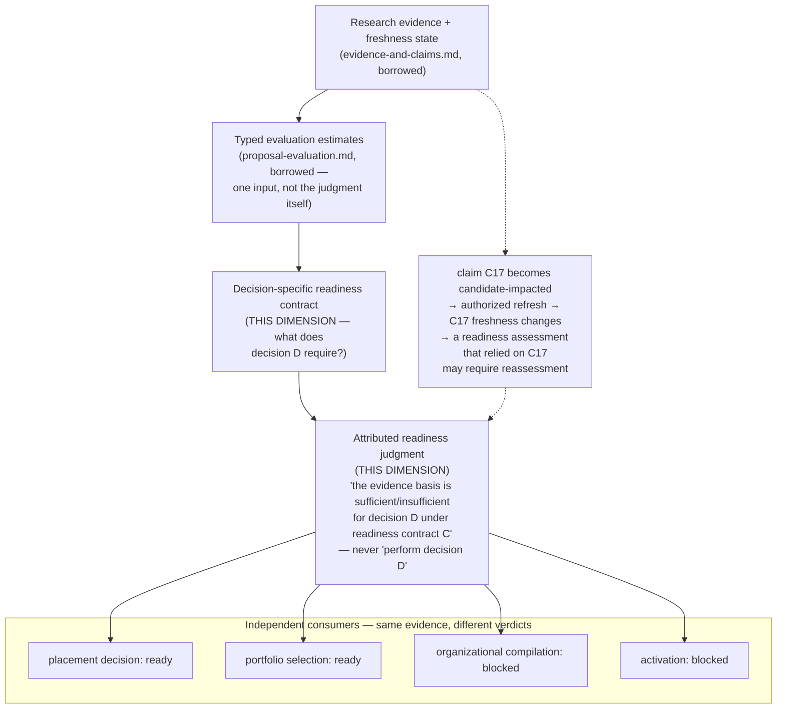

# Decision-Specific Readiness

> **Question:** Given the evidence and estimates currently held about a proposal, is that evidence basis sufficient for one particular downstream decision — under an explicit readiness contract naming what that decision requires?

## Purpose

This view shows Work Engine's **decision-specific-readiness dimension**: confirmed independent from `proposal-evaluation.md` by direct falsifier testing this session, not assumed from adjacency. The falsifier that settles it, quoted directly from the source: one evidence basis, four different decision-specific verdicts, simultaneously —

```text
placement decision:        ready
portfolio selection:       ready
organizational compilation: blocked
    missing: independence requirement, mutation authority
activation:                 blocked
    missing: accepted envelope, current runtime capability
```

This dimension owns the **readiness contract** (what a particular downstream decision requires) and the **attributed readiness assessment** (ready / blocked / uncertain, exact missing requirements, exact evidence and freshness basis) — without ever acquiring the decision authority it merely informs.

```text
Decision-Specific Readiness owns:
    decision-specific readiness contracts (what evidence/facets a
        particular downstream decision requires)
    attributed readiness assessments (ready/blocked/uncertain, missing
        requirements, exact evidence + freshness basis)

Decision-Specific Readiness does NOT own:
    the evidence or freshness mechanism itself (evidence-and-claims.md)
    typed evaluation estimates (proposal-evaluation.md)
    the decision itself, or any authority the readiness verdict informs
    a competing R0-R5 lifecycle (downgraded, see §3)
```

---

## Diagram



---

## How to Read This View

Readiness is decision-relative, never proposal-absolute. The same proposal, the same evidence, and the same evaluation estimates can be simultaneously "ready" for one decision and "blocked" for another — because each decision carries its own readiness contract naming what it specifically requires. This dimension's own revision cadence is independent of evaluation's: a claim's freshness change can invalidate a previously published readiness assessment without evaluation itself ever re-running.

---

## 1. What This Dimension Owns

Two pieces, confirmed as genuinely unowned elsewhere by a targeted search across `app-server/src`, `app-server/docs`, and `app-server/ideas/pending`, which found zero occurrences of "readiness profile," "readiness_profile," or this shape anywhere:

- **The readiness contract** — what evidence, facets, or estimates a particular downstream decision requires before it can proceed.
- **The attributed readiness assessment** — ready / blocked / uncertain, with exact missing requirements and the exact evidence and freshness basis relied on.

Not owned by any existing or queued neighbor: `evidence-and-claims.md` owns the generic claim/evidence/lineage substrate and the freshness *mechanism*, not a sufficiency-for-a-named-decision *judgment* layered on top of it; `proposal-evaluation.md` is a likely supplier of the evidence a readiness assessment reads, not the judgment of whether that evidence suffices for a *particular* decision; `organizational-compilation.md` consumes an organization-qualified projection as upstream input, but does not produce the judgment that a proposal has reached that state; `implementation-contract-compilation.md` owns a later, narrower "plan readiness" concept downstream of a decision already made (§6).

---

## 2. Confirmed Independent From Proposal Evaluation, by Direct Falsifier Test

Both this dimension's own source and `proposal-evaluation.md`'s own source state the boundary independently, not merely from one side:

> "Evaluation answers 'what do we currently believe about this proposal?'; readiness answers 'is what we currently know sufficient for this particular decision?' These are different questions and should not be merged."

Recorded as `SUPPLIES`, the same relation type this session uses everywhere to mark distinct owners, never merged ones. The asymmetry is real: one evaluation can be consumed by multiple readiness decisions simultaneously (§ diagram above), but each readiness judgment requires exactly one decision-specific contract — a clean many(readiness-judgments)-to-one(evaluation) relationship, itself further evidence of separate ownership, not implementation-adjacency dressed up as identity.

---

## 3. The R0–R5 Ladder Is Downgraded to an Optional Derived Projection, Not a Competing State Machine

The idea's own un-compressed history warns against treating R0–R5 as more than a coarse summary: it calls the R-levels "epistemic states, not a mandatory ceremony," then states "one scalar level cannot express every kind of readiness." Decomposed against existing and queued owners, no individual R-stage survives as new canonical state this dimension must own:

```text
R0 Captured              -> idea/intake provenance (formation)
R1 Formed                -> proposal formation (already exists)
R2 Situated              -> placement / architecture relationship (already exists)
R3 Characterized         -> proposal-evaluation.md's own estimates
R4 Organization-qualified -> organizational-compilation.md's own upstream input,
                             which does not make "R4" an independent owner
R5 Activation-ready       -> bundles fields each already owned by formation,
                             authority, organizational compilation, or
                             runtime admission
```

**If a future page or implementation resurrects R0–R5, it must stay a derived, optional projection over the stronger readiness assessments this dimension actually owns — never a second canonical lifecycle competing with formation, placement, evaluation, organizational qualification, authority, or runtime admission.**

---

## 4. Freshness Is a Referenced Facet, Not a Mechanism This Dimension Owns

The freshness/refresh mechanism itself retires entirely to `evidence-and-claims.md` — this dimension's own mechanical/attributed split ("mechanical analysis may mark a claim candidate-stale; attributed judgment determines whether the conclusion remains current") is exactly `evidence-and-claims.md`'s `may_affect` nomination → refresh episode → `retained_unchanged`/`changed`/`inapplicable`/`insufficient`/`contested`/`deferred`/`superseded` outcome set. But freshness remains a *referenced facet* this dimension's own judgments depend on:

```text
claim C17 becomes candidate-impacted
        |
        v
authorized refresh
        |
        v
C17 freshness changes
        |
        v
a readiness assessment that relied on C17
    may require reassessment
```

This propagation-consumer relationship is this dimension's own open scope, never a competing claim-evidence responsibility — the readiness layer itself never owns refresh.

---

## 5. The Ownership Boundary: a Readiness Judgment Never Becomes the Authority It Informs

Stated directly from the source, because it is the single most important boundary this dimension exists to hold:

```text
research evidence
        |
        v
freshness state
        |
        v
decision-specific requirements (a readiness contract)
        |
        v
attributed readiness judgment
    "the evidence basis is sufficient/insufficient for decision D
     under readiness contract C"
    -- not --
    "perform decision D"
```

A readiness assessment does not acquire portfolio-selection authority, organizational authority, activation authority, or proposal-acceptance authority merely by concluding `activation-ready`. Those remain with their existing or separately owned consumers (`organizational-compilation.md`, `implementation-contract-compilation.md`, `portfolio-selection.md`).

---

## 6. Distinct From Decision-Gated Compilation's Own "Plan Readiness"

`implementation-contract-compilation.md`'s own source names a "plan readiness" concept in its stage-1 contract characterization ("which executor classes are semantically supported by a compiled contract, with what evidence-backed readiness — plan readiness only, no slice authority"). This is a genuinely different fact from this dimension's own pre-decision sufficiency judgment: plan readiness is narrower, evaluated *after* a decision has already been made and sealed, over a compiled implementation contract specifically — not the proposal-level, pre-decision "is this evidence sufficient to decide at all" judgment this dimension owns. Named explicitly to avoid the same kind of conflation the `routing.vs.admission` regression caught elsewhere this session.

---

## Key Invariants

1. **A readiness judgment never becomes the authority it informs.**
2. **Readiness is decision-relative, not proposal-absolute — the same evidence can be simultaneously ready for one decision and blocked for another.**
3. **This dimension's own revision cadence is independent of evaluation's — a freshness change can invalidate a readiness assessment without evaluation itself re-running.**
4. **The R0–R5 ladder is an optional derived projection over this dimension's own stronger judgments, never a competing canonical state machine.**
5. **Freshness is consumed here, never owned here — `evidence-and-claims.md`'s own refresh mechanism.**
6. **"Plan readiness" (`implementation-contract-compilation.md`'s own narrower, downstream concept) is a different fact from this dimension's own pre-decision sufficiency judgment.**

---

## What This View Does Not Show

This page does not define:

- the evidence or freshness mechanism itself (`evidence-and-claims.md`);
- typed evaluation estimates (`proposal-evaluation.md`);
- which decision actually gets made, or by whom (`portfolio-selection.md`, `material-decision-selection.md`, and whichever authority owns each named consumer);
- plan-level readiness downstream of an already-sealed decision (`implementation-contract-compilation.md`);
- organizational-envelope consumption itself (`organizational-compilation.md`).

---

## Relationship to Proposal Evaluation

`SUPPLIES`: this dimension consumes `proposal-evaluation.md`'s typed estimates as one input to a decision-specific sufficiency judgment; this dimension never performs the estimation itself.

## Relationship to Evidence and Claims

Consumes freshness state and the refresh mechanism directly; owns neither — `evidence-and-claims.md` remains the sole publisher of both.

## Relationship to Portfolio Selection

One of several independent consumers of this dimension's readiness verdict, alongside placement, organizational compilation, and activation; this dimension itself has no portfolio authority.

---

## Related Architecture Views

- **`proposal-evaluation.md`** — the `SUPPLIES` source of typed estimates this dimension consumes as one input.
- **`evidence-and-claims.md`** — owns the freshness mechanism this dimension's own judgments depend on and can be invalidated by.
- **`portfolio-selection.md`** — one of several independent consumers of this dimension's readiness verdict.
- **`organizational-compilation.md`** — another independent consumer; owns the organization-qualified projection this dimension's own judgment may inform.
- **`implementation-contract-compilation.md`** — owns a distinct, narrower, downstream "plan readiness" concept (§6) that must not be conflated with this dimension's own pre-decision sufficiency judgment.

---

## Source and Status

```yaml
architecture_status:
  design: accepted
  reconciliation: reconciled
  authorization: implementation_authorized
  implementation: none
  owner: app-server/docs/proposal-research-maturity-and-freshness-reconciliation.md
  status_as_of: 2026-09-16
```

`design: accepted` — the reconciliation's own Acceptance section: "Accepted 2026-09-14 ... This document's findings and disposition are confirmed accurate." `reconciliation: reconciled` — this page's content traces directly to that document, read in full this session (supplemented by a falsifier-test fork grounded in the same source and in `proposal-evaluation.md`'s own text), not carried forward from a prior summary. `authorization: implementation_authorized` — the same Acceptance section states directly: "Implementation of the stated residue — the decision-specific readiness contract and attributed assessment semantics — is authorized to proceed." `implementation: none` — the source's own targeted search across `app-server/src`, `app-server/docs`, and `app-server/ideas/pending` found zero occurrences of "readiness profile," "readiness_profile," or this shape anywhere.
