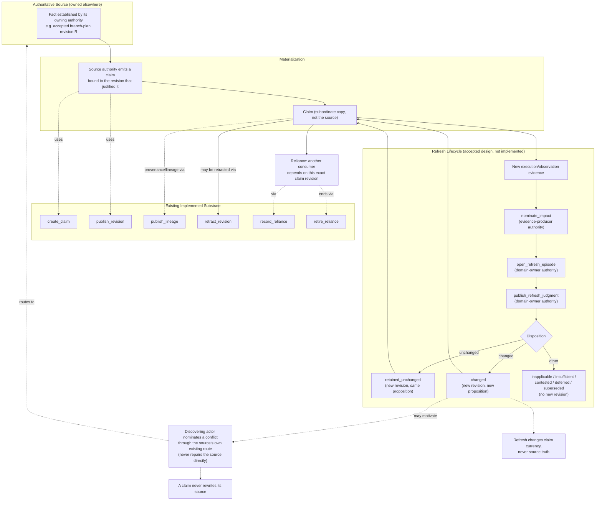

# Evidence and Claims

> **Question:** What propositions does Work Engine durably materialize as claims; what establishes their provenance, currency, reliance, and semantic impact; and how do those claims remain subordinate to the authoritative source whose meaning they materialize?

## Purpose

This view shows Work Engine's **claim-evidence dimension**: the durable, provenance-bearing record of asserted propositions, distinct from both the authoritative sources those propositions describe and the generic revision machinery that publishes them safely.

A claim is never the thing it is about. It is a **materialization** — a revision-bound, attributed copy of a fact some other authority already established, kept current through its own governed lifecycle. The central rule:

> **A claim is cache, never owner. Refreshing, superseding, or invalidating a claim changes a fact about the claim. It is never itself authority to change the source the claim describes.**

This dimension owns claim identity, revision, provenance, lineage, reliance, and refresh-lifecycle semantics. It does not own the truth of what a claim is about — that belongs to whichever dimension produced the fact in the first place (Semantic Planning for a branch plan, Organizational Compilation for an admitted organization, or any other domain source).

---

## Diagram



---

## How to Read This View

The diagram has three regions with different maturity, deliberately drawn together rather than split across pages, because the status grammar (`status-grammar.md`) exists precisely so a mixed-maturity page stays legible:

1. **Materialization and the existing six-operation substrate** — implemented, running code.
2. **The refresh lifecycle** (`nominate_impact` / `open_refresh_episode` / `publish_refresh_judgment`) — accepted design, no implementation yet.
3. **Domain profiles that would use this substrate for planning- and organization-derived facts** — proposed and exploratory respectively, covered in §7–§8 below.

The authoritative source itself is drawn outside this dimension's boundary on purpose: this page never decides what a branch plan or an admitted organization means, only what happens to a materialized copy of a fact about one.

---

## 1. What This Dimension Owns

Claim identity, revision chains, provenance, lineage relationships, reliance (who depends on an exact claim revision), and — once implemented — impact nomination and refresh-episode/judgment lifecycle.

It answers questions such as:

```text
What proposition does this claim assert?
What evidence and provenance support it?
What revision of its source justified it?
Is it still current, or has it been refreshed, superseded, or retracted?
Who relies on this exact revision, and what happens to them if it changes?
```

It does not answer whether the proposition is *true in the world* independent of its source — that question belongs to the source's own owning authority.

---

## 2. The Implemented Substrate Today

Verified directly against `app-server/src/services/claim-evidence/{service,contract}.mjs`, not assumed from design documents: six operations exist and are real, running code —

```text
create_claim       — mint a new claim and its initial revision
publish_revision    — publish a new revision under CAS against current heads
publish_lineage      — record a typed relationship between revisions
                        (refresh / correction / supersession / composition /
                        derivation / identity_fork / retraction)
record_reliance      — a consumer declares dependence on an exact revision
retire_reliance      — retire or supersede an existing reliance
retract_revision     — publish a retraction lineage edge
```

Three domain profiles currently exist (`contract.mjs`'s `PROFILES`): `proposal-research-v1`, `revision-bound-review-finding-v1`, `production-path-v1`. Every claim belongs to exactly one profile, which owns that domain's own proposition-identity and evidence-mode rules.

```yaml
status_override:
  design: accepted
  reconciliation: reconciled
  authorization: implementation_authorized
  implementation: implemented
  source: app-server/docs/claim-evidence-service.md
```

---

## 3. Materialization: A Claim Is a Subordinate Copy, Never the Source

When an authoritative source publishes a fact, a claim materializing that fact is a distinct, later act — not the same transition. The claim's revision is bound to the exact source revision that justified it (§7 works through a concrete case: a planning-fact claim bound to an accepted branch-plan revision).

The invariant:

```text
source publishes fact
        ↓
claim materializes fact, bound to the source revision that justified it
        ↓
claim's own lifecycle (refresh, supersession, retraction) proceeds independently
        ↓
none of that lifecycle is authority to change what the source itself asserts
```

This is the same "cache is never owner" pattern this dimension shares with every other subordinate-materialization relationship in Work Engine's architecture — stated once here because claim-evidence is its most fully worked instance, not because the pattern is unique to it.

---

## 4. Reliance: Who Depends on a Claim, and What Happens When It Changes

A consumer that structurally depends on one exact claim revision records that dependence through `record_reliance`, scoped to that revision specifically — not to the claim's identity in general. If the claim is later refreshed to a new revision, existing reliances do not silently follow; they remain bound to the revision they declared, until explicitly retired or superseded through `retire_reliance`.

This dimension owns recording and retiring reliance. It does not own deciding whether a changed claim *should* reopen a consumer's own work — that judgment belongs to whichever workflow owns the consumer, using the changed-claim fact as an input.

---

## 5. Provenance and Lineage

Every claim revision carries producer, authority reference, and evidence references. Relationships between revisions are typed and explicit (`publish_lineage`'s `relationship` field): `refresh`, `correction`, `supersession`, `composition`, `derivation`, `identity_fork`, `retraction`. A claim's history is therefore reconstructable — which revision produced which, under what authority, from what evidence — without inferring lineage from timing or proximity.

---

## 6. The Accepted-but-Unimplemented Refresh Extension

`nominate_impact` / `open_refresh_episode` / `publish_refresh_judgment` — fully specified in `proposals/evidence-lineage/claim-maintenance-and-reliance-propagation/operation-contract-surface.md`, passed after six review rounds — extend the substrate in §2 without replacing any of it.

```text
nominate_impact          evidence-producer authority; caller-asserted identity;
                          publishes candidate impact only — cannot itself make
                          a claim stale, changed, or reopened

open_refresh_episode      authorized domain-owner authority; admits an episode
                          against one exact subject revision, triggered by one
                          or more prior nominations

publish_refresh_judgment  same domain-owner permission class; closes the
                          episode with an attributed disposition and, when the
                          disposition requires one, causally produces the
                          successor claim revision and its `refresh` lineage
                          edge as one atomic consequence
```

Episode-level dispositions: `retained_unchanged` / `changed` / `inapplicable` / `insufficient` / `contested` / `deferred` / `superseded`. Nomination-level dispositions use a deliberately distinct vocabulary: `resolved_unchanged` / `resolved_changed` / `inapplicable` / `insufficient_evidence` / `contested` / `deferred` / `superseded` — the two are never conflated into one enum, because `semantic-model.md` treats a nomination's own outcome and an episode's overall disposition as separate facts.

```yaml
status_override:
  design: accepted
  reconciliation: reconciled
  authorization: design_work_authorized
  implementation: none
  source: proposals/evidence-lineage/claim-maintenance-and-reliance-propagation/operation-contract-surface.md
```

The next authorized design step is **profile-owned `refresh_policy`** (`branching_permitted`, `proposition_equivalent`) for the three existing profiles in §2 — not yet formed for any of them. No builder can truthfully implement this extension for a real profile until that policy exists.

---

## 7. Planning-Facts-v1: A Proposed Domain Profile

A candidate, not-yet-existing domain profile that would materialize declared branch-plan fields as claims, as one atomic consequence of branch-plan acceptance — reducing how much a newly formed supervisor must rediscover through fresh reconnaissance.

```text
publish accepted branch-plan revision R  (Semantic Planning's own transition)
        ↓  (must be one atomically-visible admission, not two sequenced ones)
planning-fact claims materialized, bound to R
        ↓
supervisor formation consumes them directly, per Organizational Compilation
```

Constrained to pure projection: a `planning-facts-v1` claim's proposition must trace to an explicitly declared branch-plan field by direct restatement, never by inference from the plan's evidence — otherwise the profile becomes a second, unaccountable planner.

```yaml
status_override:
  design: proposed
  reconciliation: partial
  authorization: exploration_only
  implementation: none
  source: app-server/ideas/pending/deterministic-authority-projection-and-adaptive-organizational-topology.md
```

`reconciliation: partial`, not `reconciled` — checked against this dimension's own operation contract and against `hierarchical-planning-and-multi-supervisor-orchestration.md` §6's field list, but not against every consumer that might eventually want to read these claims (recursive organizational-compilation layers, specifically — an explicitly open question in the owning idea document).

---

## 8. Organizational-Facts-v1: A Named Structural Possibility, Not a Proposal

Symmetric in shape to §7 — a hypothetical future profile that would materialize facts from an admitted `ExecutionEnvelope`/topology revision (Organizational Compilation's own authoritative artifact) rather than from a branch plan. Named only so that a recursively admitted organizational layer does not quietly treat claims as a substitute for the authoritative revision it should read directly when one exists.

```yaml
status_override:
  design: exploratory
  reconciliation: not_applicable
  authorization: exploration_only
  implementation: none
  source: app-server/ideas/pending/deterministic-authority-projection-and-adaptive-organizational-topology.md
```

`reconciliation: not_applicable` — this has not crystallized into a concrete proposal yet, so there is nothing specific for reconciliation to check it against.

---

## 9. What This Dimension Does Not Own

Deliberately excluded, even though each is adjacent:

- **Generic evidence production.** Any role or service may produce evidence (a builder observing shared state, a repository scanner, a context observer). Producing evidence is not this dimension's concern until that evidence becomes a claim through `nominate_impact` or claim materialization.
- **The truth of a source's own fact.** Branch-plan truth belongs to Semantic Planning. `ExecutionEnvelope`/organizational truth belongs to Organizational Compilation. This dimension never decides those; it only materializes and refreshes copies of them.
- **CAS, revision-chains, and atomic-publication mechanics in general.** Claim revisions use exactly the same predecessor-chained, CAS-published pattern every other dimension's own durable state uses. That pattern is a shared mechanism, not something this dimension invented or owns — see the Revision/CAS mechanism (not yet its own page; referenced, not duplicated, here).
- **Transition fencing between concurrently changing authoritative revisions.** A shared concern across dimensions, not specific to claims.
- **Authority to change the source artifact a claim describes.** Stated repeatedly in this page because it is the single most important boundary this dimension exists to preserve.

---

## Key Invariants

1. **A claim is a materialization of a fact, never the fact's owner.**
2. **Refreshing, superseding, or retracting a claim is a fact about the claim's own currency — never itself authority to change the source.**
3. **A changed claim can motivate a conflict nomination through the source's own existing route; it cannot repair the source directly.**
4. **Nomination asserts candidate impact only — it cannot itself make a claim stale, changed, or reopened.**
5. **A nomination's own resolution and an episode's causal attribution are separate facts, never derived from one another.**
6. **Reliance binds to an exact revision, not to a claim's identity in general; it does not silently follow a successor revision.**
7. **Materialization must be pure projection of declared source fields — never inference of a semantic conclusion the source did not itself assert.**
8. **A materializing transition and its claim emission must be one atomically-visible admission, not two sequenced ones, when the source dimension's own transition is what produces the claim.**
9. **No currency check can ever prove absence of impact nobody has yet observed and nominated — only absence of *known* unprocessed impact.**

---

## What This View Does Not Show

This page does not define:

- exact revision/CAS mechanics (shared mechanism, not duplicated here);
- transition fencing implementation;
- branch-plan or `ExecutionEnvelope` schemas (owned by other dimensions);
- the full cross-consistency matrix between episode disposition and trigger resolutions (see `operation-contract-surface.md` directly for the logically-forced subset that already exists);
- delivery, recovery, or selective-reopening obligations (explicitly out of `operation-contract-surface.md`'s own scope, owned by domain workflows and a general control-plane delivery capability respectively);
- which specific profile gets a `refresh_policy` definition first.

---

## Relationship to Semantic Planning Hierarchy

Semantic Planning produces the accepted branch-plan revisions that `planning-facts-v1` (§7) would materialize. This dimension never influences what a branch plan says — only how a durable copy of its declared fields, once published, stays current and gets re-derived after a replan.

## Relationship to Organizational Compilation

Organizational Compilation's own admitted revision is the analogous future source for `organizational-facts-v1` (§8). Organizational Compilation already reads its *root-layer* structural inputs directly from the accepted branch plan (not through claims at all); this dimension's materialized facts earn their keep at supervisor formation and at recursive deeper layers that lack an artifact as directly readable as the root branch plan.

---

## Related Architecture Views

- **`semantic-planning-hierarchy.md`** — the authoritative source for planning-derived claims.
- **`organizational-compilation.md`** — the authoritative source for organizational-derived claims, and the consumer of planning-derived ones during supervisor formation.
- **`runtime-realization.md`** — the sibling dimension whose own invalidation lifecycle independently converged on the same "invalidation never mints authority" shape as this dimension's refresh lifecycle.
- **`role-and-contract-structure.md`** — a distinct source dimension a future domain profile could materialize claims from, symmetric to `planning-facts-v1` and `organizational-facts-v1` (not proposed).
- **`authority-and-ownership.md`** — the evidence-producer / domain-owner authority split this dimension's operations depend on directly.
- **`context-lifecycle-and-fencing.md`** — where the shared revision-chain/CAS/fencing mechanism this dimension reuses is treated as a mechanism, not duplicated.

---

## Source and Status

```yaml
architecture_status:
  design: accepted
  reconciliation: reconciled
  authorization: implementation_authorized
  implementation: implemented
  owner: app-server/docs/claim-evidence-service.md
  status_as_of: 2026-09-16
```

This default describes §2–§5 (the existing substrate, materialization, reliance, and provenance/lineage) — verified directly against `app-server/src/services/claim-evidence/{service,contract}.mjs`, `app-server/docs/claim-evidence-service.md`, and `proposals/evidence-lineage/claim-maintenance-and-reliance-propagation/decision.json`'s explicit `approve_proposal_meaning` ruling. §6, §7, and §8 each carry their own `status_override` above and must not be read as sharing this default — this page is the first place the status grammar has to actually separate genuinely different maturity levels within one dimension rather than describe one uniform claim, and it does: implemented substrate, accepted-but-unimplemented extension, a proposed profile, and a merely-named structural possibility, side by side, each traceable to a different owning document.
