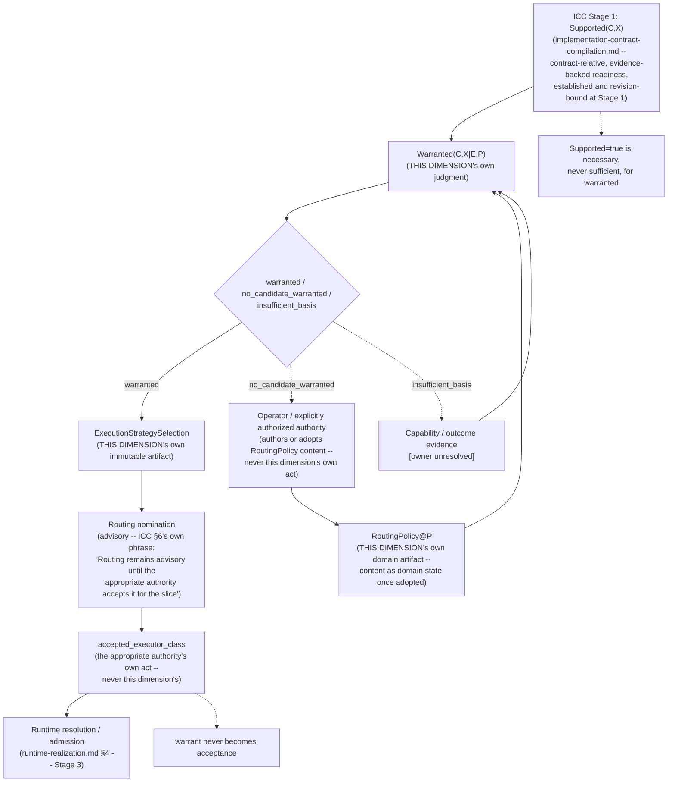

# Execution Strategy Selection

> **Question:** Given a bounded implementation contract, its ICC Stage-1 support characterization, revision-bound capability/outcome evidence, and an applicable `RoutingPolicy` revision, which semantically supported executor class — if any — is warranted for this subject now?

## Purpose

This view shows Work Engine's **execution-strategy-selection dimension**: the
home for the `routing.vs.admission` ruling's own named-but-previously-unhomed
Stage 2 — executor-class routing/acceptance. `implementation-contract-
compilation.md` §6 owns Stage 1 (contract characterization: which executor
classes a compiled contract's own constraints semantically support, with
what evidence-backed readiness). `runtime-realization.md` §5 owns Stage 3
(runtime resolution/admission: given an accepted class, which exact
provider/model/harness/tool realization is admitted now). Between them sat a
real, repeatedly-named gap: which already-supported class is actually
warranted for this subject **now**, given current capability/outcome
evidence and current routing policy. This dimension owns that judgment, and
only that judgment.

```text
Execution Strategy Selection owns:
    the subject-specific Warranted(C,X|E,P) judgment
    the immutable, exact-basis-bound ExecutionStrategySelection artifact
    confidence, unresolved uncertainty, disposition, applicability, and
        predecessor semantics for that judgment
    the RoutingPolicy domain artifact: its identity, lineage, schema,
        revision semantics, scope, adopted content as domain state, and
        application to Stage-2 candidates

Execution Strategy Selection does NOT own:
    ICC's Stage-1 Supported(C,X) judgment or the implementation contract
        itself (implementation-contract-compilation.md)
    the authority to author or adopt RoutingPolicy content (the operator's
        or an explicitly authorized authority's own decision act)
    capability/outcome-evidence truth or freshness mechanics
        (owner unresolved; not assumed to be evidence-and-claims.md)
    Plan IR projection-resolution ownership (unclaimed elsewhere;
        deliberately not claimed here either)
    implementation-discretion ceilings or authority grants
        (implementation-contract-compilation.md §4's envelope;
        authority-and-ownership.md §8-9's grant mechanics)
    verification/review-strength selection (review.md's own named,
        still-unresolved successor, adaptive-review-panel-coordination)
    exploration-versus-exploitation governance (deliberately left outside
        this dimension's scope pending separate establishment)
    executor-class acceptance (an authority consequence -- the appropriate
        authority's own act, never this dimension's)
    concrete provider/model/harness/tool realization (runtime-realization.md)
    implementation or review acceptance (review.md + evidence-and-claims.md
        + authority-and-ownership.md + mechanisms/revision-cas-and-
        publication.md's own composition)
```

---

## Diagram



---

## How to Read This View

Four inputs feed one residual judgment: ICC's own frozen-per-revision Stage-1
support fact, capability/outcome evidence, a `RoutingPolicy` revision this
dimension hosts but does not author, and the resulting warrant. The judgment
is independently re-askable on its own revision cadence, distinct from ICC's
— the same freshness-independent-of-evaluation pattern `decision-specific-
readiness.md` already establishes against `proposal-evaluation.md` (its own
Key Invariant 3). The output is never itself an acceptance: it projects, at
most, an advisory routing nomination that a separate authority may accept.

---

## 1. `Supported(C,X)` vs. `Warranted(C,X|E,P)`: Necessary, Never Sufficient

`Supported(C,X)` — ICC's own Stage-1 fact — is established and
revision-bound to an exact ICC Stage-1 characterization revision. Whether
that establishment happens literally the instant contract bytes are emitted
or somewhere within ICC's own compiler/plan-conformance boundary is ICC's own
unresolved internal sequencing question, not this dimension's to settle (see
`implementation-contract-compilation.md`'s own Stage-1 representation
question, §7 below).

`Warranted(C,X|E,P)` — this dimension's own judgment — asks a different
question on a different revision cadence: given that `X` is already
established as supported for `C`, do the current capability/outcome evidence
`E` and the current `RoutingPolicy` revision `P` actually warrant using `X`
for this slice now?

The boundary is **not** that Stage 1 consumes coarse evidence and Stage 2
consumes exact evidence — the same underlying observation may legitimately
ground both facts, for different reasons, at different times. The operative
distinction is **revision cadence**: `Supported` is bound to one ICC Stage-1
characterization revision and never re-evaluates on its own; `Warranted` is
independently re-askable under later `E`/`P` revisions against the same
still-valid contract. A class can remain `Supported=true` while later
becoming `Warranted=false` purely from post-establishment capability-evidence
or policy drift, with no contradiction.

This also means the dimension is non-vacuous even when ICC currently exposes
exactly one proposed class (`N=1`, ICC §4's current schema): "is it *still*
warranted *now*" is a real, independently re-askable question regardless of
how many classes ICC currently exposes. `N>1` (once ICC's own representation
exposes it) adds comparative selection on top of an already-real judgment —
a difference of richness, not of kind.

`Supported(C,X) = true` alone never obligates `warranted` — see the
disposition grammar, §3 below.

---

## 2. The Non-Duplication Invariant

This dimension may not warrant class `C` unless its bound ICC Stage-1 basis
establishes `C` as semantically supported. This holds regardless of how ICC
represents that establishment — an exhaustive map, an individual record, or
a proposed-class projection plus additional characterization ICC has not yet
exposed as a schema field (representation-neutral binding). If `C`'s semantic
support is not established by whatever Stage-1 basis this dimension can
actually bind to, this dimension cannot warrant `C` — the correct outcome is
an ICC recharacterization or successor contract characterization, never a
self-manufactured supportedness fact and never a `returned_for_decision`
outcome (that outcome is reserved for ICC's own discovery of a newly material
route choice, a different condition entirely — `implementation-contract-
compilation.md` §8, mirroring `material-decision-selection.md` §9's own
invariant).

`RoutingPolicy`'s own `class_exclusions` must never become a second name for
`Supported(C,X) = false`. ICC's negative is a structural/mechanical
incapability fact, established and revision-bound to an exact ICC Stage-1
characterization revision, carrying no preference or administrative content.
A policy exclusion is an administrative/preference prohibition that can hold
even when `Supported(C,X) = true` — an operator may exclude an otherwise
fully capable class from security-adjacent work for compliance reasons
unrelated to whether that class can technically do the work. These answer
different questions, about different things, on different revision cadences,
and must never be collapsed into one field or one negative.

`warranted_executor_class` names the semantic judgment this dimension
actually owns. It is deliberately not called `selected_executor_class` or
described as authoritative on its own: a warrant is a judgment about what the
evidence and policy basis supports, not yet a consequence.

```text
warranted_executor_class          (THIS DIMENSION's own judgment, produced
                                    against its own RoutingPolicy revision)
        ↓ projection
routing nomination                 (advisory -- ICC §6's own verbatim
                                     phrase: "Routing remains advisory
                                     until the appropriate authority
                                     accepts it for the slice")
        ↓ authority consequence
accepted_executor_class            (the appropriate authority's own act --
                                     never this dimension's)
        ↓
runtime resolution / admission     (runtime-realization.md §4)
```

The advisory recommendations block (`projection_resolution`,
`execution_autonomy`, `verification_review_strength`) is evaluated jointly
with the warranted class but is never itself part of the artifact's
authoritative consequence — each recommendation is only informative input
for its own present-or-pending owner: an unnamed future projection-
generation step; `authority-and-ownership.md`'s grant machinery, consuming
ICC's own discretion ceiling; `adaptive-review-panel-coordination`, once
built.

---

## 3. Disposition: Three Honest Outcomes

Mirroring `implementation-contract-compilation.md` §3's own
`compiled`/`returned_for_decision`/`blocked_by_evidence` honesty, this
dimension's own judgment step returns exactly one of:

```text
warranted                 a specific already-ICC-supported executor
                           class is warranted for this subject now,
                           under the exact capability-evidence and
                           RoutingPolicy revision bound to the judgment.
                           warranted_executor_class is populated.

no_candidate_warranted    one or more classes are ICC-supported for
                           this subject, but current evidence and
                           policy jointly warrant none of them -- a
                           real, evaluated negative, never silently
                           defaulted, hidden, or resolved by picking
                           the least-bad candidate. Returns to the
                           authorized routing authority for
                           disposition; never blocks, reopens, or
                           second-guesses ICC's own Stage-1 fact.

insufficient_basis        one or more required judgment inputs cannot
                           truthfully support a warrant -- capability
                           evidence unavailable/stale/contested,
                           RoutingPolicy missing/unresolved/inapplicable,
                           the required Stage-1 support reference
                           unavailable, or the required execution-profile
                           basis unavailable. A RoutingPolicy is not
                           itself evidence, so this outcome is named for
                           the basis as a whole rather than folded under
                           an evidence-only label; distinct from
                           no_candidate_warranted, which is a real,
                           fully-evidenced, fully-policy-bound negative,
                           not a gap in the basis itself.
```

A subject with genuinely supported candidates for which none currently
clears policy or evidence requirements is a real, nameable outcome, never an
absence this dimension papers over by warranting the least objectionable
class anyway.

---

## 4. The Owned Artifact

```yaml
ExecutionStrategySelection:
  subject: <implementation-contract identity + revision digest>
  basis:
    stage1_support_basis:
      characterization_revision: <ICC's own Stage-1 revision this binds to>
      # Representation-neutral: whatever ICC-owned record(s) establish a
      # given class's semantic support and evidence-backed readiness.
      # Whether ICC stores this as an exhaustive map, individual per-class
      # records, or a proposed-class projection plus additional
      # unexposed characterization is not decided here -- see §7.
      # This dimension binds to, and cites, whichever concrete record(s)
      # ICC actually exposes for the class in question.
      class_support_reference: <pointer to ICC's own record(s) establishing
          this specific class's supportedness + readiness>
    execution_profile: <reference -- derived representation, non-owner;
        bound here as part of this dimension's own exact basis>
    capability_evidence: <reference -- ownership unresolved>
    routing_policy_revision: <exact RoutingPolicy artifact revision (see
        below) this judgment was evaluated against -- owned by this
        dimension; content authored by the operator or an explicitly
        authorized authority, never by this dimension itself>
  disposition: warranted | no_candidate_warranted | insufficient_basis
  warranted_executor_class: <populated only when disposition = warranted;
      must be a class whose semantic support is established by
      basis.stage1_support_basis.class_support_reference>
  confidence: ...
  unresolved_uncertainty: ...
  rationale: ...
  advisory_recommendations:
    projection_resolution: <joint-evaluation input, not an owned field>
    execution_autonomy: <joint-evaluation input, not an owned field>
    verification_review_strength: <joint-evaluation input, not an owned field>
  applicability: valid | stale | historical
  reopening_conditions: ...
  predecessor: ...
  producer: ...
  integrity_digest: ...
```

```yaml
RoutingPolicy:
  # This dimension's own domain artifact, following runtime-realization.md's
  # Operator Runtime Policy Overlay precedent exactly (that page's own §11:
  # "owns the concrete policy content being projected"). This dimension
  # owns what an adopted revision says (content as domain state), together
  # with identity, lineage, schema, revision semantics, scoping, and
  # application mechanics below. It does not exercise the authority to
  # choose that content -- the decision to make a revision say what it says
  # belongs to the operator or an explicitly authorized authority,
  # exercised through mechanisms/authority-preserving-intent-projection.md's
  # own projection/edit discipline.
  revision: <content-digest identity, predecessor-chained -- same
      Revision/CAS shape as every other durable artifact in this
      architecture; mechanisms/revision-cas-and-publication.md>
  scope: <global | campaign | role-class | subject-class | one-slice --
      the same hierarchical scoping runtime-realization.md §11's own
      overlay already uses; a narrower scope may override a broader
      preference, never a role contract, an ICC-established support fact,
      or an authority boundary>
  class_exclusions: [...]        # administrative prohibitions, independent
                                  # of ICC's own Supported(C,X) fact -- §2
  class_preferences: [...]       # ranking among supported classes
  cost_objective: <reference or weighting, if authored -- narrowly scoped
      to whatever the operator/authority actually specifies; this
      dimension does not itself define an economic model>
  confidence_thresholds: {...}
  freshness_requirements: {...}  # this field and its shape are this
                                  # dimension's own schema (decision-
                                  # specific-readiness.md §4's own
                                  # precedent for this exact split); the
                                  # actual threshold value in any adopted
                                  # revision is authored/adopted content,
                                  # never set by this dimension itself; the
                                  # freshness mechanism itself remains
                                  # evidence-and-claims.md's own
  severe_failure_treatment: {...}  # this field and its shape (e.g.
                                  # "exclude a class with an unresolved
                                  # severe-failure flag") are this
                                  # dimension's own schema; the actual rule
                                  # in any adopted revision is authored/
                                  # adopted content, never set by this
                                  # dimension itself; preservation of the
                                  # underlying evidence distinction remains
                                  # evidence-and-claims.md's own
                                  # representation concern
  escalation_triggers: [...]     # systemic policy-level triggers, distinct
                                  # from a single judgment's own subject-
                                  # specific reopening_conditions
  pins: [...]
  class_limitations: [...]
  authored_by: <the operator or explicitly authorized authority who
      authored or adopted this revision -- never this dimension's own
      producer identity>
  predecessor: ...
  integrity_digest: ...
```

---

## 5. Basis Binding, Applicability, and Reopening

An `ExecutionStrategySelection` never mutates. Exact-basis preservation means
it remains a true historical record of what was warranted against exactly
which contract revision, Stage-1 support reference, execution-profile
reference, capability-evidence reference, and `RoutingPolicy` revision — the
same discipline `runtime-realization.md` §6 already holds for
`RoleRealization`.

Two distinct classes of change carry two distinct consequences, and must not
be conflated:

```text
CONTRACT-SUBJECT REOPENING
    implementation-contract-compilation.md's own returned_for_decision /
    blocked_by_evidence outcome, or material-decision-selection.md §6's
    decision-set successor reopening every implementation contract that
    relied on the superseded revision
        -> the prior ExecutionStrategySelection's subject (the exact
           contract revision it bound to) is superseded, never deleted
           and never retroactively rewritten. Its own applicability
           transitions to `historical` -- it remains a true, permanently
           inspectable record of what was warranted, against exactly
           which contract revision, evidence reference, and
           RoutingPolicy revision, at the time it was produced. A new
           contract revision requires an entirely new judgment against a
           new subject identity; the prior judgment's historical truth
           is preserved, not erased -- the same discipline every other
           Revision/CAS instance in this architecture already holds
           (mechanisms/revision-cas-and-publication.md), and the same
           correction "invalidation never mints authority"
           (authority-and-ownership.md §12) already requires: a
           superseded subject losing current applicability is not
           license to treat its own historical truth as if it had never
           existed.

EVIDENCE / POLICY EVOLUTION
    a capability-evidence reference changes, or a new RoutingPolicy
    revision is authored or adopted, while the contract itself remains
    untouched
        -> does NOT reopen the subject and does NOT void the existing
           judgment. It marks the existing judgment's own applicability
           `stale` (never `historical` -- that transition is reserved
           for CONTRACT-SUBJECT REOPENING, above), and makes the
           judgment re-askable for a *new* attempt against the same
           still-valid contract. Any operation already relying on the
           existing judgment keeps it, per the same reliance discipline
           runtime-realization.md §9 already states for one operation
           executing under one stable realization.
```

The full `applicability` enum, stated plainly since no single passage above
maps all three values together: `valid` (the judgment's basis is current),
`stale` (evidence or policy has moved since the judgment was produced, but
the contract subject itself has not — re-askable, not void), and `historical`
(the contract subject itself was superseded — the judgment is permanently
preserved as a true record, never current again).

A prior `warranted_executor_class` therefore remains historically valid under
its original basis unless its own reopening rule fires — reconsideration is
never automatic on every upstream revision, and invalidation never mints
authority (`authority-and-ownership.md` §12; `runtime-realization.md` §7).

---

## 6. Component-by-Component Ownership: Why Only `executor_capability_class` Survives

An earlier draft of this dimension treated a broader four-part strategy tuple
(`plan_ir_projection_resolution + executor_capability_class +
execution_autonomy + verification_review_strength`, from the Structural Plan
IR family's own execution-profile-scoring addendum) as one jointly *owned*
judgment. Tested component-by-component against exact existing and
named-pending owners, only `executor_capability_class` survives as something
this dimension may hold authoritatively:

- `plan_ir_projection_resolution` — unclaimed by any existing page, but never
  named by the `routing.vs.admission` ruling either. Owning it here would
  widen the ruling, not fulfill it. Remains a joint-evaluation input, not an
  owned field.
- `execution_autonomy` — substantially pre-owned upstream:
  `implementation-contract-compilation.md` §4 already authors an "explicit
  implementation-discretion envelope" as a compiled-contract field at Stage
  1, before Stage 2 runs; the specific grant within that ceiling is an
  authority-projection act (`authority-and-ownership.md` §8–9), the same
  act-class already excluded from this dimension for acceptance itself.
  Remains a joint-evaluation input.
- `verification_review_strength` — `review.md` explicitly disclaims
  "specialist selection, execution, or independence mechanics," naming
  `adaptive-review-panel-coordination` — a distinct, still-unresolved
  mechanism — as its own intended owner. Claiming it here would preempt an
  already-named future owner. Remains a joint-evaluation input.

Splitting these components does not destroy an irreducible semantic
tradeoff — the addendum's own joint economic framing survives intact as
this dimension's own internal evaluation method (`advisory_recommendations`,
§4 above). It merely keeps ownership where it already sits, or is already
named to eventually sit. Joint evaluation is not joint ownership.

---

## 7. Stage-1 Representation Tension — ICC's Own Open Question, Not This Dimension's to Settle

`implementation-contract-compilation.md`'s own top-level Question and §6 body
use plural executor-class wording ("which executor classes are semantically
supported, with what evidence-backed readiness?"). Its own §4 artifact
schema currently exposes exactly one field: "a proposed executor class with
an evidence-backed readiness assessment." Whether this is a genuine
representation gap, a deliberate design in which ICC evaluates multiple
candidates internally but exposes only its own best proposal plus readiness
for that one class, or something else entirely, is an open tension this
dimension does not resolve and does not need to resolve: this dimension's
own non-duplication rests only on binding to whatever concrete Stage-1
record(s) ICC actually exposes for a given class, per the representation-
neutral basis above — not on any assumption about ICC's internal storage
shape.

This dimension's own predicate is well-defined independent of how ICC
eventually resolves this tension (§1, above): `Warranted(C,X|E,P)` remains
real and non-vacuous whether ICC currently exposes one class or eventually
exposes many. Resolving ICC's own representation gap may *enrich* this
dimension's own candidate space — turning a binary warrant-or-return-for-
recharacterization judgment (today's `N=1` reality) into a genuine
comparative selection among several supported classes (`N>1`) — but it was
never a precondition for this dimension's own semantic soundness or
admission. Any eventual clarification or correction to ICC §4 belongs to
that page, on its own timeline, and is out of scope here.

---

## Key Invariants

1. **`Supported(C,X)` is necessary but never sufficient for `Warranted(C,X|E,P)`.**
2. **The boundary between Supported and Warranted is a revision-cadence distinction, not an evidence-coarseness one — the same underlying observation may legitimately inform both, for different reasons, at different times.**
3. **This dimension never establishes ICC's own Stage-1 supportedness fact — it only judges whether an already-established class remains warranted now.**
4. **A `RoutingPolicy` class exclusion is never a second name for `Supported(C,X) = false` — one is an administrative/preference prohibition, the other a structural/mechanical incapability fact.**
5. **`no_candidate_warranted` and `insufficient_basis` are real, honest, distinct negatives — never silently defaulted to the least objectionable candidate, and never conflated with each other.**
6. **This dimension owns what an adopted `RoutingPolicy` revision says (content as domain state); the operator or an explicitly authorized authority owns the decision to make a revision say what it says.**
7. **A warrant is never an acceptance — it projects, at most, an advisory routing nomination that a separate authority may accept for the slice.**
8. **An `ExecutionStrategySelection` never mutates; a superseded contract subject transitions to `historical`, never deleted or retroactively rewritten; evidence/policy evolution transitions applicability to `stale`, never `historical`, and never reopens the subject.**
9. **Invalidation never mints authority — a superseded or stale judgment's own historical truth is preserved, not erased (`authority-and-ownership.md` §12).**

---

## What This View Does Not Show

This page does not define:

- the compiled implementation contract itself (`implementation-contract-compilation.md`);
- material decision selection (`material-decision-selection.md`);
- the concrete provider/model/harness/tool realization (`runtime-realization.md`);
- review judgment or review-panel coordination (`review.md`; `adaptive-review-panel-coordination`, unresolved);
- capability-evidence truth or freshness mechanics (owner unresolved);
- the authority-grant mechanics that make acceptance, autonomy grants, or admission effective (`authority-and-ownership.md`);
- the projection/edit mechanics that let an operator author or adopt a `RoutingPolicy` revision (`mechanisms/authority-preserving-intent-projection.md`);
- the generic candidate-reduction mechanic this dimension's own residual class-selection step reuses (`mechanisms/candidate-resolution-and-admission.md`).

---

## Relationship to Implementation-Contract Compilation

`implementation-contract-compilation.md` owns Stage 1 (contract
characterization) of the `routing.vs.admission` pipeline; this dimension owns
Stage 2 (executor-class routing/acceptance). ICC's own §5 plan-conformance
gate criterion — "the selected executor class is supported by prior evidence
for comparable plan entropy and task shape" — is a coarse, one-shot
plausibility check, established and revision-bound at Stage 1, never itself
a preference or currency judgment; it does not collapse into this
dimension's own capability/outcome-evidence-driven warrant. ICC's own text
(§6, "What This View Does Not Show") previously named Stage 2 as "the
supervisor / routing-policy authority — named but not architecturally homed
by this dimension"; this dimension is that home.

## Relationship to Runtime Realization

`runtime-realization.md` owns Stage 3 (runtime resolution/admission): given
an accepted executor class, which exact provider/model/harness/tool
realization is admitted now. This dimension's own `RoutingPolicy` ownership
is modeled directly on that page's own Operator Runtime Policy Overlay and
Key Invariants 10/13 — a dimension may own a policy overlay's content as
domain state without ever holding the authority to author it — the precedent
this dimension follows, not a parallel invention. `runtime-realization.md`
§5 previously named Stage 2 the same way ICC did; this dimension is that
home. `RoutingPolicy` never reaches downstream into concrete provider/model/
harness selection — that remains `runtime-realization.md`'s own territory
entirely.

## Relationship to Role and Contract Structure

`role-and-contract-structure.md` §6 ("The Executor-Class-Routing Boundary —
Closed by Ruling, Not This Dimension's to Reopen") and its own Key Invariant
5 independently name the identical unhomed Stage-2 seam: "a contract
requirement naming an executor class is not the same decision as routing to
that class now." That page's own owned fact — a role contract's declared
`requires: executor_class = X` — remains entirely its own; this dimension
never redefines or consumes it. Same correction as ICC and Runtime
Realization: this dimension is now that page's own named-but-unhomed owner.

## Relationship to Review

Would gain an explicit note that its own "governing review contract" input
may, in part, be informed by this dimension's advisory
`verification_review_strength` recommendation, without this dimension
acquiring any of `review.md`'s or `adaptive-review-panel-coordination`'s own
authority.

## Relationship to Evidence and Claims

Consumes capability/outcome evidence by reference; ownership of that
evidence's own truth and freshness mechanics remains unresolved, not
assumed to belong to `evidence-and-claims.md` (that page's own §10 profile
pattern is "a real but compositional relationship, not a claim already
stated"). `evidence-and-claims.md` remains the sole owner of the freshness
*mechanism* this dimension's own `freshness_requirements` policy field may
reference as a requirement, the same split `decision-specific-readiness.md`
§4 already establishes for its own dimension.

## Relationship to Authority and Ownership

The acceptance consequence and the autonomy-grant consequence both remain
that page's own §7–§9 territory; this dimension is the upstream producer of
the judgment an acceptance act operates on, and that page's own delegation
modes govern who may author a `RoutingPolicy` revision.

## Relationship to Authority-Preserving Intent Projection

Owns the projection/edit discipline through which an operator's authored
`RoutingPolicy` content reaches this dimension's own artifact; this
dimension never acquires that discipline itself, the same relationship
`runtime-realization.md` §11 already holds with its own overlay.

## Relationship to Candidate Resolution and Admission

This dimension's own residual class-selection step, once ICC exposes `N>1`
supported classes, reuses this mechanism's generic 0/1/N reduction; the
mechanism supplies no routing meaning of its own, the same relationship
`runtime-realization.md` §4 and `material-decision-selection.md` §7 already
hold with it.

---

## Related Architecture Views

- **`implementation-contract-compilation.md`** — the Stage-1 owner this dimension consumes as a given, never re-litigated, fact.
- **`runtime-realization.md`** — the Stage-3 owner this dimension's advisory nomination feeds, once accepted; the precedent source for `RoutingPolicy` ownership.
- **`role-and-contract-structure.md`** — a third, independent namer of this dimension's own previously-unhomed seam; owns a role's declared executor-class requirement, a distinct fact this dimension never redefines.
- **`review.md`** — a potential future consumer of this dimension's advisory `verification_review_strength` recommendation; owns no part of this dimension's own judgment.
- **`evidence-and-claims.md`** — the potential, not-yet-confirmed, owner of the capability/outcome evidence this dimension consumes; the confirmed owner of the freshness mechanism this dimension's own policy may reference.
- **`authority-and-ownership.md`** — owns acceptance, disposition, and the delegation modes governing `RoutingPolicy` authorship; this dimension never claims any of it.
- **`mechanisms/authority-preserving-intent-projection.md`** — owns the projection/edit discipline through which `RoutingPolicy` content is authored or adopted.
- **`mechanisms/candidate-resolution-and-admission.md`** — the mechanism this dimension's own residual class-selection step reuses when ICC exposes `N>1`.
- **`mechanisms/revision-cas-and-publication.md`** — the shared succession/publication discipline both `ExecutionStrategySelection` and `RoutingPolicy` reuse without owning it themselves.

---

## Source and Status

```yaml
architecture_status:
  design: accepted
  reconciliation: reconciled
  authorization: design_work_authorized
  implementation: none
  owner: app-server/ideas/pending/execution-strategy-selection.md
  status_as_of: 2026-09-27
```

`design: accepted` — admitted 2026-09-27 as the 14th Work Engine truth
dimension, by explicit operator decision, from `app-server/ideas/pending/
execution-strategy-selection.md` at commit `f566c47`. That candidate went
through five original bounding rounds, one independent adversarial review
(verdict `REVISE_CANDIDATE`, findings fully incorporated), two further
falsifier-test reconciliation rounds settling the Stage-1/Stage-2 predicate
boundary and `RoutingPolicy` ownership, a second independent adversarial
review of the resulting successor (verdict `REVISE_CANDIDATE`, four small
defects — none reopening either settled finding — all repaired), and a final
admission-verification pass (verdict `ACCEPT_CANDIDATE`) before the operator
decision. `reconciliation: reconciled` — every claim on this page traces
directly to that candidate's own final text, not summarized from an earlier
draft. `authorization: design_work_authorized` — per the admission decision:
canonicalization and continued design integration are authorized; nothing
about this admission authorizes implementation of this dimension,
`RoutingPolicy` machinery, capability-evidence machinery, adaptive routing,
or any associated pilot. `implementation: none` — no implementation evidence
exists anywhere in `app-server/src` for this dimension's own artifacts.

**Preserved, not resolved, by this admission**: ICC's own Stage-1
singular/plural representation tension (§7, above) remains that page's own
open question; capability/outcome-evidence ownership, Plan-IR projection-
resolution ownership, verification/review-strength ownership, and
exploration-versus-exploitation governance all remain explicitly unresolved,
exactly as the admitted candidate stated them — this admission does not
silently settle any of the four.
