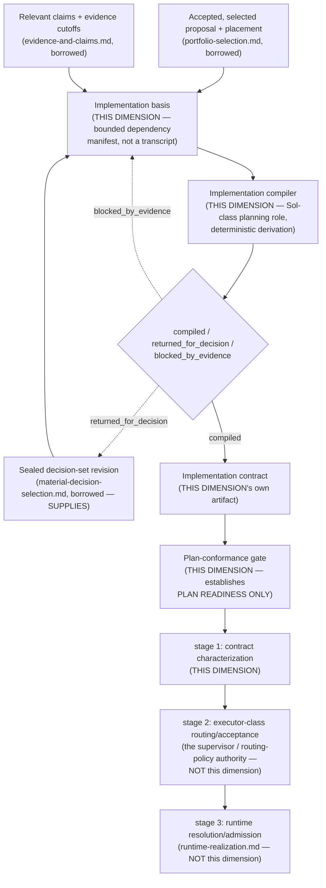

# Implementation-Contract Compilation

> **Question:** Given an accepted proposal, its relevant claims, and a sealed decision-set revision, what exact bounded repository transformation is derived for downstream execution — and which executor classes are semantically supported, with what evidence-backed readiness?

## Purpose

This view shows Work Engine's **implementation-contract-compilation dimension**: the fifth and heaviest stage of the proposal→decision front-end chain, confirmed independent from `material-decision-selection.md` by direct falsifier testing this session. This dimension owns the **implementation basis**, the **implementation compiler**, the **implementation-contract schema**, and the **plan-conformance gate** — and is confirmed, precisely, as stage 1 ("contract characterization") of the `routing.vs.admission` ruling, not "decision-gated compilation" generically and not `role-and-contract-structure.md`.

```text
Implementation-Contract Compilation owns:
    implementation-basis assembly (bounded dependency manifest)
    the implementation compiler (deterministic derivation, 3 honest
        outcomes)
    the implementation-contract schema
    the plan-conformance gate
    contract characterization (routing.vs.admission's own stage 1)

Implementation-Contract Compilation does NOT own:
    material decision selection itself (material-decision-selection.md)
    slice-level executor-class routing/acceptance (the supervisor /
        routing-policy authority — named but not architecturally
        homed by this dimension, §6)
    concrete runtime resolution/admission (runtime-realization.md)
    a role's own declared contract requirements
        (role-and-contract-structure.md)
```

---

## Diagram



---

## How to Read This View

This dimension derives *what exact repository transformation realizes an accepted decision* — it never decides which route was selected (that's `material-decision-selection.md`), and it never authorizes a slice to run or picks a concrete executor for it (those belong to two separate, later stages this dimension explicitly does not own). Passing every gate this dimension defines establishes **plan readiness only**.

---

## 1. What This Dimension Owns

Four pieces, each real and non-overlapping with its neighbors: basis assembly, the compiler, the contract schema, and the conformance gate. Confirmed as genuinely distinct from `material-decision-selection.md` by direct falsifier test — different actor classes (a named decision owner vs. "a Sol-class planning role," separately checked by "an independent plan-conformance gate"), different lifecycle cadence (one decision-set revision can be relied on by multiple contracts over time), different artifact schema.

---

## 2. The Implementation Basis: a Bounded Dependency Manifest, Not a Transcript

Before compilation, this dimension assembles an immutable implementation basis containing: accepted proposal revision; placement revision; sealed decision-set revision; relevant claim revisions and evidence cutoffs; governing invariants and acceptance requirements; rejected routes whose reintroduction would change meaning; unresolved uncertainty that remains valid for the planned slice; repository commit and required generated or indexed-state revisions; applicable authority grants; and predecessor plans or implementations whose contracts remain binding.

**Every included item must explain its implementation relevance. Missing completeness remains visible; the manifest must not claim that retrieval found all relevant evidence when its projection or coverage cannot support that conclusion.** The same coverage discipline `substrates/evidence-anchor.md`'s own `bound_observation`/`observed_observation` split enforces — never silently treat an incomplete or stale basis as if it were current and complete.

---

## 3. The Implementation Compiler: Deterministic Derivation, Three Honest Outcomes

The implementation compiler is initially a Sol-class planning role. It consumes the implementation basis, performs targeted repository validation, selects only delegated or route-invariant mechanisms, and emits a versioned implementation contract. **It may discover repository facts that revise a claim or expose a new material decision. It must not conceal that discovery by adjusting the plan silently.** It returns exactly one of:

```text
compiled              the slice is sufficiently constrained for a
                       named executor class
returned_for_decision a newly discovered material route choice
                       requires disposition or delegation
                       (returns to material-decision-selection.md)
blocked_by_evidence   the proposal, claim basis, placement, authority,
                       or repository binding is stale, contradictory,
                       or insufficient
```

---

## 4. The Implementation-Contract Schema

A compiled contract contains at least: stable plan identity, version, producer, and predecessor; exact implementation-basis digest; exact repository revision and dirty-worktree observations; bounded slice objective and non-goals; exact files, symbols, interfaces, or creation boundaries involved; selected mechanisms and the decision or delegation authorizing each material selection; data structures, schemas, operation signatures, and error behavior to the degree required by the executor class; ordered implementation increments and intermediate validity conditions; integration points and repository patterns to preserve or imitate; explicit implementation-discretion envelope; forbidden changes and rejected routes; tests, fixtures, commands, and expected observations; failure, recovery, migration, compatibility, and cleanup requirements where applicable; plan-deviation and stop conditions; expected evidence and completion receipts; and a **proposed executor class with an evidence-backed readiness assessment** — the exact field the `routing.vs.admission` ruling names as this dimension's own stage-1 output (§6).

---

## 5. The Plan-Conformance Gate Establishes Plan Readiness Only

Before implementation, an independent gate checks that every material mechanism is bound to a sealed decision or valid delegation; every proposal invariant and acceptance consequence is either exercised by the slice or truthfully outside its boundary; repository references resolve against the bound revision; the executor receives objective tests or observations for every claimed completion consequence; implementation discretion is bounded rather than implied; newly discovered material ambiguity is absent or explicitly returned; the plan does not expand proposal or implementation authority; and the selected executor class is supported by prior evidence for comparable plan entropy and task shape.

**Quoted directly, because it is the single most important boundary this dimension exists to hold: "Passing the gate establishes plan readiness only. It does not authorize the slice or predict that implementation cannot fail."**

**The symmetric post-execution question — did the implementation actually turn out to satisfy the contract — is deliberately not this dimension's own** (confirmed 2026-09-16): it belongs to `review.md` (the conformance finding), `evidence-and-claims.md` (materializing the acceptance fact), `authority-and-ownership.md` (the accept/reject/stop consequence), and `mechanisms/revision-cas-and-publication.md` (publishing the accepted successor state) — a composition, not a gap requiring this dimension to extend past compile time.

---

## 6. This Dimension Owns Stage 1 of the `routing.vs.admission` Ruling, Precisely

Confirmed by direct falsifier test this session, correcting an earlier imprecise attribution to "decision-gated compilation" generically (and, before that, an even less precise paraphrase naming Role/Contract Structure): the ruling's corrected three-stage composition is

```text
contract characterization (THIS DIMENSION: the implementation compiler
    and plan-conformance gate — given a compiled contract, which
    executor classes are semantically supported, with what
    evidence-backed readiness? Establishes plan readiness only;
    authorizes no class for any specific slice.)
            |
            v
executor-class routing / acceptance (the supervisor / the routing-
    policy authority named in this dimension's own source document,
    under its Implementation Track's "Stage 6: Adaptive routing" —
    NOT this dimension's own architectural content, only named within
    the same source file: "allow the supervisor to nominate an
    executor class from contract characteristics and historical
    outcomes. Routing remains advisory until the appropriate authority
    accepts it for the slice.")
            |
            v
runtime resolution / admission (`runtime-realization.md` §4: given
    that accepted class plus current capabilities and policy, which
    exact model/provider/harness/tool realization is admitted now?)
```

**This dimension owns contract characterization only** — whether an executor class is *semantically supported* by a compiled contract's constraints, at compile time, with no runtime authority attached. It does not own the slice-level routing decision (a separate named actor's own act) or the concrete-realization admission (`runtime-realization.md`'s own). Treating this dimension's own characterization as if it were slice-level acceptance would quietly give it more authority over routing than its own source document ever claims.

---

## 7. Relationship Among Claims, Decisions, and Plans

Claims, decisions, and implementation instructions remain distinct durable objects, grounding why this dimension is a genuinely different truth owner from both `evidence-and-claims.md` and `material-decision-selection.md`:

```text
claim     -> an evidence-backed answer about the repository,
             environment, mechanism, or observed behavior
             (evidence-and-claims.md)
decision  -> selects or delegates one route among materially
             different valid possibilities
             (material-decision-selection.md)
plan      -> derives an exact repository transformation from
             accepted meaning, evidence, and decisions
             (THIS DIMENSION)
```

The claims capability caches semantic research questions and their evidence so this dimension's compiler does not repeat broad repository research — it does not turn recommendations into decisions or visibility into applicability. The decision set owns route selection. This dimension owns the derived patch instructions.

---

## 8. Newly Discovered Material Decisions Return Upstream, Not Concealed

Mirrors `material-decision-selection.md` §9, from this dimension's own side: the compiler may discover repository facts that revise a claim or expose a new material decision, and must not conceal that discovery by silently adjusting the plan. The `returned_for_decision` outcome (§3) is the mechanical enforcement of this invariant, not a discretionary courtesy.

---

## 9. Context Lifecycle: Pure Observable-Signal Relationship

This dimension's own source explicitly disclaims any context-management responsibility: sealed decision sets, compiled plans, and workflow transitions are observable inputs to `context-lifecycle.md`'s own external manager, never a reset command or mandatory reset point. Snapshot binding, sufficiency validation, write fencing, and reconciliation remain owned entirely by that dimension's own protocol.

---

## Key Invariants

1. **This dimension owns contract characterization only — no authority over slice-level routing or concrete realization.**
2. **The plan-conformance gate establishes plan readiness only; it never authorizes the slice.**
3. **The implementation compiler cannot acquire reserved decision authority.**
4. **An execution vantage does not acquire planning, proposal, or decision authority merely by receiving an implementation contract.**
5. **Newly discovered material ambiguity returns upstream instead of being concealed as implementation discretion.**
6. **The implementation basis must never claim completeness its own coverage cannot support.**

---

## What This View Does Not Show

This page does not define:

- material decision selection itself (`material-decision-selection.md`);
- slice-level executor-class routing/acceptance (the supervisor / routing-policy authority, named but not architecturally homed here, §6);
- concrete runtime resolution/admission (`runtime-realization.md`);
- a role's own declared contract requirements (`role-and-contract-structure.md`);
- context-lifecycle transitions (`context-lifecycle.md`).

---

## Relationship to Material Decision Selection

`SUPPLIES`: a sealed decision-set revision feeds this dimension's implementation basis; newly discovered material decisions return there, never resolved here.

## Relationship to Runtime Realization

This dimension owns stage 1 of the `routing.vs.admission` pipeline only (§6); `runtime-realization.md` owns stage 3. Neither owns stage 2.

## Relationship to Portfolio Selection

Consumes an accepted, campaign-selected proposal as part of this dimension's own implementation basis.

## Relationship to Evidence and Claims

Consumes relevant claims and evidence cutoffs as part of the implementation basis; never republishes or owns them.

---

## Related Architecture Views

- **`material-decision-selection.md`** — the `SUPPLIES` source of the sealed decision-set revision this dimension's basis depends on.
- **`runtime-realization.md`** — the downstream stage-3 owner; §5 there names this dimension precisely as stage 1's owner.
- **`role-and-contract-structure.md`** — a distinct, adjacent fact; never the owner of stage 1.
- **`portfolio-selection.md`** — the upstream source of the accepted proposal this dimension compiles against.
- **`evidence-and-claims.md`** — the source of claims and evidence cutoffs this dimension's basis consumes.
- **`context-lifecycle.md`** — a pure observable-signal consumer relationship; this dimension owns no context-management responsibility.
- **`substrates/evidence-anchor.md`** — the same coverage discipline (§2) independently converged on: never claim completeness the underlying observation cannot support.
- **`review.md`** — owns the symmetric, post-execution counterpart to this dimension's own §5 plan-conformance gate: did the produced implementation actually satisfy the accepted contract, confirmed 2026-09-16 to compose cleanly from `review.md` + `evidence-and-claims.md` + `authority-and-ownership.md` + `mechanisms/revision-cas-and-publication.md`, with no residue requiring a new dimension.

---

## Source and Status

```yaml
architecture_status:
  design: proposed
  reconciliation: reconciled
  authorization: exploration_only
  implementation: none
  owner: app-server/ideas/pending/proposal-decision-gated-implementation-compilation.md
  status_as_of: 2026-09-16
```

`design: proposed`, not `accepted` — the same source document as `material-decision-selection.md`, whose own "Identity and state" line states directly: "candidate proposal and implementation track; not accepted, prioritized, or authorized for implementation." A formed architectural direction (a fully specified basis, compiler, contract schema, and conformance gate, plus a six-stage implementation track), not shape-unresolved — but genuinely weaker maturity than the three accepted upstream dimensions (`proposal-evaluation.md`, `decision-specific-readiness.md`, `portfolio-selection.md`), stated plainly rather than smoothed to match them. `reconciliation: reconciled` — this page's content traces directly to the source document, read in full this session, and cross-checked by a falsifier-test fork against `mechanisms/candidate-resolution-and-admission.md`, `role-and-contract-structure.md`, and `runtime-realization.md`'s current (corrected) text — a real session-level reconciliation pass, without a formal `*-reconciliation.md` document of its own. `authorization: exploration_only` — the source's own Authority section: "This implementation track is an evidence plan, not authorization to modify the proposal workflow, claims system, context lifecycle manager, supervisor, builder, model routing, or repository." A confirmed ceiling. `implementation: none` — confirmed directly: no implementation-basis, implementation-compiler, or implementation-contract shape found anywhere in `app-server/src`.

**Corrected 2026-09-25** — Key Invariant 4 previously named "the builder" specifically. A documentation-only vantage-normalization audit found nothing in this dimension's schema, compiler, or gate that is Builder-specific: the source document's own use of "builder" names whichever executor implements a compiled contract, per `organizational-compilation.md` §5's ruling that named roles are reusable profiles over the deeper "logical vantage contract," not fixed types. Restated in execution-vantage terms; no meaning change — a Builder remains one legitimate profile that may hold this position.
