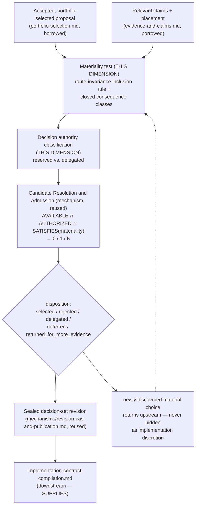

# Material Decision Selection

> **Question:** Given an accepted proposal, which unresolved route choices would produce materially different durable consequences — and who is authorized to select, delegate, defer, or reject each one?

## Purpose

This view shows Work Engine's **material-decision-selection dimension**: the fourth stage of the proposal→decision front-end chain, confirmed independent by direct falsifier testing this session, with a resolved category-leak question that strengthens rather than eliminates it. This dimension owns the **materiality test**, the **decision-authority classification**, and the **decision-set artifact schema** — genuinely irreducible domain content. Its own final selection act, however, is not a new mechanism: it is `mechanisms/candidate-resolution-and-admission.md`'s **third confirmed instance**, the same pattern Organizational Compilation and Runtime Realization already both follow (own dimension page *and* reuse the mechanism for the final step).

```text
Material Decision Selection owns:
    the materiality test (route-invariance inclusion rule, closed
        consequence classes)
    decision authority classification (reserved vs. delegated)
    the decision-set artifact schema

Material Decision Selection does NOT own:
    which proposal is selected for a campaign in the first place
        (portfolio-selection.md)
    the compiled implementation contract itself
        (implementation-contract-compilation.md)
    a role's own declared contract requirements
        (role-and-contract-structure.md)
    the candidate-reduction / admission protocol its own final step
        reuses (mechanisms/candidate-resolution-and-admission.md)
```

---

## Diagram



---

## How to Read This View

Two things are easy to conflate and must not be: this dimension's own irreducible domain content (the materiality test, the authority classes, the schema) versus the generic reduction-and-selection shape its final act happens to share with every other domain that reduces a candidate set to zero, one, or many. The domain content stays here. The reduction shape belongs to `mechanisms/candidate-resolution-and-admission.md`, reused, not reinvented.

---

## 1. What This Dimension Owns

Confirmed by direct falsifier testing against the alternate hypothesis that this dimension might dissolve entirely into the existing mechanism — it does not: the materiality test and authority classification are irreducible, domain-defined predicates that mechanism's own "What This Mechanism Does Not Decide" section explicitly disclaims inventing.

---

## 2. The Inclusion Rule: Route-Invariance as the Governing Test

An unresolved choice belongs on the material decision surface only when all of the following are true:

```text
1. at least two routes remain compatible with the proposal's current
   meaning, invariants, placement, and available evidence;
2. the routes differ in at least one durable or externally meaningful
   consequence; and
3. no existing authority-bound decision already determines the route.
```

Material consequence classes are closed initially to: canonical ownership or authority; public interface or behavior another component may rely on; persistent identity, schema, history, compatibility, or migration; concurrency, failure, durability, or recovery guarantees; security, privacy, trust, or admission boundaries; dependency or operational footprint; difficult-to-reverse physical placement; accepted product scope or observable behavior; and evidence required to establish implementation acceptance.

The governing route-invariance question, quoted directly because it is the single test this dimension exists to apply:

> If either admissible route were selected, could every downstream consumer, owner, migration, recovery path, acceptance test, and authorized future plan behave identically?

If yes, the choice is ordinarily implementation discretion. If no, it is a candidate material decision.

---

## 3. Excluded Implementation Discretion

The decision surface does not ordinarily include local helper names, equivalent internal decomposition, unobservable control-flow choices, test-file organization, formatting or comment style, replaceable local data structures, equivalent library choices with no operational or compatibility consequence, or any other choice whose alternatives are route-invariant under §2's test. **Classification depends on consequence, not on whether the choice appears architectural in the abstract** — an excluded choice becomes material only when repository evidence shows it actually changes one of the closed consequence classes.

---

## 4. Decision Authority Classes: Reserved vs. Delegated

```text
reserved decision
    explicit disposition by the named decision owner is required when
    the choice changes accepted product meaning or placement; contains
    a product, value, cost, or priority tradeoff; consumes authority
    reserved to a human or another owner; creates a security, privacy,
    migration, or destructive consequence; is expensive or difficult to
    reverse; or materially expands the accepted scope

delegated decision
    an authorized planning role may select the route when the decision
    owner has explicitly delegated the materiality class and bounded
    the valid alternatives, constraints, evidence requirements, and
    reopening conditions
```

**Absence of a reserved-decision marker is not delegation. Possession of the proposal, repository, planning role, or implementation tool does not create decision authority.** Stated as plainly as the source states it, because it is the boundary this dimension exists to enforce against silent authority drift.

---

## 5. The Decision-Set Artifact

Each decision record contains at least: stable decision identity and schema version; exact proposal and placement revisions; the bounded decision question; material consequence class; explanation of why the choice is route-variant; governing invariants and authority boundary; evidence claims and repository observations with exact revisions; genuinely admissible alternatives; consequence analysis for each alternative; recommended route and confidence or unresolved uncertainty; decision owner and authority reference; disposition (`selected`/`rejected`/`delegated`/`deferred`/`returned for more evidence`); selected route or exact delegation envelope; rejected routes and reasons when consequential; reopening conditions; and producer, evidence cutoff, predecessor, and integrity digest.

---

## 6. Sealing Is a Revision/CAS Instance, Not This Dimension's Own Mechanic

A decision set becomes sealed only when every included decision is either resolved, explicitly delegated, or explicitly deferred with a consequence that prevents unauthorized downstream work. Quoted directly: "Sealing makes that revision immutable; later changes create a successor and reopen every implementation contract that relied upon the superseded revision." This is the identical predecessor-chained, CAS-published shape already named elsewhere in the architecture — `mechanisms/revision-cas-and-publication.md`'s own territory, consumed here, not invented here. Sealing does not prove the decision surface was complete; planning and implementation retain a duty to return newly discovered material choices (§9).

---

## 7. The Final Selection Act Reuses Candidate Resolution and Admission

Confirmed directly by falsifier test this session: `mechanisms/candidate-resolution-and-admission.md`'s own "What This Mechanism Does Not Decide" section explicitly disclaims inventing "what counts as available, authorized, or required — those are domain-defined predicates the mechanism applies, never predicates it invents." This dimension's materiality test (§2) and authority classification (§4) are exactly those domain-defined predicates. But the final act — genuinely admissible alternatives → disposition — structurally matches `AVAILABLE ∩ AUTHORIZED ∩ SATISFIES(REQUIRED) → {0/1/N} → selected → admitted` precisely, with the named decision owner supplying the residual N-case judgment the same way every other confirmed instance of that mechanism works. This is the mechanism's **third confirmed instance**, alongside Organizational Compilation's and Runtime Realization's own.

---

## 8. Distinct From Role/Contract Structure's Own Contract Facts

A role declaring `requires: executor_class = X` (`role-and-contract-structure.md`'s own truth) is a genuinely different fact from this dimension's own compile-time route selection. The former is an authoring-time fact about one role's own requirements; the latter is a compile-time judgment over an entire accepted proposal's material decision surface, evidence-backed, producing one of `selected`/`rejected`/`delegated`/`deferred`. Different subject, different lifecycle point, different producer. No collapse — confirmed by direct falsifier test against both pages' current (corrected) text.

---

## 9. Newly Discovered Material Choices Return Upstream, Never Hidden as Discretion

Any newly discovered material decision returns through a versioned decision amendment rather than being selected silently during planning or coding. This is not merely a stated preference — it is the invariant this dimension exists to hold against the same failure mode `role-and-contract-structure.md`'s own "no judgment branch" asymmetry warns about: judgment quietly performed somewhere with no accountable owner.

---

## Key Invariants

1. **Materiality is determined by route-variant consequence, never by apparent size or technical sophistication.**
2. **A decision set is exact-versioned and never silently follows a successor.**
3. **Possession of the proposal, repository, planning role, or implementation tool does not create decision authority.**
4. **Sealing is a Revision/CAS instance — later changes create a successor and reopen every implementation contract relying on the superseded revision.**
5. **Newly discovered material ambiguity returns upstream instead of being hidden as implementation discretion.**
6. **This dimension's own final selection act reuses Candidate Resolution and Admission; the materiality test and authority classes remain this dimension's own, irreducible content.**

---

## What This View Does Not Show

This page does not define:

- which proposal gets selected for a campaign in the first place (`portfolio-selection.md`);
- the compiled implementation contract itself (`implementation-contract-compilation.md`);
- a role's own declared contract requirements (`role-and-contract-structure.md`);
- concrete provider/model/harness selection (`runtime-realization.md`);
- context-lifecycle transitions — this dimension's own source explicitly disclaims owning context management, treating workflow transitions only as observable signals to `context-lifecycle.md`'s own external manager.

---

## Relationship to Portfolio Selection

Consumes an already-selected, campaign-accepted proposal as its own starting point — strictly downstream, never overlapping.

## Relationship to Implementation-Contract Compilation

`SUPPLIES`: a sealed decision-set revision is part of that dimension's own implementation basis; this dimension never compiles the implementation contract itself.

## Relationship to Role/Contract Structure

Distinct facts at different lifecycle points, §8 — never collapsed.

## Relationship to Candidate Resolution and Admission

Reuses the mechanism for its own final selection step (§7) — the mechanism's third confirmed instance.

---

## Related Architecture Views

- **`portfolio-selection.md`** — the upstream source of the accepted proposal this dimension operates on.
- **`implementation-contract-compilation.md`** — the `SUPPLIES` consumer of this dimension's sealed decision-set revision.
- **`role-and-contract-structure.md`** — a distinct, adjacent fact (§8), never collapsed with this dimension's own route selection.
- **`mechanisms/candidate-resolution-and-admission.md`** — this dimension's own final selection step is that mechanism's third confirmed instance.
- **`mechanisms/revision-cas-and-publication.md`** — sealing (§6) is that mechanism's territory, consumed here.
- **`context-lifecycle.md`** — a pure observable-signal consumer relationship; this dimension owns no context-management responsibility.

---

## Source and Status

```yaml
architecture_status:
  design: proposed
  reconciliation: reconciled
  authorization: exploration_only
  implementation: none
  owner: app-server/ideas/pending/proposal-decision-gated-implementation-compilation.md
  status_as_of: 2026-09-16
```

`design: proposed`, not `accepted` — the source document's own "Identity and state" line: "candidate proposal and implementation track; not accepted, prioritized, or authorized for implementation." This has never gone through the sequel queue's 2026-09-14 acceptance pass the way `proposal-evaluation.md`, `decision-specific-readiness.md`, and `portfolio-selection.md` did — a genuinely different, weaker maturity than its three upstream neighbors, stated plainly rather than smoothed to match them. But it is a formed architectural direction, not shape-unresolved: a full material decision surface, authority classification, decision-set schema, and a six-stage implementation track are all fully specified. `reconciliation: reconciled` — this page's content traces directly to the source document, read in full this session, and cross-checked twice by falsifier-test forks against `role-and-contract-structure.md`, `mechanisms/candidate-resolution-and-admission.md`, and `authority-and-ownership.md`'s current (corrected) text — a real, session-level reconciliation pass, even without a formal `*-reconciliation.md` document of its own. `authorization: exploration_only` — the source's own Authority section: "This implementation track is an evidence plan, not authorization to modify the proposal workflow, claims system, context lifecycle manager, supervisor, builder, model routing, or repository. Each stage requires its own bounded authority... and acceptance decision." A confirmed ceiling, not silence. `implementation: none` — confirmed directly: no `DecisionSet`, `MaterialDecision`, or related shape found anywhere in `app-server/src`.
