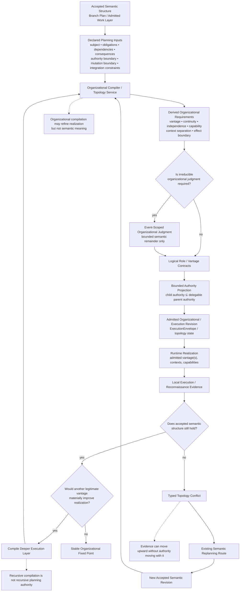

# Organizational Compilation

> **Question:** How does Work Engine turn accepted semantic work into a lawful execution organization without changing what the work means?

## Purpose

This view shows Work Engine's **organizational-compilation layer**.

Semantic planning determines:

- what work exists;
- what obligations are accepted;
- what dependencies hold;
- what consequences must be preserved;
- which semantic owners and boundaries matter.

Organizational compilation answers a different question:

> **Given that accepted semantic structure, what execution vantages, contexts, capabilities, and bounded authority projections are required to realize it well?**

The distinction is essential.

Organizational compilation may choose **how accepted work is realized**.

It may not silently change **what work was accepted**.

The core transformation is:

```text
accepted semantic structure
    ↓
organizational requirements
    ↓
logical role / vantage composition
    ↓
bounded authority projection
    ↓
admitted execution organization
    ↓
runtime realization
```

This page focuses on that transformation and its recursive form.

---

## Diagram



---

## How to Read This View

The diagram has three major regions:

1. **accepted semantic structure enters;**
2. **execution organization is compiled and admitted;**
3. **local evidence either confirms the plan or routes semantic invalidation back upward.**

The loop is therefore not arbitrary agent spawning.

It is a governed alternation between:

```text
accepted semantic state
    ↓
execution realization
    ↓
new evidence
```

and, only when necessary:

```text
new evidence
    ↓
semantic topology conflict
    ↓
planning authority
    ↓
new accepted semantic state
```

---

## 1. Organizational Compilation Begins From Accepted Meaning

The compiler does not start from an unconstrained goal.

It begins from an already-admitted semantic artifact, such as an accepted branch plan.

That artifact establishes the meaning of the work.

Conceptually, it may expose:

```text
subject
obligations
dependencies
required consequences
authority boundary
mutation boundary
affected semantic owners
integration boundary
evidence cutoff
known constraints
```

Organizational compilation treats those as inputs.

It does not reinterpret their evidence and invent new semantic conclusions.

The boundary is:

> **The planner establishes meaning; the organizational compiler derives execution consequences from that meaning.**

---

## 2. Semantic Topology and Execution Topology Are Different

This page depends on a distinction established elsewhere in the architecture.

### Semantic topology

Answers:

```text
What work exists?
What depends on what?
What consequences are required?
What semantic owners are affected?
What boundaries define the plan?
```

### Execution topology

Answers:

```text
How many execution vantages are needed?
Which obligations may share context?
Which require separation?
What capabilities must each vantage have?
What authority may each role receive?
What continuity does each role require?
```

The compiler owns only the second class of question.

---

## 3. Organizational Requirements Can Be Derived From the Plan

Some organizational consequences should require no model inference.

For example:

```text
accepted independence requirement
    ↓
distinct execution vantage required
```

or:

```text
mutation boundary = component A only
    ↓
child role cannot receive mutation authority over component B
```

or:

```text
capability requirement = repository write
    ↓
runtime realization must satisfy write capability
```

The preferred path is therefore:

```text
semantic contract
    ↓
deterministic organizational consequences
```

Inference is reserved for the remainder that cannot be resolved mechanically.

---

## 4. Event-Scoped Organizational Judgment

Not every organizational decision can necessarily be compiled deterministically.

Local evidence may leave a real semantic question such as:

> Should these accepted obligations share one retained execution vantage, or would separating them materially improve the required consequence?

When that question becomes material, Work Engine may inject a bounded, temporary organizational-decision surface into the legitimate role.

Conceptually:

```text
normal execution context

+ organizational-fit evidence
+ applicable authority facts
+ available role/capability profiles
+ current plan constraints
+ event-scoped organizational skill

    ↓

one bounded organizational judgment
```

The result becomes durable state.

The temporary reasoning projection is then removed.

The role does not permanently carry organizational-design doctrine merely because it may occasionally need to resolve an organizational question.

---

## 5. Role Formation Is Compilation, Not Job-Title Assignment

Work Engine roles are not fundamentally fixed names such as:

```text
Builder
Reviewer
Supervisor
```

Those may remain useful profiles, but the deeper object is a **logical vantage contract**.

A role may be composed from requirements such as:

```text
subject scope
authority grant
obligations
continuity requirement
information access
effect boundary
capability requirements
independence constraints
lifecycle
terminal consequence
```

The organizational compiler therefore **derives**:

```text
semantic obligation
    ↓ derive
required vantage
    ↓ derive
logical role contract  (owned downstream by role-and-contract-structure.md)
```

rather than:

```text
semantic obligation
    ↓
pick a hard-coded agent type
```

Named roles may become reusable, tested macros over these primitives.

---

## 6. Authority Is Projected, Never Minted

Once a role contract exists, it still needs lawful authority.

The invariant is:

```text
child_authority ⊆ delegable(parent_authority)
```

A deeper layer may partition existing authority.

It may narrow it.

It may attach it to a more local subject.

It may not create new authority merely because a new role exists.

For example:

```text
Branch authority ceiling
    ↓
Supervisor authority
    ↓
Builder authority
```

Each step attenuates scope.

Depth is not itself a claim to authority.

---

## 7. Admission Produces an Authoritative Organizational Revision

A derived role topology should not become real merely because a compiler proposed it.

The result must be admitted through the authority that owns organizational realization.

**Accepted 2026-09-15** (`organizational-execution-envelopes-reconciliation.md`'s own "Candidate answer for the organizational-authority layer"): the admission step has a concrete candidate mechanism, not only a placeholder. Organizational authority is the authority domain that selects a candidate organization; `ExecutionEnvelope` is only the immutable materialization of that selection, never the authority that selects it.

**Named 2026-09-16**: this is one instance of **Candidate Resolution and Admission**, a cross-cutting mechanism, not something this dimension invented for itself — `runtime-realization.md`'s own resolution/admission step independently arrived at the identical shape before either was recognized as the same mechanism. The mechanism reduces and validates a candidate space; it never owns the meaning of what survives the reduction — see `authority-and-ownership.md` §12 for the general invariant this depends on (invalidation never mints authority; rerunning this mechanism after a candidate fails never expands the authority ceiling it resolves against):

```text
derive candidate organizational realizations
        ↓
AVAILABLE   — realizations constructible from current role primitives,
              capabilities, runtime realizations, and resources
        ↓
AUTHORIZED  — the subset the authority ceiling, delegation rules,
              workflow policy, and effect boundaries actually permit
        ↓
REQUIRED    — properties the organization must satisfy for this work
              (independence, continuity, effect separation, semantic
              obligations, capability needs) — some mechanically known,
              an unresolved remainder resolved by bounded judgment
        ↓
intersect: available ∩ authorized ∩ satisfies(required)
        ├── 0 candidates → organizational gap
        ├── 1 candidate  → mechanically determined, no judgment needed
        └── N candidates → the only place a genuine selection judgment belongs
        ↓
organizational authority admits the surviving candidate
        ↓
ExecutionEnvelope records the admitted selection as a new revision
```

This acceptance is design-only, not implementation — no compiler exists yet, and it remains coupled to `role-compiler-proposal.md`'s own deferred reusable-role-profile-composition question (§16 below). What was previously fully open is now: a concrete candidate mechanism for the admission step exists and is accepted; the compiler that would actually run it, and the exact durable schema for an admitted revision (ExecutionEnvelope proper, a distinct organizational-topology revision, or some composition), remain unbuilt and only partly settled.

The important invariant is:

> **The execution organization must become durable, revisioned state before runtime realization treats it as authoritative.**

---

## 8. Runtime Realization Comes After Organizational Admission

Only after the logical organization has been admitted should Work Engine resolve concrete runtime details such as:

```text
model
provider
harness
tools
context
workspace
credential projection
capabilities
```

This preserves the architectural layering:

```text
Semantic Contract
    ↓
Logical Role Contract
    ↓
Organizational Admission
    ↓
Runtime Contract / Realization
```

A runtime provider does not decide what authority the role has.

The runtime realizes authority and obligations already defined elsewhere.

---

## 9. Local Evidence Drives Adaptation

Once an execution vantage exists, it encounters the actual world.

That may reveal information unavailable to the higher-level planner:

- unexpected shared state;
- implementation locality;
- context coupling;
- hidden compatibility surfaces;
- capability availability;
- unexpectedly broad mutation consequences;
- continuity requirements;
- evidence volume.

That evidence can affect execution topology.

The key question becomes:

> Does the evidence only change **how accepted work should be realized**, or does it show that the **accepted semantic work itself is wrong**?

Those outcomes must remain separate.

---

## 10. If the Plan Still Holds, Organizational Adaptation May Continue

Suppose an accepted branch contains:

```text
A1
A2
A3
```

with accepted dependencies unchanged.

Local evidence may establish:

```text
A1 and A2 share heavy implementation state
A3 is operationally independent
```

The compiler may lawfully produce:

```text
Supervisor[A]
    ├── Builder[A1 + A2]
    └── Builder[A3]
```

The semantic plan is unchanged.

Only its execution realization has become more specific.

That is organizational compilation.

---

## 11. If the Plan Is Falsified, Compilation Stops and Replanning Begins

Suppose instead execution discovers:

```text
plan says:
    A3 independent of A1

actual evidence:
    A3 changes a shared contract required by A1
```

That is not merely an organizational-fit issue.

The accepted semantic topology is false or incomplete.

The execution role may:

- record evidence;
- nominate a topology conflict;
- preserve current state safely.

It may not repair the plan itself.

The path becomes:

```text
execution evidence
    ↓
typed topology conflict
    ↓
existing planning authority
    ↓
new accepted semantic revision
    ↓
organizational compilation resumes
```

This prevents organizational recursion from becoming recursive planning authority.

---

## 12. Recursive Organizational Compilation

The same process may occur at deeper execution layers.

An already-admitted execution organization may, once operating, produce new
organizational-pressure evidence — for example, that its realization should
contain multiple child vantages where it currently has one.

An active vantage within that organization may supply such evidence, or host
a bounded, event-scoped organizational judgment (§4) — it does not thereby
acquire decomposition or admission authority merely by existing. That
authority remains organizational compilation's own process and organizational
authority's own admission act (§7), exercised again — not delegated to
whichever vantage happens to be running.

One child vantage may later encounter its own organizational pressure in the
same way.

Conceptually:

```text
Admitted Execution Organization
    ↓
an active vantage supplies organizational-pressure evidence
    (or hosts a bounded, event-scoped organizational judgment, §4)
    ↓
organizational compilation (recursed)
    ↓
organizational authority admits
    ↓
deeper Admitted Execution Organization, where justified
```

**Corrected 2026-09-26** — this chain previously began recursion from "a
Supervisor" performing "its own organizational compilation," which
misattributed decomposition/admission authority to the vantage itself rather
than to organizational compilation and organizational authority, exercised
again. Recursion now begins from an already-admitted organization producing
evidence, matching §4, §7, and §9's own already-stated ownership exactly.

But recursion is always bounded by accepted semantic structure.

At every layer:

```text
plan still valid
    -> realization may adapt

plan invalidated
    -> semantic conflict moves upward
```

---

## 13. Natural Stopping Condition

Organizational recursion should not continue merely because deeper decomposition is possible.

A new vantage is justified only when a stable boundary allows the resulting roles to know materially less while preserving or improving the required consequence.

A useful fixed-point statement is:

> **No unresolved obligation benefits from another legitimate vantage.**

At that point, decomposition stops.

Not because a maximum depth has been reached.

Because another organizational split would add coordination cost without enough semantic or operational benefit.

---

## 14. Context Boundaries, Vantage Boundaries, and Role Boundaries

Organizational compilation should not equate every context separation with a new role.

There are at least three distinct boundaries:

### Context boundary

A separate information lifetime is useful.

No independent authority is necessarily required.

### Vantage boundary

Different epistemic or reasoning conditions are required.

A separate vantage may be useful even if authority remains similar.

### Role boundary

A distinct semantic obligation or authority surface requires its own logical owner.

Conceptually:

```text
role boundary
    usually implies vantage boundary

vantage boundary
    usually implies context boundary

context boundary
    does NOT imply role boundary
```

This distinction prevents every context-management problem from turning into an organizational problem.

---

## 15. When Another Vantage Is Justified

Candidate separation pressures include:

```text
independence requirement
context separation
authority separation
continuity divergence
bounded coherent subproblem
capability specialization
concurrency opportunity
```

Candidate costs include:

```text
coordination cost
projection cost
shared-state coupling
handoff cost
reconstruction cost
integration burden
```

Work Engine should not collapse these into one universal scalar score prematurely.

Some conditions may be deterministic:

```text
MUST SEPARATE
    independence invariant requires it

MUST REMAIN
    non-transferable authority or atomic continuity requires it

SEPARATION ELIGIBLE
    bounded coherent work + lawful authority + realizable capability
```

The remaining benefit question may require semantic judgment.

---

## 16. Cross-Cutting Realizations Remain an Open Boundary

Grouping entire accepted obligations is relatively clean:

```text
Builder X = A1 + A2
Builder Y = A3
```

A harder case is:

```text
Builder X = part of A1 + part of A2
Builder Y = remaining parts of A1 + A2
```

At that point the execution organization may be cutting across semantic-plan boundaries.

The architecture has not yet fully settled how much repartitioning organizational-realization authority may perform before the transformation becomes planning in disguise.

A conservative candidate boundary is:

Organizational realization may:

- group accepted obligations;
- separate accepted obligations;
- assign obligations to distinct lawful vantages.

It may not:

- change their semantic meaning;
- change accepted dependency relationships;
- create new semantic obligations;
- eliminate accepted obligations.

Cross-cutting decomposition remains an explicit open seam rather than something this page silently resolves.

---

## 17. Fixed and Adaptive Organization Use the Same Architecture

Adaptive organization should not require a second execution system.

Organizational dynamics can instead be treated as policy over the same substrate.

Conceptually:

```text
organization_mode: fixed
    authored execution topology only

organization_mode: plan_compiled
    compile initial execution layer

organization_mode: recursive_bounded
    admitted execution vantages may further compile lawful realization

organization_mode: auto
    recursive organizational compilation wherever policy permits
```

The underlying ownership rules do not change.

Only the permitted transition set changes.

---

## 18. The Full Lowering Path

The complete conceptual chain is:

```text
accepted semantic plan
    ↓
declared obligations / boundaries / dependencies
    ↓
deterministic organizational consequences
    ↓
event-scoped semantic judgment only where needed
    ↓
logical role / vantage contracts
    ↓
bounded authority projection
    ↓
admitted organizational revision
    ↓
runtime realization
    ↓
local evidence
        ├── plan valid -> further realization adaptation if justified
        └── plan invalid -> topology conflict -> replanning
```

This is the core of organizational compilation.

---

## Key Invariants

1. **Organizational compilation begins from accepted semantic state; it does not begin from an unconstrained goal.**

2. **The compiler derives execution consequences; it does not author new semantic meaning.**

3. **Planning topology and execution topology are different owned objects.**

4. **Inference is used only for organizational questions that remain genuinely semantic after deterministic derivation.**

5. **Organizational judgment should be event-scoped rather than permanently injected into every role.**

6. **Logical roles are compositions of vantage, obligation, authority, continuity, capability, and effect boundaries—not merely fixed job titles.**

7. **Child authority must be a subset of authority lawfully delegable from upstream.**

8. **Organizational depth never manufactures authority.**

9. **An organizational proposal becomes real only after governed admission into durable revisioned state.**

10. **Runtime provider/model/tool selection is downstream of logical role and authority formation.**

11. **Execution evidence may adapt realization without changing semantic topology.**

12. **Evidence that falsifies semantic topology routes upward through the existing replanning mechanism.**

13. **Recursive organizational compilation is not recursive planning authority.**

14. **Another vantage should be created only when a legitimate separation provides enough value to justify its coordination cost.**

15. **Context separation, vantage separation, and role separation are distinct operations.**

---

## What This View Does Not Show

This page does not define:

- the full semantic planning hierarchy;
- exact authority primitive schemas;
- the final canonical representation of organizational topology;
- the exact ExecutionEnvelope ownership model;
- the exact role-compiler implementation;
- provider/model selection policy;
- context lifecycle mechanics;
- claim refresh mechanics;
- planning-fact materialization;
- transition fencing implementation;
- detailed topology-conflict payload schema.

Several of those remain active reconciliation seams.

This page describes the intended lowering architecture without claiming that all of its proposed abstractions already exist in production code.

---

## Relationship to Semantic Planning Hierarchy

`semantic-planning-hierarchy.md` establishes:

```text
Preplanner
    ↓
Accepted Orchestration Plan
    ↓
Orchestrator
    ↓
Branch Planner
    ↓
Accepted Branch Plan
```

This page expands the lower boundary, ending at this dimension's own
terminal artifact — not at runtime realization, which remains a separate,
downstream dimension:

```text
Accepted Branch Plan
    ↓
organizational requirements
    ↓
role / vantage composition
    ↓
authority projection
    ↓
organizational admission
    ↓
Admitted Execution Organization / ExecutionEnvelope
    ↓
Runtime Realization  (downstream — owned by runtime-realization.md, not this page)
```

**Corrected 2026-09-26** — both chains previously ended at a fixed named
profile (`Supervisor`, or `Supervisor / Builder / Specialist`). This page's
own §7–§8 already establish `ExecutionEnvelope` as this dimension's terminal
artifact and runtime realization as strictly downstream of it; updated both
chains to match, and to match `semantic-planning-hierarchy.md`'s own
"Boundary With Organizational Compilation" section, which ends its own
semantic-planning half at Accepted Branch Plan.

The planning hierarchy decides **what work means**.

Organizational compilation decides **how that meaning is lawfully embodied in execution**.

---

## Relationship to Authority and Ownership

`authority-and-ownership.md` establishes:

```text
observe
recommend
nominate
decide
admit
execute
```

as distinct authority modes.

Organizational compilation relies directly on those distinctions.

A topology service may derive a lawful organization.

A role may resolve a bounded organizational judgment.

An admission boundary may make the resulting organization authoritative.

A runtime role may execute it.

Those are separate acts even when one physical actor participates in more than one.

---

## Related Architecture Views

- **`semantic-planning-hierarchy.md`** — how semantic work topology is formed and revised.
- **`authority-and-ownership.md`** — which roles may observe, nominate, decide, admit, and execute.
- **`runtime-realization.md`** — the sibling instance of Candidate Resolution and Admission (§7 above); its own §5 records the `routing.vs.admission` ruling confirming executor-class routing belongs to neither this dimension nor that one, but to the supervisor / routing-policy authority named in decision-gated compilation's Stage 6.
- **`mechanisms/candidate-resolution-and-admission.md`** — the mechanism itself, citing this dimension's §7 as one of its three confirmed instances.
- **`role-and-contract-structure.md`** — the "semantic obligation → required vantage → logical role contract" chain (§5 above) grounds directly against that page's own §4.
- **`context-lifecycle.md`** — the sibling, equally-ranked consumer of the shared Context Observer and transition-fencing mechanism; owns the temporal question this dimension's own topological question is deliberately kept separate from.
- **`substrates/context-observer.md`** — the substrate itself; this dimension derives `VantageSeparationEvidence` and its own organizational-judgment decision from it, owning both independently.
- **`mechanisms/transition-fencing-and-leases.md`** — the mechanism itself; this dimension's own topology-transition fence is named there conceptually, with no implementation yet.
- **`evidence-and-claims.md`** — how planning and execution facts are materialized without becoming their own semantic owners.
- **`mechanisms/revision-cas-and-publication.md`** — the mechanism this dimension's own admission mechanism (§7 above) would publish through, once implemented; accepted design only, not yet built.

Revisioned state, predecessor lineage, CAS publication, and atomic visibility (what becomes canonical durable state at each admitted transition, across all of planning, organizational admission, and claim-evidence) are treated as a shared cross-cutting mechanism, not a truth dimension — settled, not open. Its canonical mechanism view is `mechanisms/revision-cas-and-publication.md`.

---

## Source and Status

**Retrofitted 2026-09-16** — this page predates `status-grammar.md` and had no formal `architecture_status` block, discovered by the three-category structural audit's own metadata pass. This page combines at least four genuinely different maturity levels; summarizing it as one value would have been the exact status-washing the grammar exists to prevent. Page default plus three local overrides, each re-derived from cited evidence independently.

```yaml
architecture_status:
  design: proposed
  reconciliation: reconciled
  authorization: unrecorded
  implementation: none
  owner: app-server/ideas/pending/deterministic-authority-projection-and-adaptive-organizational-topology.md
  status_as_of: 2026-09-16
```

This default describes the page as a whole: organizational compilation as an architecture — the compile-from-accepted-meaning shape (§1–§6), runtime-realization ordering (§8), and the fixed/adaptive policy-mode framing (§17–§18). `design: proposed` — the source idea document's own top-level Authority line: "Exploratory only." `reconciliation: reconciled` — checked directly against `hierarchical-planning-and-multi-supervisor-orchestration.md`, `organizational-execution-envelopes.md`/its reconciliation, and `role-compiler-proposal.md`. `authorization: unrecorded` — no citable decision authorizes this architecture at its current scope. `implementation: none` — no organizational compiler exists anywhere.

```yaml
status_override:
  design: accepted
  reconciliation: reconciled
  authorization: design_work_authorized
  implementation: none
  source: app-server/docs/organizational-execution-envelopes-reconciliation.md
```

Applies to §7 (Admission Produces an Authoritative Organizational Revision). Explicit 2026-09-15 acceptance: organizational authority selects a candidate from `available ∩ authorized ∩ satisfies(required)`, and `ExecutionEnvelope` records — never makes — that selection. `authorization: design_work_authorized`, explicitly bounded per that reconciliation's own text — coupled to `role-compiler-proposal.md`'s own deferred composition question before implementation could even be considered.

```yaml
status_override:
  design: proposed
  reconciliation: partial
  authorization: exploration_only
  implementation: none
  source: app-server/ideas/pending/deterministic-authority-projection-and-adaptive-organizational-topology.md
```

Applies to §9–§13 (recursive organizational compilation and its stopping condition). `reconciliation: partial`, not `reconciled` — the idea document's own Open Question 22 states directly this "reframing" has not survived "a full, formal reconciliation pass against [the source document's] complete text." Matches `status-grammar.md` §10.3's own worked example.

```yaml
status_override:
  design: exploratory
  reconciliation: not_applicable
  authorization: exploration_only
  implementation: none
  source: app-server/ideas/pending/deterministic-authority-projection-and-adaptive-organizational-topology.md
```

Applies to §16 (Cross-Cutting Realizations Remain an Open Boundary). The idea document's own Open Question 26 states the architecture "does not decide whether cross-cutting realizations should ever be permitted at all" — genuinely open in shape, not merely unaccepted. Matches `status-grammar.md` §10.4's own worked example.

Several implementation and ownership questions remain open regardless of which override applies: the exact durable schema an admitted organizational revision actually uses (`ExecutionEnvelope` proper, a distinct organizational-topology revision, or some composition); the precise relationship between role compilation and `ExecutionEnvelope` construction; the final primitive representation of vantage and authority requirements; whether deeper organizational layers consume source artifacts directly, claim materializations, or both. This page represents the intended architectural cross-section while preserving those seams as unresolved rather than prematurely collapsing them.