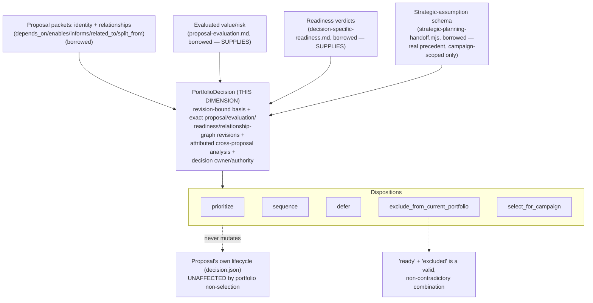

# Portfolio Selection

> **Question:** Given a set of ready/eligible proposals and the evidence bearing on them, what gets priority, sequencing, deferral, or exclusion from the current portfolio — under an authority scoped to inform, not mechanically schedule?

## Purpose

This view shows Work Engine's **portfolio-selection dimension**: the third stage of the proposal→decision front-end chain, confirmed independent by direct falsifier testing this session. The decisive falsifier, stated verbatim from the source: `exclude_from_current_portfolio` is **deliberately not named `reject`** — a proposal can be fully ready and evaluated, and still be excluded from the current portfolio for reasons that have nothing to do with its own merit.

This dimension owns the **`PortfolioDecision` record** — a revision-bound basis, attributed cross-proposal analysis, and a priority/sequencing/exclusion disposition — without ever mutating or shadowing a proposal's own separately-owned lifecycle state.

```text
Portfolio Selection owns:
    PortfolioDecision's revision-bound basis (exact proposal, evaluation,
        readiness, and relationship-graph revisions)
    attributed cross-proposal analysis (unlock/enablement,
        mutual exclusion under this basis)
    priority / sequencing / deferral / exclusion / campaign-selection
        disposition

Portfolio Selection does NOT own:
    proposal evaluation (proposal-evaluation.md)
    decision-specific readiness (decision-specific-readiness.md)
    a proposal's own lifecycle/acceptance state (decision.json) —
        never silently mutated or shadowed by a portfolio disposition
    intrinsic proposal-to-proposal conflict as durable relationship truth
        (a narrow gap in the relationship graph itself, §3)
    single-campaign strategic-planning verdicts
        (strategic-planning-handoff.mjs)
```

---

## Diagram



---

## How to Read This View

Two facts must never collapse into one: whether a proposal is *ready* (a separate dimension's judgment) and whether it is *selected for the current portfolio* (this dimension's own judgment). A proposal can be fully ready and still deferred, excluded, or sequenced behind others — for reasons entirely about the portfolio's own basis (capacity, policy, timing, competing priorities), never about the proposal's own merit.

---

## 1. What This Dimension Owns

The strongest surviving artifact, confirmed as genuinely unowned elsewhere:

```text
PortfolioDecision
    portfolio/proposal-set identity + revision
    exact strategic basis (referencing strategic-planning-handoff.mjs's
        existing schema)
    exact proposal revisions
    exact evaluation revisions (proposal-evaluation.md)
    exact readiness revisions (decision-specific-readiness.md)
    applicable relationship-graph revision
    attributed cross-proposal analysis (unlock/enablement, mutual
        exclusion under this basis)
    decision owner / authority

    dispositions:
        prioritize
        sequence
        defer
        exclude_from_current_portfolio
        select_for_campaign
```

Not owned by proposal packets, `evidence-and-claims.md`, `decision-specific-readiness.md`'s own readiness contracts, `proposal-evaluation.md`'s own evaluation/comparison machinery, or `strategic-planning-handoff.mjs`'s single-campaign verdict. This is narrower than an early pass over this territory assumed — real structured precedent for strategic-assumption *content* already exists — but the *portfolio-scoped binding* of that content to an exact proposal set and decision was, and remains, genuinely missing.

---

## 2. Confirmed Independent, by the Decisive Falsifier: Ready-but-Excluded

`exclude_from_current_portfolio` is deliberately not named `reject`. The portfolio owner can exclude a proposal from the current portfolio decision without that becoming semantic rejection of the proposal itself — proposal decisions (`decision.json`'s `disposition`/`lifecycle_state`) are a separately owned record, confirmed directly against every `decision.json` inspected this queue (shared schema: `disposition`, `lifecycle_state`, `placement_state`, `placement_claim`, `rationale`, `reopening_conditions`, `authority`, `constraints`). A `PortfolioDecision` marking a proposal `excluded`, `deferred`, or `not_selected` must not silently mutate or shadow that proposal's own lifecycle state unless the same authority separately and explicitly owns proposal rejection:

```text
proposal's own lifecycle
    accepted / formed / whatever its decision.json already says
        (unaffected by portfolio non-selection)

PortfolioDecision's disposition for that proposal
    not_selected / deferred / excluded_from_current_portfolio
        (a portfolio-scoped fact, not a proposal-scoped one)
```

---

## 3. Two Kinds of "Conflict," Only One of Which Is This Dimension's

A real gap was found bundled under one vague "blocking or conflicting proposals" clause — decomposed rather than treated as one residue:

```text
conflicts_with
    the proposals are semantically incompatible as formulated
    (e.g. two proposals both claim ownership of the same boundary
    differently) — a durable fact about the proposals themselves,
    independent of any portfolio's current capacity or timing
    -- NOT this dimension's own truth; a narrow gap in the proposal-
       relationship graph itself (alongside depends_on/enables/
       informs/related_to/split_from), owned wherever that graph is

mutually_exclusive_under_basis
    both cannot be selected or scheduled together under the current
    portfolio's capacity, policy, authority, or timing assumptions —
    a consequence of one portfolio decision's basis, not a fact
    about the proposals
    -- THIS dimension's own attributed judgment
```

`mutually_exclusive_under_basis` must never be encoded as permanent proposal-relationship truth merely because the current portfolio happens to lack the capacity or authority to pursue both — that would silently convert temporary scarcity into durable semantic conflict between proposals that may be perfectly compatible under a different basis.

---

## 4. Relationship to Proposal Evaluation and Decision-Specific Readiness: Confirmed `SUPPLIES` From Both Sides

Both neighboring dimensions' own reconciliations state the boundary independently:

- `decision-specific-readiness.md`'s own source names this dimension as a consumer of "implementation/activation readiness" — agreeing from both directions.
- `proposal-evaluation.md`'s own source supplies "evaluated value/risk evidence" — and the "unlock value" terminology overlap flagged there as unresolved is **resolved here**: evaluation estimates a proposal-local quantity (how much value one proposal is expected to unlock); this dimension owns the combination of that estimate with the real dependency graph across many proposals. A clean `SUPPLIES` boundary, not a competing definition — neither neighboring page needs correction.

---

## 5. Strategic Planning Exists, but Is Campaign-Scoped, Not Portfolio-Scoped

`strategic-planning-handoff.mjs` and `slice-campaign/strategic-reconciliation.mjs` implement a real, structured strategic-planning handoff — but for **one active campaign** (verdicts `continue`/`revise`/`pause`/`reorder`/`split_campaign`/`stop_campaign`), not which proposals across a **portfolio** should be prioritized, sequenced, deferred, or rejected. Same pattern found elsewhere this session: a real neighbor whose fields must not be assumed to already cover this dimension's broader scope merely because the name matches. This dimension borrows the strategic-assumption *content schema* directly; it owns only the *portfolio-scoped binding* of that content to an exact proposal set and decision.

---

## 6. Portfolio-Relative Unlock/Enablement Analysis Is an Attributed Judgment, Not an Automatic Graph Property

Produced per portfolio decision, bound to exact graph and evaluation revisions — never an automatically-maintained property of the proposal graph itself. Re-running this dimension against an unchanged evaluation/readiness set (a new competing proposal enters, or capacity changes) produces a new judgment without touching either upstream dimension — the same independence-of-revision-cadence property `decision-specific-readiness.md` has relative to `proposal-evaluation.md`.

---

## 7. Authority Scoped to Inform, Not Mechanically Schedule

This dimension's own authority section scopes the portfolio owner specifically to priority/sequencing/deferral/rejection/campaign-selection decisions. Relationships and evaluator findings *inform* this authority; they do not *mechanically schedule* on its behalf — the same non-authority discipline this session enforces everywhere a mechanical signal feeds a domain judgment.

---

## 8. Likely Reuses Candidate Resolution and Admission for Final Selection

Not decided here, flagged for whoever extends this page: `PortfolioDecision`'s final dispositions (`select_for_campaign`/`defer`/`exclude`) over the set of ready/eligible proposals structurally match `mechanisms/candidate-resolution-and-admission.md`'s own `AVAILABLE ∩ AUTHORIZED ∩ SATISFIES(REQUIRED) → {0/1/N} → selected` shape, with capacity/policy/authority as the filtering predicates and the decision owner supplying the residual N-case judgment — the same pattern `material-decision-selection.md` follows for its own final step. This dimension's own basis-binding, cross-proposal analysis, and disposition schema remain real, unclaimed dimension content regardless of whether the final selection act itself is formally recorded as this mechanism's fourth confirmed instance.

---

## Key Invariants

1. **`exclude_from_current_portfolio` never becomes proposal rejection unless the same authority separately and explicitly owns that act.**
2. **`mutually_exclusive_under_basis` is a portfolio-decision consequence, never durable proposal-graph truth — unlike `conflicts_with`, which is not this dimension's own truth either.**
3. **Portfolio-relative cross-proposal analysis (unlock/enablement, mutual exclusion) is an attributed judgment produced per decision, never an automatically-maintained graph property.**
4. **This dimension's authority informs; it does not mechanically schedule.**
5. **Strategic-assumption content is borrowed structured precedent; this dimension owns only the portfolio-scoped binding of that content to an exact proposal set and decision.**
6. **Evaluation and readiness are `SUPPLIES` relations, never this dimension's own output.**

---

## What This View Does Not Show

This page does not define:

- typed evaluation estimates or comparison mechanics (`proposal-evaluation.md`);
- decision-specific sufficiency judgment (`decision-specific-readiness.md`);
- intrinsic proposal-to-proposal conflict as a durable relationship type (`conflicts_with` — a narrow gap in the proposal-relationship graph itself, not owned by this dimension either, §3);
- single-campaign strategic-planning verdicts (`strategic-planning-handoff.mjs`);
- material decision selection among routes for an accepted proposal (`material-decision-selection.md`).

---

## Relationship to Proposal Evaluation

`SUPPLIES`: evaluated value/risk feeds this dimension's cross-proposal analysis; this dimension owns the combination with the dependency graph, not the estimate itself. The "unlock value" overlap resolves cleanly, §4.

## Relationship to Decision-Specific Readiness

`SUPPLIES`: readiness verdicts feed this dimension as one of several independent consumers; this dimension never performs the sufficiency judgment itself.

## Relationship to Material Decision Selection

Downstream: a proposal marked `select_for_campaign` here is the accepted input `material-decision-selection.md`'s own materiality test operates on next. This dimension does not perform materiality testing itself.

---

## Related Architecture Views

- **`proposal-evaluation.md`** — the `SUPPLIES` source of evaluated value/risk this dimension combines with the dependency graph.
- **`decision-specific-readiness.md`** — the `SUPPLIES` source of readiness verdicts this dimension consumes as one of several independent consumers.
- **`material-decision-selection.md`** — the downstream dimension operating on a proposal this dimension has selected for a campaign.
- **`mechanisms/candidate-resolution-and-admission.md`** — this dimension's own final selection step likely reuses this mechanism's shape (§8), a candidate fourth confirmed instance not yet formally recorded.

---

## Source and Status

```yaml
architecture_status:
  design: accepted
  reconciliation: reconciled
  authorization: implementation_authorized
  implementation: none
  owner: app-server/docs/proposal-backed-portfolio-selection-reconciliation.md
  status_as_of: 2026-09-16
```

`design: accepted` — the reconciliation's own Acceptance section: "Accepted 2026-09-14 ... This document's findings and disposition are confirmed accurate." `reconciliation: reconciled` — this page's content traces directly to that document, read in full this session (supplemented by a falsifier-test fork grounded in the same source), not carried forward from a prior summary. `authorization: implementation_authorized` — the same Acceptance section states directly: "Implementation of the stated residue — the `PortfolioDecision` record, with portfolio exclusion kept explicitly distinct from proposal-lifecycle rejection — is authorized to proceed." `implementation: none` — no `PortfolioDecision` record, `mutually_exclusive_under_basis`, or portfolio-scoped basis-binding shape was found anywhere in `app-server/src`, `app-server/docs`, or `app-server/ideas/pending` during this reconciliation's own targeted search.
