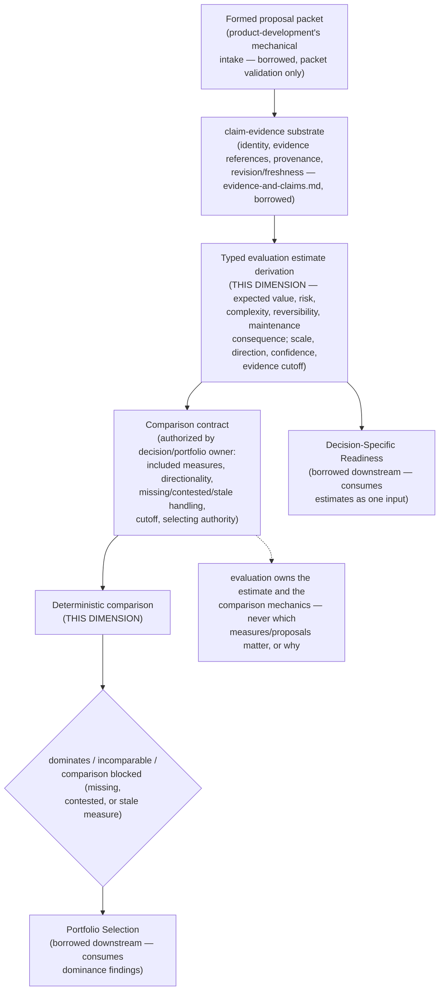

# Proposal Evaluation

> **Question:** Given a formed proposal and the evidence bearing on it, what typed, comparison-ready conclusions does Work Engine hold about its value, risk, complexity, and other decision-relevant properties — and how do those conclusions compare across proposals under an authorized contract?

## Purpose

This view shows Work Engine's **proposal-evaluation dimension**: the first stage of the proposal→decision front-end chain, confirmed as a genuine, independently-owned truth by direct falsifier testing this session (not assumed from adjacency to its neighbors).

This dimension owns exactly two things: **typed evaluation estimates** derived from evidence (never the evidence itself), and **comparison-contract/dominance-derivation mechanics** (never the authority to choose what gets compared, or why). Everything downstream — whether evidence is *sufficient* for a specific decision, and which proposals get *priority* — belongs to its two confirmed neighbors, `decision-specific-readiness.md` and `portfolio-selection.md`, which this dimension only *supplies*.

```text
Proposal Evaluation owns:
    typed evaluation estimates (value, risk, complexity, reversibility,
        maintenance consequence, validation burden — each scaled,
        directional, with confidence and an evidence cutoff)
    comparison-contract schema and validation
    dominance/Pareto derivation mechanics
    truthful incomparable/insufficient-comparison outcomes

Proposal Evaluation does NOT own:
    the evidence itself (claim-evidence's own identity/provenance/
        revision/freshness mechanics)
    decision-specific sufficiency judgment ("is this ready for decision D?")
    which measures matter for a given decision, which proposals are
        compared, or the authorized comparison surface
    priority, sequencing, exclusion, or cross-proposal dependency analysis
    acceptance, implementation authorization, or roadmap mutation
```

---

## Diagram



---

## How to Read This View

Two owned pieces, one strict authority boundary. This dimension derives *what an estimate means* (a typed value/risk/complexity conclusion, with its own scale and confidence) and *how estimates compare* (deterministic dominance/Pareto derivation) — but never *which* measures matter for a given decision, *which* proposals are being compared, or *who* gets to pick the surface. That authority belongs entirely to whichever decision or portfolio owner requests the comparison.

---

## 1. What This Dimension Owns

Two pieces, confirmed as genuinely this dimension's own by direct source verification, not evaluation's original, undifferentiated "typed evaluation model":

- **Typed evaluation estimates** — expected value, risk, complexity, reversibility, maintenance consequence, validation burden, each carrying its own scale, directionality, confidence, and evidence cutoff.
- **Comparison-contract schema, validation, and dominance/Pareto derivation mechanics** — the clearest, most load-bearing residue found: a targeted search across `app-server/src`, `app-server/docs`, and `app-server/ideas/pending` found zero occurrences of "dominance," "pareto," or "comparison contract" anywhere. This is evaluation's own genuine, non-overlapping territory.

---

## 2. Evidence vs. Estimate: the Corrected Boundary

**A first pass of this territory's own reconciliation mistyped "measures" as an evidence sub-schema** ("typed evidence items with declared units, direction, scope, and cutoff") — corrected directly in the source before this page was written:

```text
evidence (claim-evidence: identity, references, provenance,
          revision/freshness mechanics)
    |
    v
evaluation claim / estimate (THIS DIMENSION: what "expected cost" or
    "regression risk" means, the typed value/scale, directionality,
    scope, confidence/uncertainty, evidence cutoff)
```

`claim-evidence`'s evidence references are generic (digest, status, freshness) with no directional, unit-bearing estimate structure above them — that gap is this dimension's own: **typed evaluation measure/estimate semantics**, not a second evidence schema. `claim-evidence` owns the evidence beneath an estimate; this dimension owns the estimate itself.

---

## 3. Claims and Evidence Items Are Already Retired to Claim-Evidence

The idea's own original typed-model definitions — "claims: evidence-backed semantic conclusions within a facet" and "evidence items: observations supporting or challenging a claim" — are exactly `evidence-and-claims.md`'s existing claim and evidence-reference primitives, domain-scoped via the already-implemented `proposal-research-v1` vertical profile in `authorized-vertical.mjs`. Not a new schema this dimension must define — a domain-scoped application of one that already exists.

---

## 4. Facets: an Open Modeling Question This Dimension's Own Source Has Not Settled

**Not retired, and deliberately not placed as residue.** "Facets" (durable domains of investigation) are explicitly flagged by the source document's own text as unresolved: "This is not yet an accepted universal registry. Formation must decide whether a candidate field is a facet, claim, measure, epistemic metadata, or relationship before schema adoption." Per the same caution `decision-specific-readiness.md`'s own R0–R5 ladder required, this page does not assert facets as settled canonical state lacking only an owner — the source itself has not decided whether "facet" is a real primitive or a convenience grouping over claims. Left open, not resolved here by assumption.

---

## 5. The Comparison Contract: This Dimension's Primary Residue, Ownership Split Explicit

Ownership of the comparison contract itself should never be read as "evaluation decides what counts as better." The split stays explicit rather than implicit:

```text
evaluation (THIS DIMENSION) owns:
    comparison-contract schema and validation
    measure comparability rules
    dominance/Pareto derivation mechanics
    truthful incomparable/insufficient outcomes

decision or portfolio owner owns:
    which measures matter for this decision
    which proposal set is being compared
    the authorized comparison surface
    any weighting or tradeoff preference
```

With that split, dominance derivation becomes a deterministic consequence of two separately-owned inputs, never a new authority:

```text
authorized comparison contract (decision/portfolio owner)
        +
typed evaluation estimates (THIS DIMENSION)
        |
        v
deterministic comparison where defined
        |
        v
A dominates B / A and B incomparable / comparison blocked by
    stale, missing, or contested measure
```

No portfolio or acceptance authority is created by that result — it remains a conditional finding under a named contract and cutoff.

---

## 6. Readiness Is Named but Explicitly Not This Dimension's Own Output

The source document's own "Typed evaluation model" section already names "readiness judgments" as "decision-specific conclusions issued by their authorized owner" — not evaluation's own output. This dimension avoided, from the start, the trap its own review specifically warned against: absorbing "ready/not ready" merely because it produces value/risk/complexity evidence. Confirmed directly by falsifier testing this session (`decision-specific-readiness.md`'s own text: "Evaluation answers 'what do we currently believe about this proposal?'; readiness answers 'is what we currently know sufficient for this particular decision?' These are different questions and should not be merged").

---

## 7. Relationship to Portfolio Selection: `SUPPLIES`, Not Competing Ownership

`portfolio-selection.md`'s own "Required consequence" list states portfolio judgment reasons *over* "evaluated value/risk evidence" and readiness — consuming already-computed findings — and its own "Does not own" section explicitly excludes proposal evaluation. Confirmed `SUPPLIES`, not competing ownership.

**A terminology overlap flagged when this page was first written is now resolved, by `portfolio-selection.md`'s own reconciliation, checked directly rather than left open.** Both this dimension's own evaluation dimensions and `portfolio-selection.md`'s own required-consequence list name "unlock value." This dimension computes unlock value as a proposal-local quantity — a per-proposal claim/measure; `portfolio-selection.md` separately owns the combination of that estimate with the real, many-proposal dependency graph (`depends_on`/`enables`/`informs`/`related_to`/`split_from`). A clean `SUPPLIES` boundary, not a competing definition — neither page needed correction once checked from both sides.

---

## 8. Distinct From Authority-Backed Architecture Directions' Conformance Mapping

`authority-backed-architecture-directions-as-workflow-inputs.md` §7 ("Proposal-formation behavior") owns conformance mapping — is a proposal consistent with an accepted direction — not value/risk evaluation. Re-verified by direct targeted search of that section's text for "value," "risk," "complexity," and "dominance": zero occurrences. No overlap.

---

## Key Invariants

1. **Evaluation owns estimates derived from evidence, never the evidence itself.**
2. **The comparison contract's authority to select measures, proposals, and surface belongs to the decision or portfolio owner, never to this dimension — dominance derivation is a deterministic consequence of two separately-owned inputs, not a new authority.**
3. **A comparison outcome is exactly one of dominates / incomparable / blocked (by missing, contested, or stale evidence) — never silently defaulted.**
4. **Readiness judgments are named but never produced here — this dimension supplies evidence to readiness, never issues the sufficiency judgment itself.**
5. **Facets remain an open modeling question this dimension's own source has not settled — not resolved here by assumption.**
6. **No portfolio or acceptance authority is created by a comparison result.**

---

## What This View Does Not Show

This page does not define:

- evidence identity, provenance, or revision/freshness mechanics (`evidence-and-claims.md`);
- decision-specific sufficiency judgment (`decision-specific-readiness.md`);
- priority, sequencing, exclusion, or cross-proposal dependency analysis (`portfolio-selection.md`);
- proposal-direction conformance mapping (`authority-backed-architecture-directions-as-workflow-inputs.md`, not yet its own architecture view);
- an exhaustive facet ontology (open modeling question, not decided here, §4).

---

## Relationship to Evidence and Claims

`evidence-and-claims.md` owns the evidence beneath every estimate this dimension derives; "claims" and "evidence items" in this dimension's own original typed model are retired entirely to that substrate, domain-scoped via `proposal-research-v1`.

## Relationship to Decision-Specific Readiness

`SUPPLIES`: this dimension's typed estimates are one input to a decision-specific sufficiency judgment; this dimension never issues that judgment itself.

## Relationship to Portfolio Selection

`SUPPLIES`: this dimension's dominance/comparison findings feed portfolio priority and sequencing; portfolio never performs evidence comparison itself. One terminology overlap ("unlock value") remains open, §7.

---

## Related Architecture Views

- **`evidence-and-claims.md`** — owns the evidence beneath every estimate this dimension derives.
- **`decision-specific-readiness.md`** — the downstream consumer of this dimension's estimates as one input to a decision-specific sufficiency judgment.
- **`portfolio-selection.md`** — the downstream consumer of this dimension's dominance/comparison findings for priority and sequencing authority.

---

## Source and Status

```yaml
architecture_status:
  design: accepted
  reconciliation: reconciled
  authorization: implementation_authorized
  implementation: none
  owner: app-server/docs/evidence-backed-proposal-evaluation-reconciliation.md
  status_as_of: 2026-09-16
```

`design: accepted` — the reconciliation's own Acceptance section: "Accepted 2026-09-14 ... This document's findings and disposition are confirmed accurate." `reconciliation: reconciled` — this page's content traces directly to that document, read in full this session (supplemented by falsifier-test forks grounded in the same source), not carried forward from a prior summary. `authorization: implementation_authorized` — the same Acceptance section states directly: "Implementation of the stated residue — typed evaluation estimates and the comparison-contract/dominance mechanism, with evaluation owning the contract mechanics and the decision/portfolio owner picking what is compared — is authorized to proceed." `implementation: none` — the source's own targeted search across `app-server/src`, `app-server/docs`, and `app-server/ideas/pending` found zero occurrences of "dominance," "pareto," or "comparison contract," and the substrate below it (`claim-evidence`) was independently confirmed to have no "facet," "measure," "dominance," "pareto," or "comparison contract" content either.
