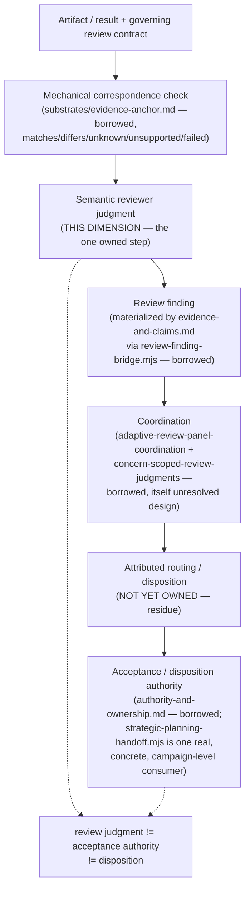

# Review

> **Question:** Given a produced artifact or result and its governing review contract, what findings and judgments are warranted about its fitness, correspondence, or acceptance-relevant properties — as distinct from who may act on that judgment?

## Purpose

This view shows Work Engine's **review dimension**: the one real, non-redundant truth this architecture calls "review" actually owns.

**Stated plainly before anything else, per this session's own discipline against manufactured symmetry:** this is the thinnest-scoped of the 13 confirmed dimensions. It owns exactly one step — semantic judgment production — and explicitly borrows everything around it: the mechanical half from `substrates/evidence-anchor.md`, finding materialization from `evidence-and-claims.md`, specialist coordination from a still-unresolved mechanism (`adaptive-review-panel-coordination`), and acceptance authority from `authority-and-ownership.md`. A page that tried to restate the full review topology as its own would misrepresent how little of it this dimension actually owns.

```text
Review owns:
    semantic judgment production for a governed artifact/correspondence —
    "does this still hold, truthfully and proportionately?" or
    "is the system MODEL, ownership, decomposition, or placement wrong?"

Review does NOT own:
    mechanical correspondence/comparison (substrates/evidence-anchor.md)
    finding materialization or revision/lineage (evidence-and-claims.md)
    specialist selection, execution, or independence mechanics
        (adaptive-review-panel-coordination — itself unresolved design)
    acceptance, disposition, or blocking authority
        (authority-and-ownership.md, and whichever concrete owner a
         finding routes to)
```

---

## Diagram



---

## How to Read This View

Most of the boxes above are explicitly borrowed, and one is explicitly unowned. That is not an oversight in this page — it is the finding. Only the "semantic reviewer judgment" step is this dimension's own truth; everything upstream and downstream already has a confirmed owner (or, for routing/disposition, confirmed non-ownership) elsewhere in the architecture.

---

## 1. What This Dimension Owns

One coherent class of truth, confirmed by `cross-cutting-seam-review-and-architectural-review-reconciliation.md`'s own direct comparison of its two named instances: the semantic judgment that a mechanical comparator's own design explicitly refuses to make and explicitly reserves for "a domain owner." **A third instance was found and added 2026-09-16**, by a targeted architectural synthesis of the `review-scope-coordination-reconciliation.md` gap — this page's own earlier claim of "two concrete instances" was an artifact of when it was first written, not a considered limit; corrected here rather than left stale, the same "audit the whole page" lesson `mechanisms/revision-cas-and-publication.md` already needed once this session. Three concrete instances of the same shape, at different grain:

```text
seam review
    question: do two independently-valid things still correspond,
              truthfully and proportionately?
    scope: one boundary, two known sides

architectural review
    question: is the system MODEL, ownership, decomposition, or
              placement itself wrong?
    scope: the architecture as a whole, or a subsystem's design

review-scope validity judgment
    question: does a planned mutation still leave an active review's
              evidence world valid — does its scope still hold?
    scope: one active review episode, checked against one incoming
           mutation, at mutation time rather than on a schedule
```

None of the three is reducible to another, and none is reducible to any of the twelve other dimensions. `evidence-and-claims.md` §9 excludes "generic evidence production" and never claims judgment authorship. `authority-and-ownership.md` §7's observe/recommend/nominate/decide/admit/execute vocabulary says only who may act, never what a reviewer should conclude. This is a real gap those pages leave, not overlap with them.

---

## 2. The Mechanical Half Retires Entirely to Evidence Anchor

Re-verified directly: the reconciliation's own Question 1 draws the line exactly where `evidence-anchor-observation-and-impact-nomination.md`'s design already draws it.

```text
mechanical correspondence checking
    "does the declared relationship still hold" (matches/differs)
    -> substrates/evidence-anchor.md's EvidenceAnchorObserver /
       comparator pattern, generalized by anchor kind — already
       extensible, not a new mechanism this dimension needs

semantic correspondence judgment
    "does this correspondence still hold truthfully and proportionately"
    -> THIS DIMENSION — the slot evidence-anchor's own pipeline
       reserves ("domain owner judges consequence") but does not fill
```

Seam review does not need, and should not get, a standalone mechanism for the mechanical half. Extending the anchor-kind taxonomy where an existing kind cannot express a declared dependency is `substrates/evidence-anchor.md`'s own territory, not this dimension's.

---

## 3. The Implemented Substrate Today

Three real instances of this dimension's own judgment-production shape, not merely proposed:

- **`review-finding-bridge.mjs`** (`app-server/src/services/claim-evidence/review-finding-bridge.mjs`, IMPLEMENTED) — its `revisionPayload` carries `assumptions`, `limitations`, `confidence`, `evidence_references`, and `reopening_conditions` for one domain profile (review findings), confirmed directly in source.
- **`agent-instruction-review`** (`app-server/src/services/agent-instruction-review/{service.mjs,contract.mjs}`, IMPLEMENTED, fully dogfooded) — a distinct specialist skill delivered read-only, with `selfCertificationAuthorized: false` mechanically fixed in `contract.mjs:244`, alongside seven other independently false-by-default authority flags. This is this dimension's own semantic judgment running in production today, not a proposed shape.
- **`native-review-host.mjs`** (`app-server/src/services/slice-campaign/native-review-host.mjs`, IMPLEMENTED — added 2026-09-16, found by a post-execution-implementation-acceptance pressure test, closing a real citation gap) — its `findingAuthority()` publishes findings under `permissions: ["create_claim", "publish_revision", "record_reliance"]` against `profile: "revision-bound-review-finding-v1"`, the **exact same profile** `review-finding-bridge.mjs` uses above. This is not an analogous shape — it is the identical mechanism, applied to a declared-boundary conformance check specifically (baseline-vs-candidate Git diff checked against a caller-declared `candidate.paths` set, `native-review-host.mjs:126–157`) rather than a generic review finding. **Corrected 2026-09-26** — an earlier draft of this line described the check as "implementation-contract conformance specifically." That overstated what the check does: it validates the diff against a flat declared file-path set, not conformance to any `implementation-contract-compilation.md`-schema object, which remains unimplemented (`implementation-contract-compilation.md`'s own Source and Status: `implementation: none`). Confirms this dimension does not need a fourth named judgment instance for post-execution conformance checking (§ Relationship to Evidence and Claims and Authority and Ownership, and `implementation-contract-compilation.md`'s own §5, below) — it is this same instance, one more concrete subject; the conformance *target* is narrower than that page's own eventual schema, not a claim that the schema is already live.

---

## 4. Finding Materialization Is Evidence/Claims' Work, Not This Dimension's Own

A review finding's durable existence — identity, revisions, provenance, reopening conditions — is `evidence-and-claims.md`'s own materialization of this dimension's judgment output, the same way that page materializes planning or organizational truth. This dimension produces the judgment; it never stores, versions, or publishes the finding itself.

---

## 5. Coordination Is a Borrowed, Still-Unresolved Mechanism

Specialist selection and execution is not a mechanism this dimension invents. It is the same "open, model-interpreted specialist registry" `adaptive-review-panel-coordination`'s own proposal already describes, paired with `concern-scoped-review-judgments`' own substrate (`ReviewEpisode`/`ReviewResult`/`ReviewJudgment`/`Finding`, each judgment scoped to one versioned concern). Both proposals carry `approve_proposal_meaning` decisions (per `ui-review-capability-reconciliation.md`'s own check) — accepted as meaning, not authorized for implementation as a general mechanism. `agent-instruction-review` is this pattern's one real, dogfooded instance for a single specialist; the general coordinator is not built.

---

## 6. Acceptance Authority Is Never This Dimension's Own

Stated as plainly as the reconciliation itself states it: *review judgment ≠ acceptance authority ≠ disposition.* `strategic-planning-handoff.mjs` (real, dogfooded — a verdict enum `continue`/`revise`/`pause`/`reorder`/`split_campaign`/`stop_campaign`) is confirmed as one concrete, campaign-level consumer of a review finding's consequence — proof the separation this dimension requires is achievable, not proof it is the universal owner:

```text
finding occurs
    during an active campaign
        -> campaign strategic planning (strategic-planning-handoff.mjs,
           a real, concrete instance)
    during proposal formation
        -> the proposal workflow
    against an accepted architecture direction
        -> architecture authority
    outside any campaign
        -> human/product authority
```

Treating `strategic-planning-handoff.mjs` as the general acceptance owner would wrongly imply the campaign strategist is the architecture authority — neither source document claims that.

---

## 7. The Residue: Six Pieces Still Genuinely Unowned

Not smoothed into this dimension's own truth merely because they are adjacent to it — each is confirmed, by the reconciliation's own disposition table (items 1-4), a targeted architectural synthesis (item 5, added 2026-09-16), or a pressure test against a strong null hypothesis (item 6, added 2026-09-16), as **not retired**:

```text
1. The semantic correspondence-judgment's own owner and record shape,
   for non-mechanically-decidable seams (state-ownership <-> UI-
   representation, authority <-> exposed-control, provenance <->
   displayed-certainty). This dimension is confirmed as the right
   *kind* of owner (§1 above) — but who performs it and how it is
   recorded is not yet specified. An asymmetry worth stating, not
   smoothing over: this dimension's own core judgment has no settled
   operational form yet, the same kind of gap `role-and-contract-
   structure.md` §7 states plainly for its own compiler.

2. An attributed routing/disposition concept — deliberately not a fixed
   "local/architectural/documentation/UI/workflow" taxonomy (that
   classification is itself semantic and multidimensional; a finding
   can be UI-and-architectural at once). What is needed is narrower: a
   finding must carry an attributed judgment that architectural
   diagnosis is warranted, so the handoff after it can be mechanical.
   Representation is open.

3. An architectural-finding domain profile, coupled to but not built on
   `claim-evidence`'s existing domain-profile pattern — buildable, not
   free-standing unowned territory, but does not exist yet.

4. The routing step itself, from a finding's recommendation to whichever
   owning decision boundary actually applies (§6 above names four
   candidate boundaries; none of them is connected by a built routing
   mechanism today).

5. Protected-scope declaration for an active review, and the handoff to
   `mechanisms/resource-lease-and-fencing.md` that enforces it (§9
   below) — same shape as items 2 and 4: an operational/coordination gap
   adjacent to this dimension's own judgment, not judgment production
   itself, but genuinely this dimension's own residue to carry, never
   inferred from the mechanism's own shape.

6. Adaptive review-panel coordination — coverage accounting over a
   required concern set, conflict preservation instead of premature
   merge, and an attributed fan-out/fan-in protocol distinguishing
   coordinator inference from specialist findings. Pressure-tested
   2026-09-16 against a strong null hypothesis (domain-local
   orchestration, not a shared mechanism) — the null held: none of
   Proposal Evaluation, Implementation-Contract Compilation,
   Organizational Compilation, or Material Decision Selection
   independently need "one semantic episode -> multiple concern-
   specialized independent judgments -> attributed aggregation ->
   explicit coverage/conflict detection." One domain needing a
   sophisticated internal workflow is not evidence for a mechanism.
   Real residue, but genuinely less mature than items 1-5: the source
   proposal's own state line reads "placement uncertain... not
   closure-reviewed, evaluated, accepted, or authorized," and its own
   "Boundary and placement" section admits "dogfooding has not
   established whether panel selection and synthesis need separate
   owners, context lifetimes, or durable-state lifecycles" — not yet
   ready even as a fully-specified residue item, named here rather than
   left uncited.
```

---

## 8. Authorization Split, Exactly as the Source Records It

**Accepted 2026-09-14**, with an explicit split this page preserves rather than flattens: implementation of the mechanical seam-evidence adapter extensions is authorized to proceed — but that authorization belongs to `substrates/evidence-anchor.md`'s own anchor-kind taxonomy, not to this dimension. Residue items 1-4 (§7) are authorized for **design work only, not implementation** — each still requires an owner decision this reconciliation deliberately did not make for it. **Residue item 5 is a genuine exception, confirmed 2026-09-16 by direct citation, not assumed to match the other four**: `review-scope-coordination-reconciliation.md`'s own Acceptance section states "implementation of the stated residue — prospective review-scope coordination before mutation admission, including the design decision of which owner declares a scope protected before `workspace-coordination` enforces it — is authorized to proceed" — `implementation_authorized`, not `design_work_authorized`. See the dedicated `status_override` below. **Residue item 6 is weaker still than items 1-4, not merely equal to them**: its own source proposal has never gone through the sequel queue's 2026-09-14 acceptance pass at all — its own Identity-and-state line reads "not closure-reviewed, evaluated, accepted, or authorized." See its own dedicated `status_override` below.

---

## 9. The Third Instance: Review-Scope Validity, Confirmed Not a Generic Mechanism

**Added 2026-09-16**, by a targeted architectural synthesis of `review-scope-coordination-reconciliation.md`'s own gap (capstone §13 item 3, `ACCEPTED_AUTHORIZED_FOR_IMPLEMENTATION`, accepted 2026-09-14, previously cited by zero of the 18 architecture views). The reconciliation's own core act — "does a planned mutation still leave an active review's evidence world valid?" — is structurally identical to §1's existing two instances at a different grain and trigger: scheduled comparison for seam/architectural review, mutation-time check for this one.

The exact invariant this instance protects:

> **A mutation to a scope an active review currently depends on must not be silently admitted without an attributed disposition from this dimension's own judgment layer — neither an old, unrelated reliance record (a false positive) nor an in-progress review with no finding yet (a false negative) may substitute for that judgment.**

**The judgment itself is not a generic cross-cutting mechanism**, tested against the same bar this session's confirmed mechanisms all had to clear (independent domains converging on the identical shape without copying each other): no second domain in the 18 views demonstrably needs "does a mutation still leave my own active semantic episode valid?" `material-decision-selection.md` and `implementation-contract-compilation.md` have an adjacent-but-different need (stale evidence during compilation) and solve it differently, via `blocked_by_evidence`/`returned_for_decision` — not this dimension's own judgment shape. This part of the finding still holds: the *judgment* stays this dimension's own residue, not a fourth mechanism.

**The *enforcement* half, corrected 2026-09-16, turned out to be exactly a missing mechanism** — `mechanisms/resource-lease-and-fencing.md`, written the same day this instance was found, generalizes `workspace-coordination`'s own real lease/fencing discipline and is confirmed to serve two independent consumers: this dimension's protected-scope declaration, and `runtime-realization.md`'s own fenced active-binding decision. Checked directly against `workspace-coordination`'s real code before that mechanism page existed: `admitMutation({lease, operationId, mutate})` takes no review-state parameter at all — it only checks lease/fencing-token validity. Its `RESOURCE_TYPES` enum already includes a `review-budget` kind, confirming the mechanism reaches into review-adjacent territory, but nothing in it declared *which* resource key an active review needs protected. That declaration remains this dimension's own residue (item 5, §7) — the mechanism enforces it once declared, it never infers it.

**Confirmed not `mechanisms/transition-fencing-and-leases.md`'s territory either** — that mechanism's own shape is preparation-vs-publication for a transition being actively prepared toward activation; this is standing protection over an active, non-transitioning review episode. Different shape, not a fence class. See `mechanisms/resource-lease-and-fencing.md`'s own explicit contrast with that mechanism for the full reasoning.

---

## Key Invariants

1. **Review judgment ≠ acceptance authority ≠ disposition — never conflated, regardless of which concrete actor happens to hold more than one role.**
2. **The mechanical half of any review retires entirely to `substrates/evidence-anchor.md`; this dimension never re-implements comparison machinery.**
3. **A review finding is materialized by `evidence-and-claims.md`, never authored, stored, or versioned by this dimension.**
4. **This dimension's own judgment is one shape at different grain (seam review, architectural review, review-scope validity), not one universal function covering every possible review type.**
5. **Coordination and specialist-execution mechanics are borrowed from `adaptive-review-panel-coordination`, itself unresolved design — not owned or reinvented here.**
6. **A reviewer's own authority flags are mechanically false by default (`selfCertificationAuthorized: false`) — never self-granted.**
7. **A mutation to a scope an active review depends on requires this dimension's own attributed disposition — never an inferred pass from an unrelated reliance record, and never a silent block from an in-progress finding.**

---

## What This View Does Not Show

This page does not define:

- mechanical correspondence/comparison mechanics (`substrates/evidence-anchor.md`);
- finding materialization, revision, or lineage mechanics (`evidence-and-claims.md`);
- specialist selection, execution, or independence mechanics (`adaptive-review-panel-coordination`, not yet its own architecture view);
- acceptance, disposition, or blocking authority (`authority-and-ownership.md`);
- any domain-specific required-concern contract (e.g. a future `UIReviewProfile`) — this page states the shared judgment shape, not any one domain's own concern list;
- lease/fencing-token mechanics themselves (`mechanisms/resource-lease-and-fencing.md`) — this dimension declares what needs protecting (§7 item 5, §9); it does not implement the protection.

---

## Relationship to Evidence and Claims

`evidence-and-claims.md` materializes this dimension's judgment output as a durable claim (`review-finding-bridge.mjs`, and — confirmed 2026-09-16 — `native-review-host.mjs` under the identical `revision-bound-review-finding-v1` profile); the judgment itself remains this dimension's own, produced before materialization occurs, never inside the claim-evidence substrate itself. **Post-execution implementation acceptance, pressure-tested 2026-09-16, fully composes from existing owners with no residue**: this dimension produces the conformance finding (via `native-review-host.mjs`, above); `evidence-and-claims.md` materializes the resulting acceptance fact (its own `production-path-v1` profile, §2 there — a claim schema whose `acceptance: {owner, source, unestablishedRoute}` field records exactly who accepted it); `authority-and-ownership.md` owns the accept/reject/stop consequence (below); `mechanisms/revision-cas-and-publication.md` publishes the successor accepted state (`completion-publication.mjs`'s real `prepared → sealed → published` lifecycle). No new dimension needed — the real code had already solved this composition before any of the 20 architecture views existed; it was simply never cited.

## Relationship to Authority and Ownership

Acceptance and disposition authority is never this dimension's own. `strategic-planning-handoff.mjs` is one concrete, campaign-level instance of `authority-and-ownership.md`'s own decide/admit vocabulary (§7 there) applied to a review finding's consequence — not evidence that this dimension acquires that authority by proximity. `capability-contract.mjs`'s real `capability.checkpoint_lifecycle/accept` and `/stop` capabilities are a second concrete instance, confirmed 2026-09-16: `production-path-contract.mjs` mechanically enforces that the accepting `owner` may never be `reviewer`/`builder`/`adapter`/`terminalizer` — the same producer/accepter separation this dimension's own boundary requires, enforced in real code, not merely stated as a principle.

## Relationship to Resource Lease and Fencing

This dimension decides what scope requires protection (§7 item 5, §9); `mechanisms/resource-lease-and-fencing.md` enforces possession/exclusivity for the declared resource once that decision is made. This dimension never infers a resource key from the mechanism's own shape, and the mechanism never decides review validity.

---

## Related Architecture Views

- **`substrates/evidence-anchor.md`** — the mechanical comparator this dimension's own judgment consumes as input; never reimplemented here.
- **`evidence-and-claims.md`** — the sole materializer of this dimension's findings as durable claims.
- **`authority-and-ownership.md`** — owns acceptance, disposition, and blocking authority; this dimension never claims it.
- **`semantic-planning-hierarchy.md`**, **`organizational-compilation.md`**, **`role-and-contract-structure.md`**, **`runtime-realization.md`**, **`context-lifecycle.md`** — any may be the subject a review judges; none of them perform or own the review judgment itself.
- **`mechanisms/resource-lease-and-fencing.md`** — enforces this dimension's own protected-scope declaration (§7 item 5, §9) once made; `runtime-realization.md`'s own fenced active-binding decision is this mechanism's other confirmed consumer.
- **`mechanisms/revision-cas-and-publication.md`** — publishes the successor accepted state once post-execution implementation acceptance composes this dimension's finding with `evidence-and-claims.md`'s and `authority-and-ownership.md`'s own outputs (Relationship to Evidence and Claims, above).
- **`implementation-contract-compilation.md`** — its own §5 plan-conformance gate is the pre-execution symmetric counterpart to this dimension's own post-execution conformance finding (`native-review-host.mjs`, §3).

---

## Source and Status

```yaml
architecture_status:
  design: accepted
  reconciliation: reconciled
  authorization: design_work_authorized
  implementation: partial
  owner: app-server/docs/cross-cutting-seam-review-and-architectural-review-reconciliation.md
  status_as_of: 2026-09-16
```

`design: accepted` — the reconciliation's own Acceptance section: "Accepted 2026-09-14 (explicit user decision...). This document's findings and disposition are confirmed accurate." `reconciliation: reconciled` — this page's content traces directly to that document, read in full this session, not carried forward from a prior summary. `authorization: design_work_authorized` — per §8 above, residue items 1-4 (§7) are authorized for design work only; the one implementation-authorized piece belonging to this dimension's own territory (residue item 5, §9) is carried in its own override below, and the mechanical seam-evidence adapter extensions' implementation authorization belongs to `substrates/evidence-anchor.md`'s own territory, not this dimension's. `implementation: partial` — this dimension's general operational form (a semantic-judgment owner role, a routing/disposition record, an architectural-finding profile, a routing mechanism, a protected-scope declaration, adaptive-panel coordination) is unbuilt, but three real, concrete instances of the judgment-production shape itself already exist and run in production (§3).

```yaml
status_override:
  implementation: implemented
```

Applies narrowly to §3: `review-finding-bridge.mjs`, `agent-instruction-review`'s `service.mjs`/`contract.mjs`, and `native-review-host.mjs` — all real code, the second fully dogfooded. None is the complete, general review-judgment mechanism this page describes — each is a concrete, working instance of the shape, not the shape's own general infrastructure.

```yaml
status_override:
  authorization: implementation_authorized
  source: app-server/docs/review-scope-coordination-reconciliation.md
```

**Added 2026-09-16.** Applies narrowly to §7 residue item 5 and §9 (review-scope validity, the protected-scope declaration and `workspace-coordination` handoff) — a genuine exception among the residue items, confirmed by direct citation rather than assumed to match items 1-4's `design_work_authorized`: `review-scope-coordination-reconciliation.md`'s own Acceptance section states "implementation of the stated residue — prospective review-scope coordination before mutation admission, including the design decision of which owner declares a scope protected before `workspace-coordination` enforces it — is authorized to proceed," accepted 2026-09-14. `implementation: none` (the page default, unchanged) — no code implements this instance yet.

```yaml
status_override:
  design: exploratory
  reconciliation: not_applicable
  authorization: exploration_only
  implementation: none
  source: proposals/adaptive-specialized-review/adaptive-review-panel-coordination/proposal.md
```

**Added 2026-09-16.** Applies narrowly to §7 residue item 6 (adaptive review-panel coordination). Weaker than every other residue item's status, not flattened to match them: the source's own "Identity and state" reads "placement uncertain; revised after bootstrap review continuation and not closure-reviewed, evaluated, accepted, or authorized" — never went through the sequel queue's 2026-09-14 acceptance pass at all, unlike items 1-5. `design: exploratory`, not `proposed` — the source's own "Boundary and placement" section states final placement itself remains genuinely unresolved ("dogfooding has not established whether panel selection and synthesis need separate owners, context lifetimes, or durable-state lifecycles"), not merely unaccepted. `authorization: exploration_only` — the source's own Authority section: "does not perform review, declare semantic freshness... or authorize implementation." A confirmed ceiling, not silence.
