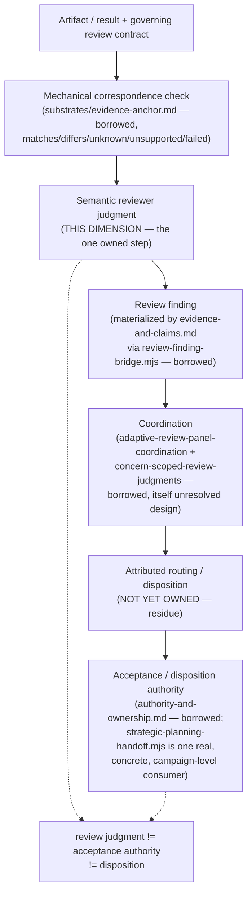

# Review

> **Question:** Given a produced artifact or result and its governing review contract, what findings and judgments are warranted about its fitness, correspondence, or acceptance-relevant properties — as distinct from who may act on that judgment?

## Purpose

This view shows Work Engine's **review dimension**: the one real, non-redundant truth this architecture calls "review" actually owns.

**Stated plainly before anything else, per this session's own discipline against manufactured symmetry:** this is the thinnest-scoped of the eight confirmed dimensions. It owns exactly one step — semantic judgment production — and explicitly borrows everything around it: the mechanical half from `substrates/evidence-anchor.md`, finding materialization from `evidence-and-claims.md`, specialist coordination from a still-unresolved mechanism (`adaptive-review-panel-coordination`), and acceptance authority from `authority-and-ownership.md`. A page that tried to restate the full review topology as its own would misrepresent how little of it this dimension actually owns.

```text
Review owns:
    semantic judgment production for a governed artifact/correspondence —
    "does this still hold, truthfully and proportionately?" or
    "is the system MODEL, ownership, decomposition, or placement wrong?"

Review does NOT own:
    mechanical correspondence/comparison (substrates/evidence-anchor.md)
    finding materialization or revision/lineage (evidence-and-claims.md)
    specialist selection, execution, or independence mechanics
        (adaptive-review-panel-coordination — itself unresolved design)
    acceptance, disposition, or blocking authority
        (authority-and-ownership.md, and whichever concrete owner a
         finding routes to)
```

---

## Diagram



---

## How to Read This View

Most of the boxes above are explicitly borrowed, and one is explicitly unowned. That is not an oversight in this page — it is the finding. Only the "semantic reviewer judgment" step is this dimension's own truth; everything upstream and downstream already has a confirmed owner (or, for routing/disposition, confirmed non-ownership) elsewhere in the architecture.

---

## 1. What This Dimension Owns

One coherent class of truth, confirmed by `cross-cutting-seam-review-and-architectural-review-reconciliation.md`'s own direct comparison of its two named instances: the semantic judgment that a mechanical comparator's own design explicitly refuses to make and explicitly reserves for "a domain owner." Two concrete instances of the same shape, at different grain:

```text
seam review
    question: do two independently-valid things still correspond,
              truthfully and proportionately?
    scope: one boundary, two known sides

architectural review
    question: is the system MODEL, ownership, decomposition, or
              placement itself wrong?
    scope: the architecture as a whole, or a subsystem's design
```

Neither is reducible to the other, and neither is reducible to any of the seven prior dimensions. `evidence-and-claims.md` §9 excludes "generic evidence production" and never claims judgment authorship. `authority-and-ownership.md` §7's observe/recommend/nominate/decide/admit/execute vocabulary says only who may act, never what a reviewer should conclude. This is a real gap those pages leave, not overlap with them.

---

## 2. The Mechanical Half Retires Entirely to Evidence Anchor

Re-verified directly: the reconciliation's own Question 1 draws the line exactly where `evidence-anchor-observation-and-impact-nomination.md`'s design already draws it.

```text
mechanical correspondence checking
    "does the declared relationship still hold" (matches/differs)
    -> substrates/evidence-anchor.md's EvidenceAnchorObserver /
       comparator pattern, generalized by anchor kind — already
       extensible, not a new mechanism this dimension needs

semantic correspondence judgment
    "does this correspondence still hold truthfully and proportionately"
    -> THIS DIMENSION — the slot evidence-anchor's own pipeline
       reserves ("domain owner judges consequence") but does not fill
```

Seam review does not need, and should not get, a standalone mechanism for the mechanical half. Extending the anchor-kind taxonomy where an existing kind cannot express a declared dependency is `substrates/evidence-anchor.md`'s own territory, not this dimension's.

---

## 3. The Implemented Substrate Today

Two real instances of this dimension's own judgment-production shape, not merely proposed:

- **`review-finding-bridge.mjs`** (`app-server/src/services/claim-evidence/review-finding-bridge.mjs`, IMPLEMENTED) — its `revisionPayload` carries `assumptions`, `limitations`, `confidence`, `evidence_references`, and `reopening_conditions` for one domain profile (review findings), confirmed directly in source.
- **`agent-instruction-review`** (`app-server/src/services/agent-instruction-review/{service.mjs,contract.mjs}`, IMPLEMENTED, fully dogfooded) — a distinct specialist skill delivered read-only, with `selfCertificationAuthorized: false` mechanically fixed in `contract.mjs:244`, alongside seven other independently false-by-default authority flags. This is this dimension's own semantic judgment running in production today, not a proposed shape.

---

## 4. Finding Materialization Is Evidence/Claims' Work, Not This Dimension's Own

A review finding's durable existence — identity, revisions, provenance, reopening conditions — is `evidence-and-claims.md`'s own materialization of this dimension's judgment output, the same way that page materializes planning or organizational truth. This dimension produces the judgment; it never stores, versions, or publishes the finding itself.

---

## 5. Coordination Is a Borrowed, Still-Unresolved Mechanism

Specialist selection and execution is not a mechanism this dimension invents. It is the same "open, model-interpreted specialist registry" `adaptive-review-panel-coordination`'s own proposal already describes, paired with `concern-scoped-review-judgments`' own substrate (`ReviewEpisode`/`ReviewResult`/`ReviewJudgment`/`Finding`, each judgment scoped to one versioned concern). Both proposals carry `approve_proposal_meaning` decisions (per `ui-review-capability-reconciliation.md`'s own check) — accepted as meaning, not authorized for implementation as a general mechanism. `agent-instruction-review` is this pattern's one real, dogfooded instance for a single specialist; the general coordinator is not built.

---

## 6. Acceptance Authority Is Never This Dimension's Own

Stated as plainly as the reconciliation itself states it: *review judgment ≠ acceptance authority ≠ disposition.* `strategic-planning-handoff.mjs` (real, dogfooded — a verdict enum `continue`/`revise`/`pause`/`reorder`/`split_campaign`/`stop_campaign`) is confirmed as one concrete, campaign-level consumer of a review finding's consequence — proof the separation this dimension requires is achievable, not proof it is the universal owner:

```text
finding occurs
    during an active campaign
        -> campaign strategic planning (strategic-planning-handoff.mjs,
           a real, concrete instance)
    during proposal formation
        -> the proposal workflow
    against an accepted architecture direction
        -> architecture authority
    outside any campaign
        -> human/product authority
```

Treating `strategic-planning-handoff.mjs` as the general acceptance owner would wrongly imply the campaign strategist is the architecture authority — neither source document claims that.

---

## 7. The Residue: Four Pieces Still Genuinely Unowned

Not smoothed into this dimension's own truth merely because they are adjacent to it — each is confirmed, by the reconciliation's own disposition table, as **not retired**:

```text
1. The semantic correspondence-judgment's own owner and record shape,
   for non-mechanically-decidable seams (state-ownership <-> UI-
   representation, authority <-> exposed-control, provenance <->
   displayed-certainty). This dimension is confirmed as the right
   *kind* of owner (§1 above) — but who performs it and how it is
   recorded is not yet specified. An asymmetry worth stating, not
   smoothing over: this dimension's own core judgment has no settled
   operational form yet, the same kind of gap `role-and-contract-
   structure.md` §7 states plainly for its own compiler.

2. An attributed routing/disposition concept — deliberately not a fixed
   "local/architectural/documentation/UI/workflow" taxonomy (that
   classification is itself semantic and multidimensional; a finding
   can be UI-and-architectural at once). What is needed is narrower: a
   finding must carry an attributed judgment that architectural
   diagnosis is warranted, so the handoff after it can be mechanical.
   Representation is open.

3. An architectural-finding domain profile, coupled to but not built on
   `claim-evidence`'s existing domain-profile pattern — buildable, not
   free-standing unowned territory, but does not exist yet.

4. The routing step itself, from a finding's recommendation to whichever
   owning decision boundary actually applies (§6 above names four
   candidate boundaries; none of them is connected by a built routing
   mechanism today).
```

---

## 8. Authorization Split, Exactly as the Source Records It

**Accepted 2026-09-14**, with an explicit split this page preserves rather than flattens: implementation of the mechanical seam-evidence adapter extensions is authorized to proceed — but that authorization belongs to `substrates/evidence-anchor.md`'s own anchor-kind taxonomy, not to this dimension. Everything this dimension itself would need to operationalize (§7's four residue pieces) is authorized for **design work only, not implementation** — each still requires an owner decision this reconciliation deliberately did not make for it.

---

## Key Invariants

1. **Review judgment ≠ acceptance authority ≠ disposition — never conflated, regardless of which concrete actor happens to hold more than one role.**
2. **The mechanical half of any review retires entirely to `substrates/evidence-anchor.md`; this dimension never re-implements comparison machinery.**
3. **A review finding is materialized by `evidence-and-claims.md`, never authored, stored, or versioned by this dimension.**
4. **This dimension's own judgment is one shape at different grain (seam review, architectural review), not one universal function covering every possible review type.**
5. **Coordination and specialist-execution mechanics are borrowed from `adaptive-review-panel-coordination`, itself unresolved design — not owned or reinvented here.**
6. **A reviewer's own authority flags are mechanically false by default (`selfCertificationAuthorized: false`) — never self-granted.**

---

## What This View Does Not Show

This page does not define:

- mechanical correspondence/comparison mechanics (`substrates/evidence-anchor.md`);
- finding materialization, revision, or lineage mechanics (`evidence-and-claims.md`);
- specialist selection, execution, or independence mechanics (`adaptive-review-panel-coordination`, not yet its own architecture view);
- acceptance, disposition, or blocking authority (`authority-and-ownership.md`);
- any domain-specific required-concern contract (e.g. a future `UIReviewProfile`) — this page states the shared judgment shape, not any one domain's own concern list.

---

## Relationship to Evidence and Claims

`evidence-and-claims.md` materializes this dimension's judgment output as a durable claim (`review-finding-bridge.mjs`); the judgment itself remains this dimension's own, produced before materialization occurs, never inside the claim-evidence substrate itself.

## Relationship to Authority and Ownership

Acceptance and disposition authority is never this dimension's own. `strategic-planning-handoff.mjs` is one concrete, campaign-level instance of `authority-and-ownership.md`'s own decide/admit vocabulary (§7 there) applied to a review finding's consequence — not evidence that this dimension acquires that authority by proximity.

---

## Related Architecture Views

- **`substrates/evidence-anchor.md`** — the mechanical comparator this dimension's own judgment consumes as input; never reimplemented here.
- **`evidence-and-claims.md`** — the sole materializer of this dimension's findings as durable claims.
- **`authority-and-ownership.md`** — owns acceptance, disposition, and blocking authority; this dimension never claims it.
- **`semantic-planning-hierarchy.md`**, **`organizational-compilation.md`**, **`role-and-contract-structure.md`**, **`runtime-realization.md`**, **`context-lifecycle.md`** — any may be the subject a review judges; none of them perform or own the review judgment itself.

---

## Source and Status

```yaml
architecture_status:
  design: accepted
  reconciliation: reconciled
  authorization: design_work_authorized
  implementation: partial
  owner: app-server/docs/cross-cutting-seam-review-and-architectural-review-reconciliation.md
  status_as_of: 2026-09-16
```

`design: accepted` — the reconciliation's own Acceptance section: "Accepted 2026-09-14 (explicit user decision...). This document's findings and disposition are confirmed accurate." `reconciliation: reconciled` — this page's content traces directly to that document, read in full this session, not carried forward from a prior summary. `authorization: design_work_authorized` — per §8 above, this dimension's own operational form (the four residue pieces) is authorized for design work only; the one implementation-authorized piece (mechanical seam-evidence adapter extensions) belongs to `substrates/evidence-anchor.md`'s own territory, not this dimension's. `implementation: partial` — this dimension's general operational form (a semantic-judgment owner role, a routing/disposition record, an architectural-finding profile, a routing mechanism) is unbuilt, but two real, concrete instances of the judgment-production shape itself already exist and run in production (§3).

```yaml
status_override:
  implementation: implemented
```

Applies narrowly to §3: `review-finding-bridge.mjs` and `agent-instruction-review`'s `service.mjs`/`contract.mjs`, both real code, the latter fully dogfooded. Neither is the complete, general review-judgment mechanism this page describes — each is a concrete, working instance of the shape, not the shape's own general infrastructure.
