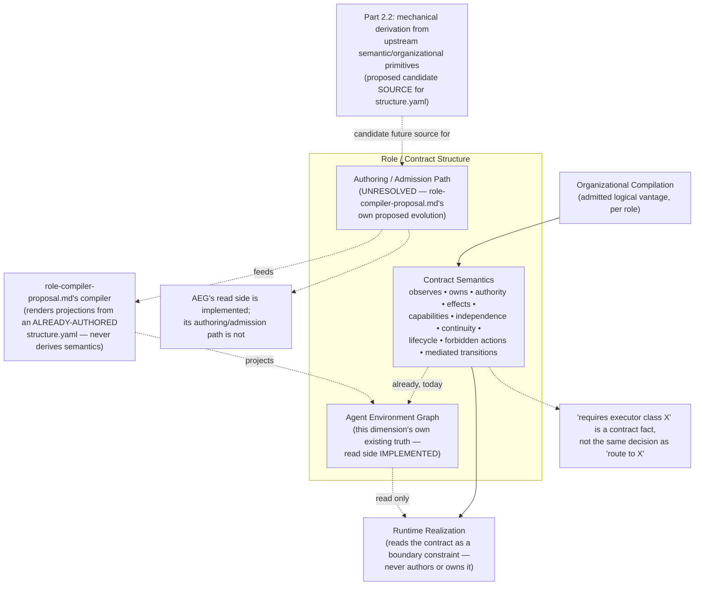

# Role and Contract Structure

> **Question:** Given an admitted semantic obligation and its organizational assignment, what logical contract must the role satisfy — independent of whichever runtime later realizes it?

## Purpose

This view shows Work Engine's **role/contract-structure dimension**: what a logical role must observe, own, decide, emit, mutate, and avoid, and what authority, continuity, and independence properties it must preserve — as **semantics**, not as any one artifact format that happens to express them.

The central rule:

> **A role's contract is a lowering consequence of already-admitted semantic and organizational meaning. It is never itself the place new semantic meaning gets authored, and its representation (a YAML file, a generated projection, a future IR) is never confused with the semantics it represents.**

This dimension sits between Organizational Compilation and Runtime Realization:

```text
Semantic Planning
    establishes obligations / consequences
        ↓
Organizational Compilation
    decides the logical vantages that realize them
        ↓
ROLE / CONTRACT STRUCTURE
    expresses what each logical role must observe, own,
    decide, emit, mutate, and avoid — independent of runtime
        ↓
Runtime Realization
    chooses concrete provider / model / harness / mechanisms
    that satisfy the contract
```

It does not own the obligation itself, which vantages exist, which executor class a role should route to, or which concrete provider realizes it.

---

## Diagram



---

## How to Read This View

Two things are easy to conflate and this page deliberately keeps separate throughout: **what a contract says** (semantics — owned here) and **how a contract gets authored or rendered** (representation and compilation — a lowering concern, not this dimension's own truth). The diagram shows both because both are real, but the "Authoring / Admission Path" box is drawn explicitly unresolved, not implemented, while the Agent Environment Graph's read side is drawn as this dimension's own already-real truth.

---

## 1. What This Dimension Owns

Independent of any runtime:

```text
what the role must observe
what state or artifacts it owns
what authority it may exercise, and its ceiling
what effects or mutations it may perform
what it consumes and what it emits
what transitions it may mediate
what it is forbidden from doing
what continuity requirement it has
what independence constraints apply to it
its lifecycle (when it begins, when its obligation ends)
```

This is the same list whether the eventual artifact is `docs/agent-environments.yaml`, a `structure.yaml`/`interface.yaml` pair, or some future intermediate representation. The representation is a lowering concern (§2); the list above is not.

---

## 2. Contract Semantics vs. Contract Representation

The architecturally important fact is never *which file format* expresses a role's contract. It is the semantic content in §1. Conflating the two risks exactly the failure `role-compiler-proposal.md`'s own structural invariants already guard against directly: "Single semantic ownership. Every semantic assertion has one canonical authored owner" and "No fabricated semantics. The compiler does not invent, paraphrase, or infer missing skill or role instructions." A representation change (YAML to IR, or one YAML shape to another) is not a semantic change, and a semantic change is never merely a representation change.

---

## 3. The Agent Environment Graph Is This Dimension's Own Truth, Not a Shared Substrate

**This was an open question carried over from `runtime-realization.md`, resolved here by direct evidence rather than by assumption in either direction.**

The test proposed for it: if Role/Contract Structure writes/defines semantic relations while Runtime Realization merely reads them, AEG belongs here, not as a substrate. Checked directly against both sides:

- `role-compiler-proposal.md`'s own text names AEG as the *existing* owner of exactly this dimension's content: "the compiler joins its role profile with shared catalogs to reproduce the expanded environment view... it must not create a second owner for relation semantics merely to avoid the current CLI boundary." Its canonical inputs are `docs/workflow-invariants.md` and `docs/agent-environments.yaml`; its own deterministic CLI parses and validates the catalogs and role vocabulary, resolves referenced closure, and renders role-scoped projections recording relations including `bound_by`, `may_invoke`, `may_observe`, `may_mutate`, `owns`, `consumes`, `emits`, `mediated_transitions`, and `forbidden_from` — precisely §1's own list, under different names, already real.
- `runtime-realization.md`'s own source document treats AEG the other way: "The canonical Agent Environment Graph describes role contracts and effective configured environments... The dynamic capability inventory may project into an operator or analysis view associated with that graph, but it must not mutate generated views or checked-in baseline configuration into runtime truth." Runtime Realization *reads* AEG as a boundary its realizations must satisfy. It never authors, validates, or owns any part of it.
- `work-engine-planned-architecture.md` independently confirms the asymmetry directly: "Agent Environment Graph / role-compiler-proposal.md (read side, IMPLEMENTED); an authoring/admission path back to those owners remains UNRESOLVED."

One dimension writes it (or at least owns its meaning, however it is currently authored); the other only reads it as an input, exactly the same relationship Semantic Planning's branch plan has to every dimension downstream of it. That is not the shared-substrate pattern (Context Observer is consumed independently and equally by two dimensions, neither of which owns it) — it is ordinary upstream/downstream ownership. **The Context Observer remains the only confirmed substrate; the Agent Environment Graph is Role/Contract Structure's own truth, currently partially implemented rather than fully proposed.**

---

## 4. Two Adjacent, Not Competing, Compilation Stages

Settled directly (Wave 1, `role-compiler-proposal.md` reconciliation) and restated here because this page is where it belongs canonically, not `organizational-compilation.md`:

```text
semantic obligation + required vantage + authority grant
+ independence constraints + available capabilities
+ current ExecutionEnvelope + system invariants
        ↓  (Part 2.2 — proposed, not yet built)
derived role-contract content, expressed in AEG's own
relation vocabulary (§1/§3) — a candidate SOURCE, not
a second renderer
        ↓  (feeds)
structure.yaml + interface.yaml + catalogs
        ↓  (role-compiler-proposal.md's compiler — proposed,
            bootstrap-experiment scoped)
generated SKILL.md + runtime requirements + validators +
environment projections + documentation
```

Part 2.2 proposes mechanically *deriving* a role contract's content from upstream primitives that precede any authored source at all. `role-compiler-proposal.md`'s own compiler renders projections from an *already-authored* `structure.yaml`, explicitly never deriving semantic content (its own invariant: "does not invent, paraphrase, or infer missing skill or role instructions"). These are adjacent pipeline stages. The real constraint, restated because it belongs to this dimension's own boundary, not merely to Part 2.2's text: any future derivation mechanism must express its output in AEG's existing relation vocabulary, never invent a parallel one.

---

## 5. Two Vocabularies Describing Similar Territory, Not Yet Mapped

**Named here as an open question, not resolved.** `deterministic-authority-projection-and-adaptive-organizational-topology.md`'s Part 2.1 proposes a role-primitive vocabulary — `vantage + authority + obligation + continuity + information access + effect boundary + capability requirements + independence constraints + lifecycle` — describing conceptually the same territory as AEG's own relation vocabulary (`bound_by` / `may_invoke` / `may_observe` / `may_mutate` / `owns` / `consumes` / `emits` / `mediated_transitions` / `forbidden_from`, §3 above). No document has yet mapped one onto the other field-by-field. Whether Part 2.1's primitives are a generative decomposition that AEG's relations are one possible *projection* of, or a genuinely independent vocabulary that would need its own reconciliation pass, is unresolved — this page states the gap rather than picking an answer it hasn't earned.

---

## 6. The Executor-Class-Routing Seam, Consistent With Runtime Realization's Own Framing

A role contract may legitimately state a requirement such as:

```text
requires: executor_class = independent_reviewer
requires: capability_set = [repository_read, shell_execution]
requires: independence = { from: implementation_author }
```

**That is a contract fact this dimension may own. It is not the same decision as "route this obligation to executor class X now," which `runtime-realization.md` §5 already names as an explicitly open seam** — whether that routing decision belongs to Role/Contract Structure, a distinct routing-policy authority, or Organizational Compilation remains unsettled there, and this page does not resolve it either. Stating a requirement and deciding how to satisfy it right now are kept distinct on purpose.

---

## 7. This Dimension's Own Compilation Has No Judgment Branch — an Asymmetry Worth Stating, Not Smoothing Over

Unlike Organizational Compilation's and Runtime Realization's own admission mechanisms (both instances of Candidate Resolution and Admission, with an explicit N-candidate judgment branch), `role-compiler-proposal.md`'s compiler is described as fully deterministic end to end: "The compiler core is deterministic, forward-only, and provider-neutral... An identical complete input closure... produces identical generated bytes... Regenerating an unchanged skill package produces no changes." There is no decision-owner step in the compilation pipeline as currently proposed.

This is not necessarily permanent. Part 2.2's own upstream-derivation direction (§4) reasons from semantic obligation, vantage, authority grant, and independence constraints — inputs that may not always determine one contract deterministically, in which case a judgment branch would need to exist somewhere in that derivation, not in the compiler itself. Whether such a branch is ever needed, and where it would live if so, is unresolved — flagged rather than assumed either way.

---

## Key Invariants

1. **Contract semantics are independent of contract representation.** A format change is never a semantic change.
2. **This dimension derives the contract consequences of already-established semantic and organizational meaning; it does not author new semantic meaning.**
3. **The Agent Environment Graph's read side is this dimension's own implemented truth; its authoring/admission path is not yet resolved.**
4. **Role-contract derivation and role-contract compilation/rendering are adjacent pipeline stages, not the same operation — and any derivation stage must express itself in the Agent Environment Graph's existing relation vocabulary, never a parallel one.**
5. **A contract requirement naming an executor class is not the same decision as routing to that class now — the routing decision's owner remains an open seam.**
6. **Determinism in the current compiler proposal is a property of what's proposed today, not a structural guarantee this dimension can never require judgment.**

---

## What This View Does Not Show

This page does not define:

- the semantic obligation a role's contract ultimately serves (`semantic-planning-hierarchy.md`);
- which logical vantages exist and how many (`organizational-compilation.md`);
- who owns executor-class routing (explicitly open, §6);
- concrete provider/model/harness selection (`runtime-realization.md`);
- the exact field-by-field mapping between Part 2.1's primitive vocabulary and AEG's relation vocabulary (§5, explicitly open);
- the full `structure.yaml`/`interface.yaml` schema or the bootstrap-migration procedure (see `role-compiler-proposal.md` directly);
- claim/evidence materialization of any of the above (`evidence-and-claims.md`).

---

## Relationship to Organizational Compilation

Organizational Compilation admits the logical vantage this dimension's contract belongs to (`organizational-compilation.md` §5, "role formation is compilation, not job-title assignment" — the same "semantic obligation → required vantage → logical role contract" chain this page's own §4 restates and grounds against real, partially-implemented machinery).

## Relationship to Runtime Realization

`runtime-realization.md` treats this dimension's output as a pure input: "a realization that cannot satisfy the role contract is invalid regardless of operator preference." That page's own open executor-class-routing seam (§5 there) is the same seam named here in §6 — carried consistently across both pages rather than resolved twice, differently.

## Relationship to Authority and Ownership

The authority, effect-boundary, and independence fields in §1 are this dimension's own concrete instance of `authority-and-ownership.md`'s general authority-projection model (§8–§11 there) — `child_authority ⊆ delegable(parent_authority)` applies to a role's contract exactly as it applies to any other authority grant.

---

## Related Architecture Views

- **`organizational-compilation.md`** — the upstream owner of which logical vantage this dimension's contract belongs to.
- **`runtime-realization.md`** — the downstream consumer that reads this dimension's contract as a boundary constraint, and the other end of the still-open executor-class-routing seam (§6).
- **`authority-and-ownership.md`** — the general authority-projection model this dimension's authority/effect/independence fields instantiate.
- **`evidence-and-claims.md`** — materializes facts about planning and organizational state; does not materialize role-contract truth, which this dimension owns directly.

---

## Source and Status

```yaml
architecture_status:
  design: accepted
  reconciliation: reconciled
  authorization: implementation_authorized
  implementation: implemented
  owner: app-server/docs/workflow-invariants.md, app-server/docs/agent-environments.yaml
  status_as_of: 2026-09-16
```

This default describes §1 and §3's read side specifically — the Agent Environment Graph's existing role vocabulary, catalogs, and generated projections, confirmed real per `work-engine-planned-architecture.md`'s own "read side, IMPLEMENTED" finding. It does **not** describe how new contracts get authored, derived, or admitted — that is where every override below lives.

```yaml
status_override:
  design: proposed
  reconciliation: reconciled
  authorization: design_work_authorized
  implementation: partial
  source: app-server/docs/role-compiler-proposal.md
```

Applies to §2 and §4's compilation-pipeline description (`structure.yaml`/`interface.yaml` → compiler → projections). `role-compiler-proposal.md`'s own Status header: "Concept proposal... Architecture candidate; canonical ownership has not migrated." `authorization: design_work_authorized` is explicitly bounded — per `work-engine-planned-architecture.md`'s own table, "Bootstrap experiment scoped, not yet authorized beyond the sterile slice-builder migration." `implementation: partial` for the same reason: the bootstrap experiment itself, not the full authoring/admission path.

```yaml
status_override:
  design: proposed
  reconciliation: reconciled
  authorization: exploration_only
  implementation: none
  source: app-server/ideas/pending/deterministic-authority-projection-and-adaptive-organizational-topology.md
```

Applies to §4's Part 2.2 discussion (mechanical derivation from upstream primitives) and §7's asymmetry observation about that direction. Reconciled against `role-compiler-proposal.md` directly in Wave 1; no acceptance decision has been made.

```yaml
status_override:
  design: exploratory
  reconciliation: not_applicable
  authorization: exploration_only
  implementation: none
  source: app-server/ideas/pending/deterministic-authority-projection-and-adaptive-organizational-topology.md
```

Applies to §5 (the Part 2.1-to-AEG vocabulary mapping) and §6's routing-seam statement specifically as it pertains to this dimension's own side of that seam — genuinely open, not merely unaccepted.
