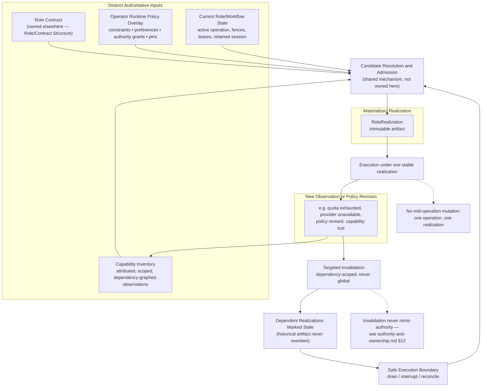

# Runtime Realization

> **Question:** Given an accepted executor/runtime requirement for a logical role, which concrete provider, harness, model, and mechanism composition is currently admissible — and how does Work Engine keep executing under one stable realization while runtime conditions keep changing underneath it?

## Purpose

This view shows Work Engine's **runtime-realization dimension**: the durable, immutable artifact binding a logical role to a concrete provider, harness, model, transport, and mechanism composition, derived from a changing capability environment and a versioned operator policy overlay.

The central rule:

> **Freeze each admitted realization, not its validity forever.** A failed dependency can make a realization stale without changing what it meant while it was in use, and without granting anyone new authority merely because the old realization broke.

This dimension owns capability observation, operator runtime policy, resolution of concrete runtime composition, the immutable `RoleRealization` artifact itself, its invalidation, and its rematerialization. It does **not** own what a logical role is required to do (Role/Contract Structure), which executor class an obligation should route to (owned by `execution-strategy-selection.md`, admitted 2026-09-27 — §5), organizational topology, or semantic planning.

---

## Diagram



---

## How to Read This View

Four inputs feed one resolution step, producing one immutable artifact that execution runs under until an observation or policy change invalidates it — at which point the same resolution step runs again, at a safe boundary, against the *same* authority ceiling. Nothing in this loop is a special case: rematerialization after invalidation is an ordinary run of the same mechanism that produced the original realization, not a separate failover path.

---

## 1. Distinct Authoritative Inputs, Owned Separately

A materialized realization is derived from inputs with different owners and lifetimes, which must not collapse into one runtime configuration object.

**Role contract** — declares semantic requirements, effect ceilings, continuity requirements, and evidence obligations without naming a specific provider ("Builder requires: streaming inference, shell tool execution, interruptible execution, observable context transition, durable raw evidence"). **Not owned by this dimension.** It belongs to Role/Contract Structure, which does not yet have its own page — this dimension only consumes it as an input, and a realization that cannot satisfy the contract is invalid regardless of operator preference.

**Operator runtime policy overlay** — a versioned, attributable input controlling the valid interior role contracts leave open. Four distinct kinds of setting, deliberately kept separate: *constraints* (permitted/prohibited providers, transports, review classes, tools), *preferences* (ranking among admissible candidates), *authority grants* (bounded, delegated permission for cost, provider use, or evidence custody), and *pins* (retain a specific realization or route until released or made impossible). "Prefer Claude" is not the same kind of setting as "never use a paid API" — collapsing these categories loses the distinction between what's ranked and what's forbidden.

**Capability inventory** — a dependency graph, not a feature list (§2), of what the current environment can actually provide.

**Current role and workflow state** — active operation identity, context lifecycle, leases, fences, and reconciliation obligations. A candidate may be semantically admissible and still unavailable until active work drains or a successor context is established.

---

## 2. Capability Inventory as a Dependency Graph

The inventory preserves dependencies and semantic differences rather than flattening them:

```text
codex-app-server/0.149.1
    +-- model-access/openai/account-A
    +-- turn-streaming
    +-- turn-interrupt
    +-- shell/harness-native
    +-- approval-routing/codex
    +-- context-transition/new_context

claude-code/runtime-X
    +-- model-access/anthropic/subscription-B
    +-- native-tools
    +-- native-context-lifecycle
    +-- native-session-continuity
```

Dependency identity must be scoped precisely (provider, credential, model, endpoint, workspace, runtime version, transport, time window) — a quota observation for one credential must not globally invalidate `anthropic.access`. Dependency edges state the exact predicate relied upon, not a vaguely named feature, so invalidation can be targeted and historical admission stays explainable.

---

## 3. Capability Facts Are Attributed Observations

At minimum: `configured`, `discovered`, `probed`, `observed`, `superseded`, `invalidated`, `unknown`. Every observation carries identity, scope, generation, source, and validity:

```text
identity: codex/openai/account-A/provider-access
state: available
generation: 184
observed_at: 2026-09-05T21:42:17-06:00
source: runtime_handshake
scope: runtime=codex-runtime-0.153, credential=account-A, model=gpt
```

A failure produces an attributed observation first. The owner of the capability's own semantics — or an admitted deterministic policy — then determines which scoped fact that observation supersedes. An unexpected failure must never automatically become a global capability conclusion.

**This inventory is dimension-owned, not a shared substrate.** Checked directly: unlike the Context Observer (consumed independently by both Context Lifecycle and Organizational Compilation), nothing outside this dimension currently consumes capability observations. It stays local rather than being promoted.

---

## 4. Resolution and Admission Reuse Candidate Resolution and Admission

**This dimension's own resolution step is not a bespoke algorithm.** It is one instance of the cross-cutting **Candidate Resolution and Admission** mechanism — named 2026-09-16 after this exact shape turned up independently here and in `organizational-compilation.md`'s already-accepted admission mechanism, before either was recognized as the same thing:

```text
candidate realizations
        ↓
AVAILABLE   — reject candidates that fail requirements or exceed ceilings;
              test dependency validity against current capability generation
        ↓
AUTHORIZED  — apply explicit prohibitions and budget bounds from the
              operator policy overlay
        ↓
REQUIRED    — rank candidates when policy defines a complete, unambiguous
              ordering; compute whatever is already determined by known
              inputs
        ↓
surviving candidates
        ├── 0 → explicit gap (no admissible realization)
        ├── 1 → mechanically determined, no judgment needed
        └── N → a decision owner (supervisor, another authorized role,
                the operator, or the human owning budget/product
                authority) resolves the remainder — review independence,
                evidence strength, continuity loss, latency, a new
                cost/authority tradeoff — none of which the mechanism
                itself may decide
        ↓
materialize and admit the exact realization
```

The mechanism reduces and validates the candidate space. It never owns the meaning of what survives the reduction — see `authority-and-ownership.md` §12.

---

## 5. Executor-Class Routing: a Closed Seam This Dimension Only Consumes

The source document names an explicit three-stage pipeline. This is a **ruling**, not an open question (`Ruling 2026-09-15, revised 2026-09-15`, resolving seam `routing.vs.admission`, previously left open by `architecture-direction-synthesis.md` §2.1):

```text
contract characterization                executor-class routing /              runtime resolution / admission
(implementation-contract-compilation.md:  acceptance                            (THIS DIMENSION: given the
which executor classes are semantically   (execution-strategy-selection.md,      accepted class plus current
supported, with what evidence-backed      admitted 2026-09-27: which             capabilities and policy,
readiness — plan readiness only,          supported class -- if any -- is        which exact model/provider/
no slice authority)                       warranted now -- a nomination,         harness/tool realization is
                                           advisory until accepted for the        admitted now?)
                                           slice)
```

This dimension is squarely the third stage. It consumes the first two stages' outputs as authoritative given facts:

> **Runtime Realization consumes an accepted executor/runtime requirement or routing nomination. It does not own the upstream semantic reason that class was requested.**

**Closed 2026-09-15, and now homed 2026-09-27 — not an open seam of this dimension's own.** An earlier draft of this section restated the second stage's ownership as a live three-way question among Role/Contract Structure, a distinct routing-policy authority, and Organizational Compilation. That was a regression, not a fresh finding: the source document's own ruling already named an owner class — "the supervisor / routing-policy authority" identified in `proposal-decision-gated-implementation-compilation.md`'s own Implementation Track, "Stage 6: Adaptive routing" — and nothing in this session's work supersedes that ruling. `execution-strategy-selection.md`, admitted 2026-09-27, is that owner for the second stage's routing/warrant judgment and its advisory nomination — never for the acceptance/refusal consequence, which remains the appropriate separately authorized authority's own act, exactly as it did before this admission: the canonical dimension now architecturally homing that residual judgment the ruling had only named. Restated correctly, and now precisely attributed rather than left as "decision-gated compilation" generically: the first stage belongs to `implementation-contract-compilation.md` (confirmed 2026-09-16, not `role-and-contract-structure.md` or Organizational Compilation), the second belongs to `execution-strategy-selection.md`, and this dimension owns only the third. See `work-engine-planned-architecture.md` §13 item 12 for the ruling's full text and `role-and-contract-structure.md` §6 for the corresponding correction there.

---

## 6. Materialized Realization: an Immutable Artifact, Never a Standing Decision

```text
RoleRealization: builder-7/realization-f83c1

role_contract: builder-v12
policy_overlay_revision: runtime-policy-42
capability_inventory_generation: 381
provider_turn: owner = codex_harness
harness_runtime: implementation = codex_app_server
tools: owner = codex_harness
context_transition: implementation = codex.new_context
cancellation: implementation = codex.turn.interrupt
approval: implementation = codex.approval
raw_evidence: source = codex_app_server_events
dependencies:
    codex.runtime            @ generation 31
    openai.account-A.access  @ generation 184
decision: owner = slice-supervisor, authority = ..., evidence = ...
```

Binds role/instance/generation identity, requirements and contract identity, policy-overlay revision, capability-inventory generation and exact dependency observations, selected provider/harness/model/transport/mechanism identities, unsupported or explicitly omitted capabilities, decision owner and authority evidence where judgment was required, and safe-boundary admission evidence. The artifact itself never mutates — it remains valid, becomes stale, or becomes historical.

**Restored citation, 2026-09-16 — `provider_turn` and `harness_runtime` are ownership assignments over externally-defined port contracts, not this dimension's own invention.** `provider-turn-harness-runtime-and-operator-projection.md` defines what a `provider_turn: owner = X` or `harness_runtime: implementation = Y` assignment obligates its owner to actually do (§2 `ProviderTurnPort`: request preparation, streaming observations, cancellation, capability discovery, raw-evidence custody; §3 `HarnessRuntimePort`: session realization, native tools, sandbox/approval mechanics, native context-transition mechanisms, restart/reconciliation evidence) — the same "concrete provider/harness implementation details for any specific runtime" this dimension's own §11 ("What This View Does Not Show") already, correctly, declines to define itself. This is a pre-existing, already-confirmed alignment (`architecture-direction-seam-map.md`'s `ports.companion-binding` seam, `ALIGNED`, predating this session: each document names the other as its explicit companion — ports §13: capability-resolution "owns observation, policy, admission, invalidation, and successor-realization semantics above these ports"; capability-resolution §12: "this mechanism complements the independently replaceable ports"), simply not carried forward when this page was rebuilt from `pre-indexed-capability-resolution-and-frozen-runtime-realization.md` alone. Neither port participates in resolution or admission (§4) — both only supply capability observations consumed as inputs and execute an already-admitted realization, exactly as `provider-turn-harness-runtime-and-operator-projection.md` §1 states directly: "Port implementations supply mechanisms and observations. They must not acquire \[Work Engine's\] authorities merely because they expose a convenient session, router, event schema, or user interface."

---

## 7. Invalidation Never Mints Authority

When an authoritative dependency changes, dependent realizations are marked stale — targeted by dependency propagation, never blanket:

```text
openai.account-A.access INVALID
        +-- reviewer-2 realization STALE
        +-- builder-7 realization STALE
        +-- supervisor-3 unaffected
```

Staleness means a realization may not be silently reused for a newly admitted operation. It does not rewrite the historical artifact and does not necessarily interrupt in-flight work. This is the exact shape `authority-and-ownership.md` §12 now states generally: invalidation cannot by itself increase cost authority, weaken an independence requirement, change evidence custody, change context continuity, expand tool or mutation authority, or substitute one review class for another. The response to invalidation (drain, interrupt, or reconcile) is derived from owned contracts and current state, not from an exhaustive table of anticipated failure names.

---

## 8. Rematerialization Instead of a Predefined Failover Graph

Failover is an ordinary consequence of invalidation plus a fresh run of §4's mechanism — not a special routing graph:

```text
stale realization
        ↓
current role requirements + current policy overlay
+ current capability inventory + current role/workflow state
        ↓
Candidate Resolution and Admission (§4), run again
        ↓
new immutable realization
```

The successor might use a different provider entirely, the same provider under different credentials, or nothing at all. Work Engine does not predict that outcome when admitting the original realization — the operator policy's `failover` section constrains or suggests the candidate space and required decision behavior; it does not pre-admit a concrete successor graph.

**A nested substrate implements this shape today, one layer below `RoleRealization` itself — checked directly, 2026-09-16, and deliberately not conflated with the dimension's own artifact.** `ExecutableGenerationManager#advance` (`app-server/src/executable-generation-manager.mjs:367-475`) runs snapshot → build → validate → activate against the App Server host process itself: on success it disposes the stale `harness_runtime` process only after its successor is active, and on a fingerprint mismatch it fails closed into `bootstrap_restart_required` or `environment_migration_required` rather than guessing. This is rematerialization-shaped, and real. It is **not**, however, an implementation of this section's own rematerialization step: it never re-runs Candidate Resolution and Admission (§4) against current role requirements, policy overlay, and capability inventory, and it never chooses a different provider, harness, or model — it only replaces the concrete process instance realizing whichever `harness_runtime` a `RoleRealization` already named. `RoleRealization`'s own rematerialization, as this section describes it, remains unbuilt; what exists is a substrate-level analogue underneath it, not an instance of it.

---

## 9. Safe Execution Boundaries

Dynamic resolution must never mean mid-operation mutation. A provider turn, tool operation, lifecycle transition, or other admitted operation executes under one stable realization from start to finish:

```text
operation executing under realization A
        ↓
runtime or policy change observed
        ↓
operation drains, terminates, or is reconciled under A
        ↓
A and its dependent facts marked stale
        ↓
return to safe Work Engine boundary
        ↓
realization B admitted; next operation executes under B
```

Switching provider or harness may require a successor context or execution identity rather than reuse of the prior provider thread — Work Engine must not splice incompatible runtimes into one logical operation.

**Confirmed implemented, 2026-09-16, at the executable-generation substrate layer.** `ExecutableGenerationManager.openAdmission` (`app-server/src/executable-generation-manager.mjs:160-187`) binds every admitted turn to the currently active generation and refuses new generation-bound admission once a reload is fenced (`reload_fence_active`, lines 164-170). `requestReload` (lines 260-319) installs that in-memory fence — `this.reload = context`, line 298, with its own comment that "the in-memory fence must exist before the first durable write yields" — *before* the first durable write (`store.beginReload`, line 300), then transitions to `draining` and calls `#advanceIfDrained` (lines 321-338), which blocks until `this.admissions.size === 0`. Only after that global quiescence does `#advance` (§8, above) snapshot, build, validate, and activate the successor; the predecessor is disposed and its retirement recorded (lines 491-499) only after the successor is active and the fence is released. This is a real, tested instance of exactly this section's own sequence — admit under A, observe the change, drain A to a safe boundary, admit B — applied to the host process rather than to a role's provider selection.

---

## 10. Realization Identity Reuses Revision/CAS Lineage, Not a New Mechanism

Every execution record identifies the exact realization it used. After rematerialization, the successor names its predecessor and the reason for transition:

```text
role: builder-7
operation: turn-19
realization: realization-a912e
predecessor_realization: realization-f83c1
transition_reason: openai.account-A.access invalidated
```

This is a third confirmed instance of the predecessor-chained, generation-tracked pattern already shared by branch-plan revisions and claim revisions — not something this dimension needed to invent. Reconciliation should be able to reconstruct which mechanisms were used, what requirements and policy applied, what capabilities Work Engine believed existed and on what evidence, what made a realization stale, and who owned and authorized its successor.

**This citation upgrades from proposed to partially implemented, 2026-09-16 — at the executable-generation substrate layer, not yet for `RoleRealization` itself.** `executable-generation-store.mjs` carries the identical shape as real, durable code: `beginReload({reloadId, requestedByTurnId, predecessorGenerationId})` (lines 204-239) names the exact predecessor generation a reload is prepared against and rejects the write if `state.activeGeneration?.generationId !== predecessorGenerationId` (line 213); `activate({reloadId, expectedActiveGenerationId, successor})` (lines 292-338) re-checks that same expected identity immediately before publishing the successor (lines 300-302, `"active generation changed before activation"` on mismatch) and increments a durable `revision` counter on every write. `recordPredecessorRetirement` (lines 431-458) durably records the outcome of retiring the predecessor. This is a real compare-and-swap over an explicit predecessor/successor chain — this section's own pattern, working, for the executable substrate that realizes a `RoleRealization`'s `harness_runtime`. It is not yet evidence that `RoleRealization`'s own lineage (`predecessor_realization`, `transition_reason`, as sketched above) is implemented — that remains this dimension's own unbuilt artifact, one layer up from what is verified here.

---

## 11. The Operator Policy Overlay Is a Control Surface, Not Canonical Truth

The overlay is scoped hierarchically (global → workflow/campaign → role class → role instance/obligation → one operation); a narrower preference may override a broader preference, never a role contract, a stronger prohibition, an authority boundary, or an unavailable capability. A UI may project candidate states (`selected`, `preferred`, `admissible`, `requires_operator_approval`, `prohibited`, and similar) as a view over owned contracts, policy, and observations — it must not itself become the resolver, and it must not directly mutate the active adapter, provider thread, runtime session, or realization.

**Confirmed 2026-09-16, by architectural synthesis, as this dimension's own real, partial instance of `mechanisms/authority-preserving-intent-projection.md`**: this paragraph was written independently, with no cross-reference to Studio or its own reconciliation, yet follows the identical shape (expose bounded candidates, never resolve, never mutate directly) that mechanism was later confirmed against as a second, independent consumer. This dimension owns the concrete policy content being projected; the mechanism owns the discipline that keeps the projection from becoming a second resolver.

---

## 12. Fenced Active-Binding: This Dimension's Own Exclusivity Concern, Consuming a Shared Mechanism

**Added 2026-09-16, resolving a gap named but not owned anywhere**: `control-plane-and-client-protocol-reconciliation.md` distinguishes "realization admission" (this dimension's own §4 — determines what may run) from "active-binding fence" (determines which admitted realization currently has authority to run as this role) and found no document owned the latter. Resolved by architectural synthesis: this dimension owns the *domain decision* — which realization generation currently holds authoritative right to execute as a given logical role instance — while `mechanisms/resource-lease-and-fencing.md` owns the *fencing mechanics* that make that decision race-safe and host-enforced, the same relationship this dimension already has to Candidate Resolution and Admission (§4) and Revision/CAS (§10).

```text
RoleRealization generation N exists (this dimension's own artifact, §6)
        ↓
acquire lease: resource = logical-role-instance:<id>:active-binding
        ↓ (mechanisms/resource-lease-and-fencing.md)
fencing generation F
        ↓
generation N may execute as the role
        ↓
generation N+1 supersedes N (this dimension's own rematerialization, §8)
        ↓
N+1 acquires fencing generation F+1
        ↓
N may remain alive physically, but F is stale
        ↓
N can no longer exercise role authority
```

This is stronger than the informal "kill the old realization" framing this dimension's own §9 (Safe Execution Boundaries) might otherwise suggest in isolation — active-binding fencing makes authority revocation enforceable by the host, not merely cooperative, and composes cleanly with rematerialization (§8): a successor's activation never requires pretending its predecessor ceased to exist, only that its predecessor's authority became unenforceable. Accepted for implementation 2026-09-14; the `role-active-binding-slot` resource type does not exist in `workspace-coordination`'s real `RESOURCE_TYPES` enum yet, so this remains a named, authorized gap, not yet built.

---

## Key Invariants

1. **Freeze each admitted realization, not its validity forever.**
2. **Role contract, operator policy, capability inventory, and current role/workflow state are four separately owned inputs — never one collapsed configuration object.**
3. **A realization that cannot satisfy the role contract is invalid regardless of operator preference.**
4. **Resolution and admission reuse the Candidate Resolution and Admission mechanism — it is not this dimension's own bespoke algorithm.**
5. **Invalidation is targeted by dependency scope, never blanket, and never mints authority (`authority-and-ownership.md` §12).**
6. **A materialized realization never mutates; it remains valid, becomes stale, or becomes historical.**
7. **One operation executes under exactly one stable realization — no mid-operation mutation.**
8. **Rematerialization after invalidation is an ordinary rerun of resolution and admission, not a special failover path or a predefined graph.**
9. **Realization identity is an instance of the shared revision/CAS lineage pattern, not a new mechanism.**
10. **The operator policy overlay is a manipulable control surface; it is not canonical workflow or runtime truth.**
11. **This dimension consumes an accepted executor/runtime requirement or routing nomination; it does not own the upstream semantic reason that class was requested (§5, closed by ruling — owned by `execution-strategy-selection.md`, admitted 2026-09-27, not this dimension).**
12. **Which realization generation currently holds authoritative active-binding is this dimension's own decision; the fencing mechanics that make it race-safe and host-enforced belong entirely to `mechanisms/resource-lease-and-fencing.md` (§12).**
13. **The operator policy overlay projects bounded candidate states; it never becomes the resolver — a real, partial instance of `mechanisms/authority-preserving-intent-projection.md` (§11).**

---

## What This View Does Not Show

This page does not define:

- role/contract semantics (`role-and-contract-structure.md`);
- executor-class routing / acceptance itself (the composite stage; routing/warrant belongs to `execution-strategy-selection.md`, acceptance to a separately authorized authority, per the ruling recorded in §5);
- organizational topology or admission (`organizational-compilation.md`);
- semantic planning or replanning (`semantic-planning-hierarchy.md`);
- claim/evidence materialization (`evidence-and-claims.md`);
- the exact revision/CAS mechanics this dimension reuses (`mechanisms/revision-cas-and-publication.md`, not duplicated here);
- context-lifecycle transition fencing mechanics, beyond noting this dimension's own safe-boundary requirement composes with them;
- the resource-lease/fencing mechanics that make active-binding exclusivity race-safe (`mechanisms/resource-lease-and-fencing.md`, §12 — consumed here, not duplicated);
- concrete provider/harness implementation details for any specific runtime.

---

## Relationship to Role/Contract Structure

`role-and-contract-structure.md` is the upstream owner of what this dimension calls "role contract" throughout — the semantic requirements, effect ceilings, and continuity requirements a realization must satisfy. This dimension never redefines those; it only tests candidate realizations against them.

## Relationship to Execution Strategy Selection

`execution-strategy-selection.md`, admitted 2026-09-27, owns the routing/warrant judgment and its advisory nomination within stage 2 of the `routing.vs.admission` pipeline (§5, above) — never the acceptance/refusal consequence, which remains a separately authorized authority's own act: given ICC's own `Supported(C,X)` fact, revision-bound capability/outcome evidence, and an applicable `RoutingPolicy` revision, which supported class — if any — is warranted now. This dimension consumes only that dimension's own advisory routing nomination, once separately accepted, as an authoritative given fact — it never owns or re-derives the upstream semantic reason a class was requested. That dimension's own `RoutingPolicy` ownership is modeled directly on this dimension's own Operator Runtime Policy Overlay (§1, above) and Key Invariants 10/13: a dimension may own a policy overlay's content as domain state without ever holding the authority to author it. `RoutingPolicy` never reaches downstream into this dimension's own concrete provider/model/harness/tool selection — that remains entirely this dimension's own territory.

## Relationship to Authority and Ownership

`authority-and-ownership.md` §12's invalidation-never-mints-authority invariant was generalized directly from this dimension's own §7, alongside Evidence/Claims' equivalent. The observe/nominate/decide/admit/execute vocabulary that dimension defines is exactly what §4's decision-owner step and `execution-strategy-selection.md`'s own routing judgment (§5, above) both depend on.

## Relationship to Organizational Compilation

`organizational-compilation.md`'s own admission mechanism and this dimension's §4 are the same Candidate Resolution and Admission mechanism, independently arrived at, now named once rather than described twice.

## Relationship to Resource Lease and Fencing

This dimension owns the domain decision (§12: which realization generation currently holds authoritative active-binding); `mechanisms/resource-lease-and-fencing.md` owns the fencing mechanics that enforce it. Same division of labor this dimension already has with Candidate Resolution and Admission (§4) and Revision/CAS (§10) — a mechanism supplies a reusable shape, never the domain meaning.

## Relationship to Authority-Preserving Intent Projection

The operator policy overlay (§11) is this mechanism's own real, partial instance — this dimension owns the concrete policy content projected; the mechanism owns the discipline that keeps a UI projection from becoming a second resolver or mutating the active realization directly.

## Relationship to Provider Turn, Harness Runtime, and Operator Projection

**Restored 2026-09-16.** `provider-turn-harness-runtime-and-operator-projection.md` is this dimension's own already-confirmed companion source (`ports.companion-binding`, `ALIGNED`), not merely an adjacent idea: its `ProviderTurnPort` and `HarnessRuntimePort` define the execution-time contracts a `provider_turn`/`harness_runtime` ownership assignment in §6's `RoleRealization` artifact obligates its owner to satisfy — domain detail this dimension intentionally consumes without redefining, the same relationship this dimension already has to Role/Contract Structure's own "role contract." Its third port, `OperatorProjection`, is not this dimension's own territory and was not folded in here — its own responsibilities (discovery, bounded-intent submission, lifecycle feedback) are `mechanisms/authority-preserving-intent-projection.md`'s confirmed precursor instead. Active-binding fencing (this dimension's own §12, consuming `mechanisms/resource-lease-and-fencing.md`) is a separate concern `control-plane-and-client-protocol-reconciliation.md` found while evaluating `OperatorProjection`, not a piece of `OperatorProjection`'s own scope split off — that document states directly that "`OperatorProjection` projects lease/fence state for display and control but does not claim to mint it" and that "operator clients are orthogonal to this gap, not part of it."

---

## Related Architecture Views

- **`authority-and-ownership.md`** — the observe/nominate/decide/admit/execute vocabulary this dimension's decision-owner step depends on, and the invalidation invariant (§12) generalized partly from this page.
- **`organizational-compilation.md`** — the sibling instance of Candidate Resolution and Admission; §5's ruling confirms executor-class routing belongs to neither this dimension nor that one.
- **`mechanisms/candidate-resolution-and-admission.md`** — the mechanism itself, citing this dimension's §4 as one of its three confirmed instances.
- **`role-and-contract-structure.md`** — owns what this dimension calls "role contract" throughout; that page's own §6 carries the corresponding correction to §5's ruling.
- **`implementation-contract-compilation.md`** — owns stage 1 (contract characterization) of §5's own three-stage pipeline, precisely, not this dimension and not Role/Contract Structure.
- **`execution-strategy-selection.md`** — owns the routing/warrant judgment and its advisory nomination within stage 2 (the historical composite "executor-class routing / acceptance" stage) of §5's own three-stage pipeline, admitted 2026-09-27; acceptance itself remains a separately authorized authority's own act. This dimension consumes only its accepted advisory nomination, never its upstream judgment; the source of this dimension's own `RoutingPolicy`-ownership precedent.
- **`semantic-planning-hierarchy.md`** — upstream of the entire pipeline in §5.
- **`evidence-and-claims.md`** — the sibling dimension whose refresh lifecycle independently converged on the same invalidation shape as this page's §7.
- **`context-lifecycle.md`** — another consumer, alongside this dimension, of the revision/CAS mechanism and the transition-fencing mechanism; owns none of them, same as this page.
- **`mechanisms/transition-fencing-and-leases.md`** — the mechanism itself; this dimension's own safe-execution-boundary requirement (§9 above) composes with it.
- **`mechanisms/revision-cas-and-publication.md`** — the mechanism itself; `RoleRealization`'s own lineage (§10) remains a proposed, not-yet-implemented instance, now with a partially implemented nested instance at the executable-generation substrate layer (§9, §10, above).
- **`provider-turn-harness-runtime-and-operator-projection.md`** — this dimension's own already-confirmed companion source for `ProviderTurnPort`/`HarnessRuntimePort` (domain detail this dimension consumes); its third port, `OperatorProjection`, is not this dimension's territory — it is `mechanisms/authority-preserving-intent-projection.md`'s own confirmed precursor instead, with active-binding fencing (`mechanisms/resource-lease-and-fencing.md`, this dimension's own §12) a separate, orthogonal concern the same reconciliation happened to surface, not a piece of `OperatorProjection` split off.
- **`mechanisms/resource-lease-and-fencing.md`** — the mechanism this dimension's own active-binding decision (§12) consumes for its fencing mechanics; citing this dimension as its second confirmed instance.
- **`mechanisms/authority-preserving-intent-projection.md`** — the mechanism this dimension's own operator policy overlay (§11) is a confirmed, partial instance of.

---

## Source and Status

```yaml
architecture_status:
  design: proposed
  reconciliation: reconciled
  authorization: exploration_only
  implementation: partial
  owner: app-server/ideas/pending/pre-indexed-capability-resolution-and-frozen-runtime-realization.md
  status_as_of: 2026-09-16
```

`design: proposed`, not `exploratory` — the source document's own text includes a real, dated ruling ("Ruling 2026-09-15, revised 2026-09-15," resolving seam `routing.vs.admission`, sharpened again after a follow-up review) showing this shape has survived direct scrutiny, even though no explicit acceptance decision has been made. `reconciliation: reconciled` — including §5, which was found on 2026-09-16 to have quietly restated the closed `routing.vs.admission` seam as open (a regression introduced while writing this page, not a property of the source document) and has since been corrected to match the source's own ruling directly. `authorization: exploration_only`, per that document's own Authority line: "Exploratory only... does not amend the migration roadmap, admit a runtime, grant budget or provider authority, or authorize implementation."

**Companion source restored 2026-09-16**: `app-server/ideas/pending/provider-turn-harness-runtime-and-operator-projection.md` is a second direct provenance source — a co-source for this page's `provider_turn`/`harness_runtime` contract fields (§6), not a second architectural authority for what this dimension owns — not a newly found relationship, but a pre-existing, already-`ALIGNED` companion-binding seam (`architecture-direction-seam-map.md`) that this page's own rebuild from `pre-indexed-capability-resolution-and-frozen-runtime-realization.md` alone simply failed to carry forward. Its `exploration_only` authority ceiling and `proposed` design status match this page's own values exactly, so no status axis changes — only the `owner` field's completeness. This page remains the sole canonical owner of Runtime Realization's architectural truth; the ports document is authoritative only about what its own port contracts say, and this page consumes that as domain detail.

```yaml
status_override:
  implementation: implemented
```

Applies narrowly to the concrete precursor pieces the source document itself names as already real (§12 there): pinned Codex capability negotiation (one real inventory adapter), the runtime manifest and compiled role environments, and the role binding registry. None of these is the complete materialized-realization architecture this page describes — each is a partial precursor the eventual design should feed from and reference, not become.

**Strengthened 2026-09-16, by direct code verification, not restated from the source document.** The precursor list above understated what already exists: `app-server/src/executable-generation-manager.mjs` and `executable-generation-store.mjs` implement, as real and tested code, the safe-execution-boundary sequence of §9 (generation-bound admission, a fence installed before the first durable write, drain to zero active admissions, then activate) and the revision/CAS lineage of §10 (`beginReload`'s predecessor CAS, `activate`'s expected-identity CAS, a durable revision counter, predecessor-retirement receipts) — see §9 and §10 above for exact citations. This is substantive, not merely a "precursor piece" in the earlier sense of static configuration or a registry. It applies to the executable substrate that realizes a `RoleRealization`'s `harness_runtime`, not to `RoleRealization` resolution or rematerialization through Candidate Resolution and Admission (§4/§8), which remain unbuilt, and it says nothing about §12's fenced active-binding, addressed separately below.

```yaml
status_override:
  design: accepted
  reconciliation: reconciled
  authorization: implementation_authorized
  implementation: none
  source: app-server/docs/control-plane-and-client-protocol-reconciliation.md
```

**Added 2026-09-16.** Applies to this page's own §12 (fenced active-binding) specifically — a genuine exception to the page default, confirmed by direct citation: `control-plane-and-client-protocol-reconciliation.md`'s own Acceptance section states "Accepted 2026-09-14 ... Implementation of the stated residue — fenced active-binding coordination for logical role instances — is authorized to proceed." `implementation: none` because the `role-active-binding-slot` resource type this decision depends on does not exist in `workspace-coordination`'s real `RESOURCE_TYPES` enum yet.
