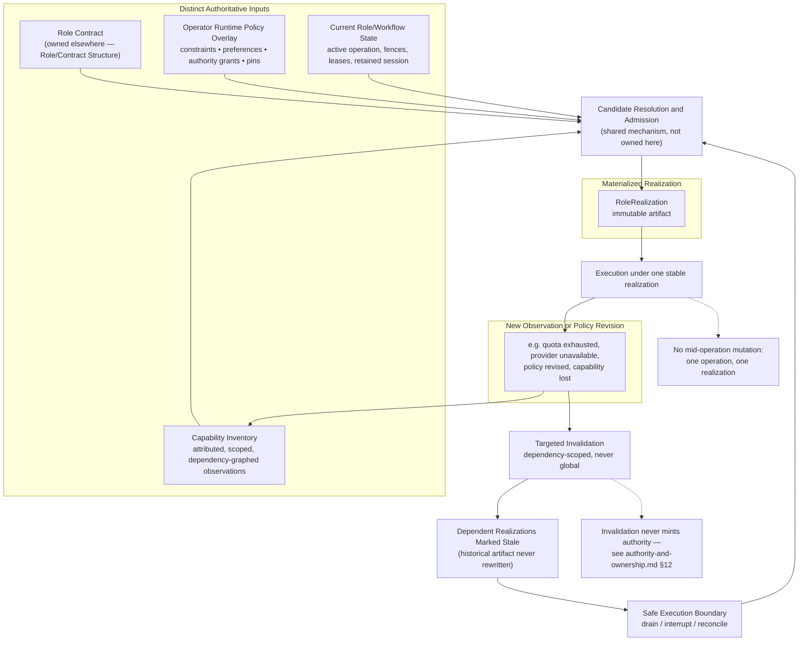

# Runtime Realization

> **Question:** Given an accepted executor/runtime requirement for a logical role, which concrete provider, harness, model, and mechanism composition is currently admissible — and how does Work Engine keep executing under one stable realization while runtime conditions keep changing underneath it?

## Purpose

This view shows Work Engine's **runtime-realization dimension**: the durable, immutable artifact binding a logical role to a concrete provider, harness, model, transport, and mechanism composition, derived from a changing capability environment and a versioned operator policy overlay.

The central rule:

> **Freeze each admitted realization, not its validity forever.** A failed dependency can make a realization stale without changing what it meant while it was in use, and without granting anyone new authority merely because the old realization broke.

This dimension owns capability observation, operator runtime policy, resolution of concrete runtime composition, the immutable `RoleRealization` artifact itself, its invalidation, and its rematerialization. It does **not** own what a logical role is required to do (Role/Contract Structure), which executor class an obligation should route to (an explicitly open seam, §5), organizational topology, or semantic planning.

---

## Diagram



---

## How to Read This View

Four inputs feed one resolution step, producing one immutable artifact that execution runs under until an observation or policy change invalidates it — at which point the same resolution step runs again, at a safe boundary, against the *same* authority ceiling. Nothing in this loop is a special case: rematerialization after invalidation is an ordinary run of the same mechanism that produced the original realization, not a separate failover path.

---

## 1. Distinct Authoritative Inputs, Owned Separately

A materialized realization is derived from inputs with different owners and lifetimes, which must not collapse into one runtime configuration object.

**Role contract** — declares semantic requirements, effect ceilings, continuity requirements, and evidence obligations without naming a specific provider ("Builder requires: streaming inference, shell tool execution, interruptible execution, observable context transition, durable raw evidence"). **Not owned by this dimension.** It belongs to Role/Contract Structure, which does not yet have its own page — this dimension only consumes it as an input, and a realization that cannot satisfy the contract is invalid regardless of operator preference.

**Operator runtime policy overlay** — a versioned, attributable input controlling the valid interior role contracts leave open. Four distinct kinds of setting, deliberately kept separate: *constraints* (permitted/prohibited providers, transports, review classes, tools), *preferences* (ranking among admissible candidates), *authority grants* (bounded, delegated permission for cost, provider use, or evidence custody), and *pins* (retain a specific realization or route until released or made impossible). "Prefer Claude" is not the same kind of setting as "never use a paid API" — collapsing these categories loses the distinction between what's ranked and what's forbidden.

**Capability inventory** — a dependency graph, not a feature list (§2), of what the current environment can actually provide.

**Current role and workflow state** — active operation identity, context lifecycle, leases, fences, and reconciliation obligations. A candidate may be semantically admissible and still unavailable until active work drains or a successor context is established.

---

## 2. Capability Inventory as a Dependency Graph

The inventory preserves dependencies and semantic differences rather than flattening them:

```text
codex-app-server/0.149.1
    +-- model-access/openai/account-A
    +-- turn-streaming
    +-- turn-interrupt
    +-- shell/harness-native
    +-- approval-routing/codex
    +-- context-transition/new_context

claude-code/runtime-X
    +-- model-access/anthropic/subscription-B
    +-- native-tools
    +-- native-context-lifecycle
    +-- native-session-continuity
```

Dependency identity must be scoped precisely (provider, credential, model, endpoint, workspace, runtime version, transport, time window) — a quota observation for one credential must not globally invalidate `anthropic.access`. Dependency edges state the exact predicate relied upon, not a vaguely named feature, so invalidation can be targeted and historical admission stays explainable.

---

## 3. Capability Facts Are Attributed Observations

At minimum: `configured`, `discovered`, `probed`, `observed`, `superseded`, `invalidated`, `unknown`. Every observation carries identity, scope, generation, source, and validity:

```text
identity: codex/openai/account-A/provider-access
state: available
generation: 184
observed_at: 2026-09-05T21:42:17-06:00
source: runtime_handshake
scope: runtime=codex-runtime-0.153, credential=account-A, model=gpt
```

A failure produces an attributed observation first. The owner of the capability's own semantics — or an admitted deterministic policy — then determines which scoped fact that observation supersedes. An unexpected failure must never automatically become a global capability conclusion.

**This inventory is dimension-owned, not a shared substrate.** Checked directly: unlike the Context Observer (consumed independently by both Context Lifecycle and Organizational Compilation), nothing outside this dimension currently consumes capability observations. It stays local rather than being promoted.

---

## 4. Resolution and Admission Reuse Candidate Resolution and Admission

**This dimension's own resolution step is not a bespoke algorithm.** It is one instance of the cross-cutting **Candidate Resolution and Admission** mechanism — named 2026-09-16 after this exact shape turned up independently here and in `organizational-compilation.md`'s already-accepted admission mechanism, before either was recognized as the same thing:

```text
candidate realizations
        ↓
AVAILABLE   — reject candidates that fail requirements or exceed ceilings;
              test dependency validity against current capability generation
        ↓
AUTHORIZED  — apply explicit prohibitions and budget bounds from the
              operator policy overlay
        ↓
REQUIRED    — rank candidates when policy defines a complete, unambiguous
              ordering; compute whatever is already determined by known
              inputs
        ↓
surviving candidates
        ├── 0 → explicit gap (no admissible realization)
        ├── 1 → mechanically determined, no judgment needed
        └── N → a decision owner (supervisor, another authorized role,
                the operator, or the human owning budget/product
                authority) resolves the remainder — review independence,
                evidence strength, continuity loss, latency, a new
                cost/authority tradeoff — none of which the mechanism
                itself may decide
        ↓
materialize and admit the exact realization
```

The mechanism reduces and validates the candidate space. It never owns the meaning of what survives the reduction — see `authority-and-ownership.md` §12.

---

## 5. The Open Seam: Executor-Class Routing Is Not Resolved Here

The source document names an explicit three-stage pipeline (its own ruling, resolving seam `routing.vs.admission`, revised after review):

```text
contract characterization                executor-class routing /              runtime resolution / admission
(decision-gated compilation: which        acceptance                            (THIS DIMENSION: given the
executor classes are semantically         (supervisor / routing-policy           accepted class plus current
supported, with what evidence-backed      authority: which supported class       capabilities and policy,
readiness — plan readiness only,          should this slice actually use —       which exact model/provider/
no slice authority)                       a nomination, advisory until           harness/tool realization is
                                           accepted for the slice)                admitted now?)
```

This dimension is squarely the third stage. **It deliberately does not decide where the second stage's ownership sits**, and neither does this page:

> **Runtime Realization consumes an accepted executor/runtime requirement or routing nomination. It does not own the upstream semantic reason that class was requested.**

Whether executor-class routing belongs to Role/Contract Structure ("this logical role should be realized by class X"), a distinct routing-policy authority ("among eligible classes, route this obligation to X"), or Organizational Compilation (if it changes organizational boundaries or creates a vantage) is a real, unresolved question — assigning it by pipeline position alone would be a guess, not a finding. Carried forward explicitly as an open seam rather than silently resolved by this page.

---

## 6. Materialized Realization: an Immutable Artifact, Never a Standing Decision

```text
RoleRealization: builder-7/realization-f83c1

role_contract: builder-v12
policy_overlay_revision: runtime-policy-42
capability_inventory_generation: 381
provider_turn: owner = codex_harness
harness_runtime: implementation = codex_app_server
tools: owner = codex_harness
context_transition: implementation = codex.new_context
cancellation: implementation = codex.turn.interrupt
approval: implementation = codex.approval
raw_evidence: source = codex_app_server_events
dependencies:
    codex.runtime            @ generation 31
    openai.account-A.access  @ generation 184
decision: owner = slice-supervisor, authority = ..., evidence = ...
```

Binds role/instance/generation identity, requirements and contract identity, policy-overlay revision, capability-inventory generation and exact dependency observations, selected provider/harness/model/transport/mechanism identities, unsupported or explicitly omitted capabilities, decision owner and authority evidence where judgment was required, and safe-boundary admission evidence. The artifact itself never mutates — it remains valid, becomes stale, or becomes historical.

---

## 7. Invalidation Never Mints Authority

When an authoritative dependency changes, dependent realizations are marked stale — targeted by dependency propagation, never blanket:

```text
openai.account-A.access INVALID
        +-- reviewer-2 realization STALE
        +-- builder-7 realization STALE
        +-- supervisor-3 unaffected
```

Staleness means a realization may not be silently reused for a newly admitted operation. It does not rewrite the historical artifact and does not necessarily interrupt in-flight work. This is the exact shape `authority-and-ownership.md` §12 now states generally: invalidation cannot by itself increase cost authority, weaken an independence requirement, change evidence custody, change context continuity, expand tool or mutation authority, or substitute one review class for another. The response to invalidation (drain, interrupt, or reconcile) is derived from owned contracts and current state, not from an exhaustive table of anticipated failure names.

---

## 8. Rematerialization Instead of a Predefined Failover Graph

Failover is an ordinary consequence of invalidation plus a fresh run of §4's mechanism — not a special routing graph:

```text
stale realization
        ↓
current role requirements + current policy overlay
+ current capability inventory + current role/workflow state
        ↓
Candidate Resolution and Admission (§4), run again
        ↓
new immutable realization
```

The successor might use a different provider entirely, the same provider under different credentials, or nothing at all. Work Engine does not predict that outcome when admitting the original realization — the operator policy's `failover` section constrains or suggests the candidate space and required decision behavior; it does not pre-admit a concrete successor graph.

---

## 9. Safe Execution Boundaries

Dynamic resolution must never mean mid-operation mutation. A provider turn, tool operation, lifecycle transition, or other admitted operation executes under one stable realization from start to finish:

```text
operation executing under realization A
        ↓
runtime or policy change observed
        ↓
operation drains, terminates, or is reconciled under A
        ↓
A and its dependent facts marked stale
        ↓
return to safe Work Engine boundary
        ↓
realization B admitted; next operation executes under B
```

Switching provider or harness may require a successor context or execution identity rather than reuse of the prior provider thread — Work Engine must not splice incompatible runtimes into one logical operation.

---

## 10. Realization Identity Reuses Revision/CAS Lineage, Not a New Mechanism

Every execution record identifies the exact realization it used. After rematerialization, the successor names its predecessor and the reason for transition:

```text
role: builder-7
operation: turn-19
realization: realization-a912e
predecessor_realization: realization-f83c1
transition_reason: openai.account-A.access invalidated
```

This is a third confirmed instance of the predecessor-chained, generation-tracked pattern already shared by branch-plan revisions and claim revisions — not something this dimension needed to invent. Reconciliation should be able to reconstruct which mechanisms were used, what requirements and policy applied, what capabilities Work Engine believed existed and on what evidence, what made a realization stale, and who owned and authorized its successor.

---

## 11. The Operator Policy Overlay Is a Control Surface, Not Canonical Truth

The overlay is scoped hierarchically (global → workflow/campaign → role class → role instance/obligation → one operation); a narrower preference may override a broader preference, never a role contract, a stronger prohibition, an authority boundary, or an unavailable capability. A UI may project candidate states (`selected`, `preferred`, `admissible`, `requires_operator_approval`, `prohibited`, and similar) as a view over owned contracts, policy, and observations — it must not itself become the resolver, and it must not directly mutate the active adapter, provider thread, runtime session, or realization.

---

## Key Invariants

1. **Freeze each admitted realization, not its validity forever.**
2. **Role contract, operator policy, capability inventory, and current role/workflow state are four separately owned inputs — never one collapsed configuration object.**
3. **A realization that cannot satisfy the role contract is invalid regardless of operator preference.**
4. **Resolution and admission reuse the Candidate Resolution and Admission mechanism — it is not this dimension's own bespoke algorithm.**
5. **Invalidation is targeted by dependency scope, never blanket, and never mints authority (`authority-and-ownership.md` §12).**
6. **A materialized realization never mutates; it remains valid, becomes stale, or becomes historical.**
7. **One operation executes under exactly one stable realization — no mid-operation mutation.**
8. **Rematerialization after invalidation is an ordinary rerun of resolution and admission, not a special failover path or a predefined graph.**
9. **Realization identity is an instance of the shared revision/CAS lineage pattern, not a new mechanism.**
10. **The operator policy overlay is a manipulable control surface; it is not canonical workflow or runtime truth.**
11. **This dimension consumes an accepted executor/runtime requirement or routing nomination; it does not own the upstream semantic reason that class was requested (§5, explicitly open).**

---

## What This View Does Not Show

This page does not define:

- role/contract semantics (owned by Role/Contract Structure, not yet its own page);
- which authority owns executor-class routing (§5, explicitly open);
- organizational topology or admission (`organizational-compilation.md`);
- semantic planning or replanning (`semantic-planning-hierarchy.md`);
- claim/evidence materialization (`evidence-and-claims.md`);
- the exact revision/CAS mechanics this dimension reuses (a shared mechanism, not duplicated here);
- context-lifecycle transition fencing mechanics, beyond noting this dimension's own safe-boundary requirement composes with them;
- concrete provider/harness implementation details for any specific runtime.

---

## Relationship to Role/Contract Structure

Role/Contract Structure (not yet its own page) is the upstream owner of what this dimension calls "role contract" throughout — the semantic requirements, effect ceilings, and continuity requirements a realization must satisfy. This dimension never redefines those; it only tests candidate realizations against them.

## Relationship to Authority and Ownership

`authority-and-ownership.md` §12's invalidation-never-mints-authority invariant was generalized directly from this dimension's own §7, alongside Evidence/Claims' equivalent. The observe/nominate/decide/admit/execute vocabulary that dimension defines is exactly what §4's decision-owner step and §5's open routing seam both depend on.

## Relationship to Organizational Compilation

`organizational-compilation.md`'s own admission mechanism and this dimension's §4 are the same Candidate Resolution and Admission mechanism, independently arrived at, now named once rather than described twice.

---

## Related Architecture Views

- **`authority-and-ownership.md`** — the observe/nominate/decide/admit/execute vocabulary this dimension's decision-owner step depends on, and the invalidation invariant (§12) generalized partly from this page.
- **`organizational-compilation.md`** — the sibling instance of Candidate Resolution and Admission, and the dimension whose relationship to §5's open executor-class-routing seam is not yet settled.
- **`role-and-contract-structure.md`** — owns what this dimension calls "role contract" throughout; that page's own §6 carries the other side of §5's open routing seam.
- **`semantic-planning-hierarchy.md`** — upstream of the entire pipeline in §5.
- **`evidence-and-claims.md`** — the sibling dimension whose refresh lifecycle independently converged on the same invalidation shape as this page's §7.
- **`context-lifecycle-and-fencing.md`** — where the shared revision/CAS and transition-fencing mechanisms this dimension reuses are treated as mechanisms, not duplicated here.

---

## Source and Status

```yaml
architecture_status:
  design: proposed
  reconciliation: partial
  authorization: exploration_only
  implementation: partial
  owner: app-server/ideas/pending/pre-indexed-capability-resolution-and-frozen-runtime-realization.md
  status_as_of: 2026-09-16
```

`design: proposed`, not `exploratory` — the source document's own text includes a real, dated ruling ("Ruling 2026-09-15, revised 2026-09-15," resolving seam `routing.vs.admission`, sharpened again after a follow-up review) showing this shape has survived direct scrutiny, even though no explicit acceptance decision has been made. `reconciliation: partial` — §5's routing-ownership seam is explicitly unresolved by design, not merely unchecked. `authorization: exploration_only`, per that document's own Authority line: "Exploratory only... does not amend the migration roadmap, admit a runtime, grant budget or provider authority, or authorize implementation."

```yaml
status_override:
  implementation: implemented
```

Applies narrowly to the concrete precursor pieces the source document itself names as already real (§12 there): pinned Codex capability negotiation (one real inventory adapter), the runtime manifest and compiled role environments, and the role binding registry. None of these is the complete materialized-realization architecture this page describes — each is a partial precursor the eventual design should feed from and reference, not become.
