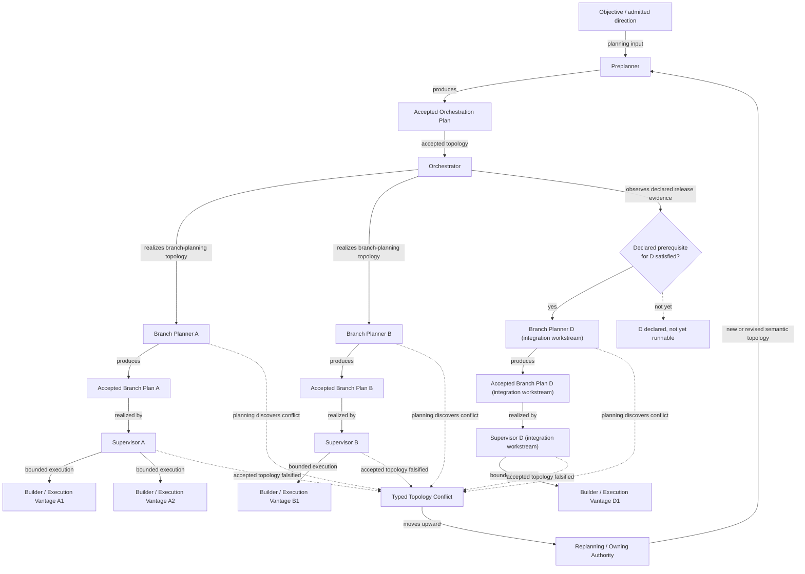

# Semantic Planning Hierarchy

> **Question:** Who decides what the work is, and who realizes work that has already been accepted?

## Purpose

This view shows Work Engine's **semantic planning hierarchy**: the chain by which an objective becomes an accepted orchestration topology, then accepted branch plans, and finally bounded execution.

Its purpose is to make one ownership distinction explicit:

> **Realizing an accepted plan does not grant authority to redefine that plan.**

The hierarchy therefore separates actors that **form or revise semantic work structure** from actors that **coordinate or execute work within already-accepted structure**.

This page intentionally shows only that dimension. Runtime model selection, context topology, organizational compilation, claims, evidence maintenance, and transition mechanics are covered by other architecture views.

---

## Diagram



Branch D is drawn with the identical `planner → accepted branch plan → supervisor → builder` shape as branches A and B — deliberately. Per "Integration is its own workstream" below, integration is not a distinct role class; it is the same pipeline applied to a workstream the orchestration plan happened to declare as integration.

Branch D is also drawn gated, not automatic: the Orchestrator realizes A's and B's branch-planning topology immediately because the orchestration plan declared no prerequisite for them, but it only realizes D's once it has observed that D's own declared prerequisite is satisfied. Restored 2026-09-25 — see "Dependency Release and Runnability" below.

---

## How to Read This View

### 1. The Preplanner owns orchestration-level semantic structure

The **Preplanner** reasons about the overall shape of the work.

Its output is an **accepted orchestration plan**: a durable semantic description of the major workstreams, their relationships, integration structure, and other planning consequences required downstream.

The accepted orchestration plan describes **what work exists and how that work is semantically organized**. It is not merely an instruction to spawn runtime agents.

---

### 2. The Orchestrator realizes the accepted orchestration topology

The **Orchestrator** sits downstream of the accepted orchestration plan.

Its job is structural realization and coordination of that accepted topology. It may instantiate or coordinate the planning vantages required by the orchestration plan, but doing so does not transfer the Preplanner's semantic planning authority to it.

The key invariant is:

> **The Orchestrator realizes an accepted orchestration topology without acquiring the semantic judgment owned by the actors that produced or own that topology.**

Coordination authority and planning authority are therefore distinct.

---

### 3. Branch Planners own branch-level semantic planning

Each **Branch Planner** receives the bounded planning subject established by the orchestration topology and produces an **accepted branch plan**.

The branch plan establishes the semantic structure of that branch: for example its objective, accepted authority and mutation boundary, dependencies, evidence cutoff, affected semantic owners, required consequences, and other planning commitments.

The Branch Planner answers questions such as:

- What obligations actually constitute this branch?
- What dependencies exist between them?
- Which semantic owners are affected?
- What consequences must the implementation preserve?
- What decisions must be resolved before execution may proceed?

The Branch Planner is not simply a preparatory version of the Supervisor. It occupies a different semantic authority boundary.

---

### 4. Integration is its own workstream, using the same pipeline as any other branch

Integration is not an incidental final step performed automatically after independent branches complete.

Where the orchestration topology establishes integration as distinct work, that work receives its own planning and realization path — the same `planner → accepted branch plan → supervisor → builder` pipeline every other branch uses, not a separate role class. Integration is a workstream, not a new kind of authority.

This prevents integration consequences from being silently absorbed into one branch merely because that branch happens to finish last or possess relevant implementation context, and it prevents the architecture from implying that integration work needs — or gets — a different authority model than any other accepted branch.

---

### 5. The Supervisor realizes an accepted branch plan

A **Supervisor** begins from an accepted branch plan.

Its authority is therefore bounded by semantic structure that already exists.

The Supervisor may:

- coordinate execution of the accepted branch;
- inspect local implementation and runtime evidence;
- judge how accepted obligations should be realized within its permitted organizational authority;
- supervise one or more execution vantages;
- nominate a topology conflict when evidence falsifies assumptions of the accepted plan.

It may not silently redefine the branch's semantic topology.

This distinction is central:

```text
"How should these accepted obligations be realized?"
    -> execution / organizational-realization question

"These are not actually the correct obligations or dependencies."
    -> planning-topology conflict
```

The first may be resolved downstream.

The second moves upward.

---

### 6. Builders and other execution vantages operate beneath accepted semantic structure

Builders or equivalent execution vantages perform bounded implementation work under the plan and authority projected to them.

Execution may produce new evidence. That evidence can reveal that the plan's assumptions no longer hold, but proximity to the evidence does not itself create planning authority.

A Builder or Supervisor discovering that two supposedly independent obligations are actually coupled has discovered a **fact relevant to replanning**.

It has not thereby gained authority to rewrite the planning topology.

---

## Dependency Release and Runnability

**Restored 2026-09-25.** This section did not survive the canonicalization pass that superseded `hierarchical-planning-and-multi-supervisor-orchestration.md` (`architectural_supersession: full`, `residue: none`, audited 2026-09-17) into this page. That source document's own §§10–11 name an explicit mechanism for one thing this page otherwise leaves silent: **when does a workstream the orchestration plan already declared actually become eligible for its own planning vantage?** The 2026-09-17 audit re-checked the Preplanner/Orchestrator/Branch-Planner ownership contracts and the Supervisor block at a conceptual level, but did not separately re-verify this mechanic against the replacement text — it is genuinely absent here, not merely reworded elsewhere. This section restores it as content the source document already carried, not as new architecture; see that document's own `canonicalization_correction` entry for the audit-record side of this fix.

An accepted orchestration plan may declare a workstream whose planning vantage should not begin immediately — not because the plan is incomplete, but because the plan itself makes that workstream's start conditional on a named consequence of another workstream. Dependencies should be expressed as **required consequences** rather than incidental process completion — the source's own strength, preserved rather than sharpened into a stronger rule here:

```text
Branch B declares:
    requires: accepted runtime-provider contract R

Branch A declares:
    releases: accepted runtime-provider contract R
```

rather than:

```text
Branch B requires: Branch A to finish
```

The consequence form preserves route independence — a different branch, or a revised implementation of the same branch, may satisfy the same declared consequence without changing dependent work.

The ownership split, restored directly from the source:

```text
Preplanner
    declares what depends on what, and what consequence releases it
        (semantic content — part of the accepted orchestration plan itself)

The domain/authority that owns the declared release consequence
    establishes that consequence under its own rules
        (that domain's own semantic authority, not the Orchestrator's —
         which may itself require review or acceptance, not merely
         production of an artifact)

Orchestrator
    observes the already-established consequence and mechanically
    determines that the plan-declared prerequisite is satisfied
        -- never judges whether an undeclared or partial consequence is
           "close enough"
    coordinates instantiation or resumption of the now-runnable
    planning vantage
```

This is coordination of already-accepted topology, not new semantic planning — the same boundary §2 above already states for the Orchestrator generally. The source document's own integration example names the mechanical half precisely: "the orchestrator only determines that the declared prerequisites for Integration D have become satisfied. It does not decide how the implementations should be reconciled." Discovering that a dependency structure itself should change — a previously undeclared dependency, integration required before its declared release point, and similar — is not mechanical observation; it is a topology falsification and routes upward through the same replanning path as any other, below.

**What this restores, precisely:** a workstream may be **declared and durable — part of the accepted orchestration plan — before it is runnable.** Runnability is a distinct, later, evidence-gated fact the Orchestrator observes, not something acceptance grants unconditionally. The diagram above should not be read as implying every declared branch's planning vantage begins the moment the orchestration plan is accepted.

**What this does not restore:** the exact mechanism by which release evidence is represented or delivered to the Orchestrator — a direct observation, a claim-evidence reliance/refresh path, or something else — is not decided by the source document and is not decided here. Left open on purpose.

---

## Topology Conflict and Replanning

The hierarchy is not a one-way waterfall.

Execution and branch-local reconnaissance can falsify accepted semantic structure.

When that occurs, Work Engine uses an explicit **topology-conflict path** rather than permitting local actors to repair the topology implicitly.

Conceptually:

```text
Branch Planner / Supervisor
        ↓
typed topology conflict
        ↓
Orchestrator
        ↓
Preplanner / owning semantic authority
        ↓
revised accepted topology
        ↓
downstream realization resumes from the new authoritative state
```

The important property is not the physical messaging route. It is the preservation of authority:

> **Evidence may originate below the planning owner; semantic revision still belongs to the planning owner.**

---

## Key Invariants

1. **Planning authority does not flow downward merely because execution does.**

2. **The Orchestrator realizes orchestration topology; it does not become the Preplanner.**

3. **The Supervisor realizes an accepted branch plan; it does not become the Branch Planner.**

4. **Local evidence may invalidate an accepted topology without granting the discovering actor authority to replace it.**

5. **Topology-level replanning moves toward the authority that owns the affected semantic structure.**

6. **Integration may be first-class semantic work and therefore receives explicit planning and ownership rather than being treated as incidental cleanup.**

7. **The same actor class may participate at multiple stages without collapsing those stages into one authority.**

   Same actor does not imply same decision, same role, or same authority.

8. **Dependency release is evidence-bearing and mechanically derived from already-established consequences.** The Orchestrator determines that the orchestration plan's declared prerequisite is satisfied; it does not establish the underlying consequence or decide whether partial or undeclared evidence is close enough.

9. **A workstream's declared dependencies are semantic content owned by the Preplanner.** Discovering that a dependency should change routes through topology conflict like any other planning revision, never through the Orchestrator's own judgment.

---

## What This View Does Not Show

This diagram deliberately does **not** describe:

- how an accepted branch plan is compiled into a concrete execution organization;
- `auto-org` or recursive organizational realization;
- how many Supervisors, Builders, Specialists, or retained contexts should exist;
- role-contract compilation;
- ExecutionEnvelope construction;
- capability or provider resolution;
- context lifecycle and `new_context` transitions;
- claims, evidence refresh, or planning-fact materialization;
- transition leases, fencing, or atomic publication;
- runtime model/provider/harness selection.

Those belong to separate architecture views.

In particular, this page describes **semantic planning topology**, not **execution organizational topology**.

That distinction is intentional.

---

## Boundary With Organizational Compilation

The output of this hierarchy becomes input to the organizational-realization architecture described elsewhere.

Conceptually:

```text
SEMANTIC PLANNING

Preplanner
    ↓
Accepted Orchestration Plan
    ↓
Orchestrator
    ↓
Branch Planner
    ↓
Accepted Branch Plan

================ authority boundary ================

ORGANIZATIONAL / EXECUTION REALIZATION

Organizational compilation
    ↓
Supervisor contract
    ↓
Execution vantages
    ↓
Runtime realization
```

The lower system may determine **how** accepted semantic obligations should be distributed across legitimate execution vantages.

It may not silently change **what those obligations are**.

---

## Related Architecture Views

The following atlas pages expand dimensions intentionally omitted here:

- **`authority-and-ownership.md`** — which authority surfaces belong to which logical roles and services.
- **`organizational-compilation.md`** — how accepted semantic structure is lowered into execution organization and recursively adapted.
- **`runtime-realization.md`** — how an accepted executor/runtime requirement becomes a concrete provider/harness/model composition, several steps downstream of this page's own output.
- **`role-and-contract-structure.md`** — what a logical role must observe, own, and avoid, sitting between organizational compilation and runtime realization.
- **`context-lifecycle.md`** — how retained reasoning contexts are replaced safely.
- **`mechanisms/revision-cas-and-publication.md`** — the mechanism branch-plan revisions (§16 of the source document) would use, once implemented; named as required durable state, not yet verified as built.
- **`evidence-and-claims.md`** — how accepted planning facts are materialized and maintained without becoming planning authority.

Revisioned state, predecessor lineage, CAS publication, and atomic visibility (canonical revisioned state, derived state, evidence, and lineage across all of these) are treated as a shared cross-cutting mechanism, not a truth dimension — settled, not open. Its canonical mechanism view is `mechanisms/revision-cas-and-publication.md`.

---

## Source and Status

**Retrofitted 2026-09-16** — this page predates `status-grammar.md` and had no formal `architecture_status` block, discovered by the three-category structural audit's own metadata pass. Each field below is re-derived independently from cited evidence, not inferred from the others.

```yaml
architecture_status:
  design: proposed
  reconciliation: reconciled
  authorization: unrecorded
  implementation: partial
  owner: app-server/ideas/pending/hierarchical-planning-and-multi-supervisor-orchestration.md
  status_as_of: 2026-09-25
```

`design: proposed`, not `accepted` — the source document's own Status header reads "Formed architectural direction," never an explicit adoption decision. `reconciliation: reconciled` — this page's content is checked directly against that source, `proposal-decision-gated-implementation-compilation.md`, and `deterministic-authority-projection-and-adaptive-organizational-topology.md`. `authorization: unrecorded` — the document was set as strategic priority (`post-migration-strategic-plan.md`, 2026-09-14), which is not the same speech-act as an authorization decision under this grammar; no citable "build this" decision was found, so this is silence, not a confirmed ceiling. `implementation: partial` — Supervisor/Builder execution is real and live in the current runtime; the newer upper layers this page depicts (Preplanner, Orchestrator, Branch Planner, concurrent multi-branch topology) are not.

**Restored 2026-09-25** — "Dependency Release and Runnability" above and Key Invariants 8–9 close a gap a documentation-only reconnaissance session found: `reconciliation: reconciled` had been true of this page's content in general but was not actually true of the source document's own §§10–11, which a prior full-supersession audit (dated 2026-09-17, on the source document itself) did not separately re-verify. No new design axis is introduced — the restored content shares this page's own default status exactly: `design: proposed` (the source's own "Formed architectural direction" ceiling, never elevated), `authorization: unrecorded`, `implementation: none` for this specific mechanic (narrower than the page-level `partial`, since dependency release has no live analogue the way Supervisor/Builder execution does).

```yaml
status_override:
  design: accepted
  reconciliation: reconciled
  authorization: design_work_authorized
  implementation: none
  source: app-server/docs/work-engine-planned-architecture.md
```

Applies specifically to the two ownership rulings this page's own §4 (integration as a workstream) and the branch-plan/decision-gated-compilation boundary depend on: `routing.vs.admission` and `decision-gated.vs.hierarchical-orchestration`. The capstone's own text is explicit these "were not part of the 2026-09-14 acceptance but were separately resolved by explicit user ruling on 2026-09-15" — a real, dated, citable decision distinct from the surrounding document's own unaccepted status. `implementation: none` because a ruling that clarifies ownership boundaries builds nothing by itself.

Where later atlas views introduce organizational compilation, adaptive topology, planning-fact materialization, or other proposed mechanisms, those views state their own implementation and reconciliation status separately, per each page's own `Source and Status` section.