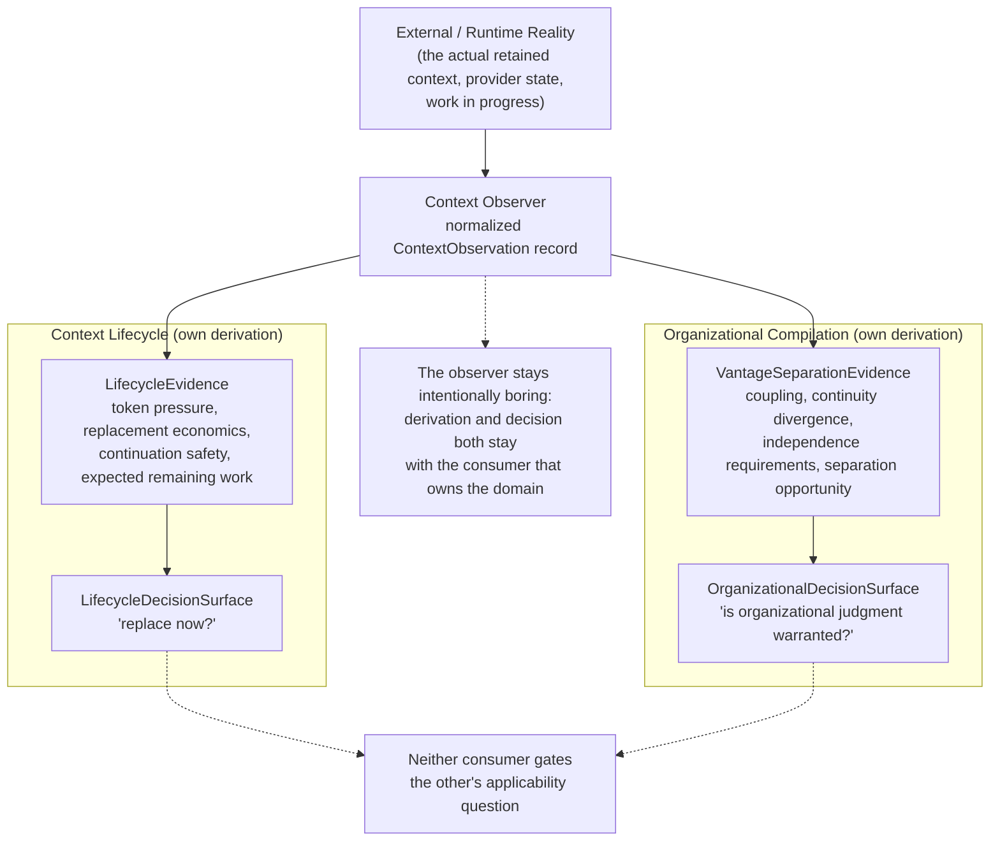

# Context Observer

> **Question:** What normalized observations about a retained reasoning context can multiple dimensions consume without the observer acquiring authority over what those observations mean?

## Purpose

This is a **substrate view**, not a dimension or mechanism view. It describes one of the two confirmed shared substrates in this architecture (alongside `substrates/evidence-anchor.md`, added 2026-09-16): a source of normalized facts that more than one dimension consumes independently, without the substrate itself acquiring any of their semantic authority.

**Correction applied before writing this page, not after:** the idea document that first proposed this substrate says it should "own facts about the current reasoning environment." Taken literally, that overstates what it owns — the substrate does not own *external reality*; it owns the **observation records and normalization contract** by which that reality gets represented. This page is deliberately precise about that distinction throughout.

```text
Context Observer owns:
    the observation schema
    collection / normalization semantics
    observation provenance
    stable factual measurements

Context Observer does NOT own:
    lifecycle pressure
    replacement applicability
    topology / separation pressure
    semantic-width interpretation
    organizational judgment
    any transition decision
```

---

## Diagram



---

## How to Read This View

Three layers, not two, and this page owns only the first. Observation is a fact; derivation is a deterministic, consumer-owned projection of that fact into domain-specific evidence; decision is that same consumer's own judgment. Token usage is an observation; token pressure is Context Lifecycle's own deterministic derivation from it; "replace now?" is Context Lifecycle's own decision — none of the three belongs to this substrate once past the first.

---

## 1. The `ContextObservation` Schema

Re-verified directly against `deterministic-authority-projection-and-adaptive-organizational-topology.md` §5.3, not restated from memory:

```text
ContextObservation
  identity:      role, thread, context window, binding revision
  usage:         live tokens, input tokens, context-window capacity,
                 cache behavior, recent growth rate
  composition:   active skills, governing instructions, projected durable
                 state, visible evidence classes, temporary material,
                 unresolved interactions
  activity:      current work unit, recent turns, tool activity,
                 mutations, active dependencies
  lifetime:      age, continuation count, checkpoint history,
                 replacement history
  relationships: subjects touched, authority surfaces involved, other
                 active roles/vantages
```

Some of these fields are already directly observable in the live implementation; others become available only as Work Engine externalizes more semantic structure — the schema names what a complete observation record would contain, not a claim that every field is populated today (see Source and Status).

---

## 2. Two Consumers, Two Independently Owned Derivation Layers

The source document is explicit that each consumer owns its own middle layer independently — this substrate does not mediate between them or own either layer itself:

```text
ContextObservation                          ContextObservation
      ↓                                      + semantic/work/authority state
LifecycleEvidence                                  ↓
(token pressure, replacement economics,     VantageSeparationEvidence
 continuation safety, expected remaining     (coupling, continuity divergence,
 work)                                        independence requirements,
      ↓                                       delegability, separation opportunity)
LifecycleDecisionSurface                           ↓
("replace now?")                            OrganizationalDecisionSurface
                                             ("is organizational judgment warranted?")
```

"Metrics like semantic-width pressure, coupling, or projection reduction therefore do not belong in the observer itself — they belong specifically to whichever consumer's own `*Evidence` layer derives them." Quoted directly because it is the single sentence this whole page exists to enforce.

---

## 3. Four Tests, Applied Directly Rather Than Assumed

**No consumer-specific derived metric belongs in the substrate.** Token count and context-window capacity are observations; "replacement is economically worthwhile" is `context-lifecycle.md`'s own content, never this page's. Coupling and separation pressure are `organizational-compilation.md`'s own content, never this page's.

**No admission or transition machinery belongs here.** This substrate can trigger nothing authoritatively — it has no admission step, no publish, no lease. `mechanisms/candidate-resolution-and-admission.md` and `mechanisms/transition-fencing-and-leases.md` are both consumed by the dimensions that use this substrate's output, never by the substrate itself.

**No hidden parent/child relation.** Context Lifecycle and Organizational Compilation are peers over this substrate — neither gates the other's applicability question (`context-lifecycle.md` §9 and `organizational-compilation.md` both state this independently, from their own sides).

**Metadata discipline.** `owner`, `authorization`, and `implementation` are checked independently below, not inferred from one another — the same discipline the prior three mechanism-page corrections established.

---

## What This Substrate Does Not Own

Restated as a direct list, since it is the page's entire reason for existing:

- lifecycle pressure or replacement applicability (`context-lifecycle.md`);
- topology or separation pressure (`organizational-compilation.md`);
- semantic-width interpretation, or any other derived evidence metric;
- organizational judgment of any kind;
- any transition, admission, or publication decision;
- external reality itself — only the observation records that represent it.

---

## Key Invariants

1. **The substrate owns observation records and their normalization contract, not external reality itself.**
2. **A derived metric belongs to whichever consumer derives it, never to the observer.**
3. **The substrate triggers no admission, transition, or publication on its own standing.**
4. **Context Lifecycle and Organizational Compilation are peer consumers; neither owns or gates the other's applicability question.**
5. **Some observation fields exist only as a target schema today, not as confirmed live telemetry — the schema is not itself a claim of completeness (see Source and Status).**

---

## What This View Does Not Show

This page does not define:

- lifecycle evidence derivation or the replacement decision (`context-lifecycle.md`);
- vantage-separation evidence derivation or the organizational-judgment decision (`organizational-compilation.md`);
- any admission, revision, or fencing mechanics (`mechanisms/`);
- a generic reusable "observer framework" abstraction — this page documents one concrete, confirmed substrate; a general pattern would only be justified if a second, independent substrate later converged on the same shape, which has not happened yet.

---

## Relationship to Context Lifecycle

`context-lifecycle.md` derives `LifecycleEvidence` and its own replacement decision from this substrate's output, and owns both independently of this page.

## Relationship to Organizational Compilation

`organizational-compilation.md` derives `VantageSeparationEvidence` and its own organizational-judgment decision from this substrate's output plus semantic/work/authority state, and owns both independently of this page.

---

## Related Architecture Views

- **`context-lifecycle.md`** — one of two peer consumers.
- **`organizational-compilation.md`** — the other peer consumer.
- **`deterministic-authority-projection-and-adaptive-organizational-topology.md`** §5.1–§5.3 — the source material this page is grounded in directly.
- **`substrates/evidence-anchor.md`** — the other confirmed substrate; same observation/normalization shape, unrelated subject matter.

---

## Source and Status

```yaml
architecture_status:
  design: proposed
  reconciliation: reconciled
  authorization: unrecorded
  implementation: partial
  owner: app-server/docs/architecture/substrates/context-observer.md
  status_as_of: 2026-09-16
```

Checked independently, not inferred from one another, per this page's own §3: `design: proposed` — the idea document proposing this substrate has never received an explicit acceptance decision (its own top-level Authority line: "Exploratory only"). `reconciliation: reconciled` — this page's content traces directly to §5.1–§5.3 and both consuming dimensions' own pages. `authorization: unrecorded` — no citable authorization decision was found for this substrate specifically; not asserted as `exploration_only` (a confirmed ceiling this page has no evidence for) and not inferred as stronger than that from anything else. `implementation: partial` — some `usage` fields (live tokens, context-window capacity) are real, observable telemetry today per `context-lifecycle.md` §2's own verified code citations (`TokenUsagePressureProjector`, `ContextPressureController`); the `identity`, `composition`, `activity`, `lifetime`, and `relationships` categories have not been checked against any implementation and should be assumed unbuilt until verified otherwise. This page owns itself.
