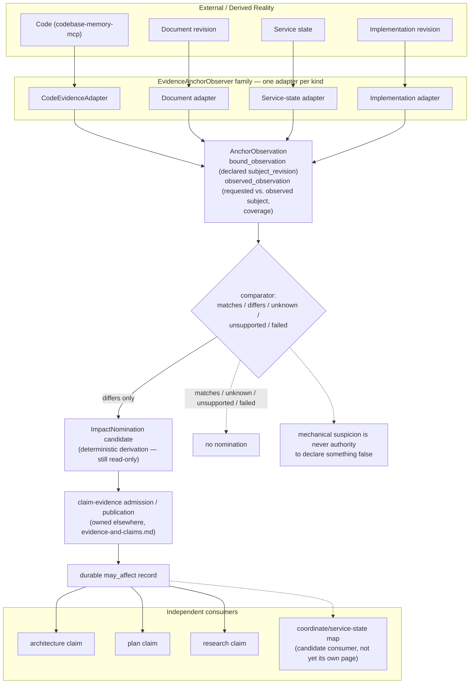

# Evidence Anchor

> **Question:** What normalized observations about a declared dependency's current state can multiple claim-owning domains consume as evidence, without the observer acquiring authority over whether that observed difference matters?

## Purpose

This is a **substrate view**, not a dimension or mechanism view — the second confirmed shared substrate in this architecture, alongside `context-observer.md`. It describes a boundary that observes whether a declared dependency still matches the evidence cited for it, across evidence sources including but not limited to `codebase-memory-mcp`, and nominates possible impact without claiming semantic consequence.

**The source document already corrects the leak this page would otherwise have to catch.** An earlier pass of its own §5 said a nomination fires when "comparison indicates relevant change" — its own text calls this out directly: "that phrasing hides a judgment leak: 'relevant' smuggles semantic materiality back into the observer, which is exactly the authority this design exists to keep out of it." This page inherits the corrected version, not the leaky one.

```text
Evidence Anchor owns:
    one observer per anchor kind (code, document, service_state, implementation)
    observation normalization, with exact-revision binding
    the five-state mechanical comparator
    deterministic may_affect nomination candidates

Evidence Anchor does NOT own:
    the dependency/anchor registry (owned by the claim or fact that
        declares the dependency, at declaration time)
    whether an observed difference is semantically material
    durable may_affect record publication
    refresh-episode consequence judgment
    reopening downstream work
```

---

## Diagram



---

## How to Read This View

Three layers, not two, and this substrate owns only the first two. Observation is a source-specific fact, bound to an exact requested and observed revision so a comparison is never silently computed against the wrong world. Comparison is a deterministic five-state reduction over that fact. Nomination-candidate derivation is still this substrate's own read-only work — but *publishing* a durable `may_affect` record is not: that step belongs entirely to `claim-evidence`, the same boundary `context-observer.md` draws between observation and consumer-owned derivation, applied here to a different domain (cross-source dependency correspondence rather than reasoning-environment facts).

---

## 1. The `AnchorObservation` Schema

Re-verified directly against `evidence-anchor-observation-and-impact-nomination.md` §3:

```text
AnchorObservation
    anchor

    bound_observation
        subject_revision        (the state recorded at declaration time)
        observation

    observed_observation
        requested_subject       (the exact revision the anchor asks about)
        observed_subject        (the exact revision the source actually
                                  answered from)
        source_generation / implementation_revision
        coverage
        observation

    comparison
    evidence
```

This binding exists to enforce one invariant directly: **an observer must never compare a declared dependency against evidence whose repository/service/implementation revision is merely assumed to be the requested one.** If an anchor requests repository state `@R42` and `codebase-memory-mcp`'s coverage is current only as of `@R47`, the observer must return `unsupported` / `unavailable` / `mismatched_subject` — never a comparison computed as if `R47` were `R42`. The source document is explicit this is illustrative, not a final schema.

---

## 2. Anchor Kinds — Extensible by Kind, Not One Universal Shape

```text
TextAnchor              file, range, digest
CodeStructureAnchor      repository/revision, stable-ish structural locator
                         (the exact codebase-memory-mcp locator is future
                          investigation, not decided by this substrate)
ServiceStateAnchor       owning_service, identity, revision_at_declaration
ImplementationRevisionAnchor
                         analyzer_or_service_identity, revision_at_declaration
```

The anchor contract is extensible by kind — the source document does not enumerate a final closed set, and this page does not either.

---

## 3. The Five-State Comparator and the "Beautifully Weak" Nomination

```text
comparator returns exactly one of:
    matches
    differs
    unknown
    unsupported
    failed

declared dependency differs  -->  ImpactNomination(may_affect)
```

Only a mechanically established `differs` produces a nomination candidate. `unknown` / `unsupported` / `failed` never default to a nomination — they are the coverage-gap outcomes §1 above requires, and must be surfaced as such, never silently treated as `matches`. Quoted directly because it is the sentence this whole substrate exists to enforce: `may_affect` is "beautifully weak — a report that a declared, mechanically checkable relationship no longer holds, nothing about whether that matters."

Forming a nomination candidate is not the same act as publishing an authoritative nomination record. The observer stays read-only all the way through; `claim-evidence` remains the only place a durable `may_affect` record actually comes into existence.

---

## 4. Multiple Independent Consumers, Already Named by the Source

Unlike `context-observer.md`, whose two-consumer case had to be assembled from two separate dimension pages, this substrate's own source document already diagrams the multi-consumer shape directly, under a box it labels — in its own words — the **"impact nomination substrate"**:

```text
                 impact nomination substrate
                           |
            +--------------+--------------+
            v              v              v
     architecture claim   plan claim    research claim
            |              |              |
            +---- domain-owned refresh ---+
```

"Consumers are a consumer, not a co-owner, of the impact-nomination substrate." A fourth candidate consumer is named independently, in the same document's own Relationships table: `service-plane-and-kernel-domain-boundary.md`'s coordinate/service-state map, "not something this document builds a parallel mechanism for."

---

## 5. Four Tests, Applied Directly Rather Than Assumed

**No consumer-specific derived metric belongs in the substrate.** Whether a `differs` result is semantically material is never this substrate's judgment — the claim author decided that when declaring the dependency; the refresh episode judges it afterward. The corrected §5 (Purpose, above) exists precisely to keep "relevant" out of the comparator.

**No admission or transition machinery belongs here.** The observer produces a nomination *candidate* only. `mechanisms/candidate-resolution-and-admission.md` and `mechanisms/revision-cas-and-publication.md` are both consumed by `claim-evidence`'s own admission/publication step, never by this substrate.

**No hidden parent/child relation.** Architecture, plan, and research claims are named as siblings under the shared substrate box, each performing its own "domain-owned refresh" independently — none gates or defers to another.

**Metadata discipline.** `owner`, `authorization`, and `implementation` are checked independently below, per the same discipline `context-observer.md` §3 and the mechanism-page corrections already established.

---

## What This Substrate Does Not Own

- the dependency/anchor registry — owned by the claim or fact declaring the dependency, at declaration time, not by whichever adapter happens to observe it (the earlier draft's own corrected error, §1 of the source);
- whether an observed difference is semantically material (`evidence-and-claims.md`'s refresh-episode judgment);
- durable `may_affect` record publication (`evidence-and-claims.md`);
- an architecture-specific stale-state machine, consequence-propagation rule, or reopen-semantics rule — all explicitly narrowed away in favor of `claim-evidence`'s own richer, already-proven vocabulary (source §7);
- the exact `CodeStructureAnchor` locator against `codebase-memory-mcp`'s schema — investigation, not invention (source §2, §10 open question 1);
- who authors anchor registry entries, or where that state durably lives — open (source §6, §10 open question 3).

---

## Key Invariants

1. **The substrate owns observation, exact-revision binding, and mechanical comparison — never dependency ownership or consequence judgment.**
2. **Only a mechanically established `differs` produces a nomination candidate; `unknown`/`unsupported`/`failed` never default to one.**
3. **Forming a nomination candidate is not the same act as publishing a durable `may_affect` record — that remains `claim-evidence`'s own admission/publication.**
4. **An observer must never compare a declared dependency against evidence whose revision is merely assumed to be the requested one — `bound_observation` vs. `observed_observation` exists to enforce this.**
5. **The anchor contract is extensible by kind; this substrate does not claim a closed set.**
6. **Architecture facts are one consumer among several — nothing about this substrate is architecture-specific.**

---

## What This View Does Not Show

This page does not define:

- claim lifecycle, refresh-episode judgment, or reopening (`evidence-and-claims.md`);
- the exact `CodeStructureAnchor` locator (open, source §2, §10);
- who authors anchor registry entries or where that state durably lives (open, source §6, §10);
- a richer comparator design beyond the five-state vocabulary (open, source §10 open question 7);
- admission or publication mechanics generally (`mechanisms/`, and `claim-evidence`'s own contract).

---

## Relationship to Evidence and Claims

`evidence-and-claims.md` is the sole durable publisher of `may_affect` records and the sole judge of refresh consequence; this substrate only ever produces nomination candidates, never durable records itself. `evidence-and-claims.md` §9's own exclusion of "generic evidence production" from its scope — naming "a context observer" as one example of a producer it does not own — confirms this boundary from both sides independently.

## Relationship to Context Observer

The other confirmed substrate, same shape (observation and normalization only, no consumer-specific derivation, no admission authority), different domain: reasoning-environment facts there, cross-source dependency correspondence here. Neither substrate is a generalization of the other; each converged on the shape independently.

---

## Related Architecture Views

- **`evidence-and-claims.md`** — the sole durable publisher this substrate's nomination candidates feed; owns refresh-episode judgment entirely.
- **`substrates/context-observer.md`** — the other confirmed substrate; same observation/normalization shape, unrelated subject matter.
- **`mechanisms/candidate-resolution-and-admission.md`**, **`mechanisms/revision-cas-and-publication.md`** — consumed by `claim-evidence`'s own admission/publication step downstream of this substrate, never by this substrate itself.

---

## Source and Status

```yaml
architecture_status:
  design: proposed
  reconciliation: reconciled
  authorization: exploration_only
  implementation: none
  owner: app-server/ideas/pending/evidence-anchor-observation-and-impact-nomination.md
  status_as_of: 2026-09-16
```

`design: proposed`, not `exploratory` — this document already supersedes an earlier draft and states directly which pieces are "kept, because they are genuinely new and not owned elsewhere" (§7): the anchor contract, the observer family and `AnchorObservation` shape, `CodeEvidenceAdapter`, and the `may_affect` nomination itself. That is a formed architectural direction with a corrected, coherent core, not content whose shape remains genuinely unresolved — the document's own "Open questions" (§10) are real but peripheral (locator choice, trigger model, comparator richness), not disputes over the kept core. `reconciliation: reconciled` — this page's content traces directly to the source document's own numbered sections, read in full this session, not carried forward from a prior summary. `authorization: exploration_only` — the source's own explicit Authority line: "Exploratory only. This document does not amend the migration roadmap, admit an implementation, or authorize a claim-evidence contract change." A confirmed ceiling, not silence. `implementation: none` — confirmed directly: `grep -rl "EvidenceAnchorObserver|AnchorObservation|CodeEvidenceAdapter|nominate_impact" src/` returns zero hits, and `claim-evidence`'s own `contract.mjs` has no `nominate_impact` operation among its six real operations (`create_claim`, `publish_revision`, `publish_lineage`, `record_reliance`, `retire_reliance`, `retract_revision`).

```yaml
status_override:
  design: accepted
  reconciliation: reconciled
  authorization: implementation_authorized
  implementation: none
  source: app-server/docs/cross-cutting-seam-review-and-architectural-review-reconciliation.md
```

**Found by the §12 capstone-row audit, 2026-09-16 — a real drift, not a wording issue.** `review.md` §8 already states that "implementation of the mechanical seam-evidence adapter extensions is authorized to proceed" and that this authorization "belongs to `substrates/evidence-anchor.md`'s own territory, not to this dimension" — but this page never carried the corresponding override, so its default `exploration_only` silently understated the real, narrower authorization. Applies specifically to extending the anchor-kind taxonomy where existing kinds (`TextAnchor`/`CodeStructureAnchor`/`ServiceStateAnchor`/`ImplementationRevisionAnchor`) cannot truthfully express a declared seam dependency — per the joint reconciliation's own Acceptance section: "implementation of the mechanical seam-evidence adapter extensions (implementation-evidence-driven, per the existing extensible `EvidenceAnchorObserver` taxonomy) is authorized to proceed," accepted 2026-09-14. Does **not** extend to the rest of this substrate (the core observer/comparator/`may_affect` shape itself remains `exploration_only`, per the page default above) — only to adding new anchor kinds against evidence of need.
