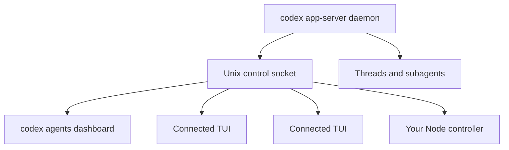

Confirmed from the current Codex source: the background agents server is literally a daemonized `codex app-server`.

No guessing required.

### What `codex agents` is

The CLI source describes the command as:

> “Browse all agent sessions on the shared local app-server daemon.”

`codex agents` launches the normal TUI with `agents_overview = true`, targeting the daemon’s default Unix socket. It is a dashboard client, not a separate server implementation. [CLI command source](https://github.com/openai/codex/blob/4347f94d5539880e8583028a50a19df5b202d9fa/codex-rs/cli/src/main.rs).

### What the daemon actually runs

The `/agent` action in your screenshot invokes:

```text
codex app-server daemon start
```

The daemon manager then starts a detached process equivalent to:

```text
codex app-server --listen unix://
```

or, when remote control is enabled:

```text
codex app-server --remote-control --listen unix://
```

It keeps a PID record, Unix control socket, settings, logs, and a managed Codex binary under the Codex home directory. [The `/agent` startup implementation](https://github.com/openai/codex/blob/4347f94d5539880e8583028a50a19df5b202d9fa/codex-rs/tui/src/app/agents_overview.rs), [daemon process backend](https://github.com/openai/codex/blob/4347f94d5539880e8583028a50a19df5b202d9fa/codex-rs/app-server-daemon/src/backend/pid.rs), [daemon lifecycle](https://github.com/openai/codex/blob/4347f94d5539880e8583028a50a19df5b202d9fa/codex-rs/app-server-daemon/src/lib.rs).

So the topology is definitively:



### Embedded versus shared sessions

The TUI source has an explicit three-way distinction:

```rust
enum AppServerTarget {
    Embedded,
    LocalDaemon { endpoint },
    Remote { endpoint },
}
```

A standalone `codex` session normally runs an in-process embedded app-server. If the default daemon Unix socket is already available, a new ordinary TUI invocation can automatically choose `LocalDaemon` instead—provided the invocation doesn’t contain configuration overrides the existing daemon cannot adopt.

That explains the screenshot precisely:

* Your current TUI was using `AppServerTarget::Embedded`.
* `/agent` requires a shared target.
* It offered to start the app-server daemon.
* Starting it does not mutate the current TUI’s `AppServerTarget`.
* Future compatible TUI invocations can discover the socket and attach automatically.
* `codex agents` explicitly attaches to it and opens the daemon-wide overview.

[Target selection and daemon auto-probing](https://github.com/openai/codex/blob/4347f94d5539880e8583028a50a19df5b202d9fa/codex-rs/tui/src/lib.rs).

### Can a chat be hooked to the control node?

Yes. This is implemented, not theoretical.

The agents dashboard:

1. Calls `thread/loaded/list` against the shared app-server.
2. Reads each loaded thread.
3. Groups root threads with their spawned descendants.
4. On selection, calls `thread/read`.
5. Calls `thread/resume` with `PreserveExistingThread`.
6. Replaces the current TUI chat widget with the selected app-server thread.
7. Subscribes to that thread’s events and replays outstanding requests.

That is literally attaching the human chat UI to an already-running agent thread. [Agents overview attachment implementation](https://github.com/openai/codex/blob/4347f94d5539880e8583028a50a19df5b202d9fa/codex-rs/tui/src/app/agents_overview.rs).

An already-running embedded session is the exception: it cannot be hot-transferred merely by starting the daemon. Once persisted and no longer independently active, its thread can be resumed through the daemon, but the existing process remains on its embedded server until exited.

### What `/agent` now means

The source confirms the new separation:

* `/agent` opens the daemon-wide overview of loaded root sessions and their descendant activity.
* `/subagents` remains the navigation surface for children belonging to the current root session.
* `codex agents` opens the full-screen shared-daemon task dashboard.

The dashboard itself is described in source as:

> “Daemon-wide overview of loaded root sessions and their subagents.”

So your memo was exactly right.

### What this means for Work Engine

You do not need to build an app-server derivative in Node.

The clean architecture is:

* Run the stock managed app-server daemon.
* Connect your Node service to its Unix control socket.
* Speak the normal bidirectional app-server JSON-RPC protocol.
* Generate version-matched TypeScript types from the installed Codex build.
* Let `codex agents` remain an independent human/operator console.
* Let Work Engine own the semantic workflow above the server.

Your controller can directly:

* start, resume, fork, read, name, archive, and delete threads;
* start, steer, interrupt, and queue turns;
* subscribe to multiple active threads;
* answer approvals and user-input requests;
* inspect thread status and descendant relationships;
* manage goals, models, permissions, working directories, and environments;
* inject durable continuation items;
* trigger compaction;
* expose dynamic controller tools to agents;
* attach a custom chat UI to any daemon-owned root thread.

The newest protocol even has experimental durable FIFO thread queues: `thread/queue/add`, `list`, `update`, `delete`, `reorder`, and `start`. [Current app-server protocol README](https://github.com/openai/codex/blob/4347f94d5539880e8583028a50a19df5b202d9fa/codex-rs/app-server/README.md).

### One important control boundary

Root agent sessions are fully controllable through app-server.

Parent-owned Multi-Agent V2 subagents are deliberately restricted:

* `canAcceptDirectInput = false`
* direct `turn/start` and `turn/steer` are rejected;
* direct settings changes, compaction, injection, goals, shell commands, and reviews are rejected;
* interruption remains available.

Those children are controlled through their owning parent’s multi-agent tools. Therefore, if Work Engine wants each role to be independently controllable, durable, replaceable, and directly chat-accessible, roles should generally be daemon-owned root threads—not ordinary parent-owned Codex subagents.

That may be the architectural gift here:

> Use root threads as Work Engine roles. Let each root optionally use ephemeral/internal subagents for bounded work. The daemon supplies durability, multiplexing, background execution, attachment, and a native operator dashboard; Work Engine supplies semantic coordination.

That is almost exactly the scaffold you were hoping app-server might provide.

