# Agent Environment Graphs

<!-- Generated by skills/agent-environment-graph/scripts/agent_environment_graph.py. -->
<!-- invariant-sha256: 8586f785a7b707c8c90583caba8174f5c28b61bb874ca8108e6e54eca0b132d9 -->
<!-- environment-sha256: ad7a49c73a773d9d077053def9739892a99d00f411558fb2e79df1dbf9fe56c7 -->

This is a deterministic view of [`agent-environments.yaml`](agent-environments.yaml).
Invariant and machinery truth remains owned by [`workflow-invariants.md`](workflow-invariants.md);
role projection truth remains owned by the YAML input. Edit those owners and regenerate this view.

Analysis produced by the CLI is candidate evidence only. Semantic classification and genuine contract changes
remain AI-judged and human-authorized respectively.

## Slice Supervisor

```mermaid
flowchart TB
  R["Slice Supervisor"]
  subgraph G1["Pinned structure"]
    N_role_supervisor_INV_001["INV-001"]
    N_role_supervisor_INV_002["INV-002"]
    N_role_supervisor_INV_003["INV-003"]
    N_role_supervisor_INV_004["INV-004"]
    N_role_supervisor_INV_005["INV-005"]
    N_role_supervisor_INV_009["INV-009"]
    N_role_supervisor_INV_010["INV-010"]
    N_role_supervisor_INV_014["INV-014"]
    N_role_supervisor_INV_015["INV-015"]
    N_role_supervisor_INV_017["INV-017"]
    N_role_supervisor_INV_018["INV-018"]
    N_role_supervisor_INV_019["INV-019"]
    N_role_supervisor_INV_020["INV-020"]
    N_role_supervisor_INV_021["INV-021"]
    N_role_supervisor_INV_022["INV-022"]
    N_role_supervisor_INV_023["INV-023"]
    N_role_supervisor_INV_025["INV-025"]
    N_role_supervisor_INV_026["INV-026"]
    N_role_supervisor_INV_027["INV-027"]
    N_role_supervisor_INV_028["INV-028"]
    N_role_supervisor_INV_029["INV-029"]
    N_role_supervisor_INV_030["INV-030"]
    N_role_supervisor_INV_031["INV-031"]
    N_role_supervisor_INV_032["INV-032"]
    N_role_supervisor_INV_034["INV-034"]
    N_role_supervisor_INV_035["INV-035"]
  end
  R -->|BOUND_BY| N_role_supervisor_INV_001
  R -->|BOUND_BY| N_role_supervisor_INV_002
  R -->|BOUND_BY| N_role_supervisor_INV_003
  R -->|BOUND_BY| N_role_supervisor_INV_004
  R -->|BOUND_BY| N_role_supervisor_INV_005
  R -->|BOUND_BY| N_role_supervisor_INV_009
  R -->|BOUND_BY| N_role_supervisor_INV_010
  R -->|BOUND_BY| N_role_supervisor_INV_014
  R -->|BOUND_BY| N_role_supervisor_INV_015
  R -->|BOUND_BY| N_role_supervisor_INV_017
  R -->|BOUND_BY| N_role_supervisor_INV_018
  R -->|BOUND_BY| N_role_supervisor_INV_019
  R -->|BOUND_BY| N_role_supervisor_INV_020
  R -->|BOUND_BY| N_role_supervisor_INV_021
  R -->|BOUND_BY| N_role_supervisor_INV_022
  R -->|BOUND_BY| N_role_supervisor_INV_023
  R -->|BOUND_BY| N_role_supervisor_INV_025
  R -->|BOUND_BY| N_role_supervisor_INV_026
  R -->|BOUND_BY| N_role_supervisor_INV_027
  R -->|BOUND_BY| N_role_supervisor_INV_028
  R -->|BOUND_BY| N_role_supervisor_INV_029
  R -->|BOUND_BY| N_role_supervisor_INV_030
  R -->|BOUND_BY| N_role_supervisor_INV_031
  R -->|BOUND_BY| N_role_supervisor_INV_032
  R -->|BOUND_BY| N_role_supervisor_INV_034
  R -->|BOUND_BY| N_role_supervisor_INV_035
  subgraph G2["Capabilities"]
    N_role_supervisor_capability_preflight["Campaign preflight"]
    N_role_supervisor_capability_lifecycle_control["Campaign lifecycle control"]
    N_role_supervisor_capability_receipt_finalization["Authoritative receipt finalization"]
    N_role_supervisor_capability_checkpoint_lifecycle["Private checkpoint lifecycle"]
    N_role_supervisor_capability_completion_offer["Completion-offer lifecycle"]
    N_role_supervisor_capability_completion_publication["Authorized completion publication"]
    N_role_supervisor_capability_resume["Validated campaign resume"]
    N_role_supervisor_capability_strategic_reconciliation["Strategic reconciliation"]
  end
  R -->|MAY_INVOKE| N_role_supervisor_capability_preflight
  R -->|MAY_INVOKE| N_role_supervisor_capability_lifecycle_control
  R -->|MAY_INVOKE| N_role_supervisor_capability_receipt_finalization
  R -->|MAY_INVOKE| N_role_supervisor_capability_checkpoint_lifecycle
  R -->|MAY_INVOKE| N_role_supervisor_capability_completion_offer
  R -->|MAY_INVOKE| N_role_supervisor_capability_completion_publication
  R -->|MAY_INVOKE| N_role_supervisor_capability_resume
  R -->|MAY_INVOKE| N_role_supervisor_capability_strategic_reconciliation
  subgraph G3["Owned state and artifacts"]
    N_role_supervisor_state_campaign_config["Effective campaign configuration"]
    N_role_supervisor_state_campaign_lifecycle["Campaign and slice lifecycle"]
    N_role_supervisor_state_durable_history["Durable terminal receipt history"]
    N_role_supervisor_artifact_audit_receipt["Terminal audit receipt"]
    N_role_supervisor_artifact_completion_offer["Live completion offer"]
  end
  R -->|OWNS| N_role_supervisor_state_campaign_config
  R -->|OWNS| N_role_supervisor_state_campaign_lifecycle
  R -->|OWNS| N_role_supervisor_state_durable_history
  R -->|OWNS| N_role_supervisor_artifact_audit_receipt
  R -->|OWNS| N_role_supervisor_artifact_completion_offer
  subgraph G4["Observable inputs"]
    N_role_supervisor_state_campaign_config["Effective campaign configuration"]
    N_role_supervisor_state_campaign_lifecycle["Campaign and slice lifecycle"]
    N_role_supervisor_state_private_checkpoint["Private accepted checkpoint"]
    N_role_supervisor_state_durable_history["Durable terminal receipt history"]
    N_role_supervisor_artifact_campaign_preflight["Campaign preflight result"]
    N_role_supervisor_artifact_plan["Evidence-based slice plan"]
    N_role_supervisor_artifact_placement_certificate["Semantic-path placement certificate"]
    N_role_supervisor_artifact_implementation_receipt["Implementation receipt"]
    N_role_supervisor_artifact_gate_receipt["Deterministic gate receipt"]
    N_role_supervisor_artifact_audit_receipt["Terminal audit receipt"]
    N_role_supervisor_artifact_handoff_receipt["Compact handoff receipt"]
    N_role_supervisor_artifact_checkpoint_receipt["Checkpoint lifecycle receipt"]
    N_role_supervisor_artifact_commit_proposal["Completion commit proposal"]
    N_role_supervisor_artifact_completion_offer["Live completion offer"]
    N_role_supervisor_artifact_completion_receipt["Completion commit receipt"]
    N_role_supervisor_artifact_telemetry_ingress["Authoritative telemetry ingress"]
    N_role_supervisor_artifact_planning_handoff["Strategic planning handoff"]
  end
  R -->|MAY_OBSERVE| N_role_supervisor_state_campaign_config
  R -->|MAY_OBSERVE| N_role_supervisor_state_campaign_lifecycle
  R -->|MAY_OBSERVE| N_role_supervisor_state_private_checkpoint
  R -->|MAY_OBSERVE| N_role_supervisor_state_durable_history
  R -->|MAY_OBSERVE| N_role_supervisor_artifact_campaign_preflight
  R -->|MAY_OBSERVE| N_role_supervisor_artifact_plan
  R -->|MAY_OBSERVE| N_role_supervisor_artifact_placement_certificate
  R -->|MAY_OBSERVE| N_role_supervisor_artifact_implementation_receipt
  R -->|MAY_OBSERVE| N_role_supervisor_artifact_gate_receipt
  R -->|MAY_OBSERVE| N_role_supervisor_artifact_audit_receipt
  R -->|MAY_OBSERVE| N_role_supervisor_artifact_handoff_receipt
  R -->|MAY_OBSERVE| N_role_supervisor_artifact_checkpoint_receipt
  R -->|MAY_OBSERVE| N_role_supervisor_artifact_commit_proposal
  R -->|MAY_OBSERVE| N_role_supervisor_artifact_completion_offer
  R -->|MAY_OBSERVE| N_role_supervisor_artifact_completion_receipt
  R -->|MAY_OBSERVE| N_role_supervisor_artifact_telemetry_ingress
  R -->|MAY_OBSERVE| N_role_supervisor_artifact_planning_handoff
  subgraph G5["Explicit non-authority"]
    N_role_supervisor_deny_1["inspecting repository implementation or diffs for domain judgment"]
    N_role_supervisor_deny_2["implementing campaign work"]
    N_role_supervisor_deny_3["replacing builder validation with supervisor inference"]
    N_role_supervisor_deny_4["creating user-visible commits without an explicit per-slice user decision"]
    N_role_supervisor_deny_5["silently amending objective, work source, approval, or immutable configuration"]
  end
  R -->|FORBIDDEN_FROM| N_role_supervisor_deny_1
  R -->|FORBIDDEN_FROM| N_role_supervisor_deny_2
  R -->|FORBIDDEN_FROM| N_role_supervisor_deny_3
  R -->|FORBIDDEN_FROM| N_role_supervisor_deny_4
  R -->|FORBIDDEN_FROM| N_role_supervisor_deny_5
  N_role_supervisor_transition_1["repository implementation"]
  R -.->|MEDIATED_BY role.builder| N_role_supervisor_transition_1
  N_role_supervisor_transition_2["private checkpoint mutation"]
  R -.->|MEDIATED_BY capability.checkpoint_lifecycle| N_role_supervisor_transition_2
  N_role_supervisor_transition_3["user-visible commit publication"]
  R -.->|MEDIATED_BY capability.completion_publication| N_role_supervisor_transition_3
  N_role_supervisor_transition_4["strategic recommendation"]
  R -.->|MEDIATED_BY capability.strategic_reconciliation| N_role_supervisor_transition_4
```

Advance the configured campaign through truthful bounded slices without absorbing or performing repository-domain work.

## Slice Builder

```mermaid
flowchart TB
  R["Slice Builder"]
  subgraph G1["Pinned structure"]
    N_role_builder_INV_001["INV-001"]
    N_role_builder_INV_002["INV-002"]
    N_role_builder_INV_003["INV-003"]
    N_role_builder_INV_004["INV-004"]
    N_role_builder_INV_006["INV-006"]
    N_role_builder_INV_007["INV-007"]
    N_role_builder_INV_008["INV-008"]
    N_role_builder_INV_009["INV-009"]
    N_role_builder_INV_010["INV-010"]
    N_role_builder_INV_011["INV-011"]
    N_role_builder_INV_012["INV-012"]
    N_role_builder_INV_013["INV-013"]
    N_role_builder_INV_014["INV-014"]
    N_role_builder_INV_015["INV-015"]
    N_role_builder_INV_016["INV-016"]
    N_role_builder_INV_018["INV-018"]
    N_role_builder_INV_020["INV-020"]
    N_role_builder_INV_022["INV-022"]
    N_role_builder_INV_023["INV-023"]
    N_role_builder_INV_027["INV-027"]
    N_role_builder_INV_030["INV-030"]
    N_role_builder_INV_034["INV-034"]
  end
  R -->|BOUND_BY| N_role_builder_INV_001
  R -->|BOUND_BY| N_role_builder_INV_002
  R -->|BOUND_BY| N_role_builder_INV_003
  R -->|BOUND_BY| N_role_builder_INV_004
  R -->|BOUND_BY| N_role_builder_INV_006
  R -->|BOUND_BY| N_role_builder_INV_007
  R -->|BOUND_BY| N_role_builder_INV_008
  R -->|BOUND_BY| N_role_builder_INV_009
  R -->|BOUND_BY| N_role_builder_INV_010
  R -->|BOUND_BY| N_role_builder_INV_011
  R -->|BOUND_BY| N_role_builder_INV_012
  R -->|BOUND_BY| N_role_builder_INV_013
  R -->|BOUND_BY| N_role_builder_INV_014
  R -->|BOUND_BY| N_role_builder_INV_015
  R -->|BOUND_BY| N_role_builder_INV_016
  R -->|BOUND_BY| N_role_builder_INV_018
  R -->|BOUND_BY| N_role_builder_INV_020
  R -->|BOUND_BY| N_role_builder_INV_022
  R -->|BOUND_BY| N_role_builder_INV_023
  R -->|BOUND_BY| N_role_builder_INV_027
  R -->|BOUND_BY| N_role_builder_INV_030
  R -->|BOUND_BY| N_role_builder_INV_034
  subgraph G2["Capabilities"]
    N_role_builder_capability_repository_evidence["Configured repository evidence"]
    N_role_builder_capability_direct_source_observation["Targeted direct-source observation"]
    N_role_builder_capability_repository_mutation["Repository mutation tools"]
    N_role_builder_capability_deterministic_gate["Deterministic gate execution"]
    N_role_builder_capability_independent_review["Fresh read-only independent review"]
  end
  R -->|MAY_INVOKE| N_role_builder_capability_repository_evidence
  R -->|MAY_INVOKE| N_role_builder_capability_direct_source_observation
  R -->|MAY_INVOKE| N_role_builder_capability_repository_mutation
  R -->|MAY_INVOKE| N_role_builder_capability_deterministic_gate
  R -->|MAY_INVOKE| N_role_builder_capability_independent_review
  subgraph G3["Owned state and artifacts"]
    N_role_builder_state_builder_context["Builder reasoning context"]
    N_role_builder_artifact_plan["Evidence-based slice plan"]
    N_role_builder_artifact_placement_certificate["Semantic-path placement certificate"]
    N_role_builder_artifact_implementation_receipt["Implementation receipt"]
    N_role_builder_artifact_gate_receipt["Deterministic gate receipt"]
    N_role_builder_artifact_handoff_receipt["Compact handoff receipt"]
    N_role_builder_artifact_commit_proposal["Completion commit proposal"]
  end
  R -->|OWNS| N_role_builder_state_builder_context
  R -->|OWNS| N_role_builder_artifact_plan
  R -->|OWNS| N_role_builder_artifact_placement_certificate
  R -->|OWNS| N_role_builder_artifact_implementation_receipt
  R -->|OWNS| N_role_builder_artifact_gate_receipt
  R -->|OWNS| N_role_builder_artifact_handoff_receipt
  R -->|OWNS| N_role_builder_artifact_commit_proposal
  subgraph G4["Observable inputs"]
    N_role_builder_state_campaign_config["Effective campaign configuration"]
    N_role_builder_state_accepted_scope["Accepted slice scope"]
    N_role_builder_state_repository["Repository structure and source"]
    N_role_builder_state_worktree["Ordinary worktree and real index"]
    N_role_builder_state_task_changes["Task-owned implementation changes"]
    N_role_builder_state_gate["Deterministic gate state"]
    N_role_builder_state_review["Independent review state"]
    N_role_builder_artifact_handoff_receipt["Compact handoff receipt"]
    N_role_builder_artifact_review_result["Independent review result"]
  end
  R -->|MAY_OBSERVE| N_role_builder_state_campaign_config
  R -->|MAY_OBSERVE| N_role_builder_state_accepted_scope
  R -->|MAY_OBSERVE| N_role_builder_state_repository
  R -->|MAY_OBSERVE| N_role_builder_state_worktree
  R -->|MAY_OBSERVE| N_role_builder_state_task_changes
  R -->|MAY_OBSERVE| N_role_builder_state_gate
  R -->|MAY_OBSERVE| N_role_builder_state_review
  R -->|MAY_OBSERVE| N_role_builder_artifact_handoff_receipt
  R -->|MAY_OBSERVE| N_role_builder_artifact_review_result
  subgraph G5["Explicit non-authority"]
    N_role_builder_deny_1["mutating during planning"]
    N_role_builder_deny_2["silently expanding the accepted boundary"]
    N_role_builder_deny_3["mutating user-owned or unattributable work"]
    N_role_builder_deny_4["treating retrieval as independent review"]
    N_role_builder_deny_5["weakening configured validation"]
    N_role_builder_deny_6["accepting its own slice"]
    N_role_builder_deny_7["directly controlling checkpoint refs or user-visible Git publication"]
    N_role_builder_deny_8["running concurrent replacement builders on the same mutable workspace"]
  end
  R -->|FORBIDDEN_FROM| N_role_builder_deny_1
  R -->|FORBIDDEN_FROM| N_role_builder_deny_2
  R -->|FORBIDDEN_FROM| N_role_builder_deny_3
  R -->|FORBIDDEN_FROM| N_role_builder_deny_4
  R -->|FORBIDDEN_FROM| N_role_builder_deny_5
  R -->|FORBIDDEN_FROM| N_role_builder_deny_6
  R -->|FORBIDDEN_FROM| N_role_builder_deny_7
  R -->|FORBIDDEN_FROM| N_role_builder_deny_8
  N_role_builder_transition_1["plan acceptance"]
  R -.->|MEDIATED_BY role.supervisor| N_role_builder_transition_1
  N_role_builder_transition_2["private checkpoint creation or acceptance"]
  R -.->|MEDIATED_BY role.supervisor| N_role_builder_transition_2
  N_role_builder_transition_3["user-visible commit publication"]
  R -.->|MEDIATED_BY role.supervisor| N_role_builder_transition_3
  N_role_builder_transition_4["durable audit append"]
  R -.->|MEDIATED_BY capability.receipt_finalization| N_role_builder_transition_4
```

Own one accepted engineering slice from repository understanding through implementation, validation, remediation, and truthful receipts.

## Independent Reviewer

```mermaid
flowchart TB
  R["Independent Reviewer"]
  subgraph G1["Pinned structure"]
    N_role_independent_reviewer_1_INV_001["INV-001"]
    N_role_independent_reviewer_1_INV_002["INV-002"]
    N_role_independent_reviewer_1_INV_008["INV-008"]
    N_role_independent_reviewer_1_INV_012["INV-012"]
    N_role_independent_reviewer_1_INV_018["INV-018"]
    N_role_independent_reviewer_1_INV_020["INV-020"]
    N_role_independent_reviewer_1_INV_023["INV-023"]
  end
  R -->|BOUND_BY| N_role_independent_reviewer_1_INV_001
  R -->|BOUND_BY| N_role_independent_reviewer_1_INV_002
  R -->|BOUND_BY| N_role_independent_reviewer_1_INV_008
  R -->|BOUND_BY| N_role_independent_reviewer_1_INV_012
  R -->|BOUND_BY| N_role_independent_reviewer_1_INV_018
  R -->|BOUND_BY| N_role_independent_reviewer_1_INV_020
  R -->|BOUND_BY| N_role_independent_reviewer_1_INV_023
  subgraph G2["Capabilities"]
    N_role_independent_reviewer_2_capability_reviewer_indexed_structure["Read-only indexed repository structure"]
    N_role_independent_reviewer_2_capability_reviewer_direct_source["Bounded read-only Read/Glob/Grep"]
  end
  R -->|MAY_INVOKE| N_role_independent_reviewer_2_capability_reviewer_indexed_structure
  R -->|MAY_INVOKE| N_role_independent_reviewer_2_capability_reviewer_direct_source
  subgraph G3["Owned state and artifacts"]
    N_role_independent_reviewer_3_state_reviewer_context["Reviewer reasoning context"]
    N_role_independent_reviewer_3_artifact_review_result["Independent review result"]
  end
  R -->|OWNS| N_role_independent_reviewer_3_state_reviewer_context
  R -->|OWNS| N_role_independent_reviewer_3_artifact_review_result
  subgraph G4["Observable inputs"]
    N_role_independent_reviewer_4_state_repository["Repository structure and source"]
    N_role_independent_reviewer_4_state_task_changes["Task-owned implementation changes"]
    N_role_independent_reviewer_4_state_gate["Deterministic gate state"]
    N_role_independent_reviewer_4_artifact_placement_certificate["Semantic-path placement certificate"]
    N_role_independent_reviewer_4_artifact_gate_receipt["Deterministic gate receipt"]
    N_role_independent_reviewer_4_artifact_checkpoint_manifest["Attributed checkpoint manifest"]
  end
  R -->|MAY_OBSERVE| N_role_independent_reviewer_4_state_repository
  R -->|MAY_OBSERVE| N_role_independent_reviewer_4_state_task_changes
  R -->|MAY_OBSERVE| N_role_independent_reviewer_4_state_gate
  R -->|MAY_OBSERVE| N_role_independent_reviewer_4_artifact_placement_certificate
  R -->|MAY_OBSERVE| N_role_independent_reviewer_4_artifact_gate_receipt
  R -->|MAY_OBSERVE| N_role_independent_reviewer_4_artifact_checkpoint_manifest
  subgraph G5["Explicit non-authority"]
    N_role_independent_reviewer_5_deny_1["mutating repository files, worktree, index, refs, or generated artifacts"]
    N_role_independent_reviewer_5_deny_2["writing patches or implementing fixes"]
    N_role_independent_reviewer_5_deny_3["running or replacing deterministic tests and gates"]
    N_role_independent_reviewer_5_deny_4["accepting a plan or slice"]
    N_role_independent_reviewer_5_deny_5["changing campaign configuration, objective, or scope"]
    N_role_independent_reviewer_5_deny_6["treating a retrieval packet as independent observation"]
    N_role_independent_reviewer_5_deny_7["broadening review beyond task-owned changes without causal evidence"]
  end
  R -->|FORBIDDEN_FROM| N_role_independent_reviewer_5_deny_1
  R -->|FORBIDDEN_FROM| N_role_independent_reviewer_5_deny_2
  R -->|FORBIDDEN_FROM| N_role_independent_reviewer_5_deny_3
  R -->|FORBIDDEN_FROM| N_role_independent_reviewer_5_deny_4
  R -->|FORBIDDEN_FROM| N_role_independent_reviewer_5_deny_5
  R -->|FORBIDDEN_FROM| N_role_independent_reviewer_5_deny_6
  R -->|FORBIDDEN_FROM| N_role_independent_reviewer_5_deny_7
```

Provide fresh, read-only falsification or adversarial evidence that reduces correlated builder error for the bounded claim under review.

## Deterministic baseline summary

- Invariants: 35
- Mechanisms: 16
- Roles: 3
- States, artifacts, and capabilities: 43
- Candidate structural findings: 1
