# Agent Environment Graphs

<!-- Generated by skills/agent-environment-graph/scripts/agent_environment_graph.py. -->
<!-- invariant-sha256: 8586f785a7b707c8c90583caba8174f5c28b61bb874ca8108e6e54eca0b132d9 -->
<!-- environment-sha256: ad7a49c73a773d9d077053def9739892a99d00f411558fb2e79df1dbf9fe56c7 -->

This is a deterministic view of [`agent-environments.yaml`](agent-environments.yaml).
Invariant and machinery truth remains owned by [`workflow-invariants.md`](workflow-invariants.md);
role projection truth remains owned by the YAML input. Edit those owners and regenerate this view.

Analysis produced by the CLI is candidate evidence only. Semantic classification and genuine contract changes
remain AI-judged and human-authorized respectively.

## Slice Supervisor

```mermaid
flowchart TB
  R["Slice Supervisor"]
  subgraph G1["Pinned structure"]
    N_role_supervisor_1_INV_001["INV-001"]
    N_role_supervisor_1_INV_002["INV-002"]
    N_role_supervisor_1_INV_003["INV-003"]
    N_role_supervisor_1_INV_004["INV-004"]
    N_role_supervisor_1_INV_005["INV-005"]
    N_role_supervisor_1_INV_009["INV-009"]
    N_role_supervisor_1_INV_010["INV-010"]
    N_role_supervisor_1_INV_014["INV-014"]
    N_role_supervisor_1_INV_015["INV-015"]
    N_role_supervisor_1_INV_017["INV-017"]
    N_role_supervisor_1_INV_018["INV-018"]
    N_role_supervisor_1_INV_019["INV-019"]
    N_role_supervisor_1_INV_020["INV-020"]
    N_role_supervisor_1_INV_021["INV-021"]
    N_role_supervisor_1_INV_022["INV-022"]
    N_role_supervisor_1_INV_023["INV-023"]
    N_role_supervisor_1_INV_025["INV-025"]
    N_role_supervisor_1_INV_026["INV-026"]
    N_role_supervisor_1_INV_027["INV-027"]
    N_role_supervisor_1_INV_028["INV-028"]
    N_role_supervisor_1_INV_029["INV-029"]
    N_role_supervisor_1_INV_030["INV-030"]
    N_role_supervisor_1_INV_031["INV-031"]
    N_role_supervisor_1_INV_032["INV-032"]
    N_role_supervisor_1_INV_034["INV-034"]
    N_role_supervisor_1_INV_035["INV-035"]
  end
  R -->|BOUND_BY| N_role_supervisor_1_INV_001
  R -->|BOUND_BY| N_role_supervisor_1_INV_002
  R -->|BOUND_BY| N_role_supervisor_1_INV_003
  R -->|BOUND_BY| N_role_supervisor_1_INV_004
  R -->|BOUND_BY| N_role_supervisor_1_INV_005
  R -->|BOUND_BY| N_role_supervisor_1_INV_009
  R -->|BOUND_BY| N_role_supervisor_1_INV_010
  R -->|BOUND_BY| N_role_supervisor_1_INV_014
  R -->|BOUND_BY| N_role_supervisor_1_INV_015
  R -->|BOUND_BY| N_role_supervisor_1_INV_017
  R -->|BOUND_BY| N_role_supervisor_1_INV_018
  R -->|BOUND_BY| N_role_supervisor_1_INV_019
  R -->|BOUND_BY| N_role_supervisor_1_INV_020
  R -->|BOUND_BY| N_role_supervisor_1_INV_021
  R -->|BOUND_BY| N_role_supervisor_1_INV_022
  R -->|BOUND_BY| N_role_supervisor_1_INV_023
  R -->|BOUND_BY| N_role_supervisor_1_INV_025
  R -->|BOUND_BY| N_role_supervisor_1_INV_026
  R -->|BOUND_BY| N_role_supervisor_1_INV_027
  R -->|BOUND_BY| N_role_supervisor_1_INV_028
  R -->|BOUND_BY| N_role_supervisor_1_INV_029
  R -->|BOUND_BY| N_role_supervisor_1_INV_030
  R -->|BOUND_BY| N_role_supervisor_1_INV_031
  R -->|BOUND_BY| N_role_supervisor_1_INV_032
  R -->|BOUND_BY| N_role_supervisor_1_INV_034
  R -->|BOUND_BY| N_role_supervisor_1_INV_035
  subgraph G2["Capabilities"]
    N_role_supervisor_2_capability_preflight["Campaign preflight"]
    N_role_supervisor_2_capability_lifecycle_control["Campaign lifecycle control"]
    N_role_supervisor_2_capability_receipt_finalization["Authoritative receipt finalization"]
    N_role_supervisor_2_capability_checkpoint_lifecycle["Private checkpoint lifecycle"]
    N_role_supervisor_2_capability_completion_offer["Completion-offer lifecycle"]
    N_role_supervisor_2_capability_completion_publication["Authorized completion publication"]
    N_role_supervisor_2_capability_resume["Validated campaign resume"]
    N_role_supervisor_2_capability_strategic_reconciliation["Strategic reconciliation"]
  end
  R -->|MAY_INVOKE| N_role_supervisor_2_capability_preflight
  R -->|MAY_INVOKE| N_role_supervisor_2_capability_lifecycle_control
  R -->|MAY_INVOKE| N_role_supervisor_2_capability_receipt_finalization
  R -->|MAY_INVOKE| N_role_supervisor_2_capability_checkpoint_lifecycle
  R -->|MAY_INVOKE| N_role_supervisor_2_capability_completion_offer
  R -->|MAY_INVOKE| N_role_supervisor_2_capability_completion_publication
  R -->|MAY_INVOKE| N_role_supervisor_2_capability_resume
  R -->|MAY_INVOKE| N_role_supervisor_2_capability_strategic_reconciliation
  subgraph G3["Owned state and artifacts"]
    N_role_supervisor_3_state_campaign_config["Effective campaign configuration"]
    N_role_supervisor_3_state_campaign_lifecycle["Campaign and slice lifecycle"]
    N_role_supervisor_3_state_durable_history["Durable terminal receipt history"]
    N_role_supervisor_3_artifact_audit_receipt["Terminal audit receipt"]
    N_role_supervisor_3_artifact_completion_offer["Live completion offer"]
  end
  R -->|OWNS| N_role_supervisor_3_state_campaign_config
  R -->|OWNS| N_role_supervisor_3_state_campaign_lifecycle
  R -->|OWNS| N_role_supervisor_3_state_durable_history
  R -->|OWNS| N_role_supervisor_3_artifact_audit_receipt
  R -->|OWNS| N_role_supervisor_3_artifact_completion_offer
  subgraph G4["Observable inputs"]
    N_role_supervisor_4_state_campaign_config["Effective campaign configuration"]
    N_role_supervisor_4_state_campaign_lifecycle["Campaign and slice lifecycle"]
    N_role_supervisor_4_state_private_checkpoint["Private accepted checkpoint"]
    N_role_supervisor_4_state_durable_history["Durable terminal receipt history"]
    N_role_supervisor_4_artifact_campaign_preflight["Campaign preflight result"]
    N_role_supervisor_4_artifact_plan["Evidence-based slice plan"]
    N_role_supervisor_4_artifact_placement_certificate["Semantic-path placement certificate"]
    N_role_supervisor_4_artifact_implementation_receipt["Implementation receipt"]
    N_role_supervisor_4_artifact_gate_receipt["Deterministic gate receipt"]
    N_role_supervisor_4_artifact_audit_receipt["Terminal audit receipt"]
    N_role_supervisor_4_artifact_handoff_receipt["Compact handoff receipt"]
    N_role_supervisor_4_artifact_checkpoint_receipt["Checkpoint lifecycle receipt"]
    N_role_supervisor_4_artifact_commit_proposal["Completion commit proposal"]
    N_role_supervisor_4_artifact_completion_offer["Live completion offer"]
    N_role_supervisor_4_artifact_completion_receipt["Completion commit receipt"]
    N_role_supervisor_4_artifact_telemetry_ingress["Authoritative telemetry ingress"]
    N_role_supervisor_4_artifact_planning_handoff["Strategic planning handoff"]
  end
  R -->|MAY_OBSERVE| N_role_supervisor_4_state_campaign_config
  R -->|MAY_OBSERVE| N_role_supervisor_4_state_campaign_lifecycle
  R -->|MAY_OBSERVE| N_role_supervisor_4_state_private_checkpoint
  R -->|MAY_OBSERVE| N_role_supervisor_4_state_durable_history
  R -->|MAY_OBSERVE| N_role_supervisor_4_artifact_campaign_preflight
  R -->|MAY_OBSERVE| N_role_supervisor_4_artifact_plan
  R -->|MAY_OBSERVE| N_role_supervisor_4_artifact_placement_certificate
  R -->|MAY_OBSERVE| N_role_supervisor_4_artifact_implementation_receipt
  R -->|MAY_OBSERVE| N_role_supervisor_4_artifact_gate_receipt
  R -->|MAY_OBSERVE| N_role_supervisor_4_artifact_audit_receipt
  R -->|MAY_OBSERVE| N_role_supervisor_4_artifact_handoff_receipt
  R -->|MAY_OBSERVE| N_role_supervisor_4_artifact_checkpoint_receipt
  R -->|MAY_OBSERVE| N_role_supervisor_4_artifact_commit_proposal
  R -->|MAY_OBSERVE| N_role_supervisor_4_artifact_completion_offer
  R -->|MAY_OBSERVE| N_role_supervisor_4_artifact_completion_receipt
  R -->|MAY_OBSERVE| N_role_supervisor_4_artifact_telemetry_ingress
  R -->|MAY_OBSERVE| N_role_supervisor_4_artifact_planning_handoff
  subgraph G5["Explicit non-authority"]
    N_role_supervisor_5_deny_1["inspecting repository implementation or diffs for domain judgment"]
    N_role_supervisor_5_deny_2["implementing campaign work"]
    N_role_supervisor_5_deny_3["replacing builder validation with supervisor inference"]
    N_role_supervisor_5_deny_4["creating user-visible commits without an explicit per-slice user decision"]
    N_role_supervisor_5_deny_5["silently amending objective, work source, approval, or immutable configuration"]
  end
  R -->|FORBIDDEN_FROM| N_role_supervisor_5_deny_1
  R -->|FORBIDDEN_FROM| N_role_supervisor_5_deny_2
  R -->|FORBIDDEN_FROM| N_role_supervisor_5_deny_3
  R -->|FORBIDDEN_FROM| N_role_supervisor_5_deny_4
  R -->|FORBIDDEN_FROM| N_role_supervisor_5_deny_5
  N_role_supervisor_transition_1["repository implementation"]
  R -.->|MEDIATED_BY role.builder| N_role_supervisor_transition_1
  N_role_supervisor_transition_2["private checkpoint mutation"]
  R -.->|MEDIATED_BY capability.checkpoint_lifecycle| N_role_supervisor_transition_2
  N_role_supervisor_transition_3["user-visible commit publication"]
  R -.->|MEDIATED_BY capability.completion_publication| N_role_supervisor_transition_3
  N_role_supervisor_transition_4["strategic recommendation"]
  R -.->|MEDIATED_BY capability.strategic_reconciliation| N_role_supervisor_transition_4
```

Advance the configured campaign through truthful bounded slices without absorbing or performing repository-domain work.

#### Relation table

| Relation | Target | Label |
| --- | --- | --- |
| `BOUND_BY` | `INV-001` | INV-001 |
| `BOUND_BY` | `INV-002` | INV-002 |
| `BOUND_BY` | `INV-003` | INV-003 |
| `BOUND_BY` | `INV-004` | INV-004 |
| `BOUND_BY` | `INV-005` | INV-005 |
| `BOUND_BY` | `INV-009` | INV-009 |
| `BOUND_BY` | `INV-010` | INV-010 |
| `BOUND_BY` | `INV-014` | INV-014 |
| `BOUND_BY` | `INV-015` | INV-015 |
| `BOUND_BY` | `INV-017` | INV-017 |
| `BOUND_BY` | `INV-018` | INV-018 |
| `BOUND_BY` | `INV-019` | INV-019 |
| `BOUND_BY` | `INV-020` | INV-020 |
| `BOUND_BY` | `INV-021` | INV-021 |
| `BOUND_BY` | `INV-022` | INV-022 |
| `BOUND_BY` | `INV-023` | INV-023 |
| `BOUND_BY` | `INV-025` | INV-025 |
| `BOUND_BY` | `INV-026` | INV-026 |
| `BOUND_BY` | `INV-027` | INV-027 |
| `BOUND_BY` | `INV-028` | INV-028 |
| `BOUND_BY` | `INV-029` | INV-029 |
| `BOUND_BY` | `INV-030` | INV-030 |
| `BOUND_BY` | `INV-031` | INV-031 |
| `BOUND_BY` | `INV-032` | INV-032 |
| `BOUND_BY` | `INV-034` | INV-034 |
| `BOUND_BY` | `INV-035` | INV-035 |
| `MAY_INVOKE` | `capability.preflight` | Campaign preflight |
| `MAY_INVOKE` | `capability.lifecycle_control` | Campaign lifecycle control |
| `MAY_INVOKE` | `capability.receipt_finalization` | Authoritative receipt finalization |
| `MAY_INVOKE` | `capability.checkpoint_lifecycle` | Private checkpoint lifecycle |
| `MAY_INVOKE` | `capability.completion_offer` | Completion-offer lifecycle |
| `MAY_INVOKE` | `capability.completion_publication` | Authorized completion publication |
| `MAY_INVOKE` | `capability.resume` | Validated campaign resume |
| `MAY_INVOKE` | `capability.strategic_reconciliation` | Strategic reconciliation |
| `OWNS` | `state.campaign_config` | Effective campaign configuration |
| `OWNS` | `state.campaign_lifecycle` | Campaign and slice lifecycle |
| `OWNS` | `state.durable_history` | Durable terminal receipt history |
| `OWNS` | `artifact.audit_receipt` | Terminal audit receipt |
| `OWNS` | `artifact.completion_offer` | Live completion offer |
| `MAY_OBSERVE` | `state.campaign_config` | Effective campaign configuration |
| `MAY_OBSERVE` | `state.campaign_lifecycle` | Campaign and slice lifecycle |
| `MAY_OBSERVE` | `state.private_checkpoint` | Private accepted checkpoint |
| `MAY_OBSERVE` | `state.durable_history` | Durable terminal receipt history |
| `MAY_OBSERVE` | `artifact.campaign_preflight` | Campaign preflight result |
| `MAY_OBSERVE` | `artifact.plan` | Evidence-based slice plan |
| `MAY_OBSERVE` | `artifact.placement_certificate` | Semantic-path placement certificate |
| `MAY_OBSERVE` | `artifact.implementation_receipt` | Implementation receipt |
| `MAY_OBSERVE` | `artifact.gate_receipt` | Deterministic gate receipt |
| `MAY_OBSERVE` | `artifact.audit_receipt` | Terminal audit receipt |
| `MAY_OBSERVE` | `artifact.handoff_receipt` | Compact handoff receipt |
| `MAY_OBSERVE` | `artifact.checkpoint_receipt` | Checkpoint lifecycle receipt |
| `MAY_OBSERVE` | `artifact.commit_proposal` | Completion commit proposal |
| `MAY_OBSERVE` | `artifact.completion_offer` | Live completion offer |
| `MAY_OBSERVE` | `artifact.completion_receipt` | Completion commit receipt |
| `MAY_OBSERVE` | `artifact.telemetry_ingress` | Authoritative telemetry ingress |
| `MAY_OBSERVE` | `artifact.planning_handoff` | Strategic planning handoff |
| `CONSUMES` | `artifact.campaign_preflight` | Campaign preflight result |
| `CONSUMES` | `artifact.plan` | Evidence-based slice plan |
| `CONSUMES` | `artifact.implementation_receipt` | Implementation receipt |
| `CONSUMES` | `artifact.gate_receipt` | Deterministic gate receipt |
| `CONSUMES` | `artifact.handoff_receipt` | Compact handoff receipt |
| `CONSUMES` | `artifact.telemetry_ingress` | Authoritative telemetry ingress |
| `CONSUMES` | `artifact.planning_handoff` | Strategic planning handoff |
| `EMITS` | `artifact.audit_receipt` | Terminal audit receipt |
| `EMITS` | `artifact.checkpoint_receipt` | Checkpoint lifecycle receipt |
| `EMITS` | `artifact.completion_offer` | Live completion offer |
| `MAY_MUTATE` | `state.campaign_lifecycle` | Campaign and slice lifecycle (boundary: configured state machine and accepted transitions) |
| `MAY_MUTATE` | `state.durable_history` | Durable terminal receipt history (boundary: exactly one validated terminal receipt per run and slice) |
| `MEDIATED` | `transition-1` | repository implementation (via role.builder) |
| `MEDIATED` | `transition-2` | private checkpoint mutation (via capability.checkpoint_lifecycle) |
| `MEDIATED` | `transition-3` | user-visible commit publication (via capability.completion_publication) |
| `MEDIATED` | `transition-4` | strategic recommendation (via capability.strategic_reconciliation) |
| `FORBIDDEN_FROM` | `deny-1` | inspecting repository implementation or diffs for domain judgment |
| `FORBIDDEN_FROM` | `deny-2` | implementing campaign work |
| `FORBIDDEN_FROM` | `deny-3` | replacing builder validation with supervisor inference |
| `FORBIDDEN_FROM` | `deny-4` | creating user-visible commits without an explicit per-slice user decision |
| `FORBIDDEN_FROM` | `deny-5` | silently amending objective, work source, approval, or immutable configuration |

## Slice Builder

```mermaid
flowchart TB
  R["Slice Builder"]
  subgraph G1["Pinned structure"]
    N_role_builder_1_INV_001["INV-001"]
    N_role_builder_1_INV_002["INV-002"]
    N_role_builder_1_INV_003["INV-003"]
    N_role_builder_1_INV_004["INV-004"]
    N_role_builder_1_INV_006["INV-006"]
    N_role_builder_1_INV_007["INV-007"]
    N_role_builder_1_INV_008["INV-008"]
    N_role_builder_1_INV_009["INV-009"]
    N_role_builder_1_INV_010["INV-010"]
    N_role_builder_1_INV_011["INV-011"]
    N_role_builder_1_INV_012["INV-012"]
    N_role_builder_1_INV_013["INV-013"]
    N_role_builder_1_INV_014["INV-014"]
    N_role_builder_1_INV_015["INV-015"]
    N_role_builder_1_INV_016["INV-016"]
    N_role_builder_1_INV_018["INV-018"]
    N_role_builder_1_INV_020["INV-020"]
    N_role_builder_1_INV_022["INV-022"]
    N_role_builder_1_INV_023["INV-023"]
    N_role_builder_1_INV_027["INV-027"]
    N_role_builder_1_INV_030["INV-030"]
    N_role_builder_1_INV_034["INV-034"]
  end
  R -->|BOUND_BY| N_role_builder_1_INV_001
  R -->|BOUND_BY| N_role_builder_1_INV_002
  R -->|BOUND_BY| N_role_builder_1_INV_003
  R -->|BOUND_BY| N_role_builder_1_INV_004
  R -->|BOUND_BY| N_role_builder_1_INV_006
  R -->|BOUND_BY| N_role_builder_1_INV_007
  R -->|BOUND_BY| N_role_builder_1_INV_008
  R -->|BOUND_BY| N_role_builder_1_INV_009
  R -->|BOUND_BY| N_role_builder_1_INV_010
  R -->|BOUND_BY| N_role_builder_1_INV_011
  R -->|BOUND_BY| N_role_builder_1_INV_012
  R -->|BOUND_BY| N_role_builder_1_INV_013
  R -->|BOUND_BY| N_role_builder_1_INV_014
  R -->|BOUND_BY| N_role_builder_1_INV_015
  R -->|BOUND_BY| N_role_builder_1_INV_016
  R -->|BOUND_BY| N_role_builder_1_INV_018
  R -->|BOUND_BY| N_role_builder_1_INV_020
  R -->|BOUND_BY| N_role_builder_1_INV_022
  R -->|BOUND_BY| N_role_builder_1_INV_023
  R -->|BOUND_BY| N_role_builder_1_INV_027
  R -->|BOUND_BY| N_role_builder_1_INV_030
  R -->|BOUND_BY| N_role_builder_1_INV_034
  subgraph G2["Capabilities"]
    N_role_builder_2_capability_repository_evidence["Configured repository evidence"]
    N_role_builder_2_capability_direct_source_observation["Targeted direct-source observation"]
    N_role_builder_2_capability_repository_mutation["Repository mutation tools"]
    N_role_builder_2_capability_deterministic_gate["Deterministic gate execution"]
    N_role_builder_2_capability_independent_review["Fresh read-only independent review"]
  end
  R -->|MAY_INVOKE| N_role_builder_2_capability_repository_evidence
  R -->|MAY_INVOKE| N_role_builder_2_capability_direct_source_observation
  R -->|MAY_INVOKE| N_role_builder_2_capability_repository_mutation
  R -->|MAY_INVOKE| N_role_builder_2_capability_deterministic_gate
  R -->|MAY_INVOKE| N_role_builder_2_capability_independent_review
  subgraph G3["Owned state and artifacts"]
    N_role_builder_3_state_builder_context["Builder reasoning context"]
    N_role_builder_3_artifact_plan["Evidence-based slice plan"]
    N_role_builder_3_artifact_placement_certificate["Semantic-path placement certificate"]
    N_role_builder_3_artifact_implementation_receipt["Implementation receipt"]
    N_role_builder_3_artifact_gate_receipt["Deterministic gate receipt"]
    N_role_builder_3_artifact_handoff_receipt["Compact handoff receipt"]
    N_role_builder_3_artifact_commit_proposal["Completion commit proposal"]
  end
  R -->|OWNS| N_role_builder_3_state_builder_context
  R -->|OWNS| N_role_builder_3_artifact_plan
  R -->|OWNS| N_role_builder_3_artifact_placement_certificate
  R -->|OWNS| N_role_builder_3_artifact_implementation_receipt
  R -->|OWNS| N_role_builder_3_artifact_gate_receipt
  R -->|OWNS| N_role_builder_3_artifact_handoff_receipt
  R -->|OWNS| N_role_builder_3_artifact_commit_proposal
  subgraph G4["Observable inputs"]
    N_role_builder_4_state_campaign_config["Effective campaign configuration"]
    N_role_builder_4_state_accepted_scope["Accepted slice scope"]
    N_role_builder_4_state_repository["Repository structure and source"]
    N_role_builder_4_state_worktree["Ordinary worktree and real index"]
    N_role_builder_4_state_task_changes["Task-owned implementation changes"]
    N_role_builder_4_state_gate["Deterministic gate state"]
    N_role_builder_4_state_review["Independent review state"]
    N_role_builder_4_artifact_handoff_receipt["Compact handoff receipt"]
    N_role_builder_4_artifact_review_result["Independent review result"]
  end
  R -->|MAY_OBSERVE| N_role_builder_4_state_campaign_config
  R -->|MAY_OBSERVE| N_role_builder_4_state_accepted_scope
  R -->|MAY_OBSERVE| N_role_builder_4_state_repository
  R -->|MAY_OBSERVE| N_role_builder_4_state_worktree
  R -->|MAY_OBSERVE| N_role_builder_4_state_task_changes
  R -->|MAY_OBSERVE| N_role_builder_4_state_gate
  R -->|MAY_OBSERVE| N_role_builder_4_state_review
  R -->|MAY_OBSERVE| N_role_builder_4_artifact_handoff_receipt
  R -->|MAY_OBSERVE| N_role_builder_4_artifact_review_result
  subgraph G5["Explicit non-authority"]
    N_role_builder_5_deny_1["mutating during planning"]
    N_role_builder_5_deny_2["silently expanding the accepted boundary"]
    N_role_builder_5_deny_3["mutating user-owned or unattributable work"]
    N_role_builder_5_deny_4["treating retrieval as independent review"]
    N_role_builder_5_deny_5["weakening configured validation"]
    N_role_builder_5_deny_6["accepting its own slice"]
    N_role_builder_5_deny_7["directly controlling checkpoint refs or user-visible Git publication"]
    N_role_builder_5_deny_8["running concurrent replacement builders on the same mutable workspace"]
  end
  R -->|FORBIDDEN_FROM| N_role_builder_5_deny_1
  R -->|FORBIDDEN_FROM| N_role_builder_5_deny_2
  R -->|FORBIDDEN_FROM| N_role_builder_5_deny_3
  R -->|FORBIDDEN_FROM| N_role_builder_5_deny_4
  R -->|FORBIDDEN_FROM| N_role_builder_5_deny_5
  R -->|FORBIDDEN_FROM| N_role_builder_5_deny_6
  R -->|FORBIDDEN_FROM| N_role_builder_5_deny_7
  R -->|FORBIDDEN_FROM| N_role_builder_5_deny_8
  N_role_builder_transition_1["plan acceptance"]
  R -.->|MEDIATED_BY role.supervisor| N_role_builder_transition_1
  N_role_builder_transition_2["private checkpoint creation or acceptance"]
  R -.->|MEDIATED_BY role.supervisor| N_role_builder_transition_2
  N_role_builder_transition_3["user-visible commit publication"]
  R -.->|MEDIATED_BY role.supervisor| N_role_builder_transition_3
  N_role_builder_transition_4["durable audit append"]
  R -.->|MEDIATED_BY capability.receipt_finalization| N_role_builder_transition_4
```

Own one accepted engineering slice from repository understanding through implementation, validation, remediation, and truthful receipts.

#### Relation table

| Relation | Target | Label |
| --- | --- | --- |
| `BOUND_BY` | `INV-001` | INV-001 |
| `BOUND_BY` | `INV-002` | INV-002 |
| `BOUND_BY` | `INV-003` | INV-003 |
| `BOUND_BY` | `INV-004` | INV-004 |
| `BOUND_BY` | `INV-006` | INV-006 |
| `BOUND_BY` | `INV-007` | INV-007 |
| `BOUND_BY` | `INV-008` | INV-008 |
| `BOUND_BY` | `INV-009` | INV-009 |
| `BOUND_BY` | `INV-010` | INV-010 |
| `BOUND_BY` | `INV-011` | INV-011 |
| `BOUND_BY` | `INV-012` | INV-012 |
| `BOUND_BY` | `INV-013` | INV-013 |
| `BOUND_BY` | `INV-014` | INV-014 |
| `BOUND_BY` | `INV-015` | INV-015 |
| `BOUND_BY` | `INV-016` | INV-016 |
| `BOUND_BY` | `INV-018` | INV-018 |
| `BOUND_BY` | `INV-020` | INV-020 |
| `BOUND_BY` | `INV-022` | INV-022 |
| `BOUND_BY` | `INV-023` | INV-023 |
| `BOUND_BY` | `INV-027` | INV-027 |
| `BOUND_BY` | `INV-030` | INV-030 |
| `BOUND_BY` | `INV-034` | INV-034 |
| `MAY_INVOKE` | `capability.repository_evidence` | Configured repository evidence |
| `MAY_INVOKE` | `capability.direct_source_observation` | Targeted direct-source observation |
| `MAY_INVOKE` | `capability.repository_mutation` | Repository mutation tools |
| `MAY_INVOKE` | `capability.deterministic_gate` | Deterministic gate execution |
| `MAY_INVOKE` | `capability.independent_review` | Fresh read-only independent review |
| `OWNS` | `state.builder_context` | Builder reasoning context |
| `OWNS` | `artifact.plan` | Evidence-based slice plan |
| `OWNS` | `artifact.placement_certificate` | Semantic-path placement certificate |
| `OWNS` | `artifact.implementation_receipt` | Implementation receipt |
| `OWNS` | `artifact.gate_receipt` | Deterministic gate receipt |
| `OWNS` | `artifact.handoff_receipt` | Compact handoff receipt |
| `OWNS` | `artifact.commit_proposal` | Completion commit proposal |
| `MAY_OBSERVE` | `state.campaign_config` | Effective campaign configuration |
| `MAY_OBSERVE` | `state.accepted_scope` | Accepted slice scope |
| `MAY_OBSERVE` | `state.repository` | Repository structure and source |
| `MAY_OBSERVE` | `state.worktree` | Ordinary worktree and real index |
| `MAY_OBSERVE` | `state.task_changes` | Task-owned implementation changes |
| `MAY_OBSERVE` | `state.gate` | Deterministic gate state |
| `MAY_OBSERVE` | `state.review` | Independent review state |
| `MAY_OBSERVE` | `artifact.handoff_receipt` | Compact handoff receipt |
| `MAY_OBSERVE` | `artifact.review_result` | Independent review result |
| `CONSUMES` | `state.campaign_config` | Effective campaign configuration |
| `CONSUMES` | `state.accepted_scope` | Accepted slice scope |
| `CONSUMES` | `artifact.handoff_receipt` | Compact handoff receipt |
| `CONSUMES` | `artifact.review_result` | Independent review result |
| `EMITS` | `artifact.plan` | Evidence-based slice plan |
| `EMITS` | `artifact.placement_certificate` | Semantic-path placement certificate |
| `EMITS` | `artifact.implementation_receipt` | Implementation receipt |
| `EMITS` | `artifact.gate_receipt` | Deterministic gate receipt |
| `EMITS` | `artifact.audit_receipt` | Terminal audit receipt |
| `EMITS` | `artifact.handoff_receipt` | Compact handoff receipt |
| `EMITS` | `artifact.checkpoint_manifest` | Attributed checkpoint manifest |
| `EMITS` | `artifact.commit_proposal` | Completion commit proposal |
| `MAY_MUTATE` | `state.task_changes` | Task-owned implementation changes (boundary: accepted scope and exact task-owned manifest after plan acceptance) |
| `MAY_MUTATE` | `state.worktree` | Ordinary worktree and real index (boundary: accepted task paths while preserving user-owned and unrelated work) |
| `MEDIATED` | `transition-1` | plan acceptance (via role.supervisor) |
| `MEDIATED` | `transition-2` | private checkpoint creation or acceptance (via role.supervisor) |
| `MEDIATED` | `transition-3` | user-visible commit publication (via role.supervisor) |
| `MEDIATED` | `transition-4` | durable audit append (via capability.receipt_finalization) |
| `FORBIDDEN_FROM` | `deny-1` | mutating during planning |
| `FORBIDDEN_FROM` | `deny-2` | silently expanding the accepted boundary |
| `FORBIDDEN_FROM` | `deny-3` | mutating user-owned or unattributable work |
| `FORBIDDEN_FROM` | `deny-4` | treating retrieval as independent review |
| `FORBIDDEN_FROM` | `deny-5` | weakening configured validation |
| `FORBIDDEN_FROM` | `deny-6` | accepting its own slice |
| `FORBIDDEN_FROM` | `deny-7` | directly controlling checkpoint refs or user-visible Git publication |
| `FORBIDDEN_FROM` | `deny-8` | running concurrent replacement builders on the same mutable workspace |

## Independent Reviewer

```mermaid
flowchart TB
  R["Independent Reviewer"]
  subgraph G1["Pinned structure"]
    N_role_independent_reviewer_1_INV_001["INV-001"]
    N_role_independent_reviewer_1_INV_002["INV-002"]
    N_role_independent_reviewer_1_INV_008["INV-008"]
    N_role_independent_reviewer_1_INV_012["INV-012"]
    N_role_independent_reviewer_1_INV_018["INV-018"]
    N_role_independent_reviewer_1_INV_020["INV-020"]
    N_role_independent_reviewer_1_INV_023["INV-023"]
  end
  R -->|BOUND_BY| N_role_independent_reviewer_1_INV_001
  R -->|BOUND_BY| N_role_independent_reviewer_1_INV_002
  R -->|BOUND_BY| N_role_independent_reviewer_1_INV_008
  R -->|BOUND_BY| N_role_independent_reviewer_1_INV_012
  R -->|BOUND_BY| N_role_independent_reviewer_1_INV_018
  R -->|BOUND_BY| N_role_independent_reviewer_1_INV_020
  R -->|BOUND_BY| N_role_independent_reviewer_1_INV_023
  subgraph G2["Capabilities"]
    N_role_independent_reviewer_2_capability_reviewer_indexed_structure["Read-only indexed repository structure"]
    N_role_independent_reviewer_2_capability_reviewer_direct_source["Bounded read-only Read/Glob/Grep"]
  end
  R -->|MAY_INVOKE| N_role_independent_reviewer_2_capability_reviewer_indexed_structure
  R -->|MAY_INVOKE| N_role_independent_reviewer_2_capability_reviewer_direct_source
  subgraph G3["Owned state and artifacts"]
    N_role_independent_reviewer_3_state_reviewer_context["Reviewer reasoning context"]
    N_role_independent_reviewer_3_artifact_review_result["Independent review result"]
  end
  R -->|OWNS| N_role_independent_reviewer_3_state_reviewer_context
  R -->|OWNS| N_role_independent_reviewer_3_artifact_review_result
  subgraph G4["Observable inputs"]
    N_role_independent_reviewer_4_state_repository["Repository structure and source"]
    N_role_independent_reviewer_4_state_task_changes["Task-owned implementation changes"]
    N_role_independent_reviewer_4_state_gate["Deterministic gate state"]
    N_role_independent_reviewer_4_artifact_placement_certificate["Semantic-path placement certificate"]
    N_role_independent_reviewer_4_artifact_gate_receipt["Deterministic gate receipt"]
    N_role_independent_reviewer_4_artifact_checkpoint_manifest["Attributed checkpoint manifest"]
  end
  R -->|MAY_OBSERVE| N_role_independent_reviewer_4_state_repository
  R -->|MAY_OBSERVE| N_role_independent_reviewer_4_state_task_changes
  R -->|MAY_OBSERVE| N_role_independent_reviewer_4_state_gate
  R -->|MAY_OBSERVE| N_role_independent_reviewer_4_artifact_placement_certificate
  R -->|MAY_OBSERVE| N_role_independent_reviewer_4_artifact_gate_receipt
  R -->|MAY_OBSERVE| N_role_independent_reviewer_4_artifact_checkpoint_manifest
  subgraph G5["Explicit non-authority"]
    N_role_independent_reviewer_5_deny_1["mutating repository files, worktree, index, refs, or generated artifacts"]
    N_role_independent_reviewer_5_deny_2["writing patches or implementing fixes"]
    N_role_independent_reviewer_5_deny_3["running or replacing deterministic tests and gates"]
    N_role_independent_reviewer_5_deny_4["accepting a plan or slice"]
    N_role_independent_reviewer_5_deny_5["changing campaign configuration, objective, or scope"]
    N_role_independent_reviewer_5_deny_6["treating a retrieval packet as independent observation"]
    N_role_independent_reviewer_5_deny_7["broadening review beyond task-owned changes without causal evidence"]
  end
  R -->|FORBIDDEN_FROM| N_role_independent_reviewer_5_deny_1
  R -->|FORBIDDEN_FROM| N_role_independent_reviewer_5_deny_2
  R -->|FORBIDDEN_FROM| N_role_independent_reviewer_5_deny_3
  R -->|FORBIDDEN_FROM| N_role_independent_reviewer_5_deny_4
  R -->|FORBIDDEN_FROM| N_role_independent_reviewer_5_deny_5
  R -->|FORBIDDEN_FROM| N_role_independent_reviewer_5_deny_6
  R -->|FORBIDDEN_FROM| N_role_independent_reviewer_5_deny_7
```

Provide fresh, read-only falsification or adversarial evidence that reduces correlated builder error for the bounded claim under review.

#### Relation table

| Relation | Target | Label |
| --- | --- | --- |
| `BOUND_BY` | `INV-001` | INV-001 |
| `BOUND_BY` | `INV-002` | INV-002 |
| `BOUND_BY` | `INV-008` | INV-008 |
| `BOUND_BY` | `INV-012` | INV-012 |
| `BOUND_BY` | `INV-018` | INV-018 |
| `BOUND_BY` | `INV-020` | INV-020 |
| `BOUND_BY` | `INV-023` | INV-023 |
| `MAY_INVOKE` | `capability.reviewer_indexed_structure` | Read-only indexed repository structure |
| `MAY_INVOKE` | `capability.reviewer_direct_source` | Bounded read-only Read/Glob/Grep |
| `OWNS` | `state.reviewer_context` | Reviewer reasoning context |
| `OWNS` | `artifact.review_result` | Independent review result |
| `MAY_OBSERVE` | `state.repository` | Repository structure and source |
| `MAY_OBSERVE` | `state.task_changes` | Task-owned implementation changes |
| `MAY_OBSERVE` | `state.gate` | Deterministic gate state |
| `MAY_OBSERVE` | `artifact.placement_certificate` | Semantic-path placement certificate |
| `MAY_OBSERVE` | `artifact.gate_receipt` | Deterministic gate receipt |
| `MAY_OBSERVE` | `artifact.checkpoint_manifest` | Attributed checkpoint manifest |
| `CONSUMES` | `artifact.placement_certificate` | Semantic-path placement certificate |
| `CONSUMES` | `artifact.gate_receipt` | Deterministic gate receipt |
| `CONSUMES` | `artifact.checkpoint_manifest` | Attributed checkpoint manifest |
| `EMITS` | `artifact.review_result` | Independent review result |
| `FORBIDDEN_FROM` | `deny-1` | mutating repository files, worktree, index, refs, or generated artifacts |
| `FORBIDDEN_FROM` | `deny-2` | writing patches or implementing fixes |
| `FORBIDDEN_FROM` | `deny-3` | running or replacing deterministic tests and gates |
| `FORBIDDEN_FROM` | `deny-4` | accepting a plan or slice |
| `FORBIDDEN_FROM` | `deny-5` | changing campaign configuration, objective, or scope |
| `FORBIDDEN_FROM` | `deny-6` | treating a retrieval packet as independent observation |
| `FORBIDDEN_FROM` | `deny-7` | broadening review beyond task-owned changes without causal evidence |

## Role × relation matrix

Every target this environment references, and which relation each role holds to it.

| Target | Slice Builder | Independent Reviewer | Slice Supervisor |
| --- | --- | --- | --- |
| INV-001 | BOUND_BY | BOUND_BY | BOUND_BY |
| INV-002 | BOUND_BY | BOUND_BY | BOUND_BY |
| INV-003 | BOUND_BY |  | BOUND_BY |
| INV-004 | BOUND_BY |  | BOUND_BY |
| INV-005 |  |  | BOUND_BY |
| INV-006 | BOUND_BY |  |  |
| INV-007 | BOUND_BY |  |  |
| INV-008 | BOUND_BY | BOUND_BY |  |
| INV-009 | BOUND_BY |  | BOUND_BY |
| INV-010 | BOUND_BY |  | BOUND_BY |
| INV-011 | BOUND_BY |  |  |
| INV-012 | BOUND_BY | BOUND_BY |  |
| INV-013 | BOUND_BY |  |  |
| INV-014 | BOUND_BY |  | BOUND_BY |
| INV-015 | BOUND_BY |  | BOUND_BY |
| INV-016 | BOUND_BY |  |  |
| INV-017 |  |  | BOUND_BY |
| INV-018 | BOUND_BY | BOUND_BY | BOUND_BY |
| INV-019 |  |  | BOUND_BY |
| INV-020 | BOUND_BY | BOUND_BY | BOUND_BY |
| INV-021 |  |  | BOUND_BY |
| INV-022 | BOUND_BY |  | BOUND_BY |
| INV-023 | BOUND_BY | BOUND_BY | BOUND_BY |
| INV-025 |  |  | BOUND_BY |
| INV-026 |  |  | BOUND_BY |
| INV-027 | BOUND_BY |  | BOUND_BY |
| INV-028 |  |  | BOUND_BY |
| INV-029 |  |  | BOUND_BY |
| INV-030 | BOUND_BY |  | BOUND_BY |
| INV-031 |  |  | BOUND_BY |
| INV-032 |  |  | BOUND_BY |
| INV-034 | BOUND_BY |  | BOUND_BY |
| INV-035 |  |  | BOUND_BY |
| Terminal audit receipt | EMITS |  | OWNS, MAY_OBSERVE, EMITS |
| Campaign preflight result |  |  | MAY_OBSERVE, CONSUMES |
| Attributed checkpoint manifest | EMITS | MAY_OBSERVE, CONSUMES |  |
| Checkpoint lifecycle receipt |  |  | MAY_OBSERVE, EMITS |
| Completion commit proposal | OWNS, EMITS |  | MAY_OBSERVE |
| Live completion offer |  |  | OWNS, MAY_OBSERVE, EMITS |
| Completion commit receipt |  |  | MAY_OBSERVE |
| Deterministic gate receipt | OWNS, EMITS | MAY_OBSERVE, CONSUMES | MAY_OBSERVE, CONSUMES |
| Compact handoff receipt | OWNS, MAY_OBSERVE, CONSUMES, EMITS |  | MAY_OBSERVE, CONSUMES |
| Implementation receipt | OWNS, EMITS |  | MAY_OBSERVE, CONSUMES |
| Semantic-path placement certificate | OWNS, EMITS | MAY_OBSERVE, CONSUMES | MAY_OBSERVE |
| Evidence-based slice plan | OWNS, EMITS |  | MAY_OBSERVE, CONSUMES |
| Strategic planning handoff |  |  | MAY_OBSERVE, CONSUMES |
| Independent review result | MAY_OBSERVE, CONSUMES | OWNS, EMITS |  |
| Authoritative telemetry ingress |  |  | MAY_OBSERVE, CONSUMES |
| Private checkpoint lifecycle |  |  | MAY_INVOKE |
| Completion-offer lifecycle |  |  | MAY_INVOKE |
| Authorized completion publication |  |  | MAY_INVOKE |
| Deterministic gate execution | MAY_INVOKE |  |  |
| Targeted direct-source observation | MAY_INVOKE |  |  |
| Fresh read-only independent review | MAY_INVOKE |  |  |
| Campaign lifecycle control |  |  | MAY_INVOKE |
| Campaign preflight |  |  | MAY_INVOKE |
| Authoritative receipt finalization |  |  | MAY_INVOKE |
| Configured repository evidence | MAY_INVOKE |  |  |
| Repository mutation tools | MAY_INVOKE |  |  |
| Validated campaign resume |  |  | MAY_INVOKE |
| Bounded read-only Read/Glob/Grep |  | MAY_INVOKE |  |
| Read-only indexed repository structure |  | MAY_INVOKE |  |
| Strategic reconciliation |  |  | MAY_INVOKE |
| Accepted slice scope | MAY_OBSERVE, CONSUMES |  |  |
| Builder reasoning context | OWNS |  |  |
| Effective campaign configuration | MAY_OBSERVE, CONSUMES |  | OWNS, MAY_OBSERVE |
| Campaign and slice lifecycle |  |  | OWNS, MAY_OBSERVE |
| Durable terminal receipt history |  |  | OWNS, MAY_OBSERVE |
| Deterministic gate state | MAY_OBSERVE | MAY_OBSERVE |  |
| Private accepted checkpoint |  |  | MAY_OBSERVE |
| Repository structure and source | MAY_OBSERVE | MAY_OBSERVE |  |
| Independent review state | MAY_OBSERVE |  |  |
| Reviewer reasoning context |  | OWNS |  |
| Task-owned implementation changes | MAY_OBSERVE | MAY_OBSERVE |  |
| Ordinary worktree and real index | MAY_OBSERVE |  |  |

## Deterministic baseline summary

- Invariants: 35
- Mechanisms: 16
- Roles: 3
- States, artifacts, and capabilities: 43
- Candidate structural findings: 1
