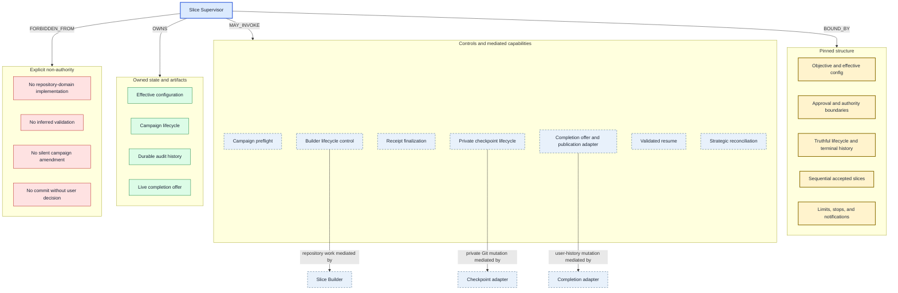
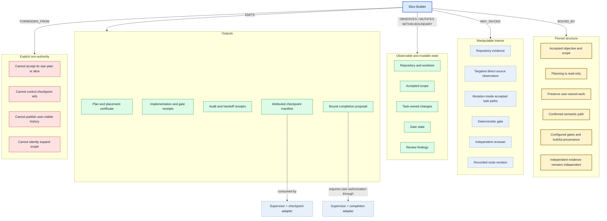
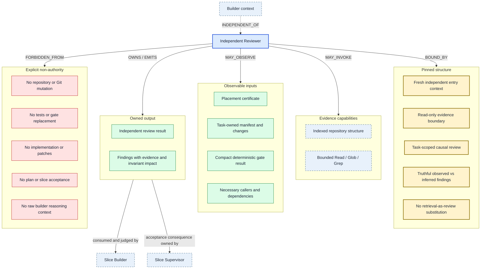

# Agent Environment Graphs

This document renders the first three role projections from
[`agent-environments.yaml`](agent-environments.yaml). The YAML file is the
automation-oriented projection source; invariant definitions and machinery
definitions remain owned by [`workflow-invariants.md`](workflow-invariants.md).

These diagrams describe each role's **declared operational world**. They are a
static verified baseline, not live runtime state and not a claim that every
platform or conversational influence is modeled.

## Slice Supervisor

The supervisor has broad lifecycle authority but deliberately weak repository
agency. Repository work, private Git mutation, publication, and strategic
judgment are available through owners rather than absorbed into the supervisor.

## Slice Builder

The builder has the richest manipulable interior, but its mutation authority is
bounded by accepted scope and attribution. It contributes checkpoint and commit
inputs without owning either Git lifecycle.

## Independent Reviewer

The reviewer has intentionally narrow agency: rich enough to independently
observe the bounded claim, but with no mutation, deterministic-gate, acceptance,
or campaign authority.

## Initial design observations

1. The supervisor's power is primarily lifecycle authority, not repository
   manipulation. Mediated capability edges are therefore central to its graph.
2. The builder's environment is intentionally the richest, but acceptance,
   checkpoint identity, durable append, and publication remain outside it.
3. The reviewer is not simply a builder with mutation disabled. It has a fresh
   context boundary, a narrower evidence objective, no deterministic-gate role,
   and an output that another role must judge.
4. `artifact.checkpoint_manifest` and `artifact.commit_proposal` are important
   ownership tests: builder emission does not imply lifecycle or mutation
   authority.
5. Negative authority is modeled explicitly. Missing `MAY_MUTATE` edges alone
   are insufficient because an incomplete projection could otherwise look like
   a prohibition.

## Automation path

The YAML already separates stable references from rendered presentation. A
future builder should:

1. validate invariant and mechanism references against
   `workflow-invariants.md` or its eventual structured successor;
2. validate entity references and role relation shapes;
3. expand role fields into typed edges;
4. render one Mermaid, Graphviz, or interactive projection per role;
5. run the declared analysis queries for obligation coverage, observability,
   authority, ownership, redundancy, procedural drift, and independence; and
6. optionally overlay effective campaign configuration and live runtime state
   without rewriting the role contract layer.

The rendered diagrams in this file are currently maintained manually. They
should be treated as views; `agent-environments.yaml` owns the role projection
data, and `workflow-invariants.md` owns invariant and machinery definitions.

