# Independent Reviewer Environment

<!-- Generated by skills/agent-environment-graph/scripts/agent_environment_graph.py. -->
<!-- invariant-sha256: 69e875a67edfb7bd58df263194de9c0f7b7133beae25eacc3c9ab6584b388ee2 -->
<!-- environment-sha256: e5f941c889988a12960686f003df0705d856914017346ae38db25b7bb3bc9f48 -->

[← Overall environment](../agent-environment-graphs.md) · [Role index](./README.md) · [Invariant catalog](../workflow-invariants.md) · [Lossless YAML projection](./independent-reviewer.yaml)

This page is a generated role-scoped projection. Its graph is an overview; the relation table is the
complete declared edge ledger for this role.

## Role contract

| Field | Value |
| --- | --- |
| Role ID | `role.independent_reviewer` |
| Objective | Provide fresh, read-only falsification or adversarial evidence that reduces correlated builder error for the bounded claim under review. |
| Context lifetime | fresh at entry; isolated and bounded to one review claim or remediation loop |
| Owning role contract | [`skills/claude-recon-implementation/SKILL.md`](../../skills/claude-recon-implementation/SKILL.md) |

## At a glance

| Pinned invariants | Capabilities | Observes | Mutates | Owns | Emits | Prohibitions |
| ---: | ---: | ---: | ---: | ---: | ---: | ---: |
| 7 | 2 | 6 | 0 | 2 | 1 | 7 |

Semantic colors are defined once in the [shared legend](../agent-environment-graphs.md#color-legend).

## Environment graph

```mermaid
flowchart TB
  classDef role fill:#111827,color:#ffffff,stroke:#000000,stroke-width:3px
  classDef invAuthority fill:#fef3c7,color:#451a03,stroke:#eab308,stroke-width:2px
  classDef invOwnership fill:#ede9fe,color:#2e1065,stroke:#7c3aed,stroke-width:2px
  classDef invMutation fill:#fee2e2,color:#450a0a,stroke:#dc2626,stroke-width:2px
  classDef invAcceptance fill:#dcfce7,color:#052e16,stroke:#16a34a,stroke-width:2px
  classDef invTruth fill:#92400e,color:#ffffff,stroke:#78350f,stroke-width:2px
  classDef invInterface fill:#dbeafe,color:#172554,stroke:#2563eb,stroke-width:2px
  classDef invIndependence fill:#ede9fe,color:#2e1065,stroke:#7c3aed,stroke-width:2px
  classDef invSecurity fill:#fee2e2,color:#450a0a,stroke:#dc2626,stroke-width:2px
  classDef invLifecycle fill:#ffffff,color:#111827,stroke:#9ca3af,stroke-width:2px
  classDef invDefault fill:#111827,color:#ffffff,stroke:#000000,stroke-width:2px
  classDef capability fill:#dbeafe,color:#172554,stroke:#2563eb,stroke-width:2px
  classDef owned fill:#dcfce7,color:#052e16,stroke:#16a34a,stroke-width:2px
  classDef observable fill:#dbeafe,color:#172554,stroke:#2563eb,stroke-width:2px
  classDef forbidden fill:#fee2e2,color:#450a0a,stroke:#dc2626,stroke-width:2px
  classDef transition fill:#ffedd5,color:#431407,stroke:#ea580c,stroke-width:2px
  R["Independent Reviewer"]
  class R role
  subgraph G1["Pinned structure"]
    direction TB
    N_role_independent_reviewer_1_INV_001["INV-001<br/>The original user objective remains authoritative"]
    class N_role_independent_reviewer_1_INV_001 invAuthority
    N_role_independent_reviewer_1_INV_002["INV-002<br/>The system acts only within granted authority and preserves every real…"]
    class N_role_independent_reviewer_1_INV_002 invAuthority
    N_role_independent_reviewer_1_INV_008["INV-008<br/>The slice has an explicit changed-output boundary, preserves baseline and…"]
    class N_role_independent_reviewer_1_INV_008 invOwnership
    N_role_independent_reviewer_1_INV_012["INV-012<br/>Evidence claimed as independent begins in a fresh context independent of…"]
    class N_role_independent_reviewer_1_INV_012 invIndependence
    N_role_independent_reviewer_1_INV_018["INV-018<br/>Observations, inference, configured values, actual execution, and…"]
    class N_role_independent_reviewer_1_INV_018 invTruth
    N_role_independent_reviewer_1_INV_020["INV-020<br/>Actual evidence capability, provider/role identity, attempt outcomes,…"]
    class N_role_independent_reviewer_1_INV_020 invTruth
    N_role_independent_reviewer_1_INV_023["INV-023<br/>Receipts and handoffs contain compact operational consequences, not raw…"]
    class N_role_independent_reviewer_1_INV_023 invSecurity
    N_role_independent_reviewer_1_INV_001 ~~~ N_role_independent_reviewer_1_INV_002
    N_role_independent_reviewer_1_INV_002 ~~~ N_role_independent_reviewer_1_INV_008
    N_role_independent_reviewer_1_INV_008 ~~~ N_role_independent_reviewer_1_INV_012
    N_role_independent_reviewer_1_INV_012 ~~~ N_role_independent_reviewer_1_INV_018
    N_role_independent_reviewer_1_INV_018 ~~~ N_role_independent_reviewer_1_INV_020
    N_role_independent_reviewer_1_INV_020 ~~~ N_role_independent_reviewer_1_INV_023
  end
  R -->|BOUND_BY| N_role_independent_reviewer_1_INV_001
  subgraph G2["Capabilities"]
    direction TB
    N_role_independent_reviewer_2_capability_reviewer_indexed_structure["Read-only indexed repository structure"]
    class N_role_independent_reviewer_2_capability_reviewer_indexed_structure capability
    N_role_independent_reviewer_2_capability_reviewer_direct_source["Bounded read-only Read/Glob/Grep"]
    class N_role_independent_reviewer_2_capability_reviewer_direct_source capability
    N_role_independent_reviewer_2_capability_reviewer_indexed_structure ~~~ N_role_independent_reviewer_2_capability_reviewer_direct_source
  end
  N_role_independent_reviewer_1_INV_023 ~~~ N_role_independent_reviewer_2_capability_reviewer_indexed_structure
  R -->|MAY_INVOKE| N_role_independent_reviewer_2_capability_reviewer_indexed_structure
  subgraph G3["Owned state and artifacts"]
    direction TB
    N_role_independent_reviewer_3_state_reviewer_context["Reviewer reasoning context"]
    class N_role_independent_reviewer_3_state_reviewer_context owned
    N_role_independent_reviewer_3_artifact_review_result["Independent review result"]
    class N_role_independent_reviewer_3_artifact_review_result owned
    N_role_independent_reviewer_3_state_reviewer_context ~~~ N_role_independent_reviewer_3_artifact_review_result
  end
  N_role_independent_reviewer_2_capability_reviewer_direct_source ~~~ N_role_independent_reviewer_3_state_reviewer_context
  R -->|OWNS| N_role_independent_reviewer_3_state_reviewer_context
  subgraph G4["Observable inputs"]
    direction TB
    N_role_independent_reviewer_4_state_repository["Repository structure and source"]
    class N_role_independent_reviewer_4_state_repository observable
    N_role_independent_reviewer_4_state_task_changes["Task-owned implementation changes"]
    class N_role_independent_reviewer_4_state_task_changes observable
    N_role_independent_reviewer_4_state_gate["Deterministic gate state"]
    class N_role_independent_reviewer_4_state_gate observable
    N_role_independent_reviewer_4_artifact_placement_certificate["Semantic-path placement certificate"]
    class N_role_independent_reviewer_4_artifact_placement_certificate observable
    N_role_independent_reviewer_4_artifact_gate_receipt["Deterministic gate receipt"]
    class N_role_independent_reviewer_4_artifact_gate_receipt observable
    N_role_independent_reviewer_4_artifact_checkpoint_manifest["Attributed checkpoint manifest"]
    class N_role_independent_reviewer_4_artifact_checkpoint_manifest observable
    N_role_independent_reviewer_4_state_repository ~~~ N_role_independent_reviewer_4_state_task_changes
    N_role_independent_reviewer_4_state_task_changes ~~~ N_role_independent_reviewer_4_state_gate
    N_role_independent_reviewer_4_state_gate ~~~ N_role_independent_reviewer_4_artifact_placement_certificate
    N_role_independent_reviewer_4_artifact_placement_certificate ~~~ N_role_independent_reviewer_4_artifact_gate_receipt
    N_role_independent_reviewer_4_artifact_gate_receipt ~~~ N_role_independent_reviewer_4_artifact_checkpoint_manifest
  end
  N_role_independent_reviewer_3_artifact_review_result ~~~ N_role_independent_reviewer_4_state_repository
  R -->|MAY_OBSERVE| N_role_independent_reviewer_4_state_repository
  subgraph G5["Explicit non-authority"]
    direction TB
    N_role_independent_reviewer_5_deny_1["mutating repository files, worktree, index, refs, or generated artifacts"]
    class N_role_independent_reviewer_5_deny_1 forbidden
    N_role_independent_reviewer_5_deny_2["writing patches or implementing fixes"]
    class N_role_independent_reviewer_5_deny_2 forbidden
    N_role_independent_reviewer_5_deny_3["running or replacing deterministic tests and gates"]
    class N_role_independent_reviewer_5_deny_3 forbidden
    N_role_independent_reviewer_5_deny_4["accepting a plan or slice"]
    class N_role_independent_reviewer_5_deny_4 forbidden
    N_role_independent_reviewer_5_deny_5["changing campaign configuration, objective, or scope"]
    class N_role_independent_reviewer_5_deny_5 forbidden
    N_role_independent_reviewer_5_deny_6["treating a retrieval packet as independent observation"]
    class N_role_independent_reviewer_5_deny_6 forbidden
    N_role_independent_reviewer_5_deny_7["broadening review beyond task-owned changes without causal evidence"]
    class N_role_independent_reviewer_5_deny_7 forbidden
    N_role_independent_reviewer_5_deny_1 ~~~ N_role_independent_reviewer_5_deny_2
    N_role_independent_reviewer_5_deny_2 ~~~ N_role_independent_reviewer_5_deny_3
    N_role_independent_reviewer_5_deny_3 ~~~ N_role_independent_reviewer_5_deny_4
    N_role_independent_reviewer_5_deny_4 ~~~ N_role_independent_reviewer_5_deny_5
    N_role_independent_reviewer_5_deny_5 ~~~ N_role_independent_reviewer_5_deny_6
    N_role_independent_reviewer_5_deny_6 ~~~ N_role_independent_reviewer_5_deny_7
  end
  N_role_independent_reviewer_4_artifact_checkpoint_manifest ~~~ N_role_independent_reviewer_5_deny_1
  R -->|FORBIDDEN_FROM| N_role_independent_reviewer_5_deny_1
```

## Complete relation table

| Relation | Target | Label | Semantic class |
| --- | --- | --- | --- |
| `BOUND_BY` | `INV-001` | The original user objective remains authoritative | 🟡 authority |
| `BOUND_BY` | `INV-002` | The system acts only within granted authority and preserves every real… | 🟡 authority |
| `BOUND_BY` | `INV-008` | The slice has an explicit changed-output boundary, preserves baseline and… | 🟣 ownership |
| `BOUND_BY` | `INV-012` | Evidence claimed as independent begins in a fresh context independent of… | 🟣 independence |
| `BOUND_BY` | `INV-018` | Observations, inference, configured values, actual execution, and… | 🟤 truth⁠/⁠provenance |
| `BOUND_BY` | `INV-020` | Actual evidence capability, provider/role identity, attempt outcomes,… | 🟤 truth⁠/⁠provenance |
| `BOUND_BY` | `INV-023` | Receipts and handoffs contain compact operational consequences, not raw… | 🔴 security |
| `MAY_INVOKE` | `capability.reviewer_indexed_structure` | Read-only indexed repository structure | 🔵 capability |
| `MAY_INVOKE` | `capability.reviewer_direct_source` | Bounded read-only Read/Glob/Grep | 🔵 capability |
| `OWNS` | `state.reviewer_context` | Reviewer reasoning context | 🟢 owned⁠/⁠output |
| `OWNS` | `artifact.review_result` | Independent review result | 🟢 owned⁠/⁠output |
| `MAY_OBSERVE` | `state.repository` | Repository structure and source | 🔵 observation⁠/⁠input |
| `MAY_OBSERVE` | `state.task_changes` | Task-owned implementation changes | 🔵 observation⁠/⁠input |
| `MAY_OBSERVE` | `state.gate` | Deterministic gate state | 🔵 observation⁠/⁠input |
| `MAY_OBSERVE` | `artifact.placement_certificate` | Semantic-path placement certificate | 🔵 observation⁠/⁠input |
| `MAY_OBSERVE` | `artifact.gate_receipt` | Deterministic gate receipt | 🔵 observation⁠/⁠input |
| `MAY_OBSERVE` | `artifact.checkpoint_manifest` | Attributed checkpoint manifest | 🔵 observation⁠/⁠input |
| `CONSUMES` | `artifact.placement_certificate` | Semantic-path placement certificate | 🔵 observation⁠/⁠input |
| `CONSUMES` | `artifact.gate_receipt` | Deterministic gate receipt | 🔵 observation⁠/⁠input |
| `CONSUMES` | `artifact.checkpoint_manifest` | Attributed checkpoint manifest | 🔵 observation⁠/⁠input |
| `EMITS` | `artifact.review_result` | Independent review result | 🟢 owned⁠/⁠output |
| `FORBIDDEN_FROM` | `deny-1` | mutating repository files, worktree, index, refs, or generated artifacts | 🔴 prohibition |
| `FORBIDDEN_FROM` | `deny-2` | writing patches or implementing fixes | 🔴 prohibition |
| `FORBIDDEN_FROM` | `deny-3` | running or replacing deterministic tests and gates | 🔴 prohibition |
| `FORBIDDEN_FROM` | `deny-4` | accepting a plan or slice | 🔴 prohibition |
| `FORBIDDEN_FROM` | `deny-5` | changing campaign configuration, objective, or scope | 🔴 prohibition |
| `FORBIDDEN_FROM` | `deny-6` | treating a retrieval packet as independent observation | 🔴 prohibition |
| `FORBIDDEN_FROM` | `deny-7` | broadening review beyond task-owned changes without causal evidence | 🔴 prohibition |

## Independence boundary

| Constraint | Value |
| --- | --- |
| `independent_of` | state.builder_context |
| `cannot_inspect` | raw builder reasoning transcript |
| `evidence_boundary` | The reviewer observes the accepted claim, attributed changes, compact deterministic evidence, and only the repository context needed to falsify or review them. |

## Explicit non-authority

- mutating repository files, worktree, index, refs, or generated artifacts
- writing patches or implementing fixes
- running or replacing deterministic tests and gates
- accepting a plan or slice
- changing campaign configuration, objective, or scope
- treating a retrieval packet as independent observation
- broadening review beyond task-owned changes without causal evidence
