# Slice Builder Environment

<!-- Generated by skills/agent-environment-graph/scripts/agent_environment_graph.py. -->
<!-- invariant-sha256: 8586f785a7b707c8c90583caba8174f5c28b61bb874ca8108e6e54eca0b132d9 -->
<!-- environment-sha256: ad7a49c73a773d9d077053def9739892a99d00f411558fb2e79df1dbf9fe56c7 -->

[← Overall environment](../agent-environment-graphs.md) · [Role index](./README.md) · [Invariant catalog](../workflow-invariants.md) · [Lossless YAML projection](./slice-builder.yaml)

This page is a generated role-scoped projection. Its graph is an overview; the relation table is the
complete declared edge ledger for this role.

## Role contract

| Field | Value |
| --- | --- |
| Role ID | `role.builder` |
| Objective | Own one accepted engineering slice from repository understanding through implementation, validation, remediation, and truthful receipts. |
| Context lifetime | one slice across planning, implementation, and gate phases |
| Owning role contract | [`skills/slice-builder/SKILL.md`](../../skills/slice-builder/SKILL.md) |

## At a glance

| Pinned invariants | Capabilities | Observes | Mutates | Owns | Emits | Prohibitions |
| ---: | ---: | ---: | ---: | ---: | ---: | ---: |
| 22 | 5 | 9 | 2 | 7 | 8 | 8 |

Semantic colors are defined once in the [shared legend](../agent-environment-graphs.md#color-legend).

## Environment graph

```mermaid
flowchart TB
  classDef role fill:#111827,color:#ffffff,stroke:#000000,stroke-width:3px
  classDef invAuthority fill:#fef3c7,color:#451a03,stroke:#eab308,stroke-width:2px
  classDef invOwnership fill:#ede9fe,color:#2e1065,stroke:#7c3aed,stroke-width:2px
  classDef invMutation fill:#fee2e2,color:#450a0a,stroke:#dc2626,stroke-width:2px
  classDef invAcceptance fill:#dcfce7,color:#052e16,stroke:#16a34a,stroke-width:2px
  classDef invTruth fill:#92400e,color:#ffffff,stroke:#78350f,stroke-width:2px
  classDef invInterface fill:#dbeafe,color:#172554,stroke:#2563eb,stroke-width:2px
  classDef invIndependence fill:#ede9fe,color:#2e1065,stroke:#7c3aed,stroke-width:2px
  classDef invSecurity fill:#fee2e2,color:#450a0a,stroke:#dc2626,stroke-width:2px
  classDef invLifecycle fill:#ffffff,color:#111827,stroke:#9ca3af,stroke-width:2px
  classDef invDefault fill:#111827,color:#ffffff,stroke:#000000,stroke-width:2px
  classDef capability fill:#dbeafe,color:#172554,stroke:#2563eb,stroke-width:2px
  classDef owned fill:#dcfce7,color:#052e16,stroke:#16a34a,stroke-width:2px
  classDef observable fill:#dbeafe,color:#172554,stroke:#2563eb,stroke-width:2px
  classDef forbidden fill:#fee2e2,color:#450a0a,stroke:#dc2626,stroke-width:2px
  classDef transition fill:#ffedd5,color:#431407,stroke:#ea580c,stroke-width:2px
  R["Slice Builder"]
  class R role
  subgraph G1["Pinned structure"]
    direction TB
    N_role_builder_1_INV_001["INV-001<br/>The original user objective remains authoritative"]
    class N_role_builder_1_INV_001 invAuthority
    N_role_builder_1_INV_002["INV-002<br/>The system acts only within granted authority and preserves every real…"]
    class N_role_builder_1_INV_002 invAuthority
    N_role_builder_1_INV_003["INV-003<br/>The effective campaign configuration preserves explicit versus defaulted…"]
    class N_role_builder_1_INV_003 invTruth
    N_role_builder_1_INV_004["INV-004<br/>Unknown fields, meaningful source conflicts, unsupported builder…"]
    class N_role_builder_1_INV_004 invInterface
    N_role_builder_1_INV_006["INV-006<br/>One configured builder owns repository understanding, architectural…"]
    class N_role_builder_1_INV_006 invOwnership
    N_role_builder_1_INV_007["INV-007<br/>Planning is read-only and produces an evidence-based bounded plan"]
    class N_role_builder_1_INV_007 invMutation
    N_role_builder_1_INV_008["INV-008<br/>The slice has an explicit changed-output boundary, preserves baseline and…"]
    class N_role_builder_1_INV_008 invOwnership
    N_role_builder_1_INV_009["INV-009<br/>Every implementation has an explicit accepted plan recorded as procedural…"]
    class N_role_builder_1_INV_009 invAuthority
    N_role_builder_1_INV_010["INV-010<br/>When evidence invalidates a premise, boundary, route, or acceptance…"]
    class N_role_builder_1_INV_010 invLifecycle
    N_role_builder_1_INV_011["INV-011<br/>A confirmed semantic-path certificate identifies the actual trigger,…"]
    class N_role_builder_1_INV_011 invInterface
    N_role_builder_1_INV_012["INV-012<br/>Evidence claimed as independent begins in a fresh context independent of…"]
    class N_role_builder_1_INV_012 invIndependence
    N_role_builder_1_INV_013["INV-013<br/>Implementation uses the accepted boundary and semantic-path certificate"]
    class N_role_builder_1_INV_013 invLifecycle
    N_role_builder_1_INV_014["INV-014<br/>Every configured validation requirement is mapped to observable evidence…"]
    class N_role_builder_1_INV_014 invAcceptance
    N_role_builder_1_INV_015["INV-015<br/>A slice is accepted only after its vertical semantic proof is observed,…"]
    class N_role_builder_1_INV_015 invAcceptance
    N_role_builder_1_INV_016["INV-016<br/>The builder identity remains stable through the normal planning,…"]
    class N_role_builder_1_INV_016 invLifecycle
    N_role_builder_1_INV_018["INV-018<br/>Observations, inference, configured values, actual execution, and…"]
    class N_role_builder_1_INV_018 invTruth
    N_role_builder_1_INV_020["INV-020<br/>Actual evidence capability, provider/role identity, attempt outcomes,…"]
    class N_role_builder_1_INV_020 invTruth
    N_role_builder_1_INV_022["INV-022<br/>The compact builder handoff is non-durable context and is never appended…"]
    class N_role_builder_1_INV_022 invOwnership
    N_role_builder_1_INV_023["INV-023<br/>Receipts and handoffs contain compact operational consequences, not raw…"]
    class N_role_builder_1_INV_023 invSecurity
    N_role_builder_1_INV_027["INV-027<br/>A user-visible commit requires an explicit per-slice create decision over…"]
    class N_role_builder_1_INV_027 invAuthority
    N_role_builder_1_INV_030["INV-030<br/>Stops and failures preserve the exact triggering condition and are never…"]
    class N_role_builder_1_INV_030 invTruth
    N_role_builder_1_INV_034["INV-034<br/>Explicit hard limits and stop conditions remain binding, are never…"]
    class N_role_builder_1_INV_034 invAuthority
    N_role_builder_1_INV_001 ~~~ N_role_builder_1_INV_002
    N_role_builder_1_INV_002 ~~~ N_role_builder_1_INV_003
    N_role_builder_1_INV_003 ~~~ N_role_builder_1_INV_004
    N_role_builder_1_INV_004 ~~~ N_role_builder_1_INV_006
    N_role_builder_1_INV_006 ~~~ N_role_builder_1_INV_007
    N_role_builder_1_INV_007 ~~~ N_role_builder_1_INV_008
    N_role_builder_1_INV_008 ~~~ N_role_builder_1_INV_009
    N_role_builder_1_INV_009 ~~~ N_role_builder_1_INV_010
    N_role_builder_1_INV_010 ~~~ N_role_builder_1_INV_011
    N_role_builder_1_INV_011 ~~~ N_role_builder_1_INV_012
    N_role_builder_1_INV_012 ~~~ N_role_builder_1_INV_013
    N_role_builder_1_INV_013 ~~~ N_role_builder_1_INV_014
    N_role_builder_1_INV_014 ~~~ N_role_builder_1_INV_015
    N_role_builder_1_INV_015 ~~~ N_role_builder_1_INV_016
    N_role_builder_1_INV_016 ~~~ N_role_builder_1_INV_018
    N_role_builder_1_INV_018 ~~~ N_role_builder_1_INV_020
    N_role_builder_1_INV_020 ~~~ N_role_builder_1_INV_022
    N_role_builder_1_INV_022 ~~~ N_role_builder_1_INV_023
    N_role_builder_1_INV_023 ~~~ N_role_builder_1_INV_027
    N_role_builder_1_INV_027 ~~~ N_role_builder_1_INV_030
    N_role_builder_1_INV_030 ~~~ N_role_builder_1_INV_034
  end
  R -->|BOUND_BY| N_role_builder_1_INV_001
  subgraph G2["Capabilities"]
    direction TB
    N_role_builder_2_capability_repository_evidence["Configured repository evidence"]
    class N_role_builder_2_capability_repository_evidence capability
    N_role_builder_2_capability_direct_source_observation["Targeted direct-source observation"]
    class N_role_builder_2_capability_direct_source_observation capability
    N_role_builder_2_capability_repository_mutation["Repository mutation tools"]
    class N_role_builder_2_capability_repository_mutation capability
    N_role_builder_2_capability_deterministic_gate["Deterministic gate execution"]
    class N_role_builder_2_capability_deterministic_gate capability
    N_role_builder_2_capability_independent_review["Fresh read-only independent review"]
    class N_role_builder_2_capability_independent_review capability
    N_role_builder_2_capability_repository_evidence ~~~ N_role_builder_2_capability_direct_source_observation
    N_role_builder_2_capability_direct_source_observation ~~~ N_role_builder_2_capability_repository_mutation
    N_role_builder_2_capability_repository_mutation ~~~ N_role_builder_2_capability_deterministic_gate
    N_role_builder_2_capability_deterministic_gate ~~~ N_role_builder_2_capability_independent_review
  end
  N_role_builder_1_INV_034 ~~~ N_role_builder_2_capability_repository_evidence
  R -->|MAY_INVOKE| N_role_builder_2_capability_repository_evidence
  subgraph G3["Owned state and artifacts"]
    direction TB
    N_role_builder_3_state_builder_context["Builder reasoning context"]
    class N_role_builder_3_state_builder_context owned
    N_role_builder_3_artifact_plan["Evidence-based slice plan"]
    class N_role_builder_3_artifact_plan owned
    N_role_builder_3_artifact_placement_certificate["Semantic-path placement certificate"]
    class N_role_builder_3_artifact_placement_certificate owned
    N_role_builder_3_artifact_implementation_receipt["Implementation receipt"]
    class N_role_builder_3_artifact_implementation_receipt owned
    N_role_builder_3_artifact_gate_receipt["Deterministic gate receipt"]
    class N_role_builder_3_artifact_gate_receipt owned
    N_role_builder_3_artifact_handoff_receipt["Compact handoff receipt"]
    class N_role_builder_3_artifact_handoff_receipt owned
    N_role_builder_3_artifact_commit_proposal["Completion commit proposal"]
    class N_role_builder_3_artifact_commit_proposal owned
    N_role_builder_3_state_builder_context ~~~ N_role_builder_3_artifact_plan
    N_role_builder_3_artifact_plan ~~~ N_role_builder_3_artifact_placement_certificate
    N_role_builder_3_artifact_placement_certificate ~~~ N_role_builder_3_artifact_implementation_receipt
    N_role_builder_3_artifact_implementation_receipt ~~~ N_role_builder_3_artifact_gate_receipt
    N_role_builder_3_artifact_gate_receipt ~~~ N_role_builder_3_artifact_handoff_receipt
    N_role_builder_3_artifact_handoff_receipt ~~~ N_role_builder_3_artifact_commit_proposal
  end
  N_role_builder_2_capability_independent_review ~~~ N_role_builder_3_state_builder_context
  R -->|OWNS| N_role_builder_3_state_builder_context
  subgraph G4["Observable inputs"]
    direction TB
    N_role_builder_4_state_campaign_config["Effective campaign configuration"]
    class N_role_builder_4_state_campaign_config observable
    N_role_builder_4_state_accepted_scope["Accepted slice scope"]
    class N_role_builder_4_state_accepted_scope observable
    N_role_builder_4_state_repository["Repository structure and source"]
    class N_role_builder_4_state_repository observable
    N_role_builder_4_state_worktree["Ordinary worktree and real index"]
    class N_role_builder_4_state_worktree observable
    N_role_builder_4_state_task_changes["Task-owned implementation changes"]
    class N_role_builder_4_state_task_changes observable
    N_role_builder_4_state_gate["Deterministic gate state"]
    class N_role_builder_4_state_gate observable
    N_role_builder_4_state_review["Independent review state"]
    class N_role_builder_4_state_review observable
    N_role_builder_4_artifact_handoff_receipt["Compact handoff receipt"]
    class N_role_builder_4_artifact_handoff_receipt observable
    N_role_builder_4_artifact_review_result["Independent review result"]
    class N_role_builder_4_artifact_review_result observable
    N_role_builder_4_state_campaign_config ~~~ N_role_builder_4_state_accepted_scope
    N_role_builder_4_state_accepted_scope ~~~ N_role_builder_4_state_repository
    N_role_builder_4_state_repository ~~~ N_role_builder_4_state_worktree
    N_role_builder_4_state_worktree ~~~ N_role_builder_4_state_task_changes
    N_role_builder_4_state_task_changes ~~~ N_role_builder_4_state_gate
    N_role_builder_4_state_gate ~~~ N_role_builder_4_state_review
    N_role_builder_4_state_review ~~~ N_role_builder_4_artifact_handoff_receipt
    N_role_builder_4_artifact_handoff_receipt ~~~ N_role_builder_4_artifact_review_result
  end
  N_role_builder_3_artifact_commit_proposal ~~~ N_role_builder_4_state_campaign_config
  R -->|MAY_OBSERVE| N_role_builder_4_state_campaign_config
  subgraph G5["Explicit non-authority"]
    direction TB
    N_role_builder_5_deny_1["mutating during planning"]
    class N_role_builder_5_deny_1 forbidden
    N_role_builder_5_deny_2["silently expanding the accepted boundary"]
    class N_role_builder_5_deny_2 forbidden
    N_role_builder_5_deny_3["mutating user-owned or unattributable work"]
    class N_role_builder_5_deny_3 forbidden
    N_role_builder_5_deny_4["treating retrieval as independent review"]
    class N_role_builder_5_deny_4 forbidden
    N_role_builder_5_deny_5["weakening configured validation"]
    class N_role_builder_5_deny_5 forbidden
    N_role_builder_5_deny_6["accepting its own slice"]
    class N_role_builder_5_deny_6 forbidden
    N_role_builder_5_deny_7["directly controlling checkpoint refs or user-visible Git publication"]
    class N_role_builder_5_deny_7 forbidden
    N_role_builder_5_deny_8["running concurrent replacement builders on the same mutable workspace"]
    class N_role_builder_5_deny_8 forbidden
    N_role_builder_5_deny_1 ~~~ N_role_builder_5_deny_2
    N_role_builder_5_deny_2 ~~~ N_role_builder_5_deny_3
    N_role_builder_5_deny_3 ~~~ N_role_builder_5_deny_4
    N_role_builder_5_deny_4 ~~~ N_role_builder_5_deny_5
    N_role_builder_5_deny_5 ~~~ N_role_builder_5_deny_6
    N_role_builder_5_deny_6 ~~~ N_role_builder_5_deny_7
    N_role_builder_5_deny_7 ~~~ N_role_builder_5_deny_8
  end
  N_role_builder_4_artifact_review_result ~~~ N_role_builder_5_deny_1
  R -->|FORBIDDEN_FROM| N_role_builder_5_deny_1
  N_role_builder_5_deny_8 ~~~ N_role_builder_transition_1
  N_role_builder_transition_1["plan acceptance"]
  class N_role_builder_transition_1 transition
  R -.->|MEDIATED_BY role.supervisor| N_role_builder_transition_1
  N_role_builder_transition_1 ~~~ N_role_builder_transition_2
  N_role_builder_transition_2["private checkpoint creation or acceptance"]
  class N_role_builder_transition_2 transition
  R -.->|MEDIATED_BY role.supervisor| N_role_builder_transition_2
  N_role_builder_transition_2 ~~~ N_role_builder_transition_3
  N_role_builder_transition_3["user-visible commit publication"]
  class N_role_builder_transition_3 transition
  R -.->|MEDIATED_BY role.supervisor| N_role_builder_transition_3
  N_role_builder_transition_3 ~~~ N_role_builder_transition_4
  N_role_builder_transition_4["durable audit append"]
  class N_role_builder_transition_4 transition
  R -.->|MEDIATED_BY capability.receipt_finalization| N_role_builder_transition_4
```

## Complete relation table

| Relation | Target | Label | Semantic class |
| --- | --- | --- | --- |
| `BOUND_BY` | `INV-001` | The original user objective remains authoritative | 🟡 authority |
| `BOUND_BY` | `INV-002` | The system acts only within granted authority and preserves every real… | 🟡 authority |
| `BOUND_BY` | `INV-003` | The effective campaign configuration preserves explicit versus defaulted… | 🟤 truth⁠/⁠provenance |
| `BOUND_BY` | `INV-004` | Unknown fields, meaningful source conflicts, unsupported builder… | 🔵 interface |
| `BOUND_BY` | `INV-006` | One configured builder owns repository understanding, architectural… | 🟣 ownership |
| `BOUND_BY` | `INV-007` | Planning is read-only and produces an evidence-based bounded plan | 🔴 mutation |
| `BOUND_BY` | `INV-008` | The slice has an explicit changed-output boundary, preserves baseline and… | 🟣 ownership |
| `BOUND_BY` | `INV-009` | Every implementation has an explicit accepted plan recorded as procedural… | 🟡 authority |
| `BOUND_BY` | `INV-010` | When evidence invalidates a premise, boundary, route, or acceptance… | ⚪ lifecycle⁠/⁠context |
| `BOUND_BY` | `INV-011` | A confirmed semantic-path certificate identifies the actual trigger,… | 🔵 interface |
| `BOUND_BY` | `INV-012` | Evidence claimed as independent begins in a fresh context independent of… | 🟣 independence |
| `BOUND_BY` | `INV-013` | Implementation uses the accepted boundary and semantic-path certificate | ⚪ lifecycle⁠/⁠context |
| `BOUND_BY` | `INV-014` | Every configured validation requirement is mapped to observable evidence… | 🟢 acceptance |
| `BOUND_BY` | `INV-015` | A slice is accepted only after its vertical semantic proof is observed,… | 🟢 acceptance |
| `BOUND_BY` | `INV-016` | The builder identity remains stable through the normal planning,… | ⚪ lifecycle⁠/⁠context |
| `BOUND_BY` | `INV-018` | Observations, inference, configured values, actual execution, and… | 🟤 truth⁠/⁠provenance |
| `BOUND_BY` | `INV-020` | Actual evidence capability, provider/role identity, attempt outcomes,… | 🟤 truth⁠/⁠provenance |
| `BOUND_BY` | `INV-022` | The compact builder handoff is non-durable context and is never appended… | 🟣 ownership |
| `BOUND_BY` | `INV-023` | Receipts and handoffs contain compact operational consequences, not raw… | 🔴 security |
| `BOUND_BY` | `INV-027` | A user-visible commit requires an explicit per-slice create decision over… | 🟡 authority |
| `BOUND_BY` | `INV-030` | Stops and failures preserve the exact triggering condition and are never… | 🟤 truth⁠/⁠provenance |
| `BOUND_BY` | `INV-034` | Explicit hard limits and stop conditions remain binding, are never… | 🟡 authority |
| `MAY_INVOKE` | `capability.repository_evidence` | Configured repository evidence | 🔵 capability |
| `MAY_INVOKE` | `capability.direct_source_observation` | Targeted direct-source observation | 🔵 capability |
| `MAY_INVOKE` | `capability.repository_mutation` | Repository mutation tools | 🔵 capability |
| `MAY_INVOKE` | `capability.deterministic_gate` | Deterministic gate execution | 🔵 capability |
| `MAY_INVOKE` | `capability.independent_review` | Fresh read-only independent review | 🔵 capability |
| `OWNS` | `state.builder_context` | Builder reasoning context | 🟢 owned⁠/⁠output |
| `OWNS` | `artifact.plan` | Evidence-based slice plan | 🟢 owned⁠/⁠output |
| `OWNS` | `artifact.placement_certificate` | Semantic-path placement certificate | 🟢 owned⁠/⁠output |
| `OWNS` | `artifact.implementation_receipt` | Implementation receipt | 🟢 owned⁠/⁠output |
| `OWNS` | `artifact.gate_receipt` | Deterministic gate receipt | 🟢 owned⁠/⁠output |
| `OWNS` | `artifact.handoff_receipt` | Compact handoff receipt | 🟢 owned⁠/⁠output |
| `OWNS` | `artifact.commit_proposal` | Completion commit proposal | 🟢 owned⁠/⁠output |
| `MAY_OBSERVE` | `state.campaign_config` | Effective campaign configuration | 🔵 observation⁠/⁠input |
| `MAY_OBSERVE` | `state.accepted_scope` | Accepted slice scope | 🔵 observation⁠/⁠input |
| `MAY_OBSERVE` | `state.repository` | Repository structure and source | 🔵 observation⁠/⁠input |
| `MAY_OBSERVE` | `state.worktree` | Ordinary worktree and real index | 🔵 observation⁠/⁠input |
| `MAY_OBSERVE` | `state.task_changes` | Task-owned implementation changes | 🔵 observation⁠/⁠input |
| `MAY_OBSERVE` | `state.gate` | Deterministic gate state | 🔵 observation⁠/⁠input |
| `MAY_OBSERVE` | `state.review` | Independent review state | 🔵 observation⁠/⁠input |
| `MAY_OBSERVE` | `artifact.handoff_receipt` | Compact handoff receipt | 🔵 observation⁠/⁠input |
| `MAY_OBSERVE` | `artifact.review_result` | Independent review result | 🔵 observation⁠/⁠input |
| `CONSUMES` | `state.campaign_config` | Effective campaign configuration | 🔵 observation⁠/⁠input |
| `CONSUMES` | `state.accepted_scope` | Accepted slice scope | 🔵 observation⁠/⁠input |
| `CONSUMES` | `artifact.handoff_receipt` | Compact handoff receipt | 🔵 observation⁠/⁠input |
| `CONSUMES` | `artifact.review_result` | Independent review result | 🔵 observation⁠/⁠input |
| `EMITS` | `artifact.plan` | Evidence-based slice plan | 🟢 owned⁠/⁠output |
| `EMITS` | `artifact.placement_certificate` | Semantic-path placement certificate | 🟢 owned⁠/⁠output |
| `EMITS` | `artifact.implementation_receipt` | Implementation receipt | 🟢 owned⁠/⁠output |
| `EMITS` | `artifact.gate_receipt` | Deterministic gate receipt | 🟢 owned⁠/⁠output |
| `EMITS` | `artifact.audit_receipt` | Terminal audit receipt | 🟢 owned⁠/⁠output |
| `EMITS` | `artifact.handoff_receipt` | Compact handoff receipt | 🟢 owned⁠/⁠output |
| `EMITS` | `artifact.checkpoint_manifest` | Attributed checkpoint manifest | 🟢 owned⁠/⁠output |
| `EMITS` | `artifact.commit_proposal` | Completion commit proposal | 🟢 owned⁠/⁠output |
| `MAY_MUTATE` | `state.task_changes` | Task-owned implementation changes (boundary: accepted scope and exact task-owned manifest after plan acceptance) | 🔴 mutation |
| `MAY_MUTATE` | `state.worktree` | Ordinary worktree and real index (boundary: accepted task paths while preserving user-owned and unrelated work) | 🔴 mutation |
| `MEDIATED` | `transition-1` | plan acceptance (via role.supervisor) | 🟠 mediated transition |
| `MEDIATED` | `transition-2` | private checkpoint creation or acceptance (via role.supervisor) | 🟠 mediated transition |
| `MEDIATED` | `transition-3` | user-visible commit publication (via role.supervisor) | 🟠 mediated transition |
| `MEDIATED` | `transition-4` | durable audit append (via capability.receipt_finalization) | 🟠 mediated transition |
| `FORBIDDEN_FROM` | `deny-1` | mutating during planning | 🔴 prohibition |
| `FORBIDDEN_FROM` | `deny-2` | silently expanding the accepted boundary | 🔴 prohibition |
| `FORBIDDEN_FROM` | `deny-3` | mutating user-owned or unattributable work | 🔴 prohibition |
| `FORBIDDEN_FROM` | `deny-4` | treating retrieval as independent review | 🔴 prohibition |
| `FORBIDDEN_FROM` | `deny-5` | weakening configured validation | 🔴 prohibition |
| `FORBIDDEN_FROM` | `deny-6` | accepting its own slice | 🔴 prohibition |
| `FORBIDDEN_FROM` | `deny-7` | directly controlling checkpoint refs or user-visible Git publication | 🔴 prohibition |
| `FORBIDDEN_FROM` | `deny-8` | running concurrent replacement builders on the same mutable workspace | 🔴 prohibition |

## Mutation boundaries

| Target | Authorized boundary |
| --- | --- |
| `state.task_changes` (Task-owned implementation changes) | accepted scope and exact task-owned manifest after plan acceptance |
| `state.worktree` (Ordinary worktree and real index) | accepted task paths while preserving user-owned and unrelated work |

## Mediated transitions

| Transition | Mediated by |
| --- | --- |
| plan acceptance | `role.supervisor` |
| private checkpoint creation or acceptance | `role.supervisor` |
| user-visible commit publication | `role.supervisor` |
| durable audit append | `capability.receipt_finalization` |

## Explicit non-authority

- mutating during planning
- silently expanding the accepted boundary
- mutating user-owned or unattributable work
- treating retrieval as independent review
- weakening configured validation
- accepting its own slice
- directly controlling checkpoint refs or user-visible Git publication
- running concurrent replacement builders on the same mutable workspace
