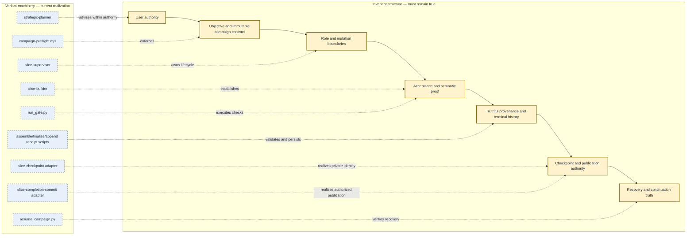

# Work Engine workflow invariant catalog

```yaml
document:
  id: work-engine.workflow-invariants
  version: 1
  status: verified-baseline
  verified_on: 2026-08-21
  evidence_tier: codebase-memory-tier-2-plus-direct-source
  graph_project: home-bline-code-work-engine
  graph_generation: 2026-08-21T18:37:04Z
  scope:
    - slice-supervisor campaign lifecycle
    - slice-builder planning, implementation, and gate lifecycle
    - terminal receipts and inter-slice recovery
    - private slice checkpoints
    - optional user-visible completion commits
    - isolated agent worktrees and shared-resource admission
    - fenced canonical Git publication
    - strategic reconciliation boundary
  excluded:
    - comparative-repository-analysis workflow
    - review-bench experiment contracts
    - Chrome Vision's internal observation contract
    - provider-specific implementation details below the configured adapter boundary
```

## Purpose and interpretation

This is the verified baseline catalog of product invariants for the primary
Work Engine slice workflow. It separates **invariant structure**—properties
whose violation makes a result invalid—from **variant machinery**—the current
components that help establish or enforce those properties.

The catalog is bounded by the `scope` metadata above. “Complete” means every
binding property found in the governing doctrine, workflow contracts, and
current enforcement boundaries within that scope is represented here. It does
not mean every imperative sentence is an invariant. Route preferences,
heuristics, named default routes, current provider choices, context-size advice,
and implementation mechanisms are intentionally excluded from invariant status.

Each invariant has stable metadata suitable for later graph projection:

| Field | Meaning |
| --- | --- |
| `id` | Stable node identity. |
| `owner` | Component or authority that owns the contract. |
| `applies` | Lifecycle states or boundaries where it binds. |
| `class` | Authority, ownership, mutation, interface, provenance, acceptance, lifecycle, or truth. |
| `condition` | The smallest statement that must remain true. |
| `causal_parent / invalid_state` | Product reality that makes the condition necessary, followed by the concrete failure if it is violated. |
| `enforcement` | Current deterministic, model-enforced, or human-enforced realization. |
| `mechanisms` | IDs of current machinery; these are replaceable architecture. |
| `relations` | Other invariant IDs constrained or required by this one. |
| `sources` | Owning doctrine, contract, and implementation evidence. |

Configuration-dependent invariants bind when the corresponding capability,
validation requirement, hard limit, notification rule, or optional completion
flow is enabled. Their conditional nature is part of the contract, not a lower
confidence classification.

## Structural and machinery views



Solid nodes are product structure. Dashed relationships point from replaceable
machinery to the structure it currently realizes. Replacing `run_gate.py`, a
private Git ref, or a provider does not change the corresponding invariant as
long as the protected property remains true.

## Invariant catalog

### Campaign contract and authority

| ID | Owner | Applies | Class | Condition | Causal parent / invalid state | Enforcement | Mechanisms | Relations | Sources |
| --- | --- | --- | --- | --- | --- | --- | --- | --- | --- |
| `INV-001` | user | entire run | authority | The original user objective remains authoritative; work sources and builders may organize evidence but may not silently narrow, broaden, reinterpret, or omit it. | The campaign exists to serve the delegated objective. A locally coherent result for a changed objective is not valid completion. | model + receipt review | `MECH-SUPERVISOR`, `MECH-RECEIPT` | requires `INV-003`, `INV-030`; constrains `INV-007`, `INV-027` | [Design §1.1](../DESIGN.md#11-contracts-and-invariants), [Supervisor: resolve contract](../skills/slice-supervisor/SKILL.md#resolve-the-campaign-contract) |
| `INV-002` | user / owning contract | entire run | authority | The system acts only within granted authority and preserves every real human approval boundary. New product, ownership, value, destructive, publication, migration, or configuration authority must come from its owner. | Model decision authority is subordinate to user authority. Acting without authority makes the transition invalid even if technically successful. | model + explicit user decision | `MECH-SUPERVISOR`, `MECH-COMPLETION` | constrains `INV-009`, `INV-024`, `INV-027` | [Design §11](../DESIGN.md#11-user-authority-and-approval), [Supervisor: accept or escalate](../skills/slice-supervisor/SKILL.md#accept-or-escalate-the-plan) |
| `INV-003` | supervisor | run initialization and every terminal receipt | provenance | The effective campaign configuration preserves explicit versus defaulted ownership, campaign-source identity, and authorized amendments; the initial resolved contract is immutable within a run except for a recorded human-approved amendment. | Configuration determines authority and acceptance. Silent reinterpretation makes later behavior and receipts unauditable. | deterministic preflight + assembly validation | `MECH-PREFLIGHT`, `MECH-ASSEMBLER` | supports `INV-001`, `INV-002`, `INV-020`, `INV-028` | [Configuration: provenance](../skills/slice-supervisor/references/work-engine-config.md#provenance-and-amendments), [`preflightCampaign`](../skills/slice-supervisor/scripts/campaign-preflight.mjs) |
| `INV-004` | supervisor | initialization | interface | Unknown fields, meaningful source conflicts, unsupported builder capabilities, and unknown validation requirements fail closed; the supervisor may not emulate or silently weaken a missing capability. | Misspellings or unsupported adapters can silently change the campaign contract. Continuing would claim guarantees the machinery cannot provide. | deterministic preflight + adapter declaration | `MECH-PREFLIGHT`, `MECH-SUPERVISOR`, `MECH-BUILDER` | requires `INV-003`; protects `INV-014` | [Configuration: builder adapter](../skills/slice-supervisor/references/work-engine-config.md#builder-adapter-contract), [Builder: launch](../skills/slice-builder/SKILL.md#launch-the-builder) |
| `INV-005` | supervisor | entire run | ownership | The supervisor owns configuration, lifecycle, acceptance, limits, durable records, continuation, and human escalation; it does not perform or re-derive repository inspection, implementation, or domain validation. | Supervisor context is the campaign control plane. Mixing builder work into it collapses ownership and defeats bounded context and receipt boundaries. | role instruction | `MECH-SUPERVISOR` | paired with `INV-006`; supports `INV-019` | [Supervisor](../skills/slice-supervisor/SKILL.md), [Builder](../skills/slice-builder/SKILL.md) |
| `INV-006` | builder | one slice | ownership | One configured builder owns repository understanding, architectural judgment, implementation, checks, review remediation, and both builder receipts for one coherent slice. | Split responsibility can lose the semantic path and make ownership or evidence attribution ambiguous. | role instruction + builder identity tracking | `MECH-BUILDER` | paired with `INV-005`; supports `INV-011`, `INV-016`, `INV-019` | [Builder](../skills/slice-builder/SKILL.md) |
| `INV-034` | user / supervisor | entire run | authority / lifecycle | Explicit hard limits and stop conditions remain binding, are never invented when absent, and cause a truthful stop when crossed; absence of a configured numeric limit is not permission to cross another safety or authority boundary. | Limits bound delegated resources and continuation authority. Ignoring or fabricating them changes the contract. | preflight provenance + supervisor terminal decision | `MECH-PREFLIGHT`, `MECH-SUPERVISOR`, `MECH-RECEIPT` | requires `INV-002`, `INV-003`; drives `INV-030` | [Configuration: field contract](../skills/slice-supervisor/references/work-engine-config.md#field-contract), [Supervisor: continue](../skills/slice-supervisor/SKILL.md#decide-whether-to-continue) |
| `INV-035` | repository instructions / user / supervisor | intervention and completion notification | authority | A notification is sent only when the effective configuration and applicable repository instructions authorize it; repository-required intervention notification remains binding, ordinary progress does not create notification authority, and a prohibited completion notification is not sent. | Notifications are external side effects governed by both request policy and repository policy. Sending or suppressing one outside those boundaries violates the owning authority. | supervisor policy evaluation | `MECH-SUPERVISOR` | requires `INV-002`, `INV-003` | [Configuration: notifications](../skills/slice-supervisor/references/work-engine-config.md#field-contract), [Supervisor: notify](../skills/slice-supervisor/SKILL.md#notify-and-finish) |

### Planning, boundaries, and route revision

| ID | Owner | Applies | Class | Condition | Causal parent / invalid state | Enforcement | Mechanisms | Relations | Sources |
| --- | --- | --- | --- | --- | --- | --- | --- | --- | --- |
| `INV-007` | builder | planning | mutation | Planning is read-only and produces an evidence-based bounded plan; implementation may not begin during planning. | Plan acceptance is the authority boundary for mutation. Early mutation bypasses scope and approval review. | builder contract + supervisor phase control | `MECH-BUILDER`, `MECH-SUPERVISOR` | precedes `INV-009`; protects `INV-002`, `INV-008` | [Configuration: builder adapter](../skills/slice-supervisor/references/work-engine-config.md#builder-adapter-contract), [Builder: planning](../skills/slice-builder/SKILL.md#planning-turn) |
| `INV-008` | builder / supervisor | planning and implementation | ownership | The slice has an explicit changed-output boundary, preserves baseline and unrelated user work, classifies overlaps, and stops mutation when new scope or unattributable changes appear. | Truthful ownership is required to avoid overwriting user work or smuggling unaccepted scope into a result. | plan/receipt fields + workspace checks | `MECH-BUILDER`, `MECH-GATE`, `MECH-CHECKPOINT` | required by `INV-011`, `INV-021`, `INV-024` | [Builder: enforce boundary](../skills/slice-builder/SKILL.md#enforce-the-boundary), [Checkpoint](../skills/slice-checkpoint/SKILL.md) |
| `INV-009` | supervisor / user | plan acceptance | authority | Every implementation has an explicit accepted plan recorded as procedural auto-approval or human approval under configured policy. Uninterrupted execution may combine turns but may not erase acceptance or phase accounting. | Acceptance establishes authorized scope and consequences. Mutation without it lacks authority and cannot yield an accepted receipt. | state machine + receipt validation | `MECH-SUPERVISOR`, `MECH-RECEIPT` | requires `INV-007`; precedes `INV-015` | [Supervisor: accept plan](../skills/slice-supervisor/SKILL.md#accept-or-escalate-the-plan), [Receipt schema](../skills/slice-supervisor/references/receipt-schema.md) |
| `INV-010` | supervisor / builder | any active phase | lifecycle | When evidence invalidates a premise, boundary, route, or acceptance evidence, applicable observations remain preserved, dependent decisions are marked stale, the route is revised, and materially changed plans return for renewed acceptance. | Routes are hypotheses, but stale conclusions cannot remain authoritative. Silent scope expansion and ceremonial continuation both violate truthful state. | route-revision receipt + state transition | `MECH-SUPERVISOR`, `MECH-BUILDER`, `MECH-RECEIPT` | protects `INV-001`, `INV-009`, `INV-020` | [Design §10](../DESIGN.md#10-route-revision), [Decision policy](../skills/slice-builder/references/decision-policy.md#adapt-without-losing-truth) |
| `INV-011` | builder / supervisor | planning through gate | interface | A confirmed semantic-path certificate identifies the actual trigger, producer, state owner, consumer, lifecycle, observable consequence, downstream proof, and insufficient substitute; missing or conflicting ownership reopens planning. | A locally plausible edit is insufficient if it is disconnected from the real producer-to-consumer consequence. | plan and receipt validation + model judgment | `MECH-BUILDER`, `MECH-RECEIPT` | required by `INV-015`, `INV-019`; supports `INV-028` | [Builder: planning](../skills/slice-builder/SKILL.md#planning-turn), [Builder receipt](../skills/slice-builder/references/builder-receipt.md#required-outcome-fields) |
| `INV-012` | configured independent reviewer / builder | falsification and adversarial review | evidence independence | Evidence claimed as independent begins in a fresh context independent of the builder and the reviewer is read-only. Retrieval alone never satisfies a required independent-review claim. | If the reviewer shares builder reasoning or mutates the work, correlated-error reduction and the independence claim become false. | isolated reviewer role + receipt provenance | `MECH-BUILDER`, `MECH-REVIEW-PROVIDER` | supports `INV-014`, `INV-020` | [Design §8](../DESIGN.md#8-independence-is-a-property-not-ritualized-amnesia), [Builder: launch](../skills/slice-builder/SKILL.md#launch-the-builder) |

### Implementation, validation, and acceptance

| ID | Owner | Applies | Class | Condition | Causal parent / invalid state | Enforcement | Mechanisms | Relations | Sources |
| --- | --- | --- | --- | --- | --- | --- | --- | --- | --- |
| `INV-013` | builder | implementation | lifecycle | Implementation uses the accepted boundary and semantic-path certificate; inability of the selected owner or consumer to support the consequence causes a boundary-change request, not a substitute result. | Acceptance authorized a specific semantic consequence, not arbitrary edits that happen to pass local checks. | builder phase contract | `MECH-BUILDER` | requires `INV-009`, `INV-011`; protects `INV-015` | [Builder: implementation](../skills/slice-builder/SKILL.md#implementation-turn) |
| `INV-014` | builder / configured gate | gate | acceptance | Every configured validation requirement is mapped to observable evidence and must pass for acceptance. It may not be silently waived or reported as passed when omitted; `not_applicable` requires a reason and cannot produce an accepted slice for a configured requirement. | Configuration defines the acceptance contract. Missing evidence leaves the result unestablished. | deterministic gate + terminal receipt validator | `MECH-GATE`, `MECH-RECEIPT` | requires `INV-004`; required by `INV-015` | [Configuration: validation](../skills/slice-supervisor/references/work-engine-config.md#field-contract), [Receipt schema](../skills/slice-supervisor/references/receipt-schema.md#required-common-fields) |
| `INV-015` | supervisor | acceptance | acceptance | A slice is accepted only after its vertical semantic proof is observed, every blocking configured gate passes, blocking findings are resolved, and unresolved issues are truthfully classified. Completed edits or pending validation are not acceptance. | Acceptance asserts that the protected downstream consequence was demonstrated, not merely that work occurred. | builder audit receipt + supervisor acceptance + schema validation | `MECH-BUILDER`, `MECH-GATE`, `MECH-RECEIPT` | requires `INV-009`, `INV-011`, `INV-014`; precedes `INV-017` | [Supervisor: accept slice](../skills/slice-supervisor/SKILL.md#accept-and-record-a-slice), [Receipt schema](../skills/slice-supervisor/references/receipt-schema.md#required-common-fields) |
| `INV-016` | builder | planning through gate | context | The builder identity remains stable through the normal planning, implementation, and gate lifecycle for a slice; any replacement is non-concurrent, inherits the accepted boundary and attributed state, and records its reason. | Persistent bounded understanding supports coherent implementation, while concurrent mutable-space owners make attribution and repair state ambiguous. | supervisor identity management + receipt metrics | `MECH-SUPERVISOR`, `MECH-BUILDER` | supports `INV-006`, `INV-008`, `INV-019` | [Supervisor: start builder](../skills/slice-supervisor/SKILL.md#start-one-configured-builder), [Builder: reasoning escalation](../skills/slice-builder/SKILL.md#escalate-reasoning-only-from-evidence) |
| `INV-017` | supervisor | between slices | lifecycle | A new slice begins only after the preceding slice is accepted. Slice identities are positive, sequential, and contiguous for resumable history. | Inter-slice context and checkpoint baseline derive from the preceding accepted terminal. Gaps or continuation after failure make lineage ambiguous. | supervisor state machine + resume validation | `MECH-SUPERVISOR`, `MECH-RESUME`, `MECH-RECEIPT` | requires `INV-015`, `INV-019`; supports `INV-028` | [Supervisor: states](../skills/slice-supervisor/SKILL.md#resolve-the-campaign-contract), [`resume`](../skills/slice-supervisor/scripts/resume_campaign.py) |

### Evidence, receipts, and durable truth

| ID | Owner | Applies | Class | Condition | Causal parent / invalid state | Enforcement | Mechanisms | Relations | Sources |
| --- | --- | --- | --- | --- | --- | --- | --- | --- | --- |
| `INV-018` | builder / supervisor | all evidence and metrics | truth | Observations, inference, configured values, actual execution, and unavailable measurements remain distinguishable. Unknown is `null`, observed zero is zero, and estimates may not masquerade as facts. | Audit and continuation decisions depend on truthful state. Conflating absence with zero or configuration with execution creates false evidence. | receipt schema + assembler + model contract | `MECH-ASSEMBLER`, `MECH-RECEIPT`, `MECH-TELEMETRY` | supports `INV-019`, `INV-020`, `INV-029` | [Design §12](../DESIGN.md#12-provenance-and-receipts), [Receipt: truth rules](../skills/slice-supervisor/references/receipt-schema.md#truth-and-safety-rules) |
| `INV-019` | receipt boundary | accepted, stopped, or failed terminal | interface | Every terminal slice has exactly one schema-valid durable audit receipt keyed by `(run_id, slice_number)` when durable metrics are enabled; duplicate identity, malformed history, prohibited content, or partial writes fail closed. | The terminal record is the campaign's authoritative audit history. Duplicate or malformed identities destroy unambiguous lineage. | exclusive lock, validation, fsync, unique identity check | `MECH-ASSEMBLER`, `MECH-FINALIZER`, `MECH-APPEND` | requires `INV-015` or `INV-029`; supports `INV-017`, `INV-028` | [Receipt schema](../skills/slice-supervisor/references/receipt-schema.md), [`append`](../skills/slice-supervisor/scripts/append_metrics.py) |
| `INV-020` | builder / receipt boundary | evidence selection and route revision | provenance | Actual evidence capability, provider/role identity, attempt outcomes, provider failures, and real fallback transitions are recorded consistently. Capability availability is not use; a capability change is not automatically a fallback; evidence-mode fallback does not silently rewrite provider identity; retrieval is not independent review. | Flexible routing remains auditable only if the record describes what actually happened and preserves role distinctions. | schema-v4 provenance validation | `MECH-BUILDER`, `MECH-RECEIPT` | supports `INV-012`, `INV-018`; protects `INV-003` | [Design §6](../DESIGN.md#6-evidence-and-capability-selection), [Receipt: evidence provenance](../skills/slice-supervisor/references/receipt-schema.md#required-version-4-evidence-provenance) |
| `INV-021` | telemetry ingress / assembler | terminal assembly | provenance | Builder runtime telemetry is accepted only after independent identity corroboration and exact run/slice binding; ambiguous, mismatched, malformed, nonterminal, or self-reported identity is unavailable rather than authoritative. | Host measurements can overwrite semantic receipt metrics. Weak binding would allow another rollout's measurements to become campaign history. | telemetry schema + deterministic harvester + assembler checks | `MECH-TELEMETRY`, `MECH-ASSEMBLER` | refines `INV-018`, `INV-019` | [Receipt: telemetry ingress](../skills/slice-supervisor/references/receipt-schema.md#telemetry-ingress-boundary), [`assemble`](../skills/slice-supervisor/scripts/assemble_receipt.py) |
| `INV-022` | supervisor / receipt boundary | inter-slice handoff | ownership | The compact builder handoff is non-durable context and is never appended as the audit record. Only its validated semantic collections may be projected into separately owned continuation context. | Audit evidence and next-builder context have different owners, lifetimes, and consumers. Flattening them either pollutes durable history or loses resumable semantic state. | finalizer handoff validation and projection | `MECH-FINALIZER`, `MECH-RESUME` | supports `INV-017`, `INV-028`; constrained by `INV-030` | [Handoff receipt](../skills/slice-builder/references/handoff-receipt.md), [Supervisor: accept slice](../skills/slice-supervisor/SKILL.md#accept-and-record-a-slice) |
| `INV-023` | receipt owners | receipts and handoffs | security / context | Receipts and handoffs contain compact operational consequences, not raw prompts, transcripts, chain-of-thought, source excerpts, diffs, patches, raw logs, debug output, or secrets. | These artifacts are durable or reused across contexts; raw execution material creates privacy, security, context, and accidental-authority risks. | prohibited-content validator + role contracts | `MECH-RECEIPT`, `MECH-BUILDER` | protects `INV-019`, `INV-022` | [Receipt: truth rules](../skills/slice-supervisor/references/receipt-schema.md#truth-and-safety-rules), [Builder receipt](../skills/slice-builder/references/builder-receipt.md) |

### Checkpoints and publication

| ID | Owner | Applies | Class | Condition | Causal parent / invalid state | Enforcement | Mechanisms | Relations | Sources |
| --- | --- | --- | --- | --- | --- | --- | --- | --- | --- |
| `INV-024` | checkpoint adapter | candidate and lifecycle checkpoints | mutation | Checkpoint mechanics mutate only private local Work Engine refs and immutable Git objects; they never move the user's branch, use the real index, alter the ordinary worktree, create tags, or publish refs. | Checkpoints preserve acceptance evidence without taking authority over user-visible repository history or workspace state. | temporary index + private-ref restrictions | `MECH-CHECKPOINT` | protects `INV-002`, `INV-008`; supports `INV-026` | [Checkpoint](../skills/slice-checkpoint/SKILL.md), [`create_candidate`](../skills/slice-checkpoint/scripts/checkpoint.py) |
| `INV-025` | supervisor / checkpoint lifecycle | candidate review and acceptance | interface | Review and gate evidence used for checkpoint acceptance exactly bind the candidate commit, tree, task patch, plan version, scope revision, and gate receipt. Material repair produces a new candidate; stopped candidates never advance acceptance. | Review of one artifact cannot authorize a different artifact. Any identity drift invalidates the acceptance claim. | exact binding validation + compare-and-swap | `MECH-CHECKPOINT-LIFECYCLE` | requires `INV-014`; precedes `INV-026` | [Checkpoint schema](../skills/slice-checkpoint/references/checkpoint-schema.md), [`validate_binding`](../skills/slice-supervisor/scripts/checkpoint_lifecycle.py) |
| `INV-026` | supervisor / resume boundary | accepted slice and continuation | lifecycle | The immutable accepted private checkpoint—not current branch `HEAD`—is the authoritative baseline for the next slice when checkpointing is present, and recovery re-verifies its ref, commit, and tree. | User-visible history can move independently of private acceptance. Using `HEAD` would silently change the accepted baseline. | checkpoint projection + resume verification | `MECH-CHECKPOINT`, `MECH-FINALIZER`, `MECH-RESUME` | requires `INV-025`; supports `INV-017`, `INV-028` | [Supervisor: checkpoints](../skills/slice-supervisor/SKILL.md#accept-and-record-a-slice), [`resume`](../skills/slice-supervisor/scripts/resume_campaign.py) |
| `INV-027` | user / completion adapter | optional completion publication | authority | A user-visible commit requires an explicit per-slice create decision over an exact proposal bound to the accepted checkpoint and task-owned paths. Proposal provenance describes support but never grants mutation authority. | Private acceptance is not authorization to publish repository history. Publishing extra or inferred content crosses the user's authority boundary. | user decision + proposal/request validation | `MECH-COMPLETION-OFFER`, `MECH-COMPLETION` | requires `INV-002`, `INV-008`, `INV-026` | [Completion adapter](../skills/slice-completion-commit/SKILL.md), [Completion receipt](../skills/slice-completion-commit/references/receipt-schema.md) |
| `INV-028` | completion adapter / terminal finalizer | created completion receipt | provenance | A `created` completion claim is persisted only after read-only verification re-establishes repository, proposal binding, commit, parent, tree, message, publication target, and resulting branch state. Publication uses an expected-parent atomic branch update and never pushes or tags. | A shape-valid receipt is not evidence that Git mutation occurred, and an uncertain publication must not be repeated. | adapter verification + atomic ref update + finalizer validation | `MECH-COMPLETION`, `MECH-FINALIZER` | requires `INV-027`; protects `INV-019` | [Completion adapter](../skills/slice-completion-commit/SKILL.md), [`validate_receipt`](../skills/slice-completion-commit/scripts/completion_commit.py) |
| `INV-029` | supervisor / completion-offer owner | delayed completion offer | lifecycle | A live offer resolves at most once from open to a terminal state with compare-and-swap. Uncertain publication is reconciled read-only and never retried. Offer state never blocks checkpoint continuation or replaces checkpoint authority. | Retrying uncertain publication can duplicate or misreport a commit; optional publication must not corrupt campaign continuation. | durable live offer + CAS + reconciliation | `MECH-COMPLETION-OFFER`, `MECH-COMPLETION`, `MECH-RESUME` | supports `INV-026`, `INV-028` | [Completion-offer schema](../skills/slice-supervisor/references/completion-offer-schema.md) |

### Workspace coordination and isolated publication

| ID | Owner | Applies | Class | Condition | Causal parent / invalid state | Enforcement | Mechanisms | Relations | Sources |
| --- | --- | --- | --- | --- | --- | --- | --- | --- | --- |
| `INV-036` | workspace-coordination service | mediated shared-resource mutation | authority / mutation | Every mediated shared mutation identifies its complete resource set and carries a current resource-matched admission backed by an unexpired lease and monotonically increasing fencing token; messages, acknowledgements, and advisory claims confer no mutation authority. | Semantically disjoint agents can still collide on physical resources, and stale or cooperative-only claims cannot exclude a superseded actor. Admitting absent, expired, mismatched, or stale authority permits conflicting mutations. | durable lease generations + mutation-boundary admission | `MECH-WORKSPACE-COORDINATION` | requires `INV-002`; protects `INV-008`, `INV-028`; supports `INV-038`, `INV-039` | [S8P direction](../app-server/docs/skills-migration-plan.md#approved-post-s8-execution-direction), [S8P slice](../app-server/docs/skills-migration-plan.md#s8p--isolated-agent-worktrees-and-publication-authority) |
| `INV-037` | workspace-coordination service / resource adapter | resource allocation and mutation | mutation | Resources that cannot enforce fencing at mutation admission are operation-namespaced or explicitly classified as advisory-only; a prior token check separated from mutation never establishes exclusive authority. | Validation followed by later mutation has a time-of-check/time-of-use window in which the lease can expire or be superseded. Treating such validation as a fence permits stale mutation. | namespaced allocation or mediated mutation adapter | `MECH-WORKSPACE-COORDINATION`, `MECH-WORKTREE-LIFECYCLE` | requires `INV-036`; protects `INV-008` | [S8P coordination boundary](../app-server/docs/skills-migration-plan.md#approved-post-s8-execution-direction), [Design §4](../DESIGN.md#4-state-and-persistence) |
| `INV-038` | worktree-lifecycle adapter | builder workspace allocation and cleanup | ownership / mutation | Each agent or slice mutates only an operation-namespaced local worktree created from an explicit repository baseline with an independent checkout, index, and `HEAD`; allocation, use, and cleanup perform no implicit fetch or push and preserve shared objects, accepted checkpoints, and user-authored work. | A shared checkout or index lets one actor's stage, commit, cleanup, or branch movement corrupt another actor's state, while per-slice cloning needlessly couples local execution to network and repository-history duplication. | explicit-baseline local worktree adapter + retention-safe cleanup | `MECH-WORKTREE-LIFECYCLE`, `MECH-WORKSPACE-COORDINATION` | requires `INV-008`, `INV-036`, `INV-037`; supports `INV-024`, `INV-039` | [S8P slice](../app-server/docs/skills-migration-plan.md#s8p--isolated-agent-worktrees-and-publication-authority) |
| `INV-039` | user / Git publisher / validation owner | canonical branch publication | authority / acceptance / provenance | Canonical publication starts from an accepted checkpoint and the observed branch tip in a separate integration worktree, admits only the exact attributed manifest, validates the integrated tree, and atomically checks the current resource fencing token and expected parent at branch mutation before recording the resulting commit, tree, and generation. | A validated private checkpoint can become stale relative to the publication target, and non-atomic fencing or validation of the pre-integration tree can publish unreviewed, conflicting, or superseded state. | isolated integration + integrated-tree gate + mutation-authority atomic admission | `MECH-GIT-PUBLISHER`, `MECH-WORKSPACE-COORDINATION`, `MECH-WORKTREE-LIFECYCLE` | requires `INV-002`, `INV-025`, `INV-027`, `INV-036`, `INV-038`; refines `INV-028` | [S8P direction](../app-server/docs/skills-migration-plan.md#approved-post-s8-execution-direction), [S8P slice](../app-server/docs/skills-migration-plan.md#s8p--isolated-agent-worktrees-and-publication-authority) |

### Stop, completion, recovery, and strategy

| ID | Owner | Applies | Class | Condition | Causal parent / invalid state | Enforcement | Mechanisms | Relations | Sources |
| --- | --- | --- | --- | --- | --- | --- | --- | --- | --- |
| `INV-030` | supervisor | terminal decision | truth | Stops and failures preserve the exact triggering condition and are never represented as success. A builder's inability to find more work is evidence, not proof of objective completion; completion requires the configured condition and evidence that no supported in-scope slice remains. | Terminal status controls continuation and user understanding. False success discards unresolved state and violates objective fidelity. | terminal state model + receipt validation | `MECH-SUPERVISOR`, `MECH-RECEIPT` | protects `INV-001`, `INV-018`; constrains `INV-017`, `INV-031` | [Supervisor: continue](../skills/slice-supervisor/SKILL.md#decide-whether-to-continue), [Receipt schema](../skills/slice-supervisor/references/receipt-schema.md) |
| `INV-031` | resume boundary | between terminal slices | interface | Resume is read-only and succeeds only for one exact run with unique contiguous history, matching effective configuration and campaign-source identity, an accepted resumable terminal, valid continuation context, and any verified checkpoint binding. It does not recover mid-slice state or authorize amendments. | Recovery must reconstruct authority from durable accepted evidence, not guessed partial state or current workspace position. | deterministic resume validation | `MECH-RESUME` | requires `INV-003`, `INV-017`, `INV-019`, `INV-026` | [Receipt: recovery](../skills/slice-supervisor/references/receipt-schema.md#telemetry-ingress-boundary), [`resume`](../skills/slice-supervisor/scripts/resume_campaign.py) |
| `INV-032` | strategic planner / supervisor / user | strategic reconciliation | authority | Strategic planning is advisory: it may return a durable recommendation but may not accept slices, direct builders, append receipts, mutate the roadmap, amend the campaign, or convert a recommendation into user approval. | Long-horizon judgment and campaign execution have different owners. Advice without authorization cannot change the active contract. | planner role + supervisor amendment boundary | `MECH-STRATEGIC-PLANNER`, `MECH-SUPERVISOR` | protects `INV-001`, `INV-002`, `INV-003` | [Strategic planner](../skills/strategic-planner/SKILL.md#preserve-the-authority-boundary), [Planning handoff](../skills/strategic-planner/references/planning-handoff.md) |
| `INV-033` | strategic planner | strategic handoff | truth / context | Strategic recommendations distinguish observed state, inference, decision, unresolved uncertainty, evidence cutoff, and continuity mode; remembered context is never represented as a durable or current product-state store. | Strategic decisions can outlive the context that produced them. Missing cutoffs or false continuity make stale assumptions appear current. | planning-handoff contract | `MECH-STRATEGIC-PLANNER` | supports `INV-018`, `INV-032`; constrained by `INV-023` | [Strategic planner](../skills/strategic-planner/SKILL.md#preserve-useful-strategic-continuity), [Planning handoff](../skills/strategic-planner/references/planning-handoff.md) |

## Current machinery catalog

These records describe replaceable implementation architecture. Their existence
does not prescribe a universal route through the workflow.

| ID | Current component | Affordance | Primary invariant edges |
| --- | --- | --- | --- |
| `MECH-PREFLIGHT` | `campaign-preflight.mjs` | Resolves named campaigns, defaults, source digests, and transient capabilities; rejects invalid shapes. | enforces `INV-003`, `INV-004` |
| `MECH-SUPERVISOR` | `slice-supervisor` skill | Owns campaign state, phase transitions, acceptance, limits, and continuation. | owns `INV-003`, `INV-005`, `INV-009`, `INV-017`, `INV-030` |
| `MECH-BUILDER` | `slice-builder` skill | Owns one engineering slice and its semantic evidence, mutation, checks, and receipts. | establishes `INV-006`–`INV-016`, `INV-020`, `INV-022` |
| `MECH-REVIEW-PROVIDER` | configured independent-review role | Supplies isolated read-only falsification or adversarial evidence when required. | supports `INV-012`, `INV-014` |
| `MECH-GATE` | `run_gate.py` | Executes an explicit check manifest as argument arrays with compact fail-fast results. | enforces evidence for `INV-014`, `INV-015` |
| `MECH-TELEMETRY` | telemetry ingress schema and harvester | Binds host runtime measurements to the launched builder identity. | enforces `INV-018`, `INV-021` |
| `MECH-ASSEMBLER` | `assemble_receipt.py` | Replaces model-authored config and runtime metrics with preflight- and ingress-owned values. | enforces `INV-003`, `INV-018`–`INV-021` |
| `MECH-FINALIZER` | `finalize_receipt.py` | Composes assembly, continuation, checkpoint, completion verification, and append without a mutable intermediate. | enforces `INV-019`, `INV-022`, `INV-026`, `INV-028` |
| `MECH-APPEND` | `append_metrics.py` | Validates schema-v4 current writes and atomically appends a unique durable terminal. | enforces `INV-019`, `INV-020`, `INV-023` |
| `MECH-CHECKPOINT` | `slice-checkpoint` adapter | Constructs immutable candidates with a temporary index and private refs. | realizes `INV-024`, `INV-026` |
| `MECH-CHECKPOINT-LIFECYCLE` | `checkpoint_lifecycle.py` | Validates exact review/gate binding and creates accepted/stopped private lifecycle identities. | realizes `INV-025` |
| `MECH-COMPLETION-OFFER` | `completion_offer_lifecycle.py` | Stores and resolves one optional live offer with compare-and-swap. | realizes `INV-029` |
| `MECH-COMPLETION` | `slice-completion-commit` adapter | Verifies and atomically publishes an explicitly approved commit. | realizes `INV-027`, `INV-028` |
| `MECH-WORKSPACE-COORDINATION` | App Server workspace-coordination service | Issues expiring resource leases and monotonic fencing generations and admits mediated mutations against current resource state. | realizes `INV-036`, `INV-037`; supports `INV-039` |
| `MECH-CODEX-CHATBOARD` | App Server operational-coordination adapter plus canonical Codex chatboard | Provides advisory read, claim, message, and release mechanics without granting mutation admission or workflow authority. | supports `INV-002`, `INV-036` |
| `MECH-WORKTREE-LIFECYCLE` | App Server Git worktree adapter | Allocates and cleans operation-namespaced local worktrees from explicit baselines without implicit network operations. | realizes `INV-037`, `INV-038` |
| `MECH-GIT-PUBLISHER` | App Server canonical Git publisher | Reconciles an accepted checkpoint in an isolated integration worktree, validates the integrated tree, and atomically admits the branch mutation. | realizes `INV-039`; refines `INV-028` |
| `MECH-RESUME` | `resume_campaign.py` | Reconstructs only validated inter-slice continuation state. | enforces `INV-017`, `INV-026`, `INV-031` |
| `MECH-RECEIPT` | receipt schemas and validators | Defines terminal, builder, handoff, checkpoint, completion, and planning artifact boundaries. | enforces `INV-003`, `INV-009`, `INV-011`, `INV-014`, `INV-018`–`INV-023`, `INV-030` |
| `MECH-STRATEGIC-PLANNER` | `strategic-planner` skill | Reconciles durable strategic evidence and returns an advisory handoff. | realizes `INV-032`, `INV-033` |

## Explicit non-invariants

The following are current routes, affordances, defaults, or heuristics. They
must not be promoted into binding product structure without a new causal
contract:

- `direct` and `falsified-placement` are named default routes, not an exhaustive
  taxonomy.
- Codebase Memory being the current primary indexed-structure capability is an
  affordance, not a permanent tool-order rule.
- The default builder model, reasoning effort, providers, validation profile,
  metrics path, and notification settings are configuration defaults, not user
  decisions or universal product invariants.
- “More than twice a recent median” is an attention signal, not an automatic
  failure or acceptance rule.
- Private Git refs are the current checkpoint and live-offer storage mechanism;
  private, immutable, non-user-history authority separation is the invariant.
- Reusing a reviewer through a bounded remediation loop is a useful context
  lifetime; freshness is required only where the evidence claim requires
  independence again.
- Strategic reconciliation is triggered by material strategic consequences,
  not a fixed slice count or numeric score.
- Full-suite and independent-review breadth under the proportional profile are
  selected from risk and consequence; their selection does not change the
  authored validation-profile identity.

## Graph projection contract

A future renderer can project this document without changing its ontology:

```text
(Invariant {id, owner, class, applies, condition, causal_parent_and_invalid_state})
(Mechanism {id, component, affordance})
(Authority {name})
(LifecycleState {name})

(Authority)-[:OWNS]->(Invariant)
(Invariant)-[:REQUIRES|PROTECTS|PRECEDES|CONSTRAINS]->(Invariant)
(Mechanism)-[:ENFORCES|ESTABLISHES|REALIZES|SUPPORTS]->(Invariant)
(Invariant)-[:APPLIES_DURING]->(LifecycleState)
(Invariant)-[:EVIDENCED_BY]->(Source)
```

Use the stable IDs as node keys. Treat `owner`, `applies`, `mechanisms`,
`relations`, and `sources` as edges rather than flattening them into display
text. Preserve the distinction between a conditional invariant and a mechanism
that happens to be enabled in the current campaign.

## Verification notes

- Structural discovery used Codebase Memory project
  `home-bline-code-work-engine`, generation `2026-08-21T18:37:04Z`, at Tier 2.
- Exact source was inspected for campaign preflight, gate execution, receipt
  validation/assembly/finalization/append, checkpoint creation and binding,
  completion-receipt verification, and resume.
- Coverage checks reported no recorded gaps in every cited source file.
  Bounded workflow scopes reported only excluded `__pycache__` directories;
  those generated caches contain no governing source. As always, a clean
  best-effort coverage signal is not proof of parser completeness.
- The doctrine sources are [DESIGN.md](../DESIGN.md) and the non-normative
  explanatory [PHILOSOPHY.md](../PHILOSOPHY.md). Workflow instructions were
  classified as invariant only when they had a causal product failure mode and
  were consistent with the doctrine's route-invariance test.
